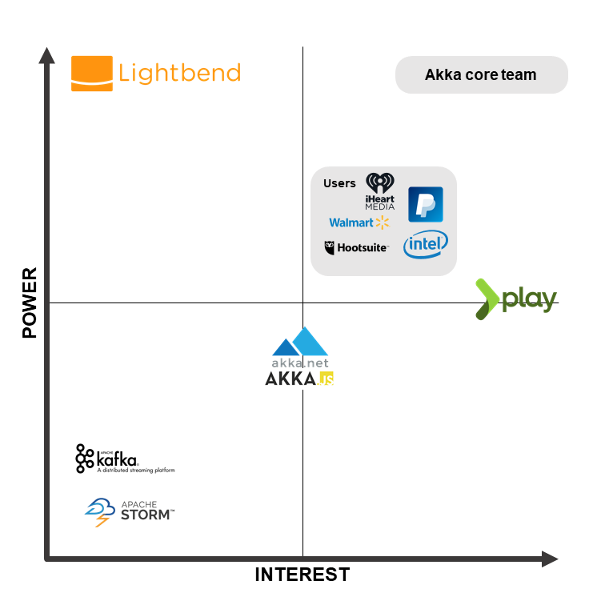
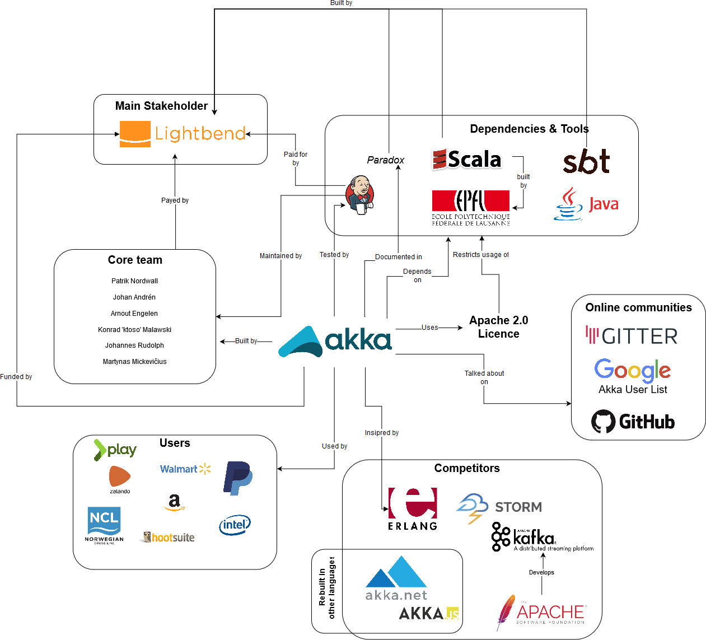
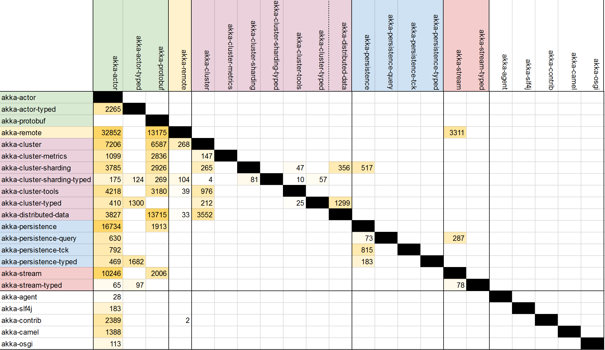
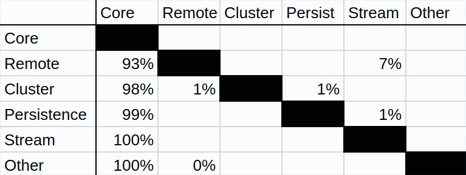
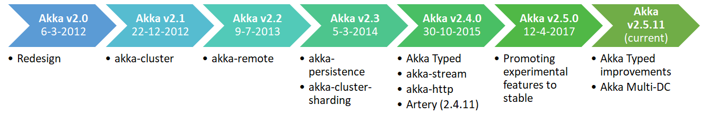
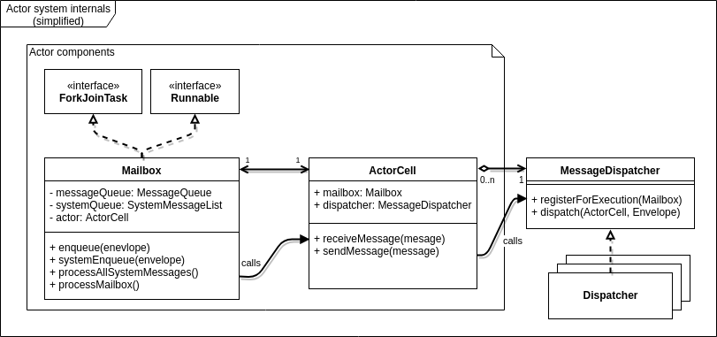
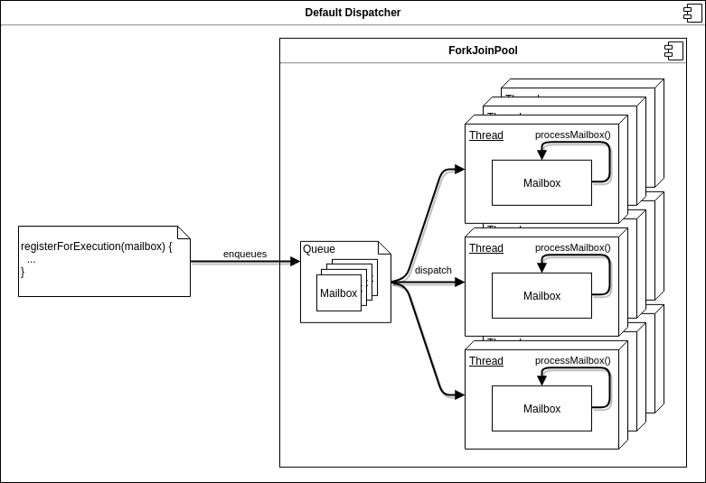
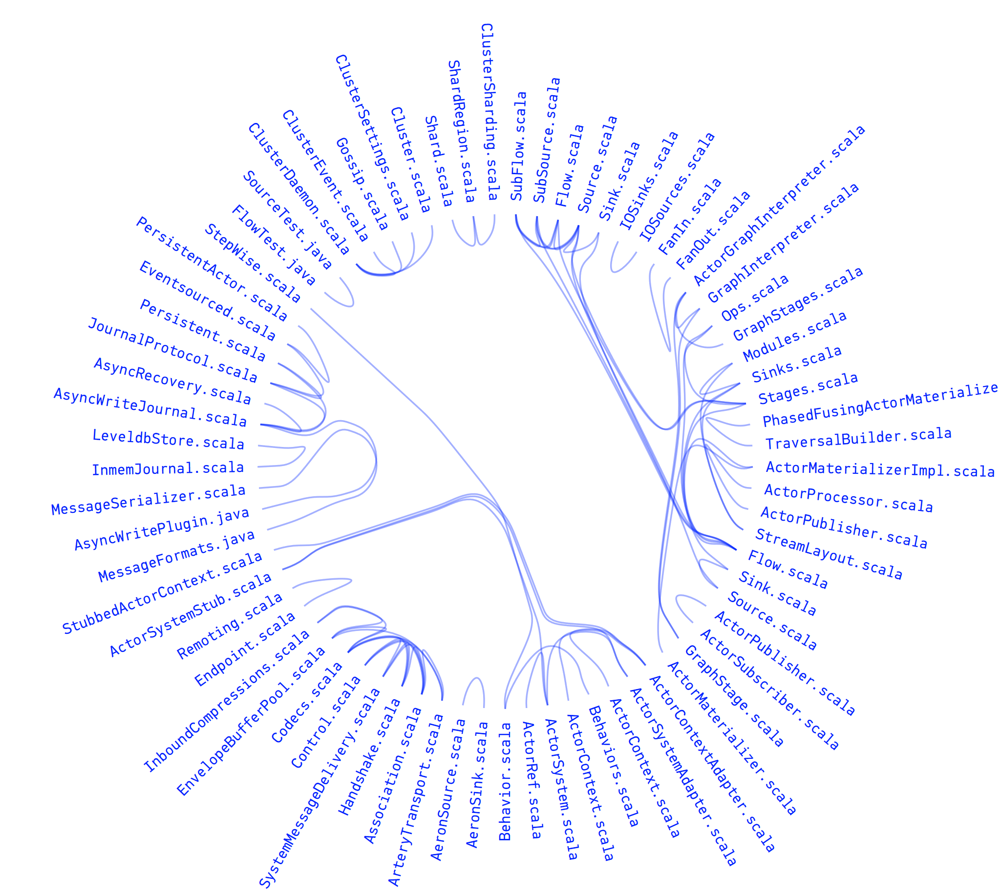

# Akka - Build powerful reactive, concurrent, and distributed applications more easily
By: [Thomas Smith](http://github.com/txsmith), [Carsten Griessmann](http://github.com/Schubbcasten),  [Martijn Steenbergen](http://github.com/mjwsteenbergen), [Remi van der Laan](http://github.com/RvanderLaan)


**Abstract**

Akka is a toolkit for building highly concurrent, distributed applications.
It was created by a company now called Lightbend, which is also behind the Scala language, and is maintained by a core team of seven people employed by them as well.
After a thorough analysis from various perspectives and views of this software system, we concluded there are few problems, though there are some possibilities for improvement.
Notably, there are the problems that come along with binary compatibility, which is mentioned by the core team themselves as the largest time intensive burden for technical debt.
Besides analyzing the current architecture, we provide descriptions of its evolution and concurrency in the delivery of messages between actors.
This chapter serves as a high-level overview for people interested in Akka and to suggest possible improvements to the project maintainers.

## Introduction
Akka is a set of libraries for building concurrent, distributed and message-driven applications for Java and Scala. It allows users to build applications in different programming models, such as stream programming or pub/sub, on the [Actor model](https://en.wikipedia.org/wiki/Actor_model). The actor model aims to take the core principle of OOP, sending messages to objects, and make it safe in the face of concurrency.
Akka focuses on simplicity, resilience and performance which has made it widely adopted by large organizations such as eBay, Twitter and Walmart. It is written in Scala and provides bindings to Java as well. It is one of the biggest open source projects within Scala and it keeps evolving.

In this chapter, we aim to provide insight into the Akka project and provide a high-level understanding of its underlying architecture.
We start by giving an overview of its stakeholders and the context surrounding Akka. Then an analysis of its architecture and design is given through the development viewpoint, which additionally describes the code organization and standards.
This is followed by looking into the evolution of Akka. We then provide more insights in how Akka solves the problem of building parallel application through the concurrency view.
We finish by looking at some technical debt that we found.


## Stakeholders

Akka is lead and funded by Lightbend. Lightbend, formerly called TypeSafe [[1](#typesafe-lightbend)], is a company founded by Martin Odersky (the creator of the Scala language), Jonas Bonér (creator of the Akka framework) and Paul Phillips (who has left the company [[2](#doing-wrong)]). Next to Lightbend Akka also has a lot of other stakeholders, that are interested in the success of the product. In this chapter we will identify those using the categories of the book _Software Systems Architecture: Working with Stakeholders Using Viewpoints and Perspectives_.

### Acquirers

Acquirers are the stakeholders that fund the project.
In the case of Akka that is the company Lightbend. It employs the core team that oversees the development and is currently listed as their only sponsor [[8](#sponsors)].

### Assessors

Assessors oversee whether Akka meets all legal standards.
The main assessors that we identified are the license holders of the dependencies of Akka, such as Oracle (Java/JVM), Lightbend (Scala/SBT), Google (Protobuf) and Netty. Next to that there is probably a legal department within Lightbend that also has that role for Akka. This unfortunately cannot be verified due to it not being transparent in the open source project.

### Communicators
Communicators are the ones that explain and document the system so that it can be used by others.
The most important communicator for Akka is Lightbend. They are selling consultancy and training services for it, which is an important part of their business model [[3](#consulting)]. Next to that, the extensive documentation of Akka can be contributed to by anyone, but most changes are added by its core team.

### Developers

Since Akka is an open source project and has existed for many years [[4](#anniversary)], there have been many developers who understand the architecture and make it through the whole development cycle to make a contribution. That contribution can be anything like a new feature, a bug-fix or even a refactor. This makes them not only developers but also maintainers and testers, since when making contribution they also have to test it. It is notable that many key contributors are also Lightbend employees and part of the Akka core team. Most of those members made the releases on the Akka GitHub repository.

### Production engineers

The production engineer in this case is the one that is providing Akka's development infrastructure such as the build servers and the CI environment. This is again Lightbend. Things such as deployment itself is the responsibility of the users since Akka is just a library.

### Suppliers

Akka is a quite low-level library and therefor not reliant on suppliers that could be viewed as stakeholder. Their main suppliers like the JVM or Scala are not reliant on Akka being successful so therefor are omitted here.

### Support staff

Lightbend provides paid support for Akka for Lightbend subscription members [[5](#subscription)]. Other (visible) support questions are handled inside GitHub issues or online communities like Gitter [[7](#akka-gitter)].

### Users

The users of Akka can be seen as developers of other projects, such as PayPal, Zalando, Wehkamp and Walmart [[6](#case-studies)]. These developers directly use of Akka to build business applications and have concerns about its functionality. They also are responsible of the correct deployment of their application.

### System Administrators

System Administrators are not directly visible since Akka is not an in-house developed enterprise product. It is built and released as a library, but this does not require a system administrator.

### Competitors

Akka's main competitors are other solutions in the space of distributed Actor systems such as Erlang, Akka.net and Akka.js, but also other distributed solutions like Kafka.

### Reviewers/Integrators
The reviewers and integrators are responsible for maintaining quality and consistency within the codebase of Akka through reviewing pull-requests. Here those are the members of core team that were active in the past 6 months:
* [@patriknw](https://github.com/patriknw)
* [@johanandren](https://github.com/johanandren)
* [@ktoso](https://github.com/ktoso)
* [@raboof](https://github.com/raboof)
* [@2m](https://github.com/2m)

### Power interest relations

<div id="fig1" />



<br>**Figure 1** - _Power to interest graph for Akka's stakeholders._


To visualize the importance of all different stakeholders in comparison with their interest in Akka's development, a power to interest diagram was created. The most important ones here are the core development team, which always has the final say on the project's development, and again Lightbend.


## Context View

The Context view focuses on the relationships and dependencies between Akka and external entities.

### Context model diagram
To visualize Akka's interactions with its environment, the following diagram was made.

<div id="fig2" />



<br>**Figure 2** - _The context view for Akka, showing the external parties and their relationship to it._

From this diagram, one very important item is to be seen and that is the ubiquity of Lightbend in this project. From funding the CI server, developers, documentation tools, but also maintaining the language (Scala) and the build-tool (SBT) this framework is written in.
Akka's main dependencies are Scala, SBT and the JVM. Those are baked into the architecture of Akka in such a way that cannot be changed.
Akka depends on several of those tools that are fundamental to the Scala ecosystem. Therefore, the general direction and development of Scala, JVM and SBT heavily influence the possibilities for Akka. So Lightbend's influence on Scala potentially reduces the risk of problems occurring in the ecosystem that affect Akka.
Next to that Akka has several competing libraries in the space of distributed Actor systems. The most noteworthy here is Erlang.
Next to being a competitor it's also a big source of inspiration and since Erlang lives in a separate eco-system its competition gets less significant.
There are also several online communities that, as mentioned in the stakeholder analysis, work as Akka's free support and as discussion boards.


## Development View

### Introduction
Akka is a big project and contains a lot of modules. To understand the design constraints and how the project is developed a Development view is made. Here we look at the organization of the modules, analyze standards and processes and the source-code organization within the project.

### Module organization
In this part of the development view we will focus on the organization of the modules that Akka is composed of.
To perform our analysis, we have used the built-in dependency analysis tools that JetBrains IntelliJ provides.
We will first briefly describe the purpose of each module and then dive deeper in their dependencies.

#### Core modules
The core of Akka consists of two modules that do not depend on each other or other modules. They implement the basic functionality that Akka provides. As a consequence, most other modules depend on these. The `akka-actor` module, the largest module in the project, is responsible for providing a basic framework to the Actor model.
The `akka-protobuf` module provides code used for serializing and de-serializing messages that get sent over the network. As the name suggests, this module relies on Google's Protobuf library. Every other Akka module that needs to send anything over the network uses this module for serialization.

#### akka-persistence
`akka-persistence` enables Actors that contain internal state to persist that state. By default, it uses the key value store levelDB to do that, but it can also be extended with various community plugins to support other stores, where `akka-persistence-tck` implements a technology compatibility kit to ease the way of implementing those.
The `akka-persistence-query` module complements `akka-persistence` with an asynchronous query interface that could be used to separate the query side from the write side in a model.

#### akka-stream
The Actor model can be seen as a more low-level model for stream processing; actors send and receive messages that have to be dealt with in (near) real-time. Because building robust streaming applications on the Actor model can be cumbersome, Akka provides an abstraction around `akka-actor` that provides reliable streaming capabilities.

#### akka-remote
The `akka-remote` module is responsible for making the actor system [location agnostic](https://doc.akka.io/docs/akka/current/general/remoting.html) and allowing actor applications to be distributed over multiple servers. It was designed for peer-to-peer communication and the API can be used to create and lookup actors remotely.

#### akka-cluster
Built on top of the core and remoting modules, Akka provides tools for managing and sharding clusters which run Akka applications. The `akka-cluster` modules provide fault-tolerant cluster membership, leadership election and failure detection. This module is complemented by several other modules.
 - `akka-cluster-sharding` facilitates sharding of actors across machines;
 - `akka-cluster-tools` provides a client for actor systems that are not in a cluster to communicate with actors that do reside in a cluster;
 - `akka-cluster-metrics` is an extension that provides system health metrics on actors;

#### akka-\*-typed
These modules are an initiative to develop a new set of APIs for each of the above modules. These are more type safe and can be seen as a layer on top of the other modules. For example, it provides a new way of building actors for which the compiler type-checks messages that actors can send and receive, therefore avoiding unsafe runtime casts.


### Dependencies of modules
Using the dependency analysis in IntelliJ, we created a dependency matrix which in turn we used to visualize the module structure.

<div id="fig3" />



<br>**Figure 3** - _The dependency matrix for all modules in Akka._

From this matrix one can determine that most dependencies are between modules which belong in the same group (`akka-cluster-*`), if we do not look at the dependencies on Akka core.
It immediately becomes clear from the table that Akka does not have a layered architecture.
The `akka-actor` module, together with `akka-protobuf` forms a core where nearly all other modules depend on.
Cluster management modules form an almost perfect clique, indicating that the individual modules are not independently usable and thus that `akka-cluster-*` modules together form one large subsystem.
Another notable observation that we can make from this is that the `persistence` modules have a relatively low coupling.
We can also clearly see the modules in white, that will be from here on out be classified as `other`, only depend on `akka-actor` and therefore have little impact on the overall architecture.

To convey the high-level architecture as naturally as possible, we abstracted to groups of modules and showing the dependencies of those groups.
We compacted the original dependency matrix to only count dependencies between subsystems (like `cluster`), as many modules have the same prefix and therefore it can be said that they together solve a higher-level problem.

<div id="fig4" />



<br>**Figure 4** - _The high level dependencies between subsystems in Akka._

This matrix displays what percentage of external references from one of the rows points to one of the columns. For the remoting subsystem, 93% of its external references use one of the core modules. Only 7% use functionality in streaming modules. Note that this matrix is very sparse; subsystems are tightly coupled to the core but relatively loosely coupled to each other.

Some seemingly strange dependencies can also be seen.
 - **`akka-remote` depends on `akka-stream`**: This is caused by the new [Artery](https://doc.akka.io/docs/akka/current/remoting-artery.html#remoting-codename-artery-) system, a remoting subsystem that will eventually replace the old API. Artery supports sending messages between actors with TLS streams instead of Netty TCP. This is used for network communication in a distributed actor system.
 - **`akka-cluster-sharding` depends on `akka-persistence`**: this turns out to be because user-defined shards can also be stored on disk, which makes them persistent after a complete cluster reboot.
 - **`akka-persistence` depends on `akka-stream`**: This can be explained by the fact that certain database operations return a stream for performance and convenience.

An interactive dependency visualization can be accessed [here](https://txsmith.github.io/akka-modules/detailed/).

### Standardization of Design
Since Akka is open source and quite large, the core Akka team has defined a set of rules and guidelines in order to maintain a consistent design and improve maintainability in general. We will investigate the most interesting ones here.

#### User extensibility
Akka provides various classes or subsystems with interfaces with a default implementation or library.
In fact, extensibility is encouraged though [Akka Extensions](https://doc.akka.io/docs/akka/2.5/extending-akka.html), which is how many features such as Typed Actors and Serialization have been implemented.
Customized implementations can be specified in the Akka configuration in order to integrate them in a system.
More about user extensibility can be found in the [Evolution Perspective](../chapter-4-/README.md)

#### Quick overview of standardization
 - Most code style standards are standardized automatically. For Scala, the [scalariform](https://github.com/scala-ide/scalariform) code style is applied and for Java they use For the [Oracle Java Style Guide](http://www.oracle.com/technetwork/java/codeconvtoc-136057.html). Akka also has a lot of scripts to make standardization easier such as e.g. standardizing line endings, indentation and finding documentation errors [[9](#contributing)].
 - Contributions that add whole new features should be added to the `akka-contrib` module.
 - Each module has to be tested and well documented. Testing is done with `ScalaTest` and `ScalaCheck`[[10](#testing-guidelines)]. A continuous integration server is used to test every new addition to the codebase. [[11](#ci)].
 - Large changes should be documented in the official documentation in the `akka-docs/paradox` module.

#### Binary compatibility
One major and obvious design principle in Akka that can only be found by looking at documentation is binary compatibility
[[12](#bc-rules)]. This will be explained further in the [Technical Debt section](chapter-3-technical-debt/README.md).

### Codeline Organization

The source code structure represents the same structure as the previously described module structure. Each module has its own folder which contains the _src_ folder as shown in figure [5](#fig5).
The settings, plugins and dependencies for each module are defined in the `build.sbt` configuration file in the project root. It provides the entry point for SBT and there the separate configuration files for building each module are bundled together. These all can be found inside the _project_ folder.
The _scripts_ folder contains all sorts of scripts, for example for code formatting or pull-request validation.

<div id="fig5" />

```
akka
│
└───akka-actor
│   └───src
└───akka-agent
│   └───src
|   ... (all module folders)
└───project
└───scripts
└───build.sbt
```

<br>**Figure 5** - _The folder structure of Akka._

## Evolution perspective
This section gives a quick overview of the current and future state of Akka, focuses on the flexibility in regard to change and the techniques that are used to accomplish this.

### System evolution
Figure [6](#fig6) shows the major releases and the most noteworthy features they (experimentally) introduced. Before version 2.4, Akka followed the Java or Scala style of versioning: `epoch.major.minor`. Since 2.4 however they follow an approach closer to semantic versioning: `major.minor.patch` [[13](#versioning)].

<div id="fig6" />



<br>**Figure 6** - _The version history of Akka, showing the features they (experimentally) introduced._

After the initial core Actor pattern was implemented in Akka, many features have been added to satisfy and solve problems for its users. Clusters provide fault-tolerant scalability, streams provide performance in data transfer and processing and persistence provides robustness by allowing the recovery of actor states after restarting.
Alpakka, an independent project that will soon get its own full team, provides easy extensibility for connections to external technologies. Akka HTTP, again a independent project, gives users functionality for HTTP integration needs for building their own applications.
A more detailed creation story can be found in their [five-year anniversary blog post](https://www.lightbend.com/akka-five-year-anniversary).


### Recent and future development
There are still problems being solved and to be solved in the future of Akka. These are likely not goals that were set at the beginning of Akka, but feature requests that have developed over time.

Akka Typed is a new attempt to bring type safety to Akka. The reason why this was not integrated at the start of the project is due to its heavy inspiration from the Erlang language. It introduces typed versions of actors, clusters, and persistence, so that everything is type safe [[14](#future)].
This brings more compile time safety, which causes less debugging at runtime leading to more productive development.
Two other attempts in the past with the same goal have failed and have become deprecated.
Typed Actors was too slow due to reflection and not true to messaging; a core principle of Akka.
Typed Channels was too complex since it introduced too many operators and it relied on Scala macros.
The new Akka Typed is has none of these downsides while introducing benefits, such as actor behaviors acting as a state machine.

Artery is the modern remoting layer, which utilizes UDP instead of TCP for better performance and includes various other optimizations. Currently it remains an experimental feature, but it is to become stable relatively soon [[15](#state-2017)]. It will replace the old Akka Remoting implementation and it mostly source compatible with it, meaning it can act as a drop-in replacement in many cases [[16](#artery)].

Multi Data Center (DC) is a new experimental feature that provides global scalability and improved stability, with benefits such as serving requests close to a user's proximity and large scale load balancing. This is accomplished by making one Akka Cluster span over multiple data centers [[17](#multi-dc)].

### Dealing with change
Akka provides some measures to extend its public API, but also internally strive to integrate facilities for change.

#### Public API
Akka makes use of variation points in order to allow for specific localized design solutions through Akka Extensions [[18](#extensions)].
Standard extension points for storage back-ends in persistent actors can be found in the community plugins repository [[19](#persistence)].
Runtime configurations of actor systems can be defined in a [type-safe configuration format](https://github.com/lightbend/config) developed by Lightbend. This allows for configuration of logging, remoting, serializing and much more [[20](#configuration)].

Along every major version increase an extensive migration guide is provided, which includes the most notable changes to the public API and the reasoning behind them.
The binary compatibility mentioned in [Technical Debt](../chapter-4-/README.md) forces changes to remain compatible. This causes old features to become deprecated in favor of entirely new features with the same goal, as is the case with Akka Typed.

#### Internal change
The core team is actively working on creating extensible interfaces; we found a recent [issue](https://github.com/akka/akka/issues/24324) where many parameters were being replaced with a settings file in order to provide a higher level API for a certain feature.

One more technique is the exclusion of unnecessary additions that can be implemented by users themselves, which we found out first-hand while looking for an [issue](https://github.com/akka/akka/issues/24627) for our first contribution. They rather provide generic solutions that require some work from their users.

An observation that we personally made was that there is an inconsistent use of features from the Scala language, such as inheritance, which makes it difficult for newcomers to understand the codebase and has negative consequences for the overall maintainability.

### Conclusion
Highly flexible systems can bring significant costs in terms of runtime efficiency and performance.
However, it doesn't seem like this is the case for Akka; all configuration is processed at compile-time, which does not affect the runtime performance.
The techniques they apply to deal with change ensure that the system can evolve while keeping it well maintainable.
The architecture is built for both performance and flexibility, allowing Akka developers and its users to easily change and extend features to their pleasing.

## Concurrency View

Being a framework for distributed actor systems, Akka must make use of strong concurrency constructs to keep actor systems safe and performant.
In this section we explore the main constructs Akka uses to achieve safe and fast concurrency.

We will first look at the core machinery that makes actors work.
With the core infrastructure covered, we can then explore how remote messaging between actors fits in the picture.

### Actor component and threading model
To support actor concurrency to the full extent, Akka uses a unified threading model for nearly everything that requires tasks to be offloaded from the main thread.
Let's consider a simplified component model to illustrate the most important components of an actor:

<div id="fig7" />



<br>**Figure 7** - _A simplified component model._

<div id="fig8" />



<br>**Figure 8** - _The dispatcher threading model._

Each actor is created with a `Mailbox` and `ActorCell` and is registered with one `MessageDispatcher`.
Multiple actors can use different mailbox and dispatcher classes.
Note that since `Mailbox` implements `Runnable` and `ForkJoinTask`, it's possible to schedule a mailbox object to run on another thread.
Its `run()` method dispatches to the actor's user-defined `receive` method for any message that's processed.
In turn, when `sendMessage` gets called on an actor, it will use the registered dispatcher to enqueue the message in the receiver mailbox and schedule the mailbox for execution.

The default dispatcher uses a `ForkJoinPool` is used for scheduling.
This is a threading construct that runs tasks on a resizable pool of threads.
Because threads get reused as soon as they become free, running an actor is very inexpensive and running many actors automatically utilizes a server's multi-core capabilities.

This model is not only used to run individual actors, but also to schedule any `Future`s that an actor may create.

### Scheduler
The `Scheduler` is another concurrency construct that's made available to users by Akka.
The scheduler is available in each actor and enables the user to postpone lightweight tasks for a short amount of time.
It runs an algorithm based on a revolving wheel of buckets that advances at a fixed tick rate and dispatches tasks it finds in the current bucket to their respective ExecutionContexts.
Since it runs tasks in their own ExecutionContext, the tasks themselves run on the execution model that's also used to run the actors. The Scheduler only creates its own thread for running the timer used by the algorithm.

### Remote messages
Sending messages between remote actors utilizes the above model.
When remoting is enabled, special actors get started that receive messages that cannot be dispatched locally.
These endpoint actors are responsible for maintaining the necessary remote connections and serialization.
When a remote message is received, the endpoint actor decides which local actor to relay the message to.
Multiple endpoints exist for communication over TCP, UDP and TLS.

### Synchronization of shared state
In a few key places, state has to be shared between threads for example to communicate the state of a mailbox.
Akka achieves this by relying mostly on volatile variables instead of locks to avoid lock contention.
An example where this is needed is for actor supervision.
Actors are usually organized in hierarchies where one actor is supervised by another.
When an actor terminates, it has to terminate all its children and suspend the mailbox.
Likewise, when an actor crashes, its parent has to decide whether to stop, resume or recreate the crashed actor and its children.
The state to track which children have terminated and whether the mailbox is open or closed (in case of termination) is maintained in volatile variables that are set by means of compare-and-swap operations.

### User extensibility
As discussed before, Akka values user-extensibility.
This also resonates in their concurrency model.
Throughout the entire framework, one framework for execution is used of which many parts are extensible or at least configurable.
Mailboxes, dispatchers and thread pools are all extensible to support different application workloads.
For example, the default dispatcher can be configured to use any other `ExecutorService` instead of `ForkJoinPool`.
One could use `AffinityPool` instead to ensure that each actor always runs on the same thread, or create a custom `ExecutorService`, which may be faster in certain scenarios.
The same holds for mailboxes; the message queue used internally can be changed to anything that fits a
user's needs.
This enables programmers to make their own choices when it comes to concurrency and multi-core performance when building an actor-system.


## Technical Debt

Technical debt can be described as the build-up of problems caused by making changes work with easy solutions instead of making them better through more time-consuming approaches.
Identifying it is challenging and for this chapter several methods were run. We looked at code hotspots (files that are often changed), test coverage and compiler warnings but were unable to find any noteworthy technical debt.
Therefor we decided to focus on the two most interesting subjects that do attribute to technical debt in this section.
To also get a better impression of how the maintainers of Akka experience technical debt, we decided to contact them and ask them how they feel about debt in the project.

### Binary Compatibility
Akka maintains backwards binary compatibility for minor and patch versions.
This means that for users can safely upgrade Akka to a newer minor or patch versions without risking breakage in their products;
new JARs are drop-in replacements for older ones.

A consequence of this is that the Akka core team has to carefully manage which parts of their API fall under the compatibility guarantee and which parts do not.
The team maintains several ways to signal that an API is not subject to binary compatibility:
 - **May change** is used in module descriptions and docs,
 - Classes annotated with `/** INTERNAL API */` or with `@InternalAPI`, `@ApiMayChange`, or `DoNotInherit`.

In general, developers of open source projects have to strike a balance between public and internal APIs. Internal APIs can be changed more frequently as there is no risk of introducing breaking changes for the user. However, keeping lot of the APIs internal restricts the users possibilities to extend the system. This may lead to a lot of patch requests for supporting a new use case that wasn't thought of by the developers.

On the other hand, if developers make too much of the API public, they risk severe inertia as users will inevitably depend on all public APIs, making changes to the core hard because some form of backwards compatibility has to be provided.

For Akka specifically, any mistake or change in public API results in that API being deprecated and replaced by something else.
However, the deprecated code will have to remain in the project until the next major release, which may take several years.
The cost in changing APIs is therefore so high that maintainers are more willing to sacrifice cleanness to avoid this cost. One maintainer mentioned a typical example of this, 'dead code' that is kept in the system to not break the public API: [`ClusterSingleton.scala`](https://github.com/akka/akka/blob/563c7fbcf0fcb374d414403900d620c8fac54d52/akka-cluster-typed/src/main/scala/akka/cluster/typed/ClusterSingleton.scala#L68).

Besides releasing a new major version of Akka more often which may be undesirable, there is no clear and set solution to this problem. Ultimately it comes down to two aspects:
 - balance public and internal APIs,
 - design new public APIs to be as future-proof as possible.

When asked whether the team can quantify the cost of binary compatibility, the consensus was that this is hard to measure in practice [[21](#gitter-convo)]. The Akka team could investigate in methods to make the time they spend on these issues more quantifiable. If the cost of working around public API changes is better known the team may be in a better position to make sound decisions on whether to introduce an API change or sacrifice code quality.

### Temporal Coupling
We have used CodeScene to analyze temporal coupling. This refers an analysis of which files are frequently changed together. Temporal coupling can be an indicator for technical debt as it can expose several code smells such as Shotgun Surgery, Code Duplication and Inappropriate Intimacy.
After a first run of the analysis we noticed that the results needed some filtering to prevent false positives:
 - `*Test.java` and `*Spec.scala` files tend to be tightly coupled with the classes under test so we filtered out any coupling between files where one of the two was a test file.
 - Akka features a dsl-like API for both Scala and Java users. Generally this means that when one of the APIs changes, so does to other. We therefore filtered pairs of files with the same name where one in in the `javadsl` folder and the other in the `scaladsl` folder.

The filtered result is shown in figure [9](#fig9). Lines between files indicate that they are often changed together; thicker lines indicate stronger coupling.

<div id="fig9" />



<br>**Figure 9** - _A visualization of the temporal coupling in Akka._

The abstract pattern that we see here is one that applies to many things in the domain of data processing. For many streaming classes, one is a dual to the other: sources create data, sinks reduce data. The way in which they do this may differ, for example, IOSource has a very different implementation compared to AeronSource. But these two classes will generally form a pair where the behavior of one must match the behavior of the other. Another example of where this applies is with serialization. A Serializer class will always be tightly coupled with a Deserializer because the two must work on the same serialization format, causing duplication of code and logic.
The cost induced by this coupling can be tough to deal with. A mistake in one of the dual classes can manifest in the other in very unpredictable ways.

Given that there is no easy way around this coupling, the best the Akka team can do is write good tests for these cases and extract as much common code as possible (although the latter will not always be possible). Luckily, the classes in question are well covered by tests.


## Conclusion
With over 9 years of development, Akka has grown in many aspects; not only in size, but also in the creation of a solid architecture.
It remains flexible and constantly improves its performance and reliability despite of the complex goals it tries to achieve.

We have analyzed Akka from various perspectives and viewpoints to give an insight into the inner workings. It was impressive to see how little actual issues we could find in a project of this size. The architecture is well thought of and the core team behind it are always making proper decisions even if that sometimes leads to more pain in maintaining the project. The success and usage of Akka really prove that. We think it will remain a popular choice for creating distributed applications and are curious on how the project will keep evolving.

## References

1. <div id="typesafe-lightbend"/> Mark Brewer. Typesafe Changes Name to Lightbend. https://www.lightbend.com/blog/typesafe-changes-name-to-lightbend
2. <div id="doing-wrong"/> Paul Phillips. Pacific Northwest Scala 2013 We're Doing It All Wrong. https://www.youtube.com/watch?v=TS1lpKBMkgg
3. <div id="consulting"/> Lightbend Consulting Services. https://www.lightbend.com/services/consulting
4. <div id="anniversary"/> Jonas Bonér. Akka 5 Year Anniversary. https://www.lightbend.com/akka-five-year-anniversary
5. <div id="subscription"/> Lightbend Subscription. https://www.lightbend.com/subscription
6. <div id="case-studies"/> Lightbend Case Studies. https://www.lightbend.com/case-studies
7. <div id="akka-gitter"/> The akka/akka Gitter Channel. https://gitter.im/akka/akka
8. <div id="sponsors"/> Akka. Sponsors. https://doc.akka.io/docs/akka/current/project/links.html#sponsors
9. <div id="contributing"/> Akka. Contributing Guide https://github.com/akka/akka/blob/master/CONTRIBUTING.md
10. <div id="testing-guidelines"/> Akka. Testing Guidelines. http://downloads.lightbend.com/paradox/akka-docs-new/20170511-sidenotes/java/dev/developer-guidelines.html#testing
11. <div id="ci"/> Akka. Continuous Integration https://github.com/akka/akka/blob/master/CONTRIBUTING.md#continuous-integration
12. <div id="bc-rules"/> Akka. Binary Compatibility Rules. https://doc.akka.io/docs/akka/current/common/binary-compatibility-rules.html
13. <div id="versioning"/> Akka. Versioning Scheme. https://doc.akka.io/docs/akka/current/common/binary-compatibility-rules.html#change-in-versioning-scheme-stronger-compatibility-since-2-4
14. <div id="future"/> Konrad Malawski. Networks and Types -- the Future of Akka. https://www.slideshare.net/ktoso/reactive-systems-tokyo-networks-and-types-the-future-of-akka
15. <div id="state-2017"/> Konrad Malawski. State of Akka @ 2017 - The best is yet to come. https://www.slideshare.net/ktoso/state-of-akka-2017-the-best-is-yet-to-come
16. <div id="artery"/> Akka. Remoting (codename Artery). https://doc.akka.io/docs/akka/2.5/remoting-artery.html
17. <div id="multi-dc"/> Akka. Multi-DC. https://akka.io/blog/2018/01/17/multidc
18. <div id="extensions"/> Akka. Akka Extensions. https://doc.akka.io/docs/akka/current/extending-akka.html
19. <div id="persistence"/> Akka. Persistence.  https://doc.akka.io/docs/akka/current/persistence.html?language=scala
20. <div id="configuration"/> Akka. Configuration. https://doc.akka.io/docs/akka/current/general/configuration.html
21. <div id="gitter-convo"/> Gitter conversation on Technical Debt. https://gitter.im/akka/dev?at=5aaa41b7bb1018b37ae7ee04
