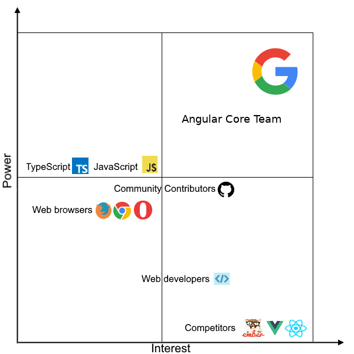
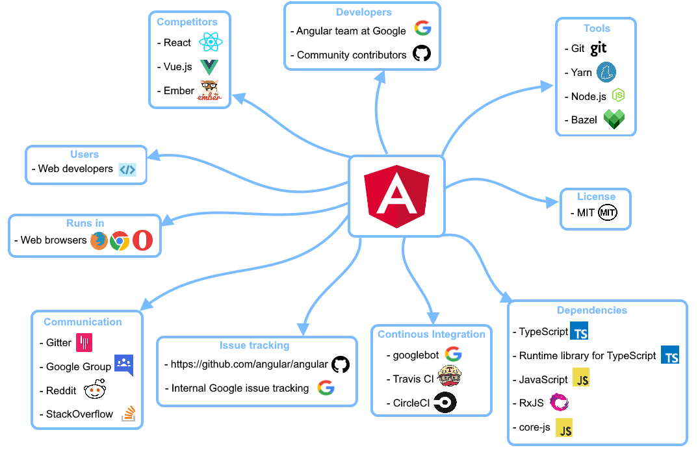
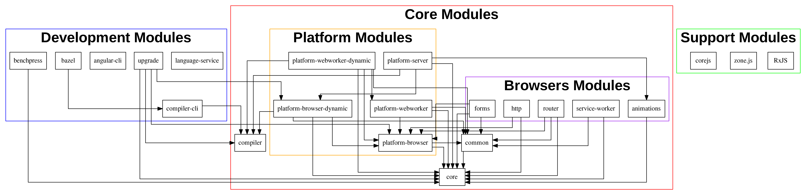

# Angular

[Blazej Kula](https://github.com/blaz11) | [Arvind Chembarpu](https://github.com/arvindch) | [Algirdas Jokūbauskas](https://github.com/algirdyz) |
| :---: | :---: | :---: |
|  |  |  |

*Delft University of Technology*

## Abstract

Angular is a Free and Open Source Typescript-based framework for developing web applications. It is a complete rewrite from its predecessor AngularJS and is maintained by Google, along with a community of individuals and corporations. It helps users create fast, multi-platform applications in Typescript or Javascript with ease. In this chapter, we will discuss the architecture of the Angular project in detail and try to explain how it is developed. We will be building this analysis on top of the concepts learned in "Software Systems Architecture" by Nick Rozanski and Eoin Woods.

## Table of Contents

* [Introduction](#introduction)
* [Stakeholders](#stakeholders)
* [Context View](#context-view)
* [Development View](#development-view)
* [Technical Debt](#technical-debt)
* [Things in Motion](#things-in-motion)
* [Conclusion](#conclusion)

## Introduction

AngularJS was created by Google and released in 2010. The main idea was to decouple HTML DOM manipulation from application logic. It does so by introducing Model-View-Controller architecture to Client Side Javascript code. However, a few years later, in 2014, Google announced Angular 2 - a complete rewrite of AngularJS. It introduced the possibility to code in Typescript (a superset of Javascript) and changed the internal architecture of both itself and applications created with it. It also improved performance and complexity, while also introducing support for building cross platform native mobile apps. However, the lack of backwards compatibility with AngularJS created a lot of controversy among developers. It was fully released in 2016 and has been through many changes since, including a new preview release version 6.0.

We will start our analysis by defining the different stakeholders in the project. We will then provide a contextual view of the application showing its relation to the environment. Furthermore, we will present a development view showing different modules of the application and and design models used. Lastly, we will analyze various kinds of technical debt that have accrued over its lifespan.

## Stakeholders

Angular was created and is maintained by Google, along with a large community of individuals and corporations. We compiled this list of stakeholders by analyzing the Angular [repository](https://github.com/angular/angular), official [website](https://angular.io/about), and Github's [Insights & Analytics](https://github.com/angular/angular/pulse). In order to provide context and reasoning, we have also provided notes alongside our findings. We will also be using bold text to highlight the actual stakeholders within the analysis.

### Primary Stakeholders

In this section, we detail the stakeholders defined by Rozanski and Woods in the course book [Software Systems and Architecture](https://www.viewpoints-and-perspectives.info/).

#### Acquirers

**Google** is arguably the most important primary stakeholder, considering how Angular was created by Google engineers for Google's projects. They use Angular internally and externally for a [variety of projects](https://www.madewithangular.com/categories/google), and so OSS contributions can be considered to be continuously "acquired" by Google.

#### Assessors

Legal compliance is managed by [Max Sills](https://angular.io/about?group=Angular) (Angular's Open Source Lawyer, employed by **Google**), who can be considered as an assessor. Angular currently uses the [MIT license](https://github.com/angular/angular/blob/master/LICENSE), but used to be distributed under the Apache 2 license - this was [changed](https://blog.angularjs.org/2016/01/angular-2-mit-open-source-licensed.html) due to community feedback, as a community-friendly license contributes to the project's success and uptake.

#### Communicators

**Contributors** and **Committers** are communicators by default, as every contribution is [required](https://github.com/angular/angular/blob/master/CONTRIBUTING.md) to have accompanying documentation and justification. **Google** is also an important communicator, as they have [dedicated employees](https://angular.io/about?group=Angular) who work on improving documentation and also offer services through the [Google Developer Expert](https://angular.io/about?group=GDE) program. They also conduct [events](https://angular.io/events) to promote the project.

#### Developers

**Contributors** [on](https://github.com/angular/angular/graphs/contributors) GitHub, which includes **Google** and non-Google developers alike, are the development stakeholders. All contributions are made publicly on GitHub and stakeholders are expected to participate to make their voice and needs heard.

#### Maintainers

Angular is a framework and not a deployable product on its own, so we have considered maintenance of the framework itself in this section. Under this definition, the same contributors who are developers can be considered maintainers, however, not all of them are involved in regular upkeep. **Google** and other **companies** that utilize Angular have a greater investment in keeping Angular running well. However, it is the **Angular core team** employed by Google, which decides the primary [release schedule](https://github.com/angular/angular/blob/master/docs/RELEASE_SCHEDULE.md) and [milestones](https://github.com/angular/angular/milestones).

#### Suppliers

The [**Git SCM**](https://git-scm.com/) is used to track, version, and control the source code and changes. On top of this, [**GitHub**](https://github.com/angular/angular) provides the primary platform for code storage, tracking issues, accepting contributions, and making releases. [**Google**](https://angular.io/about?group=Angular) can also be considered a supplier as they employ the core team, provide necessary infrastructure, and various other resources to the project. [**NPM**](https://www.npmjs.com/package/angular) provides the primary distribution medium for Angular and its dependencies. Angular is developed using [**TypeScript**](https://www.typescriptlang.org/), a superset of plain Javascript.

#### Support Staff

Users can open [Issues](https://github.com/angular/angular/issues) on Github to obtain support. [**Gitter**](https://gitter.im/angular/angular) provides a chatroom for users to discuss issues and obtain help from their peers. Further, **Google** offers [paid professional support](https://angular.io/about?group=GDE) to users through their [Google Developers Experts](https://developers.google.com/experts/) program. Google also offers an official [Google Group](https://groups.google.com/forum/#!forum/angular) for a mailing-list-like forum. There are multiple third-party communities, as well - on [Reddit](https://www.reddit.com/r/Angular2/) and on [StackOverflow](https://stackoverflow.com/questions/tagged/angular).

#### System administrators

Angular only provides a framework, so any system infrastructure is independent of the project. The end-users of Angular, who administrate their own Angular-based product can be considered system administrators, but not necessarily in the context of Angular itself.

#### Testers

All **contributors** are [expected](https://github.com/angular/angular/blob/master/CONTRIBUTING.md#-submission-guidelines) to test and ensure that their changes work locally. Further, they must provide useful and effective tests for every change that they propose. **Google** both develops and uses Angular in-house so they also run independent tests to ensure compatibility with their systems, via the Google3 bot (status reported via [NgBot](https://github.com/apps/ngbot)). **Users** of the framework also technically test the framework in-use. They are expected to report bugs and provide logs, in order to obtain support.

#### Users

Web/Application **developers** are the primary users of Angular. **Content-producers** who produce blogs, videos, tutorials, guides, etc. related to Angular can also be considered user-stakeholders. There are also a multitude of **OSS projects** which utilize Angular.

### Secondary Stakeholders

In this section, we identify self-defined categories of stakeholders that we consider useful.

#### Evangelists

Like any other popular OSS project, Angular has its fair share of enthusiasts who introduce and help others in using the framework. They may do this through blog posts, multimedia content, technical guides, textbooks, conferences, and meetups.

#### Competitors

Competing frontend JavaScript frameworks can also be considered to have a stake in Angular, as its popularity can set the trend for various programming paradigms. Further, they can look to the Angular project for inspiration in planning features, quickly making similar bug or security fixes, or even rethink parts of their own approaches. For example, [React](https://github.com/facebook/react), [Vue.js](https://github.com/vuejs/vue), and [Ember](https://github.com/emberjs/ember.js).

#### Dependencies

Angular has a number of [JS Dependencies](https://github.com/angular/angular/blob/master/package.json) which have a vested interest as well, since having a large project like Angular as a user increases robustness and contributions.

#### Browsers

Leading web browsers also have a minimal stake in frameworks like Angular. They are incentivized to ensure that features utilized by these frameworks are well-supported and highly performant, in order to provide their users with the best possible experience. In fact, a lot of synthetic benchmarks test framework usage performance. For example, [Google Chrome](https://www.google.com/chrome), [Mozilla Firefox](https://www.mozilla.org/en-US/firefox/), [macOS Safari](https://www.apple.com/lae/safari/), [Microsoft Edge](https://www.microsoft.com/en-us/windows/microsoft-edge), and [Opera](http://www.opera.com).

### Power Grid

We identified the interest and power of actors described in the stakeholders analysis. The most powerful actor with the highest interest is Google, which uses Angular for many of its products and is maintaining the Angular core team. Competitors have high interest in Angular project as their popularity is correlated with Angular success or failure, however they do not exert any significant power over it. Since Angular is written in TypeScript, which in turn heavily relies on JavaScript, the language specifications also have some power over the project, but with little to no interest. While web browsers are the main environment where Angular is used, they could have some power over the framework; however because browser vendors mostly only implement language and environment standards and experiment with early versions, they are not actually powerful. Community Contributors do have power over the project as their contribution can introduce new features or change functionality - their input is usually taken into account, however there is no way they can force Angular to make significant changes without substantial support. Web developers have almost no power over the project, although they can suggest changes that best suit their needs - which can then be picked up by community contributors and merged by the Angular Core Team. The Core Team exerts the most influence over the project's course and make decisions on features that are developed by them and merged from community developers.

## Context View

A context view describes the relationships, dependencies, and the interactions between the system and its environment. This view is relevant to understand the system's architecture, as it defines the boundaries of the system and how it interacts with external entities across all spectrums.

#### System scope & responsibilities

Angular is a front-end web framework. As a result, its main objective is to help developers build fast, responsive, robust user-facing web applications. Frameworks focus on establishing patterns that help with the programming and layout of the contents of web applications, by forcing the user to conform to its own opinionated designs (in contrast to how libraries work by providing just an interface to use). Technologies used by those frameworks include HTML and CSS for creating and laying out views along with JavaScript, TypeScript and, recently, WebAssembly for handling front-end logic such interacting with view or fetching data from server. Angular combines declarative templates, dependency injection, and tooling to make development quicker and easier to maintain.

#### Context View Diagram

Using the above context-view, from a high-level perspective, we can see that while the project itself is open-source, Google is the chief maintainer, and so we can see high reliance on Google tooling, especially for development. Other individual entities/groups are described individually below.

#### External Entities & Interfaces

* **Developers** - Angular is developed primarily by the dedicated team at Google (Angular Core Team) with contributors from the large open source community. They are responsible for developing, releasing, and maintaining the framework.
* **Users** - Angular is a front-end web application framework which means it is used by web developers to create web applications, and according to the [StackOverflow](https://stackoverflow.blog/2018/01/11/brutal-lifecycle-javascript-frameworks/) it is one of 3 most popular ones as of 2018. Its users include individual developers, and companies creating web applications for their clients and creators of reusable components for Angular.
* **Runs in** - As Angular is a web framework it runs in web browsers - including almost all modern browsers for both desktop and mobile devices. A lot of consideration is given to make Angular work on as many platforms with little effort from the user.
* **License** - Angular is an open source project, released under MIT license. It states that users have unlimited rights to use, copy, modify and distribute original/modified version of software.
* **Competitors** - Angular's competitors include all other web front-end frameworks. Providing an exhaustive list of them is challenging given dynamic development of current web ecosystem, but the most notable ones include [React](https://reactjs.org/), [Vue](https://vuejs.org/), [Ember](https://www.emberjs.com/), and [Blazor](https://github.com/aspnet/Blazor).
* **Tools** - Angular is using numerous tools for development. The project is using Git SCM as its version control software, Yarn as the dependency manager, Node.js as the JavaScript runtime, and Bazel as the build tool.
* **Dependencies** - Angular is developed in TypeScript and also heavily depends on numerous JavaScript and TypeScript libraries.
* **Continuous Integration** - For its CI and automation needs, the Angular team use Travis CI, CircleCI, and internal Google Bots. Those bots are used for example to check if a Contributor License Agreement was signed or to test if changes doesn't break internal Google repositories.
* **Issue Tracking** - Angular is using GitHub for its issue tracking, feature planning, and roadmap, though unfortunately, the core team seem to be using internal Google tools and keeping discussions offline, which means these are not accessible to open source contributors.
* **Communication** - Angular's official communication channels are [Gitter](https://gitter.im/angular/home) and [Google Group](https://groups.google.com/forum/#!forum/angular). Its unofficial channels are [Reddit](https://www.reddit.com/r/Angular2/) and [StackOverflow](https://stackoverflow.com/questions/tagged/angular), where users can reach out for help from the community.

## Development View

The development view for a system describes the architecture related to the software's development process. As such, we have explained module organization, common design processes for components like code style, testing, logging, and building, along with an explanation of the codeline organization. Unfortunately, there does not exist any canonical documentation detailing the architecture of Angular for developers, so instead we have attempted to derive a relevant overview.

### Module Structure

Angular source code is organized in to several modules that encapsulate specific [functionality](https://angular.io/guide/architecture) of the project,  represented as npm packages which allow for easy installation by tools such as [npm](https://www.npmjs.com/) or [yarn](https://yarnpkg.com/lang/en/). These packages are usually referred to as `@angular/*` and are called "components" within Angular's documentation. Below, we present Angular's module organization diagram with their dependencies, which can be split into 3 groups following the [convention](https://angular.io/guide/architecture) introduced by the Angular team - Core, Development and Support modules.

#### Core Modules

Core modules provide functionalities that are used across whole Angular system and contain modules necessary for it to work.

1. **common** - The commonly needed services, pipes, and directives provided by the Angular team.
2. **core** - Critical runtime parts of the framework needed by every application - metadata decorators, Component, Directive, dependency injection, lifecycle hooks.
3. **compiler** - Angular's Template Compiler - it understands templates and can convert them to code that makes the application run and render.

##### Platform Modules

Platform modules provide functionalities that are platform specific. In the case of Angular those dependent on the browser itself and sometimes include polyfills. Those modules responsibilities include manipulating DOM (Document Object Model), threading and server side rendering.

1. **platform-browser** - Everything DOM and browser related, especially the pieces that help render into the DOM.
2. **platform-browser-dynamic** - Includes providers and methods to compile and run the app on the client using the JIT compiler.
3. **platform-webworker** - Angular's support for threading and background calculations using web workers.
4. **platform-webworker-dynamic** - It contains JIT compiler specific options for **platform-webworker** module.
5. **platform-server** - Angular's support for server side rendering.

##### Browser Modules

Browser modules provide functionalities that are used to perform various actions in the web applications like changing pages via routing, making HTTP calls, or animations.

1. **router** - The router module navigates among web application pages when the browser URL changes.
2. **http** - Angular's old, soon-to-be-deprecated, HTTP client, being being replaced by '@angular/common/http'. The HTTP client is used for sending and retrieving resources over internet using HTTP protocol,.
3. **forms** - Both template-driven and reactive forms allow users to interact with web application's logic such as log in, placing order or booking flights.
4. **animations** - Angular's animations library for applying animation effects such as page and list transitions.
5. **service-worker** -
a network proxy script that manages caching for an application. Angular's service worker is designed to optimize the end user experience of using an application over a slow or unreliable network connection.

#### Development Modules

Development modules provide functionalities for developers creating web applications using Angular as front-end. They are **not** necessary for Angular to work but contribute to good development experience.

1. **language-service** - The Angular language service analyses component templates and provides type and error information that TypeScript-aware editors can use to improve the developer's experience.
3. **upgrade** - Set of utilities for upgrading AngularJS applications to Angular.
4. **compiler-cli** - The Angular compiler CLI tools, which are mainly used for compiling templates.
5. **angular-cli** - Which lies outside of main Angular repository. It contains Angular CLI tools, which consist of generating scaffolding for web applications, components or modules among others.
6. **benchpress** - Angular's performance measuring tool. Developers can benchmark their applications using this module to ensure best performance of their applications.
7. **bazel** - Angular's support tools for building Angular applications with [Bazel](https://bazel.build/). This still work in progress and Angular Core Team is transitioning from shell scripting build system.

#### Support Modules

Support modules are used by the Angular project internally but are not actively maintained in the project itself. Those mostly include JavaScript and TypeScript libraries.

1. **RxJS** - Many Angular APIs return observables. RxJS is a library for reactive programming using Observables, to make it easier to compose asynchronous or callback-based code.
2. **zone.js** - Angular relies on zone.js to run Angular's change detection processes when native JavaScript operations raise events.
3. **core-js** - Polyfills plug gaps in a browser's JavaScript implementation. `core-js` is a popular library for that.

### Common Design Model

#### Common Patterns

In the above diagram, we can see an overview of an Angular application's architecture. Modules define compilation context, and contain Templates which contain the view layout while the Components contain the business logic. Metadata, or state, is shared and Property and Event Binding are used to keep both these parts in sync. Services provide specific functionalities, and are provided to the application via the Dependency Injector. Directives provide view logic to the Templates.

The Angular project utilizes the industry-standard pattern of [Object Oriented Programming](https://en.wikipedia.org/wiki/Object-oriented_programming), more specifically [Class-based Programming](https://en.wikipedia.org/wiki/Class-based_programming). Each class' behavior is defined as a blueprint and objects are instantiated explicitly based on a class. Further, this allows for inheritance, where you can define common behaviors in the parent and extended behavior in the subclasses. Logic is encapsulated within the class definition and it is good practice for objects of that type to utilize specific methods that change data values and attributes.

Angular also utilizes the paradigm of [Dependency Injection](https://angular.io/guide/dependency-injection) to provide components with their dependencies at instantiation time. Dependency Injection (DI) is a way to create objects that depend on other objects. A DI system supplies the dependent objects, i.e. the dependencies, when it creates an instance of an object. The primary advantage of DI is that it forces each file to clearly state its dependencies, which makes for a clear separation of concerns resulting in easier debugging and testing. A minor disadvantage is that code ends up being more verbose and clunky.

#### Common Processing

Common processing approaches address aspects of the architecture that require a standard approach across the whole system. This is a key task as it contributes to the overall technical coherence of the system and clarifies how and where processing is done.

##### Modularity

The Angular project contains multiple directories like `aio` for [Angular.io](https://angular.io), `docs` for Documentation, `integration` for the End-to-End integration tests, `packages` for the core sub-modules, `scripts` for project scripts, and `tools` for tooling.

##### Message Logging

The logger is instantiated only once - during the bootstrap step. All logging is done through this common, app-level logger instance. The advantage of this is that all logs are handled in a universal manner with uniform formatting and styles. Further, logging is enabled only in development mode and not in production to prevent exposure of sensitive data to the user's console, and in the case of a framework like Angular, to avoid spamming the actual applications' logs. Angular does not log much in general, rather it restricts itself to deprecation warnings and framework errors.

##### Testing

All tests are run in parallel, to decrease testing time and increase throughput. A side-effect of this is that tests do not rely on lack of race-conditions or undefined dependencies to work correctly. Any tests that are dependent on other components are required to create mocks or instantiate dependencies as necessary.

#### Standard Design

Standard design approaches are used when designing the system's various elements, and only start to emerge while subsystems are fleshed out.

##### Coding Style

Google has standardized rules for all their JavaScript code in the [JS style guide](https://google.github.io/styleguide/jsguide.html) and all contributions are expected to follow it strictly. Each and every contribution is tested against these guidelines by the CI tooling and is rejected until changes are made to conform. This is done to keep the codebase uniform and remove any comprehension overhead for developers.

##### Commit Style

The Angular project has strict rules about git commit messages as described [here](https://github.com/angular/angular/blob/master/CONTRIBUTING.md#-commit-message-guidelines) in order to ensure consistency and clarity.

##### Internationalization

Angular as a framework is written in TypeScript, which means that the coding language is English. However, the website with documentation is available in multiple languages, often maintained by the community. Official translations are maintained on GitHub in language-specific locations, i.e. [English](https://github.com/angular/angular/tree/master/aio/content) and [Chinese](https://github.com/angular/angular-cn).

#### Standard Software Components

This refers to what common software should be used for different aspects and how it should be used to maintain consistency. These are usually the result of making higher-level decisions or identifying reusable components.

##### Third Party Libraries

3rd party libraries are used to provide a consistent and stable API for the Angular project to use. This reduces development time and effort, as common patterns can be offloaded to these libraries. While this does open up possible security concerns, it is an industry-wide practice to utilize libraries that provide stable, tested functionality. A comprehensive list of these dependencies can be found in the [package.json](https://github.com/angular/angular/blob/master/package.json).

## Technical Debt

Technical debt is a gap between creating a perfect solution: adhering to the architectural design, using good programming standards, with proper documentation and thorough tests, and creating a working solution: as quickly and cheaply as possible. Technical debt is an essence those aspect of software that are incomplete, immature, or inadequate _(Cunningham, 1992)_ and are imposing a risk of causing problems in the future if not properly fixed.

We analyzed the Angular project quantitatively (static code analysis) using tools such as Codebeat and qualitatively by manual inspection to assess evolution of technical debt. While we have analyzed the project to the best of our abilities, it is possible that there may be minor details we missed due to the complete lack of documentation.

### Historical Analysis

The Angular project is sort of an evolution from [Angular 1](https://angularjs.org/), built with performance and maintainability in mind. It was a complete rewrite, in terms of code and architecture, which was initially performed privately within Google. Afterwards, Angular 2 was announced publicly as a beta software in December 2015.

Angular [now](https://blog.angularjs.org/2016/10/versioning-and-releasing-angular.html) uses [semantic versioning](https://semver.org/) and as a result, only major version changes can introduce breaking changes while minor version changes should handle bug/security fixes. This is a welcome change, as inconsistent API deprecation can lead to technical debt, and was a major point of contention in the community when Angular (2) was announced and required a complete rewrite of AngularJS (1) applications. Angular version 3 was skipped to prevent numbering confusion, and since then, Angular has matured with version 6 currently in beta and version 5 considered stable.

It is not practically feasible to analyze the entire history of the Angular codebase, especially considering the lack of documentation. Instead, we opted to choose an example of debt evolution - specifically, testing and building debt. This aspect is quite interesting as the Angular project is currently in the middle of a major rewrite of their testing and building architecture. While it was earlier handled by monolithic build and test shell scripts, they are now going to be handled with a Google-created tool called [Bazel](https://bazel.build). This is a very important change that effectively removes a significant portion of technical debt from the project. We have discussed more about this change in our [Solutions in Motion](#solutions-in-motion). Furthermore, we have touched upon other specific aspects of historical debt in the individual sections of this chapter.

### Codebase Analysis

We analyzed the repository using SonarQube, which is designed to find potential bugs, vulnerabilities, code smells, coverage, and code duplication. This analysis revealed that Angular has amassed 348 days of technical debt according to SonarQube, which gives it the highest _A_ rating. The KPIs identified are:

* **Bugs** - SonarQube identified 5360 potential bugs which resulted in the rating _D_, which means that there is at least one critical bug identified. It predicts the remediation effort to be 49 days.
* **Vulnerabilities** - SonarQube identified 6 possible security issues, with rating _B_, meaning at least one minor vulnerability and remediation effort of 0.5 hours.
* **Code Smells** - SonarQube identified 23k (thousands) of code smells, most of them not critical. This contributes to 347 days of effort from 348 days identified. This is because bugs and vulnerabilities are ignored in the debt analysis, as they are different category of problems.
* **Code Duplication** - SonarQube identified 7168 of blocks, 201544 lines and 1488 files duplication, with the density of 6.6%. This ratio is quite high and it appears that these duplication aren't taken into account while calculating effort required to pay the technical debt.

This analysis finds that Angular project hasn't amassed significant technical debt in any unsolvable ways. The identified debt instances are not critical and are few and far between. This can be caused by a few different reasons:

1. TypeScript offers typed code and convenient syntactical sugar which can help alleviate the buildup of technical debt. This is opposed to JavaScript which, without rigorous code reviews, is known in the community for being cumbersome.
2. Fast release cycles for Angular - on a 6 month schedule.
3. Complete rewrite of an existing product along with a switch in [programming language](http://voidcanvas.com/angular-2-introduction/) kickstarted the development in the right direction while avoiding common pitfalls.
4. Famous code quality standards of Google, but this might just be wishful thinking on our part.

It is possible that some technical debt instances are present in the project but the tools and procedures we used might have missed them. It is however unlikely that this is a large amount as otherwise they would be easily noticeable.

### Testing Debt

Building on our previous analysis of Angular's testing tools, we proceeded to observe the output of each testing suite and continuous integration tool, to understand their purpose and utility. We also analyzed what sort of testing debt they contribute to the project.

Angular uses [Jasmine](https://jasmine.github.io/) to unit and function test each component with a clear definition of the behavior of the test case itself. [Karma](https://karma-runner.github.io) is a "test-runner" environment for JS, which runs suites of tests in multiple real browsers and devices, i.e. ensuring cross-compatibility and preventing regressions. It is a crucial tool for frameworks like Angular, which aim for maximum compatibility leading to widespread usage. [Protractor](www.protractortest.org) is an end-to-end (e2e) testing library [built](https://github.com/angular/protractor) by and for Angular. It support tests written in `Jasmine`, hence decreasing the overhead of having multiple test definition frameworks. Protractor further uses [WebdriverJS](http://www.webdriverjs.com/webdriverjs/) which uses native events and browser-specific drivers to simulate real-world user interactions for testing. This helps catch bugs that might not be apparent in unit tests. End to end tests are crucial in this regard and further guarantee the validity of the code. [BrowserStack](https://www.browserstack.com/) and [SauceLabs](https://saucelabs.com/) are cloud-based, cross-browser and cross-device testing tools. They do not offer any specific testing frameworks or definitions, rather they are Continuous Integration tools for running tests through `Karma`, as explained earlier. Angular uses BrowserStack and SauceLabs to track cross-compatibility and continually test code against the test suite in a public, online manner. The result of this integration can be seen in this compatibility matrix for the `master` branch. Here, we can observe another aspect of testing debt - it appears that tests are failing for `Internet Explorer 7`, `Android < 6.0`, `iOS 10.x`, and `Edge on Windows 10`. Only `Chrome` and `Firefox` seem to have maximum support. Angular currently uses a monolithic test and build shell script, which is in the process of being replaced by Bazel. We have detailed this technical debt mitigation in [Things in Motion](#things-in-motion).

## Things in Motion

[Bazel](https://bazel.build) is a fast and correct build and test tool, built with concepts like caching, incremental builds, dependency analysis, and parallel execution in mind. Bazel was [built](https://bazel.build/governance.html) by Google, and is now developed by a core Google-employed team and various community contributors on Github, similar to how Angular is managed. Fabian Wiles directed us to his [PR #909](https://github.com/angular/universal/pull/909), where he started the implementation of Bazel in Angular. We analyzed the changes made within and made some observations:

* Bazel does NOT yet have [documentation](https://docs.bazel.build) for Javascript/Typescript projects. This is current technical debt, and is significant as the migration is already happening, but non-core-members are not aware of how Bazel works in the first place.
* As mentioned [earlier](#approach), core member are discussing technical implementation details offline without documenting their ideas anywhere. Moving forward, this can contribute to technical debt, through the bus factor, as other contributors are not made aware of key points.
* Angular uses the `ngc`, i.e. Angular compiler tool and there is a slight compatibility [issue](https://github.com/angular/angular/issues/18810) with Bazel and 3rd party libraries. Hence, a [workaround](https://github.com/angular/universal/pull/909/files#diff-6fcc5fd43953616b1cf5f442bc981cb5R1) has been used for now. This is an obvious starting point for potential technical debt, until the issue is resolved and the workaround is removed.

## Conclusion

This chapter summarized our analysis of the Angular project. We described stakeholders and provided contextual analyses of the project's ecosystem. We concluded that Angular is primarily Google's project and hence they control its features and releases. Our contact with Angular Core Team from Google was successful which proved that project is open for open source contributions, however finding useful documentation is not straight-forward.
We investigated project modularity, common design patterns, coding styles, and the tools that are used. We found that there are rather strict coding rules that contributors need to adhere to. There are numerous automation tools used during development, testing, and releasing of the system.
Our analysis of technical debt found that it is rather minor, in part thanks to the complete rewrite performed by Google from AngularJS. Furthermore, Angular is released regularly in a 6 months cycle and in the next one, Angular 6, will introduce the new building system based on Bazel, along with a new render engine which increases performance and reduces size of applications. Those changes are accompanied by an updated Angular component compiler for Custom Elements and a CLI upgrade. Our findings lead us to believe that Angular will continue to lead front-end frameworks popularity rankings for the near future.

## References

1. Nick Rozanski and Eoin Woods. 2011. Software Systems Architecture: Working with Stakeholders Using Viewpoints and Perspectives. Addison-Wesley Professional.
2. Angular - Angular - Contributors. https://angular.io/about?group=Angular
3. Ian Allen. 11-01-2018. https://stackoverflow.blog/2018/01/11/brutal-lifecycle-javascript-frameworks/
4. AngularJS - Superheroice JavaScript MVw Framework. https://angularjs.org/
5. Google Javascript Style Guide. https://google.github.io/styleguide/jsguide.html
6. Angular - Angular Dependency Injection. https://angular.io/guide/dependency-injection
7. angular/angular: One framework. Mobile & Desktop. https://github.com/angular/angular
8. TypeScript - JavaScript that scales. https://www.typescriptlang.org/