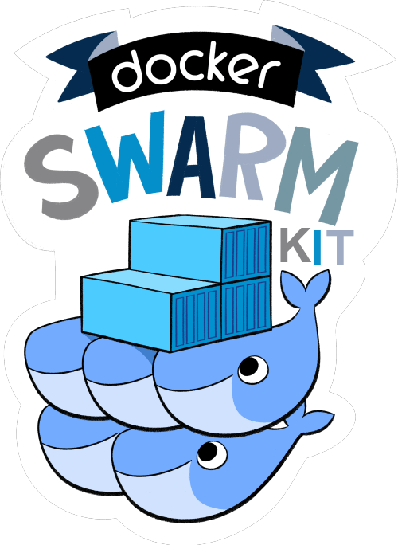
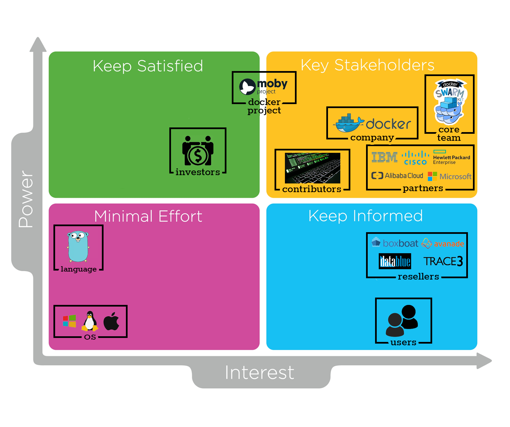
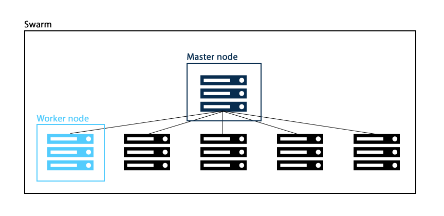
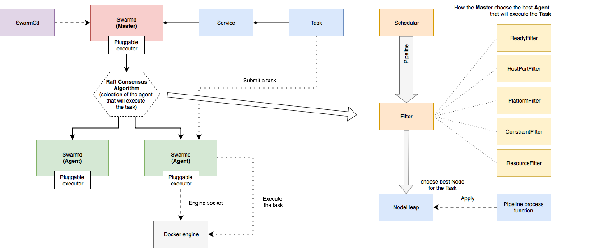
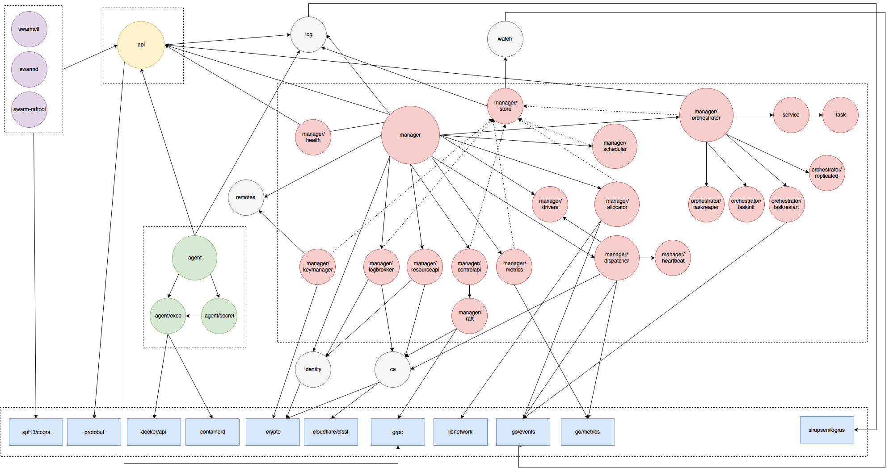
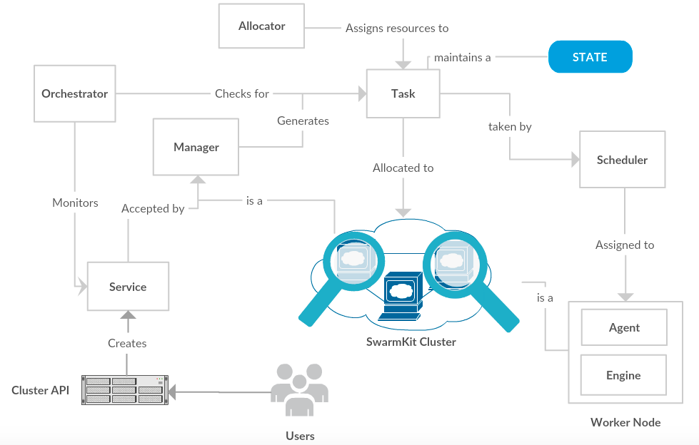
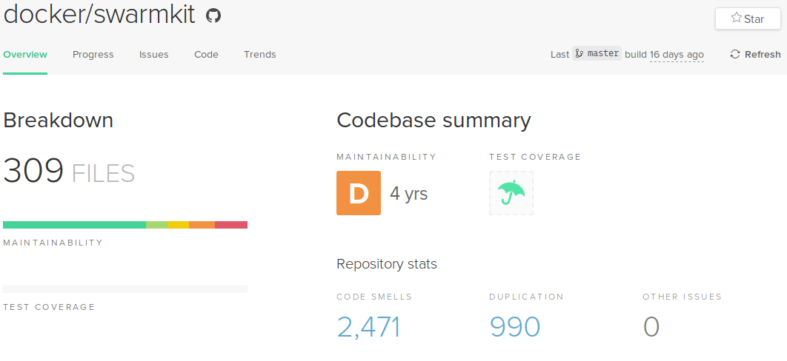
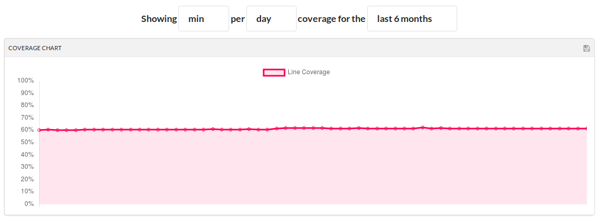
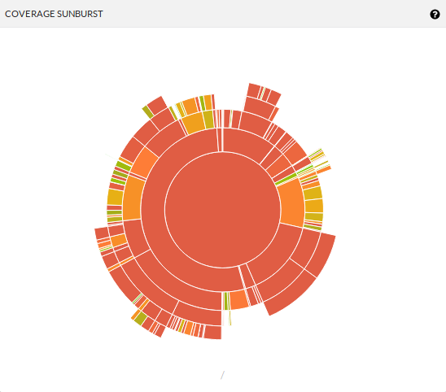

# Docker SwarmKit



[**Dhruv Batheja**](https://github.com/live-wire/), [**Chantal Olieman**](https://github.com/chantal-olieman/), [**Sven Popping**](https://github.com/svenpopping/), [**Vincent Robbemond**](https://github.com/VincentRbbmnd/)

## Abstract

*SwarmKit is a toolkit for container orchestration, with a focus on security and scalability of distributed systems.
The project is managed by Docker Inc., is just over 2 years old and has been open-source for almost 2 years.
SwarmKit is one of the main container orchestration tookits on the market today, and is being actively developed.
This is an analysis of the SwarmKit architecture, by exploring the full project, its stakeholders, developer collaboration, and technical debt.
First, a stakeholder analysis along with a context view are discussed, followed by insights from a core SwarmKit developer.
After that, differrent viewpoints are discussed for the SwarmKit project in order to create a better understanding of the underlying architecture.*

## Table of Contents

1. [Introduction](#introduction)
1. [Stakeholders](#stakeholders)
1. [Integrator insight](#integrator-insight)
1. [Context View](#context-view)
1. [Development View](#context-view)
1. [Functional View](#functional-view)
1. [Evolution Perspective](#evolution-perspective)
1. [Technical debt](#technical-debt)
1. [Conclusion](#conclusion)

## Introduction

SwarmKit is a Docker initiative that began in early 2016, and is a toolkit for orchestrating distributed systems. It includes primitives for node discovery, raft-based consensus, task scheduling etc. SwarmKit is the orchestration component in the Moby Project, and covers Cluster management and orchestration features in Docker Engine 1.12 or later.
It uses the Apache License for use, reproduction, and distribution.

The main collaborators of this project are engineers from Docker Inc., with small contributions from the community. SwarmKit runs on all popular server environments that most of the popular cloud-providers provide. The project is very active and has grown tremendously since its inception. There are daily commits to the repository and issues are actively being created and closed. The releases of SwarmKit are currently coupled with Docker releases. The most recent stable release of SwarmKit is `v1.12.0`.

This chapter is written as part of the Delft Students on Software Architecture book 2018.
This chapter aims to summarize the architecture of SwarmKit, provide details about the stakeholders, present different views ranging from development to functional, and evolution of SwarmKit. Hence, this chapter aims to cover not only the technical aspects of the project, but also provide a broader view. This chapter also covers our interaction with a [core-developer](#integrator-insight) from SwarmKit team, as well as contributions made. This also includes a section about possible scopes of improvement that are discussed in the [Technical debt](#technical-debt) section.

## Stakeholders

The definition of a stakeholder is: people, organizations, groups and/or companies that have interest in the realisation of a project. Stakeholders can be affected by or affect the actions, objectives and policies of the organization.

### Rozanski and Woods classification

In the book "Software Systems Architecture" of Rozanski and Woods <a href='#ref3'>[3]</a>, 11 stakeholder types are described. Below are the types of stakeholders that apply to SwarmKit.

#### Acquires

The acquirer of SwarmKit is Docker Inc. They employ the core team of SwarmKit. This core team is in control of the roadmap. They have a daily stand-up meeting in which they discuss the issues they want to fix that day.

#### Assessors

There is no clear role of an assessor in this project. Docker SwarmKit is licensed under the Apache 2.0 license, which means everybody is allowed to use the software, without warranty or liability from Docker Inc.
Every pull request is checked by two or more members of the core team. They also asses the conformance to standards and legal regulations.

#### Communicators

The most important communicator for SwarmKit is the team itself, they regularly monitor developer platforms like Docker Forum, Google Development Group and Stack Overflow for questions from users/contributors.

Besides the developers, Docker Inc. also collaborates with so called training partners. These are companies certified by Docker which provide education courses.

Annually Docker hosts Docker Con, last year two team members of SwarmKit gave a presentation titled: [Under the Hood with Docker Swarm Mode](https://www.youtube.com/watch?v=Mw4ImA2IB10).

#### Developers/Maintainers

The [MAINTAINERS](https://github.com/docker/swarmkit/blob/master/MAINTAINERS) file on the repository contains a list of all the maintainers of the project. Beside the core team there are a few active developers that contribute to the system.
Most tasks like bug fixes, enchantments, etc. are fixed by the core team.

#### Suppliers

SwarmKit is written in Go, and compiled binaries run on any Unix based OS. GitHub provides the repository where the code is stored. Resellers are companies that offer a service to this customer that use the Docker Enterprise platform as core.

#### Support staff

Docker Inc. itself handles all support. On the website [https://support.docker.com](https://support.docker.com) you can post tickets/questions regarding all Docker systems.

#### Testers

The developers create unit/integration tests, these tests are run by CircleCI and after, CodeCov will create a coverage report.

#### Users

SwarmKit is used by the enterprise customers of Docker. SwarmKit is also used by other companies and private users.

### Other classification

Listed below are additional stakeholders which go beyond the the classification of Rozanski and Woods.

#### Media

A few websites have posted articles about SwarmKit, describing SwarmKit and how it can improve organizations and help with scalability. These may persuade more organizations to use SwarmKit as bases for their infrastructure.

#### Researchers

A article has been published on improvements of the container scheduling for Docker using Ant Colony Optimization <a href="#ref1">[1]</a>.

#### Partners

Docker Inc. has five Spotlight Partners: Alibaba, Cisco, HP, IBM and Microsoft. These partners strive to improve the user experience for developers, by creating a hybrid infrastructure that supports continuous delivery of applications and services. All of these functionalities should be available across all major operating systems like Windows and Linux.

### Power vs. interest grid

A method to classify stakeholders is by using Mendelow's power vs. interest grid <a href='#ref2'>[2]</a>. Figure <a href='#image1'>1</a> shows the power vs. interest grid for the Docker SwarmKit project. There are four categories: minimal effort, keep informed, keep satisfied and key stakeholders.


*Figure <span id='image1'>1</span>: Power vs. interest grid for the Docker SwarmKit project*

## Integrator insight

We scheduled a video call with [@dperny](https://github.com/dperny), a core team member of Docker SwarmKit. Drew Erny graduated in 2016 at the University of Alabama, and has been working at Docker for 2 years.


During this call we asked about the allocator ([docker/swarmkit#2516](https://github.com/docker/swarmkit/issues/2516)), which is one of the big tasks he is working on. He explained the core issue is there is no difference between initialization and allocation of resources. The first version was written by one developer, who was fluent in C, but fairly new to Golang. Therefore the code is messy. Currently Drew is working on [docker/swarmkit#2579](https://github.com/docker/swarmkit/pull/2579) as the first PR in a series of PRs rewriting the allocator. Due to a lack of allocator-related tests, the whole rewrite has to be manually tested. As Drew described, the exact architecture of the allocator is not decided beforehand, but formed throughout the process of rewriting. This makes sense considering in the process of rewriting,  the developers' understanding of this code grows and therefore their view on the architecture may change as well.

The development of SwarmKit is currently following a downward trend in terms of new features in the roadmap. Most open issues are bugs that were reported by enterprise customers. Debugging these issues can be a hard task, as many customers do not give direct access to their clusters. These customer escalations can take up quite some time, depending on the severity of the issue. According to Drew, some issues can take up the entire week, leaving no time for developers to work on other tasks.

Of the few SwarmKit contributors, most work at Docker. Therefore a lot of communication happens internally, face-to-face or through Slack. This makes it easy to 'forget' SwarmKit is an open-source project, and communication towards the community can be improved.

A lot of files in the project contain long methods which is a violation of the SOLID principle. However the team argues that if the function interface is good and testable and the code is dry (no repetition), then long methods are not directly seen as a problem. Secondly splitting these methods up into different function may obscure the complexity of the main method.

Upon hearing our technical debt analysis, Drew agrees that the project contains severe testing debt. Apart from a lack of functional tests, the project also lacks performance tests. The team is able to identify when a cluster is broken, but can't yet figure out what causes the instability.

In the near future, the SwarmKit team aims to fix most of the technical debt by improving code quality and rewriting parts of the code that cause a lot of bugs. One of the long term goals is to integrate SwarmKit with Kubernetes as Docker currently support Kubernetes.

## Context View

This section describes the context view of the `docker/swarmkit` project. The context view portrays the relationships and interactions of `docker/swarmkit` with the environment.

### System Scope

The project repository of SwarmKit uses the following description: *"SwarmKit is a toolkit for orchestrating distributed systems at any scale. Machines running SwarmKit can be grouped together in order to form a Swarm, coordinating tasks with each other."*

SwarmKit is a separate project in the Docker project. It focuses on implementation of the orchestration layer and is used as is in the main project hence efficiently separates concerns.

### Context Model


*Figure: Swarmkit Context Model*

The figure shows a simple black-box context model implementation of the `docker/swarmkit` project. A small description of the important entities in the diagram is as follows:

- **Overview:** SwarmKit is the implementation of the orchestration layer built for the Docker project and aims to abstract the features like Orchestration, Scheduling, Cluster Management and Security.

- **Requires:** The project is implemented in the Go programming language and requires **Go version 1.6 or greater**. The project also requires **Protobuf 3.x or higher** to regenerate protocol buffer.

- **Supported on:** Thanks to the multi platform support of Docker, SwarmKit is supported on all operating systems.

- **Integrations:** The project uses integrations like CircleCI for continuous integration and Codecov.io for gaining insights about the code coverage for testing the impact of new changes made in the system.

- **Inspiration:** [Moby](https://mobyproject.org) is an open-source project started by Docker to enable and accelerate software containerization. SwarmKit is the orchestration component in the Moby project. The architectural decisions for SwarmKit are heavily influenced by Moby guidelines.

- **Community:** The project only uses github for issue-tracking and development collaboration. It has an active community support and adoption. The contributors can be found in the [MAINTAINERS](https://github.com/docker/swarmkit/blob/master/MAINTAINERS).

- **Communication:** This sub-project does not have a big online presence in social media, but the Docker project can be reached out to via several communication mechanisms like: the [Docker forums](https://forums.docker.com), [IRC](https://irc.freenode.net), [Google Group](https://groups.google.com/forum/#!forum/docker-dev), [Twitter](https://twitter.com/docker/) and it also has a Stack Overflow [tag](https://stackoverflow.com/search?tab=newest&q=docker).

- **Sponsors:** The Docker project has raised over 242M from 24 investors in 10 rounds of funding and is valued over 1B. It was incubated by YCombinator and the lead investors include Sequoia Capital, Greylock Partners and Insight Ventures.

- **Competitors:** The main competitors of this swarm orchestration project include Kubernetes, Mesos, Amazon's Elastic Container Service, Azure's container service (AKS).

- **License:** The project is licensed under *Apache License 2.0* to define terms and conditions for use, reproduction and distribution.

- **External and Internal Entities:** External entities where SwarmKit relies on are the cloud providers on which SwarmKit is deployed, the Go programming language in which it is written, CI tools CodeCov and CircleCI and the communication tools used by the core team.The investors and competitors shown in the context diagram can all be categorized as external entities as well. Internal entities include the developers as most of the contributors are employees of Docker and the Moby project as it is a Docker project.

## Development view

### Common Processing Model

Encapsulating common processing across sections of the project into separate code units contributes to the overall coherence of the system and tackles issues like duplication. Since SwarmKit is written in Go, it makes use of the excellent package management that Go provides. Moreover, Go enforces a strict import regime which makes the code more readable and less prone to unnecessary import clashes.

- **Common data store:** SwarmKit's data store is built on top of [go-memdb](https://github.com/hashicorp/go-memdb), which is a in-memory database built on immutable radix trees. SwarmKit also uses [Bolt](https://github.com/boltdb/bolt) to provide a simple, fast, and reliable database.

- **Third party libraries:** SwarmKit uses the [Cobra](https://github.com/spf13/cobra) for its CLI module. It also uses Cloudflare's [CFSSL](https://github.com/cloudflare/cfssl) for signing, verifying, and bundling TLS certificates. Another notable dependency is [containerd](https://github.com/containerd/containerd), to manage the complete container lifecycle of its host system.

- **Logging:** SwarmKit uses [Logrus](https://github.com/sirupsen/logrus) for logging.

- **Scheduling & Batching:** SwarmKit's scheduling algorithm works by balancing the number of task over the nodes in the cluster. However replicas should not be on the same node, when possible, to prevent a single point of failure.

- **Orchestration:** A service gets translated into a number of tasks, these are managed by the orchestrator. There are two types of events an orchestrator handles, service-level events and task-level events.

- **SwarmKit's Task Model:** A task is a "one-shot" execution unit. When a task fails it while never be executed again. The orchestrator may create a new task to retry.

#### Instrumentation Analysis

Instrumentation refers to the ability to monitor or measure the level of a product's performance, to diagnose errors and to write trace information.

As of now, SwarmKit doesn't have any specific instrumentation code. SwarmKit uses [Logrus](https://github.com/sirupsen/logrus) for all of the project's logging. SwarmKit uses [Testify](https://github.com/stretchr/testify) with features like *easy assertions*, *mocking*, *testing suite interfaces and functions*.

Developers can use instrumentation locally, for instance one can incorporate [gmx](https://dave.cheney.net/tag/gmx) to query the internal state of their Go application. Secondly, [Delve](https://github.com/derekparker/delve), a full featured debugging tool for Go.

##### Standardization of design

For software developers to contribute to Docker swarmkit, some clear guidelines are set in [CONTRIBUTING.md](https://github.com/delftswa2018/swarmkit/blob/master/CONTRIBUTING.md). A guide explains [setting up a Docker development environment and the contribution process](https://docs.docker.com/opensource/) for all Docker projects.  The [community guidelines](https://github.com/delftswa2018/swarmkit/blob/master/CONTRIBUTING.md#docker-community-guidelines) are mentioned specifically, these are general guidelines for the community as a whole and are enforced accordingly.

##### Code conventions

While reporting an issue, it is important the issue include the `docker version` and `docker info`. This information helps the team to review and fix the issue.
One should also take care as to not submit duplicate issues.

When submitting a change, the changes should be made on a feature branch in a forked repository. The name of the branch should look like XXXX-something, where XXXX is the number of the corresponding issue.

When creating or modifying a feature, it is desired the documentation is updated accordingly, here also the [style guide](https://docs.docker.com/opensource/) is referenced, containing instructions on building the documentation.

To keep all code clean, [gofmt](https://golang.org/cmd/gofmt/) should be used to format all submitted code. Specifically, `gofmt -s -w file.go` should be run on every changed file.

PR's should always be rebased on top of master, without any other branches mixed into the PR. Commits should be squashed into logical units of work before making a PR and the description should contain the issue being addressed.

Overall, the [coding guidelines from the Go community](https://github.com/delftswa2018/swarmkit/blob/master/CONTRIBUTING.md#coding-style) are followed.

##### Signing

Every commit should be signed-off, agreeing to the [Developer certificate](https://developercertificate.org/).

#### Standardization of testing

To ensure a reliable build process for SwarmKit, standard practices have been adopted by the team to test the adapted or added code.

##### Testing framework

SwarmKit leverages a standard project structure to work well with the standard Go [testing framework](https://golang.org/pkg/testing/).
Tests are run with the `go test` command, which automatically executes any function of the form:

```Go
func TestXxx(*testing.T)
```

In line with the testing framework, all tests have a filename that end in `_test.go` and live in the same directory as the file being tested.

##### Automated testing

All code changes are tested automatically by triggering a test on [CircleCI](https://circleci.com/gh/docker/swarmkit).
The `README.md` in the main folder holds a badge showing result of the latest tests on the master branch:
[](https://circleci.com/gh/docker/swarmkit).
NB: The result of the automated test build for our first Pull Request can be found [here](https://circleci.com/gh/docker/swarmkit/8634).

### Module Structure

#### Concept of SwarmKit

SwarmKit can group hardware in order to form a *Swarm*, in which tasks can be coordinated among individual pieces of hardware. Once a machine joins, it becomes a node in the Swarm, called a *Swarm Node*. Figure <a href='#image2'>2</a> shows an example of a Swarm.

There are two types of Swarm Nodes, the worker node and the manager node. The worker node, called *Agent*, is responsible for running Tasks using an Executor. The manager node, called *Master*, accepts input from the user and is responsible for reconciling the desired state with the actual cluster state.


*Figure <span id='image2'>2</span> Example of the hardware structure of a Swarm*

#### High level components

Figure <a href='#image3'>3</a> depicts the dependencies for Tasks, Services, Master and Agents. *SwarmCtl* is used to communicate with the cluster. The `swarmctl` command is used to to create, update and delete services and add/remove nodes from the swarm.

When a service is added to the cluster through the API, the Master will generate tasks, allocate resources, and pick an available node to execute the tasks. For the coordination of the tasks SwarmKit makes use of the [Raft Consensus Algorithm](raft.github.io).


*Figure <span id='image3'>3</span>: Dependencies of the Task, Service, Agent and Master.*

Within the Master node there are four main parts, the Orchestrator, the Allocator, the Scheduler and the Dispatcher. The Orchestrator is there to ensure that the services have the appropriate set of tasks running in the cluster. The Allocator is responsible for dispensing the required amount of resources. The Scheduler assigns the tasks to the available nodes. The Dispatcher handles all communication between the Master and the Agent.

A worker consists of two parts, as shown in figure <a href='#image3'>3</a>, the agent and the engine. The Engine runs the containers. The Agent coordinates the work and maintains the connection with the Master, the Agent notifies the Master of the current state of the assigned tasks.

#### Dependencies of components and models



*Figure <span id='#image5'>5</span>: In-depth overview of the dependencies of components.*

Figure <a href='#image5'>5</a> depicts the in-depth dependencies of the SwarmKit project. There are six types of components in this project, each type of component will be explained.

##### Blue components

Blue depicts vendor components, of which only the most important are shown. The vendors not shown in this figure are helper classes/functions. The full list of vendors can be found in `vendor.conf`.

##### Yellow components

Yellow depicts the API, which is based on protocol buffers. All communication between different components is event driven and go via the API. For readability, only the important connections are shown.

##### Purple components

Purple components are the available commands to interact with the SwarmKit cluster.

##### Grey components

The grey components are global helper classes/function. The `log` is the global logger of the system, `remotes` keeps track of remote addresses by weight, informed by observations, `identity` generates random ids which are used to identify components within the Swarm, `ca` is the certificate authenticator of SwarmKit and `watch` starts a stream that returns any changes to objects that match the specified selectors.

##### Green components

The green components are part of the agent module. The `agent/exec` is the executor for a container, currently the containers based on `dockerapi` and `containerd` are supported.

##### Red components

The red components are part of the manager, which looks like a very complex system.

The module `manager/store` stores all the information about the clusters. The module `manager/health` keeps track of the manager's health and reports it to the API.

Scheduling of the services and assigning them to a node in the cluster is handled by `manager/scheduler`. The scheduler only depends on the `manager/store`, because it needs information about the different nodes to decide where to deploy the tasks.

Allocation of resources for the task execution is done in the `manager/allocator` module. This module uses the vendor library `libnetwork` for setting up an network connection with the task. `go-events` is used for the event driven communication between the manager and the allocator.

Module `manager/dispatcher` is responsible for dispatching tasks and tracking agent's health. The tracking of the agent's health is done via a `manager/heartbeat`.

The biggest module within the `manager` is the `manager/orchestrator` which runs a reconciliation loop to create and destroy tasks as necessary for global services.

## Functional View


_SwarmKit Functional View_

The figure describes SwarmKit's important functional elements, their responsibilities, interfaces, and some primary interactions among them. It drives the shape of the overall system design and architectural decisions. It also depicts the flexibility of SwarmKit as a separate pluggable system and the ease of adding new features in any particular part of the project.

The components shown in the functional view diagram are as follows:

- **Cluster API:**
It is the endpoint that is available for the users to create service requests. The valid service requests then end up as *services* which will be executed by the swarm.

- **Service:**
A service is a set of instructions for the cluster about what needs to be run. It is the central structure of the cluster system and the primary root of user interaction.

- **Task:**
A task basically represents a unit of work assigned to a (worker)node in the _cluster_. A task contains a description about running the container.
As a task flows through the system, its **state** is updated accordingly and the change of state only flows in one direction. Once a the task is bound to a
node, it can only run on that node or fail.

- **Orchestrator:**
The service informs the orchestrator about how to create and manage tasks. The Orchestrator ensures that services have the appropriate set of tasks running in the _cluster_ according to the _service_ configuration and polices.

- **Allocator:**
The allocator dispenses resources, such as volumes and networks to tasks, as per the respective task requires.

- **Cluster:**
A cluster is made up of an organized set of Docker _Engines_ configured in a
manner to allow the dispatch of _services_. It contains two kinds of nodes:
	- **Manager**
	A manager accepts _services_ defined by users through the _cluster API_. When a valid _service_ is provided, the manager will generate tasks, allocate resources and dispatch _tasks_ to an available _node_.

	- **Worker**
	A typical worker contains an **Agent** that coordinates the dispatch of work for a _worker_ and the recipt of _tasks_. This agent maintains a connection to the _dispatcher_, waiting for the current set of tasks assigned to the node. A worker also contains an **Engine** which is a shorthand for the _Docker Engine_. It receives and executes _tasks_ while reporting on their status.

## Evolution Perspective

SwarmKit has evolved quite a lot since the inception of the project in Feb 2016. A lot of new features have been added to the system since then. There have been quite some contributions in terms of new features and bug fixes by the community. This section will briefly cover the evolution of SwarmKit throughout its development.

Docker was released as an open source project by dotCloud, a platform as a service company, in 2013. _Docker Swarm standalone_ was then introduced as a native clustering system for Docker. This basically turns a pool of Docker hosts into a single, virtual host using an API proxy system. This was Docker's first container orchestration project that began in 2014. It is still a very convenient tool to schedule containers. Then came **SwarmKit** in early 2016. This included cluster management and orchestration features in Docker Engine 1.12 and up. When Swarmkit is enabled, the Docker Engine is said to be running in _swarm mode_. Swarm mode (SwarmKit) was Docker's response to the community's request to simplify service orchestration. Docker announced the Moby Project in _DockerCon 2017_ which is an open-source project created by Docker to enable and accelerate software containerization. This project heavily influences the architectural decisions for SwarmKit going forward.

SwarmKit currently follows the [semantic versioning](http://semver.org/) convention when releasing an update, that is `vA.B.C` where `A` denotes a major release, `B` denotes a minor release, and `C` denotes a patch release. The project currently only has 3 releases published:

- [M1](https://github.com/docker/swarmkit/releases/tag/M1) Published on 18 Mar 2016
- [M2](https://github.com/docker/swarmkit/releases/tag/M2) Published on 29 Apr 2016
- [v1.12.0](https://github.com/docker/swarmkit/releases/tag/v1.12.0) Published on 29 Jul 2016

The most recent release `v1.12.0` was the Tag version of SwarmKit shipped in Docker 1.12.0. There has been a lot of development on the project since then in the `master` branch and the version bump branches which follow this kind of versioning: `bump_v1.12.2`. These maintain stable versions of SwarmKit based on features developed till then for the corresponding semi-releases. The versioning in these branches is not very consistent. For example the most recent branch is `bump_17.03.1`. This is not a big issue as the next major release would go hand in hand with the next Docker release.

Besides the new features and bug fixes on each release, SwarmKit also keeps improving its transparency and product design documentation. The development of the project has been quite organized and the roadmap seems well planned to address the technical debts and service new feature requests.

## Technical debt

Technical debt is a concept that represents the implied cost or additional work of choosing an easy solution now instead of using a better approach right away that is harder to implement or takes longer.
This does not have to be a conscious decision, e.g. it can be a result of lack of experience or knowledge.

### Identifying Technical Debt

In a big project like SwarmKit, identifying Technical Debt might feel a bit overwhelming, luckily there are different approaches to doing so.

The following approaches were used to identify technical debt:

1. [Code inspection tools](tooling.md)
1. [Analyzing design and architecture](design-debt.md)
1. Issue analysis
1. Manual code inspection

One of the cases found is related to issue [#2516](docker/swarmkit#2516), which will be explained in the [section on design debt](design-debt.md).

An example found by manual inspection is the `manager/allocator/network.go.`, which contains a lot of long and complex methods without comments.
Another example is `manager/dispatcher/dispatcher.go`, which has 8 TODO's, however, no issues are created to actually fix them.

To realize good maintainability and understandability, it is very important to keep code documented and clean, for these cases it is safe to say that there is some form of technical debt present.

### Design/Architectural Debt

This section will focus on parts of the system that contain architectural or design flaws, this means that for example, they are not as flexible as they could be.
We will glance over the architectural technical debt that we identified and explain why they will require time investments to be fixed.

One of the big architectural decisions that the needs to be made is referenced by [issue #2516](https://github.com/docker/swarmkit/issues/2516) **Rewrite Allocator** by [Drew Erny](https://github.com/dperny).
Which states the Allocator code is badly written, quoting Drew: "is a source of constant bugs and breakages".
Apparently, the code associated with the allocator has a lot of problems like:

- Cluttered code which isn't being used.
- Methods implemented straight on the Allocator object, which is suggested to be separate.
- Under-commented and tangled code, which makes piece-wise refactoring almost impossible.
- Possible inconsistencies between the raft state and the local state of the network allocator  because of logic errors.
- Race conditions in local state initialization because initialization and allocation using the same code paths, resulting in IP allocation errors.

This issue was marked with the `exp/expert` tag, which means it requires hours from people with the maximum amount of experience/skills.
Rewriting the entire allocator component, according to Drew, would give them a clean slate and would let them finally get rid of the most ingrained design flaws.

### Identification of Testing Technical Debt

According to the CodeCov badge in the `README.md` in the SwarmKit repository, the current test coverage is 61%.
This level of test coverage has been around 60% in the last 6 months, however, untested packages are not considered in the calculation.

#### Packages with low test coverage

The three packages with the lowest test coverage are `cmd` (the command tools to interact with the Swarm), `protobuf` (the code for the [protocol buffers](https://developers.google.com/protocol-buffers/)), and `agent` (the code for the SwarmKit agent).

Within the `cmd` package, the `swarm-rafttool` has a test coverage of 12.97%.
This is caused by the low test coverage of two of the three files, `main.go` and `dump.go` have little to no test coverage.
The `dump.go` file is not tested at all, the reason why is unknown, maybe due to the  high cognitive complexity (191, as reported by CodeClimate) and large number of code smells (24).
The low test coverage of the file `main.go`, is due to the fact that a function within a `cobra.Command` is really hard to test.
A possible solution for this is by extracting the command code into another function, for example as shown below.

Before:

```go
boomCmd = &cobra.Command{
    Use:   "boom <output directory>",
    Short: "Explode all the things",
    RunE: func(cmd *cobra.Command, args []string) error {
        for _, arg := range args {
            println("boom " + arg)
        }
    },
}
```

After:

```go
boomCmd = &cobra.Command{
    Use:   "boom <output directory>",
    Short: "Explode all the things",
    RunE: func(cmd *cobra.Command, args []string) error {
        boom(args...)
    },
}

func boom(args []string) error {
    for _, arg := range args {
        println("boom " + arg)
    }
}
```

By refactoring the code according to the second example the function `boom` becomes better testable.

All the other commands in the `cmd` package are not tested at all.
The `main.go` files can be tested using the method as described above.

Within the `protobuf` package only two files are covered by tests, the average test coverage of these two files is 28.81%.
The reason for this low test coverage is that this specific code is generated.

The `agent` package has a test coverage of 49.78%. This package contains one of the two integration test in the whole project.
The test coverage can easily be increased by adding tests for a number of small files, which have a low coverage.
Beside that a lot of files in the package have a high cognitive complexity, due to long functions with a lot of if-statements.
Splitting these functions into smaller functions makes it much easier to test the whole file, increase coverage and lower the cognitive complexity.

#### Testing procedures

The majority of tests are pure unit tests with a few exceptions of tests that do some sort of class integration test.
There are two full integration tests: one which tests the main functions of the Swarm cluster, the other tests the agent controller flow against a docker instance to make sure it does not blow up.

The SwarmKit team wants to avoid mocking or implementing fakes for classes, because they are expensive to maintain. Due to this decision a few critical parts of the system remain untested.

```text
// TODO(stevvooe): The current agent is fairly monolithic, making it hard
// to test without implementing or mocking an entire master. We'd like to
// avoid this, as these kinds of tests are expensive to maintain.
```

The SwarmKit team wants to decouple classes, which should make testing easier (as in the `cobra.Command` example) and cheaper to maintain.

### Tooling

This section describes the code inspection tools used to identify technical debt and the insights these tools provided.

#### CodeClimate

The SwarmKit project uses [CodeClimate](https://codeclimate.com/github/docker/swarmkit) to assess the maintainability of the project.

At the time of writing, this is the status of the project:



The CodeClimate maintainability grade for the SwarmKit project is a D (Technical Debt ratio between 20% and 50%), with a time estimate of 4 years to resolve all these issues.
Furthermore, there are 2471 counts of code smells and 990 counts of duplication marked in the project.
These metrics are skewed, since a large part of the code in the project is auto-generated by [ProtoBuf](https://github.com/google/protobuf).
A large portion of files which CodeClimate graded poorly are these auto-generated files, for which maintainability is of no concern to the SwarmKit maintainers.

Disregarding the auto-genereted files, these are files with the lowest grades and longest time estimation to resolve issues:

- `manager/state/raft/raft.go`
- `manager/allocator/network.go`
- `manager/dispatcher/dispatcher.go`
- `manager/controlapi/service.go`
- `cmd/swarm-rafttool/dump.go`

It becomes clear a lot of maintainability issues stem from code related to the Manager.

#### CodeCov

[CodeCov](https://codecov.io/github/docker/swarmkit) is a code/test coverage reporting tool.
It has a straightforward formula: `hits / (hits + misses + partials)`.
Here, `hits` indicate parts of the codebase which are being executed, while `partials` are parts which are partially executed by the test suite.
Finally, `misses` are parts of the code which have not been executed.

At the time of writing, this is the status of the project:



Code coverage has barely changed the past 6 months, since the SwarmKit project is actively being developed and new code gets added daily, this means that a fair amount of that code is being tested.
An additional visualization is the [Sunburst](https://codecov.io/github/docker/swarmkit), depicting the folder/file structure and the test coverage of that part of the project:



This shows us specific parts of the project are well tested, while others are not.
The innermost band that spans half the core is the `manager` folder, which also contains a lot of low maintainability files as described in the section on CodeClimate.
This makes it easy to identify large files with low coverage, some of these include:

- `manager/state/raft/raft.go`
- `manager/allocator/network.go`
- `manager/allocator/cnmallocator/networkallocator.go`
- `manager/dispatcher/dispatcher.go`

As was to be expected, there is a lot of overlap with the files listed in the CodeClimate section.

#### Impact of Technical Debt

Most of the violations are Single Responsibility Principle (SRP) based, which is a result of many long files with long functions.
These violations can have a big impact, because it often occurs in the core of the program.
When these violations are re-factored, thus making sure a class/function has a single purpose (making them more robust), making changes will be less daunting (which is the case at the current time, as seen by the discussions between the developers).

In combination with the low amount of test the impact becomes even higher.
After resolving the SRP violation there is now a way to make sure that the code does actually function the same way as before.
So the emphasis is on creating a more extensive test suite, to provide a larger safety net when eventually refactoring becomes inevitable.

## Conclusion

This chapter analyzed Docker's SwarmKit and it can be concluded that it is a well thought out project.

The first section throws light on the stakeholders involved in this project. Furthermore, stakeholders were analyzed through a power vs. interest grid, and concluded that the stakeholders with the highest interest and power include the core team, Docker Inc., partners and the Moby project.

The next section analyzes the dependencies of the project and visualizes this in a context diagram. It neatly separates external and internal entities of the project. After which an interview with core developer [Drew Erny](https://github.com/dperny) is discussed. By interviewing a core team member, we got a better understanding of the way the team copes with technical debt and the architectural difficulties they face.

SwarmKit has a modular nature, which makes it relatively easy to extend the project. This is achieved by common processing (for example the Common Data Store) and standardization (for example the Task Model) in the design of the project.
The Development view section discusses the structure of SwarmKit's codebase. The next section covers technical debt of the project. It covers a few major architectural/design debts like the buggy allocator. The code quality and coverage is also analysed while describing techniques used.

This chapter also discusses the contributions we managed to make which helped progress the project. Conclusively, SwarmKit is a really interesting project which is professionally managed by a team of talented engineers. We loved our interaction with Drew and enjoyed working on the project. We will follow the progress of the project and try to keep making contributions.

## Reference

- <span id="ref1">[1]</span> KAEWKASI, C. and CHUENMUNEEWONG, K., 2017. Improvement of container scheduling for Docker using Ant Colony Optimization, 2017 9th International Conference on Knowledge and Smart Technology: Crunching Information of Everything, KST 2017 2017, pp. 254-259.

- <span id="ref2">[2]</span> Mendelow, A. (1991) ‘Stakeholder Mapping’, Proceedings of the 2nd International Conference on Information Systems, Cambridge, MA (Cited in Scholes,1998).

- <span id="ref3">[3]</span> Rozanski, N., & Woods, E. (2012). Software systems architecture: working with stakeholders using viewpoints and perspectives. Addison-Wesley.
