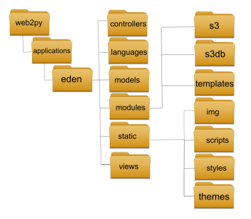
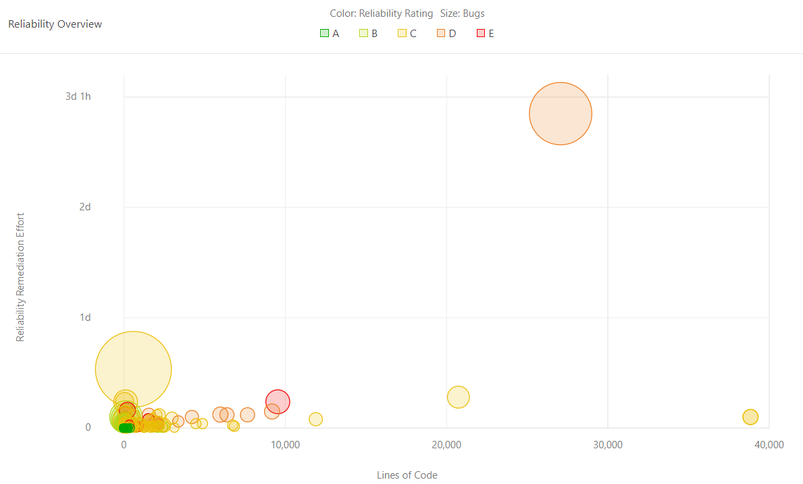
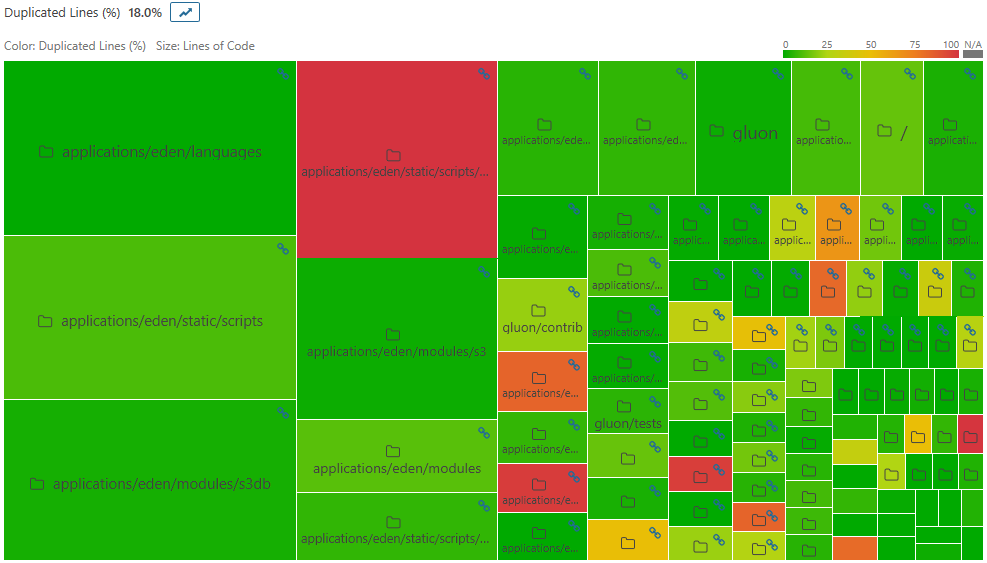
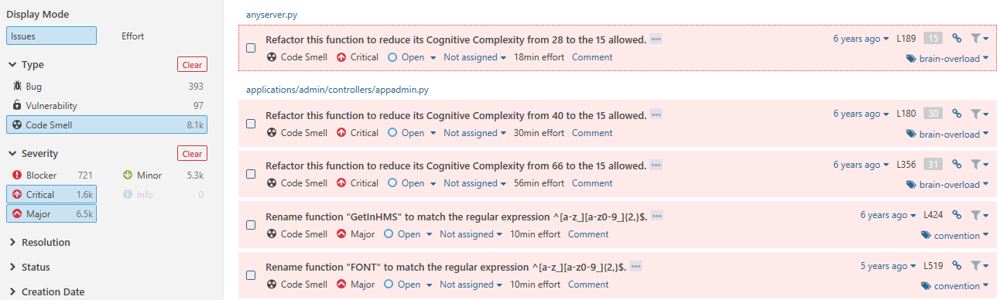
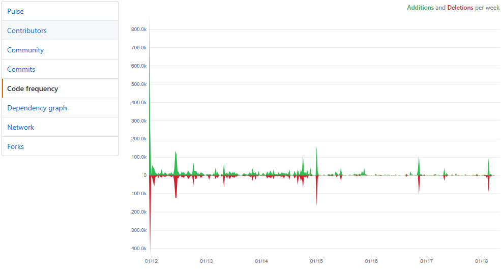
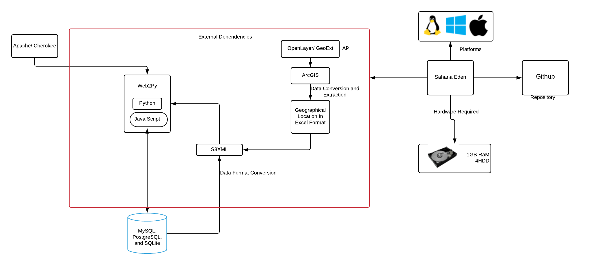

# Eden

## Team members
| [Aravindakshan Ramesh](https://github.com/dakshan07) |  [Mohammed Al-Owayyed](https://github.com/ExtraMHD) | [Myeongjung Park](https://github.com/Myeongjung) | [Louis Sikkes](https://github.com/lsikkes) |
| --- | --- | --- | --- |
|  |  |  |  |

# Abstract

Sahana Eden is a free open source system for disaster management that is highly regarded for its configurability and customizability. It provides a solution for governments, organizations, civil societies, communities and affected individuals in responding to a disaster when one occurs. The system also receives support of various types from volunteers in the community, as well as from several professional companies. 

## Index

[1. Introduction](#introduction)

[2. Stakeholder Analysis](#stakeholder-analysis)

[3. Context View](#context-view)

[4. Development View](#development-view)

[5. Technical Debt](#technical-debt)

[6. Internationalization Perspective](#internationalization-perspective)

[7. Deployment View](#deployment-view)

[8. Conclusion](#conclusion)
# Introduction
Sahana (which means “relief” in Sinhalese)  started after the tragic Indian Ocean earthquake and tsunami in 2004, when members of the IT community in Sri Lanka, called the Lanka Software Foundation (LSF), began to implement a solution for efforts to alleviate human suffering during the aftermath. In 2009, LSF requested to make the software project an independent nonprofit organization based in the United States with a mission of providing reliable solutions in emergency management, humanitarian relief and social development domains. Since that time, Sahana Software Foundation (SSF) has developed many open source software products, mainly focusing on solutions used by relief organizations.

Nowadays, Sahana Eden, the latest evolution, includes many functionalities in managing organizations, people, projects, inventory and assets, as well as handling assessment information and providing situational awareness through maps. Its goal is to both plan ahead so that response can be fast and to provide a management tool during such a situation. Thus, Sahana Eden is highly appreciated by various communities, from governmental and nongovernmental organizations (NGOs), who appreciate the customizability, to the open source community and academic researchers, who see it as a useful platform for analyzing and studying open source disaster management software. 

# Stakeholder analysis
In this section, we identify the key stakeholders of Sahana Eden. At first, we state the board of directors of the Sahana Eden foundation, we will later refer to them as the core team. After that we list the types of stakeholders proposed in Rozanski and Woods and identify them in a table:

| Type | Stakeholders | Description |
| ----- | -------- | ----------- |
| Acquirers | Core Team | The core team of Sahana Eden (their board of directors) oversee the future roadmap of company by creating issues and engaging in discussions for system development. | 
| Assessors | Core Team and Contributors | The core team assess the conformance to standards and legal regulations themselves. In this category we have identified two people: Brent Woodworth, who is an International Risk and Crisis Management expert, and John Smith, who is a law enforcer at the Disaster Risk Mitigation (DRM).  | 
| Communicators | Core Team and External Organizations | Devin Balkind, the president of the project, Nuwan Waidyanatha, also a member of the board of directors, and Lutz Frommberger post regular updates and developments of Sahana Eden on external communication platforms (their website, blog, Twitter, etc.) |
| Developers | Core Team and Committers | In the Sahana project the main people are Francis Boon (over 3000 commits), Nuwan Waidyanatha. They are the co-founders of the project and integral in the development of the system. They review almost all pull requests on github. Furthermore , Dominic König (over 3000 commits) and a Github user called trendspotter are also very active in the development process through Github. The pull requests and issues are handled by Dominic König and Francis Boon |
| Maintainer | Core Team and Contributors | The overall evolution is maintained by the core developers, all other maintenance tasks like bug fixes are done by contributors. The localization team appoints a maintainer for each language translation and the teams are governed by the core team members. |
| Suppliers | Core team and Auxiliary Organizations | Auxiliary organizations provide relief measures and are not directly involved with the system. Since Sahana Eden is also a self hosted system where the deployment is done by users who use the system. |
| Support Staff | Developers | Support for the development of Sahana Eden is done by internal as well as external developers through github and through [Google Groups](https://groups.google.com/forum/#!forum/sahana-eden) |
| System Administrators | Core Team and Users | Since Sahana Eden is self deployed, the user becomes the system administrator | 
| Testers | Core Team and Contributors | The core team is involved in fixing bugs and reporting errors. In addition, Sahana community members can sign up as testers to participate in the testing of development branches. trendspotter is one of the main testers of the system. |
| Users | End Users | The end users represent most of the Sahana Eden Community. They range from volunteers,health care organization or government organizations. They are mostly concerned about the functionality of the system. |

Going beyond the book we have identified stakeholders which do not directly fall under the Rozanski and Woods classification. 

- Competitors: Ushahidi is an open source disaster response organization that  allows anyone to gather distributed data via SMS, email or web and visualize it on a map or timeline. Their goal is to create the simplest way of aggregating information from the public for use in crisis response.
- Researchers and Scientist: They research and present findings of the system through journals. They are also integral in improving the functionality of the system. For instance Pictographs in Disaster Information Communication for the Linguistically Challenged is a core-recognition project, funded by the Humanitarian Innovation Fund of UK.
- Media: They present unambiguous and reliable sources of information and is vital in the communication of the system to people and developers who are interested in new challenges and projects. Sahana software and its role supporting post-tsunami disaster relief in Sri Lanka were featured in the 2006 BBC World documentary The Code-Breakers.

|  |
|:--:| 
| *Power interest diagram: We have analyzed the stakeholders and grouped them in a diagram to give a better understanding of who to monitor and how.* |

# Context View

The context view describes the relationship, dependencies and relationships of the system with its environment. In the diagram above we have split these into groups that we have derived from the stakeholder analysis and the external entities that we will now discuss.
- Governmental and non-governmental organizations: The external entities contained in this group range from government departments and the police to healthcare organizations like the Red Cross. These organizations make use of all external interfaces of the system. We will describe the three most important ones now: alerting, importing and exporting and printing maps. These will be explained later in the document.
- Volunteers: Besides big organizations, individual volunteers can also help during a disaster. These people will not have a wide variety of assets or inventory and will therefore not use all external interfaces of the system. The main focus of these people lies in receiving alerts whenever something happens or letting organisations know their skills and availabilities.
- Media: The last external entity that we discuss is the media. They are not involved in participating to support the disaster area, their main focus is to report on the activities. They will therefore only use the alert functionality to be alerted of any activities.

# Development View
Before we start to contribute to the Sahana Eden, we have to know how the system is built. In this document, we start off by giving an overview of the components of the system. In the second section, we discuss the common design models and approaches that were used to build the system. Thirdly, we talk about the guidelines that are being used during the development of the system, we do this by talking about the release and testing processes.

## Component overview
Sahana Eden contains many different modules which can be configured to provide a wide range of functionality. Since these modules are easily customizable, they can provide solutions in a wide variety of contexts. This further enhances by the fact that these modules can be enabled or disabled to provide the needs of the deployer. In this section, we will outline these and explain what purpose they serve. The information found here has been extracted from a brochure found on the Sahana Eden website [3].

|  |
|:--:| 
| *Module Overview: After analyzing all modules we have created the following diagram to visualize their dependencies on each other.* |

This diagram gives a logical view of how the modules work together, we have not extracted this from the code. We can see that in the middle the organization registry interacts with most other modules. We then see that organizations can perform a variety of tasks like managing inventory or assets. Finally, most modules are linked to the map, which can create a map of most data in the system.

We have identified the following modules:
- Organization Registry:
This module allows registry, searching and modification of data of organizations. It also allows the registration of warehouses, offices and field sites which can be mapped to other modules.
- Project Tracking: The project tracker provides a platform to allow the organizations to manage the projects that are currently active and what their needs are. This tool is used for instance by the Disaster Risk Reduction Project Portal [13].
- Messaging: The project allows users to set up groups so a large audience can be messaged at once. Furthermore, there is the possibility to subscribe to communication channels such as email, SMS, Twitter and Google Talk.
- Scenarios & Events: This tool can be used to map the needs in different scenario's, including human resources, facilities, assets and tasks. There is the option to create specific templates which can be used whenever a new disaster happens.
- Human Resources: Eden is able to track volunteers and staff of different organizations. It keeps track of what they do, where they are and what their skills are.
- Inventory: A wide variety of items, ranging from supplies for survival to tools for rebuilding area's, are often needed after a disaster. This module can keep track of inventories and match requests. It can be used to record and automate transactions for sending and receiving shipments.
- Assets: Vehicles, radio equipment, power generators and more are all needed after a disaster. This module provides a platform to track which assets are available, where they are and in which condition they are.
- Assessments: It is used to collect and analyze assessment information to support planning ahead. Users can design templates that can later be imported when a disaster happens. The module includes reports, graphs and maps. 
- Map: The integrated map module can be used to visualize data. It supports any location-based data and aims to provide situational awareness. Many formats for overlaying data are supported such as population and weather data.

## Common design models
The Eden project is built in two languages, Python and Javascript. They use Web2Py with the goal of making the web development easier, faster and more secure. This framework enforces to build an MVC environment. The other big framework that is used is the S3 API. They use this for a lot of their functionalities: authentication, authorization and accounting, logging, as a RESTful API, accessing the database, exporting/importing, GUI's and mapping. Finally, to import and export data they use the XSLT format. This allows them to import and export data easily and even on-the-fly. Their repository contains 2 folders dedicated to defining the resulting structure of the XML files. Furthermore, the import/export templates are stored in the static/formats/... folder. We will now delve more specific into two design models: internationalization and importing and exporting. 

### Internationalization
Since different people from different countries and cultures have to interact with this system it is important that the system is understandable for all of the users. Most of the languages are handled using the web2py localization engine. This contains a file for each language which contains the translations from English to the correct language. Some of these files have been established using Google Translate.

### Importing and exporting
Since Sahana Eden is allowing organizations to collaborate each other it has to import data from most of these organizations. This data can range from inventory information to data about a certain area. To support a wide variety of different formats to use for importing and exporting data they use XSLT templates. This can be used to create for instance csv and XML files on the fly. 

### Code conventions
A full list can be found here [15]. To check for these code conventions they use several tools including PEP8, PyLint and PyChecker. Since they aim to be internationally available, all strings should be labeled, so that the appropriate language can be gathered from its corresponding file. Furthermore, all files, classes and functions, should have docstring to allow auto-generation of API documentation using Epydoc.

## Codeline model
In this section, we will describe the components that make up the code of the project. For this, we have studied their Github repository [10] and analyzed the components that can be seen in the picture below. This picture was found on their website. We expected to find some of the module structure that we have found earlier in this document to be present in the code. This is not the case, all the functionalities from these modules are handled in the controller folder, which has no further structure. We will discuss this later on. 

We can see in the picture below that there are 6 main folders. In the repository itself, there are four more folders on the same level. These folders are 'cron', 'docs', 'private' and 'tests'. In the 'docs' and 'private' folders, we found some documents unrelated to the rest of the code so we will only not analyze these any further. While observing the repository we found very minimal use of a folder structure within these specified folders, most of them contain a bunch of files that do a wide variety of things. 

|  | 
|:--:| 
| *Folder structure of the repository* |

- Model, View & Controllers : The controllers are the part of this system where the logic happens (.py files). Instead of a further structure inside this folder, we found some single files that are related to a module. For instance, the 'project.py' file handles project registry and the 'inv.py' file handles managing the inventory. The models are .py files and the views are HTML files, both folders have no further structure.
- Languages : The files in here are Python files that translate English to another language. The format of the files is as follows: 
 { 
 "%s rows deleted',nrows": "%s lignes supprimées',nrows", 
 ... 
 }
- Modules : Contains external modules like GeoJSON (an open standard format designed for representing simple geographical features), S3 (accommodates cloud object storage), S3 database, S3 unit tests, ClimateDataPortal, GeoPy, a name parser and PyGSM.
- Static : The static folder contains any static files that are stored once and rarely touched afterwards. In here we can find images, themes, styles, fonts, scripts and more. 
- Tests : Contains the tests, we will talk about these later.
- CRON : To perform some time-based jobs they make use of CRON. In here we find only 3 files of which one is empty and 1 contains only 1 line that sets a heartbeat. The final file is an SMS handler that probably sends automated messages.

## The release process
Whenever new contributions are ready to be published they will plan to make a release version of the system. This consists of:
* Creating a QA branch in which final integration testing will be done before pushing it to the Stable branch
* Creating a Stable branch, deployment will be done from this branch
* Adding appropriate tags to the release, the following schema will be used [Branchname]-[Major].[Minor].[Sub]
* Building upgrade scripts, the pull script has been modified to call this script automatically

## The testing process
An important step in the development process is verifying that the system works properly. To this extend Eden has implemented several testing approaches that we will discuss in this section. In the technical debt, we have tried to run these tests. We will discuss them further in that chapter.

### EdenTest
EdenTest is a Robot Framework based test framework used for automated testing in Sahana Eden. The files implementing these tests are .txt files that contain almost regular language instructions, for instance: "Open Advanced Filter Options". These functions are defined in separated files which makes it easy to reuse them.

### Unit Tests
From the website, we found that unit tests are used to detect problems early during the development process. This indicates that they make use of test-driven development. Each module has their own test set that was separately run. Aside from validation they use these tests to validate the design against requirements, keep implementation simple and focused and mention that this can be a great source of code samples as to how to apply your API methods. A Continuous Integration server that uses Travis has been set up. Whenever a pull request is created all unit tests are run before and have to succeed before it can be merged.

# Technical Debt
## Bugs & Reliability
SonarQube rated Sahana Eden's reliability as an E (from A to E), which means there is at least 1 blocker bug presented in the program. Upon further inspection, it was discovered that SonarQube flags Python 2 code as errors if the code  is not compatible with Python 3. Thus, Python 2 -specified errors were eliminated to judge the code quality fairly. Bugs that do not create errors or affect the program’s behavior are still present in the major and minor code, but with an overall better rating of B instead of E. Most of the major issues were due to the absence of HTML5 format that SonarQube checks (e.g., deprecated elements such as center), similar to the Python 2 issue discussed previously. Overall, the code is well-written and reliable with few to no bugs affecting the behavior, but could benefit from using more modern versions to keep all files up to date (i.e., Python 3 and HTML5).

|  | 
|:--:| 
| *An Overview of reliability and bugs* |

## Vulnerabilities
In this section, we will discuss the vulnerabilities that were found by SonarQube. It found a total of 434 vulnerabilities and gave the rating D since there was at least 1 critical vulnerability. 97 of the vulnerabilities were marked as critical and 337 as minor. In the graph, we can see the overall severity of the vulnerabilities and how long it would take to fix them. We notice that there are some small volume severe vulnerabilities that should not take too long to fix, but most of the code is secure.  

We first analyse the critical vulnerabilities, which only 1 type of issues was found: validating arguments before making a function call. Although this is faster than dynamically evaluating the code, it can expose the program to random, unintended code which can pose a security risk. When analyzing the minor vulnerabilities are concerned with hardcoded IP addresses (like localhost) or debug code still there. 

## Code Smells 
In this section, we talk about the Code Smells which we derived from SonarQube. We basically look at how simple or how complicated the code is and look to enhance their code with solutions which we deem can satisfy the technical debt and improve the overall quality of the code. SonarQube found 14.000 code smells. The minor errors mostly deal with renaming local variables and removing empty statements, due to time constraints we leave it out not because they are not important but they do not need immediate attention right away. SonarQube gives a maintainability rating as A since the technical debt ratio is less than 5%. 

The below comments are treated as critical and major by SonarQube. These errors seem to be repetitive. One example is an initialisation function that has 16 parameters, this is too much. Another example is an assignment to a variable that is not used later on.

## Duplications
We have found several files that were completely duplicated. Below in the figure is a Treemap, generated by SonarQube of duplications on directory level in the Sahana Eden project.

|  |     
|:--:| 
| *Treemap of duplications* |
 
The color of the squares indicates the level in which duplicated code exists. Red indicates a high percentage and green indicates a low percentage of duplications. There are not a lot of duplications when looking on the folder level, some functions are duplicated. For example, mouse move, touch move functions, calculation functions, etc. However, if we move into class level, there are a lot of duplicated files, even in the directories that are green in the Treemap.

The density of the duplicated lines is 18%, which we find quite high. Most of the files that are duplicated are HTML or JavaScript files. These mostly occurred in modules, especially the templates and static/script folder. The files that are duplicated are often functions such as list filter, update, appadmin, config, cache or auxiliary. The percentage of duplications is quite diverse throughout the files. There are files which are 100% duplicated and some files even have the same name with a different location. Some duplicated files are in the same location with a different name. This is in violation with one of the SOLID principles: the single responsibility principle. Most highly duplicate files are about display, comments, list, and layout. Although these duplicates are not critical issues yet, these features can become problems later on and should be resolved as soon as possible. Removing these duplications would play a key role in reducing the technical debt. 

## Historical Analysis
In this section, we identify how Sahana Eden has attempted to improve the technical debt over the years. We will discuss how they found and solved these issues. The tools that we will use to analyze this are SonarQube and Github statistics. 

First, we filtered the major and critical issues with code smells in SonarQube. The result is the following:

|  |     
|:--:| 
| *Historical analysis by SonarQube* |

As can be seen in image, most files have not changed since they were created 6 years ago. This image only shows the code smell part. Also, bug and vulnerability sections showed almost the same results. One thing we could find latest changes in is vulnerability. The changes were in simple syntax errors (e.g., if (delay == 'undefined') to if (delay == undefined)). However these changes are not the issues detected by SonarQube.

|  |     
|:--:| 
| *Code frequency in Github* |

The image above shows the code frequency by means of the additions and deletions per week. The significant changes were 6 years ago when they were created. After that, the code frequency did not show any significant changes over the years. 

Secondly, Eden project core members and developer are clearly aware of the technical debt and bugs. There are 'bug' and 'enhancement' labels and they are also divided by 'Major' and 'Minor' issues that are well-explained. The developers identified the problems and how (not) to fix them, as can be seen in [PR#1348](https://github.com/sahana/eden/pull/1348). In this example, they are aware what the problem is, and refactored the code to solve them. This PR has been merged, some of the technical debts have been solved as refactoring as well.

## Testing
In the development view, we have mentioned that Sahana Eden uses a couple of different tests. These tests were executed and we will report the results in this section.

### EdenTest
The EdenTest is a Robot Framework used for automated testing. In order to install it, we had to download a few packages including Selenium. We followed the guide for running the tests but found that not all steps that had to be taken were explained. There is a section that explains how to create a configuration file but it does not explain how or what we should change in here. We also had to erase and populate the database (using a script in the project) before running the tests but the database stayed empty while running this. As a result, a lot of lookup functions failed since the entry that they were searching for did indeed not exist. We found that most basic functions were tested, but no attempts to break the system were made in these tests. 

### Unit Tests
On their website, they mention that they use unit tests to detect problems early during development. This indicates that they use test-driven development. We observe a total of 610 tests which we ran from the command line. All tests succeed so we inspected what was tested in these tests. Most functionalities are tested like parsing, initialising and other functions, with again only 1 test per function / functionality. The documentation did not describe how to generate code coverage. 

### Other Tests
Here we will discuss the other tests that were incorporated. Smoke Tests simply click on every link within the Sahane Eden project to check for broken links or errors made. They ran successfully and reported nothing was broken. These tests are good to make sure that you have not accidentally overlooked something. They do however not give any guarantee that what is shown is what should be shown. When running the script for the Role Tests these did not seem to be working. The documentation mentioned that these are limited at the moment. Finally, we ran the Benchmark Tests which gave us some numbers but no further explanation was given about these numbers and although they mention that the result of these tests will rate the performance relative to the system that we ran it on, we could not find such a result.

To conclude the tests and their documentation have a lot of room for improvement. We found setting up the tests to be harder than it should be because of a lack of documentation. There was also no mention of code coverage or how to set it up. We saw that most of the functionalities were tested, which is good. More tests could be implemented to check for corner cases to try and identify bugs or vulnerabilities in order to increase the solidity of the system.

# Internationalization Perspective
The rationale behind choosing this is that Sahana Eden operates in various languages for different regions as per the needs of their deployment. As a disaster management system, including different languages would help to deploy the system whenever a disaster occurs, as the system must be understandable to the interested parties. This perspective was chosen because the Sahana foundation should appeal to international society, and to achieve that, it is not enough to only translate the right meaning of words; the right orientation (some languages are written from right to left), character sets, currencies or any other localization issues must be addressed, as well.

As stated before, Sahana Eden was deployed following the 2010 Haiti earthquake. Since then, more than 60 different nonprofit or government agencies used it as means for disaster management [1]. The system has been deployed notably for wildfires in Chile (2012), earthquake and tsunami in Japan (2011) and Flooding in Colombia (2011). Various organizations adopted Sahana Eden, such as Asian Disaster Preparedness Center (ADPC) for its Disaster Risk Reduction Projects Portal, International Federation of Red Cross (IFRC) and National Disaster Relief Services Center (NDRSC).

Sahana Eden has 39 different languages files [2], which mostly include translations for the majority of the text shown on the website. The software inherits Web2Py localization architecture, which simplifies the process of adding a new language. Also, files could be edited directly from the GitHub repository. Furthermore, a tool is recommended in Sahana wiki for auto-translating using the Google Translate API, which explains the literal translation that we found and fixed in the Korean language file. However, languages that are most likely to be used due to their associations with targeted areas (e.g., conflict zones and disaster areas) have an understandable but incomplete translation. The small percentage of untranslated words are presented in English, which is the default language for the system. Regarding the orientations for right-to-left written languages, those languages have an inversed web page layout to correspond with its flow. As can be observed from Arabic language page that displays the menu on the right instead. Furthermore, all characters from different languages are shown correctly, as it uses UTF-8 for encoding. Another inspected issue is currency and unit converting between different regions, which was avoided by letting the user who inputs the amount has to enter the currency or the measurement unit as well, with the exception of capacity that always follows the metric system (m³). The date format used is fixed across different languages (dd-mm-yyyy).

# Deployment View
Sahana Eden is highly configurable so that it can be used in a wide variety of different contexts and easy to modify in order to build custom solutions. Different levels of support are available from both the voluntary community and professional companies. Especially, Sahana Eden can be accessed from the web or locally from a flash drive, allowing it to be used in environments with poor Internet. Local & web versions can be configured to synchronize to allow data to be shared between them.

The deployment view looks at parts of the system that are relevant one the system has been built or deployed. It defines computational, physical and software-based requirements for running the system. First of all, Sahana Eden runs on Python and JavaScript and hence requires Python 2.7 and JavaScript 1.8 respectively. Sahana Eden can be downloaded from the Sahana Software Foundation and installed with its requirements. In order to contribute to code, the developer should have your own repository on GitHub, a community collaboration platform based on the Git distributed version control system. The other dependencies are as follows :
- Web Server: Apache is preferred but other web servers such as Cherokee can also be used.
- Operating System: For production installations, Debian Linux v7 "Wheezy" is recommended as this is the environment for which the most support is available. Windows and Mac OS X are possible, but only recommended for single-user environments.

Hardware Requirements: 
 - A virtual server executing the main functional elements of the system and allowing users to access the system should, at the very least, have 1GB of RAM and 4GB HDD.
 - Sahana Eden must be installed on a medium in which Python programming language can be run and where any database systems such as PostgreSQL database is supported. 

Database Settings: 
- It is recommended that production systems use PostgreSQL or MySQL rather than the default SQLite. For these databases, it is more secure to provide the application with a database account with minimal privileges.
- S3XML is a data exchange format for Sahana Eden.
- S3XML is a meta-format and does not specify any particular data elements. The interface is entirely introspective to the underlying data model, thus the specific constraints defined in the data model also apply for S3XML documents.

Web Application Framework: The database is examined using Web2Py's interface.

Mapping API:
- API allows developers to be able to display customised data output relevant to a specific module on the Map.
- Sahana Eden's mapping client is based on OpenLayers & GeoExt.
- OpenLayers provides access to a wide range of data sources, from public services based on OGC standards.
- GeoExt provides UI widgets to allow the user to interface with the map.

| | 
|:--:| 
| *Deployment View of Sahana Eden* |

# Conclusion
Sahana Eden has a solid foundation with a passionate set of developers and contributors. Ever since it's initial release it has accomplished a lot and is still evolving constantly adding new modules and technologies to its platform. However, we have identified rooms for improvement throughout this document which is summarized below. 

Sahana Eden consists of different modules, used for managing disasters and planning ahead. These modules can be enabled or disabled to create custom solutions in different contexts. In the code itself, we have not found this module structure but only a basic structure. The project incorporates different testing methods to guarantee all parts of the system are working. Overall we found that the mapping of the codebase is rather poor and we see room for improvement here.

Sahana Eden has a varied analysis on technical debt. Using SonarQube they were rated B for Bugs, D for vulnerability and A for Code Smells. On analysing duplication of the code we realized that the density of duplication is too high. Although this is not directly harmful, this is still a potential weakness that lowers the quality of the code. Vulnerabilities were examined and certain functions can expose the program to random, unintended code which can pose an operational and security risk. 

Even though, Sahana Eden could improve from a developer's view, their main focus is to help people in need which they are doing a commendable job.

## Resources
[1] Sahana Eden deployments - https://sahanafoundation.org/eden/deployments/
 [2] Github language files - https://github.com/sahana/eden/tree/master/languages
 [3] The website of the Sahana foundation. It contains information about who is contributing, guidelines, a blog and also links to other useful resources. - https://sahanafoundation.org/ - 
 [4] A book describing the system - http://archive.flossmanuals.net/_booki/sahana-eden/sahana-eden.pdf
 [5] The demo of the system was used to get a good overview of the system. - http://demo.sahanafoundation.org/eden/
 [6] Google Groups for discussions - https://groups.google.com/forum/#!forum/sahana-eden
 [7] Twitter - https://twitter.com/sahanafoss 
 [8] Facebook - https://www.facebook.com/SahanaFOSS/
 [9] XSLT Templates - http://eden.sahanafoundation.org/wiki/XsltTemplates - 
 [10] Sahana Eden Github repository - https://github.com/sahana/eden
 [12] Sahana Eden brochure - https://www.slideshare.net/SahanaFOSS/sahana-eden-brochure-10577413
 [13] Disaster Risk Reduction Project Portal website - http://www.drrprojects.net/drrp/
 [14] Sahana Eden Wiki - http://eden.sahanafoundation.org/wiki/
 [15] Sahana Eden coding conventions - http://eden.sahanafoundation.org/wiki/DeveloperGuidelines/CodeConventions
 [16] SonarQube - https://www.sonarqube.org/
