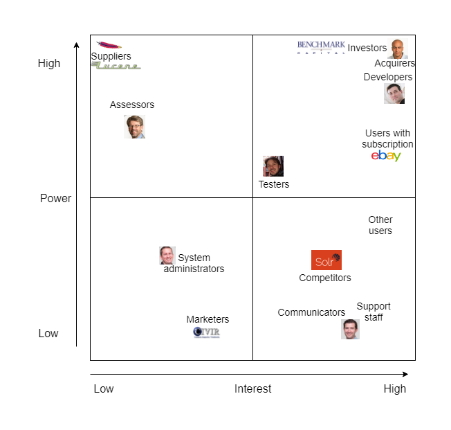
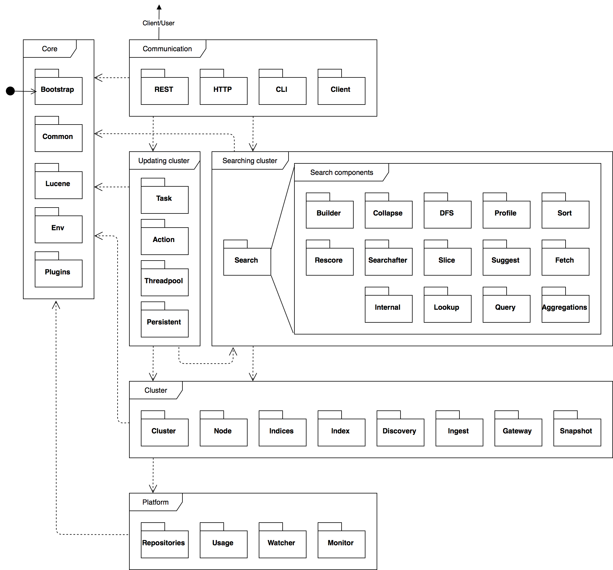
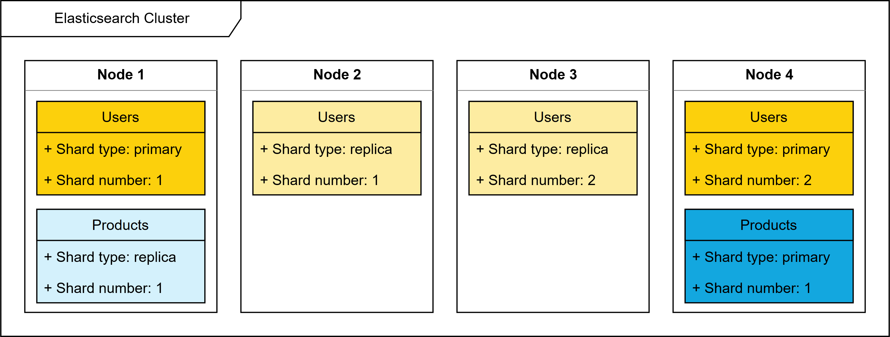
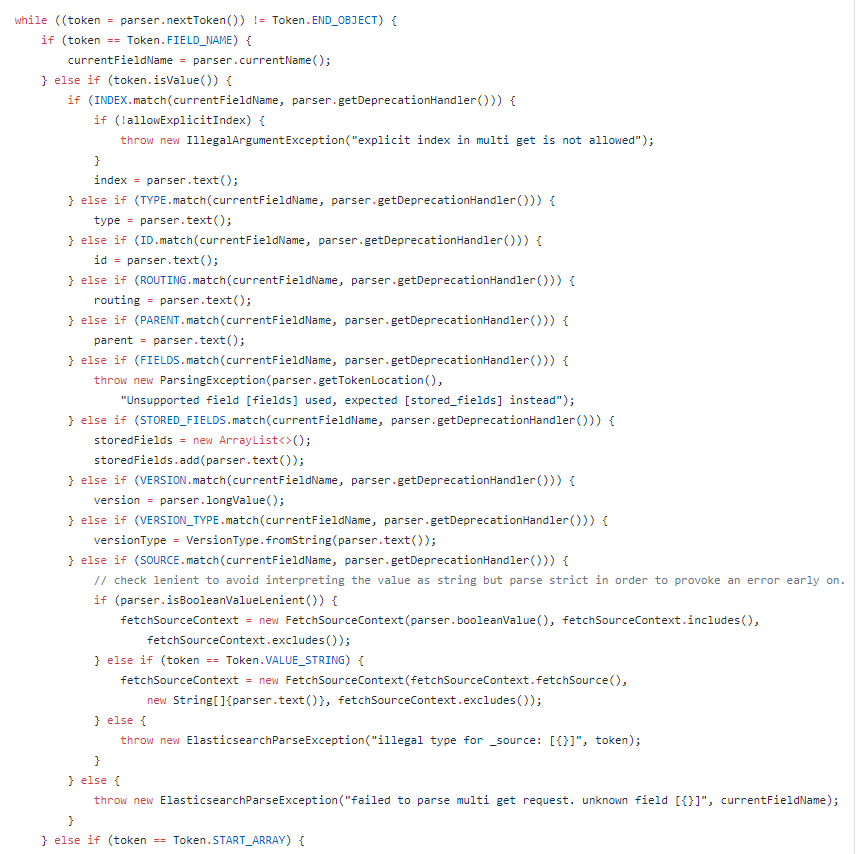
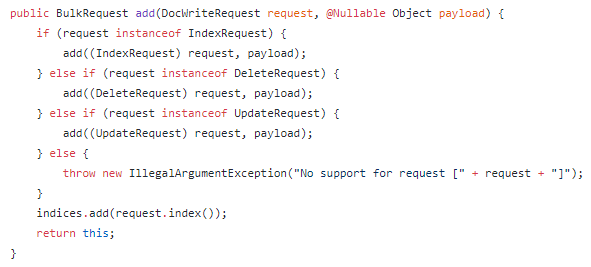
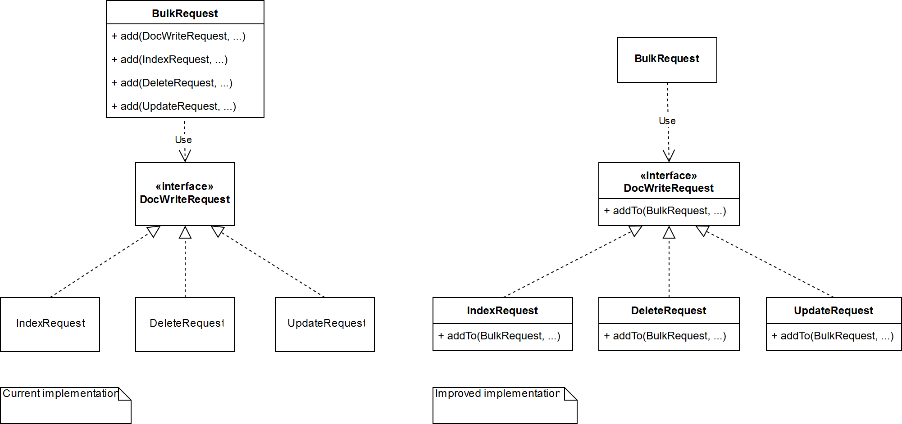

# Elasticsearch - The Heart of the Elastic Stack

By Mathias Meuleman, Bart van Oort, Menno Oudshoorn, Mark van de Ruit

_Delft University of Technology, 2018_

Elasticsearch is a distributed, RESTful search and analytics engine. It lies at the heart of the Elastic Stack: a group of multiple applications developed and managed by the Elastic company. The Elastic Stack provides a way to reliably and securely take data from any source in any format, and search, analyze, and visualize it in real time.

We, four master students of the TU Delft, have analyzed the architecture of Elasticsearch and aim to provide insight into the system from different viewpoints. We do so by first identifying the stakeholders of Elasticsearch, after which we put Elasticsearch into context. We then look into the module organization of the system. Furthermore, we analyze how information is handled within Elasticsearch and how performance and scalability are monitored and upheld. Finally, we dive into the system to identify technical debt and propose ways to decrease it.

## Table of Contents

* [1. Stakeholders](#1-stakeholders)
  * [Power/Interest grid](#powerinterest-grid)
* [2. Context View](#2-context-view)
* [3. Module Organization](#3-module-organization)
  * [Server module](#server-module)
  * [Client module](#client-module)
  * [Client-server communication](#client-server-communication)
* [4. Information View](#4-information-view)
  * [Storage model](#storage-model)
  * [Data representation and relations](#data-representation-and-relations)
* [5. Performance & Scalability Perspective](#5-performance-scalability-perspective)
  * [Benchmark suite](#benchmark-suite)
  * [Addressed perspective concerns](#addressed-perspective-concerns)
  * [Performed perspective activities](#performed-perspective-activities)
  * [Leveraged perspective tactics](#leveraged-perspective-tactics)
* [6. Technical Debt](#6-technical-debt)
  * [SonarQube analysis](#sonarqube-analysis)
    * [Deliberate violations](#deliberate-violations)
    * [Actual technical debt](#actual-technical-debt)
  * [SOLID violations](#solid-violations)
    * [Single Responsibility Principle](#single-responsibility-principle)
    * [Open-Closed Principle](#open-closed-principle)
  * [Instrumentation](#instrumentation)
  * [Javadoc](#javadoc)
  * [Testing debt](#testing-debt)
    * [Testing procedures](#testing-procedures)
    * [Test coverage generation](#test-coverage-generation)
* [7. Conclusion](#7-conclusion)
* [References](#references)

## 1. Stakeholders

The stakeholders of Elasticsearch are categorized according to the stakeholder types described in Rozanski & Woods (2012), including three additional types: competitors, investors, and marketers. The categories have been placed in alphabetical order.

| Type | Stakeholders |
|------|--------------|
| Acquirers | The Elastic company itself, mainly its [founders](https://www.elastic.co/about), [leadership](https://www.elastic.co/about/leadership), and [board](https://www.elastic.co/about/board).
| Assessors | Baird Garett (Senior Vice President of Legal) and Robin Sharpe (Vice President of Operations).
| Communicators | Marty Messer (Vice President of Customer Care) is the main responsible person for the training and consulting of the customers of Elastic. There is also a three-day [Elastic{ON}](https://www.elastic.co/elasticon) event, as well as a number of paid [online training courses](https://www.elastic.co/training) and private courses on location.
| Competitors | [Apache Solr](http://lucene.apache.org/solr/) is the most direct competitor, as it also uses Apache Lucene. Other competitors include [Sphinx](http://sphinxsearch.com/about/sphinx/), [Hawksearch](https://www.hawksearch.com/), [Commvault](https://www.commvault.com/), and [SwifType](https://swiftype.com/).
| Developers | Every contributor on GitHub. The three biggest contributors we identified are Shay Banon ([@kimchy](https://github.com/kimchy), creator of Elasticsearch), Simon Willnauer ([@s1monw](https://github.com/s1monw), founder) and Jason Tedor ([@jasontedor](https://github.com/jasontedor), currently most active developer).
| Investors | Elastic company. Elastic [is funded by](https://www.elastic.co/about/board) three main investors: Benchmark Capital, Index Ventures, and New Enterprise Associates Inc. (NEA).
| Integrators | Members of the [Github Elastic organization](http://github.com/elastic). The most important integrators are Jason Tedor, Luca Cavanna ([@javanna](https://github.com/javanna)), Christoph Büscher ([@cbuescher](http://github.com/cbuescher)), Boaz Leskes ([@bleskes](http://github.com/bleskes)) and Colin Goodheart-Smithe ([@colings86](http://github.com/colings86)).
| Maintainers | Large overlap with developers. The three most active are Jason Tedor, Simon Willnauer and Jim Ferenczi ([@jimczi](https://github.com/jimczi)).
| Marketers | Elastic has 'Go-To-Market' partners, who help market Elasticsearch. A list of over 25 of these partners is available [here](https://www.elastic.co/about/partners/go-to-market).
| Suppliers | Apache Lucene provides the base functionality of Elasticsearch, with Elasticsearch providing a REST API on top of Lucene, among other functionalities. Elasticsearch also runs on Apache Hadoop, Amazon Web Services (AWS), and Google Cloud Platform (GCP), thus making Apache, Amazon, and Google their main suppliers.
| Support staff | Marty Messer (Vice President of Customer Care). Elastic also provides [subscriptions](https://www.elastic.co/subscriptions) for dedicated support for Elastic's products. Elastic's [open forums](https://discuss.elastic.co/c/elasticsearch) handle general questions on using Elasticsearch.
| System administrators | IT departments of the companies that use Elasticsearch, as well as the people who manage the [Elastic Cloud](https://www.elastic.co/cloud) platform.
| Testers | Most developers are also testers. One contributor stands out in his involvement in testing as well as documentation: Luca Cavanna.
| Users | A large number of users, both simple individuals as well as large companies, use Elasticsearch. Some of the largest users include [Sprint](https://www.elastic.co/use-cases/sprint), [eBay](https://www.elastic.co/videos/ebay-and-elasticsearch-this-is-not-small-data), and [Zalando](https://www.elastic.co/videos/creating-the-fashion-experience-of-the-future-with-elasticsearch-at-zalando).

### Power/Interest grid

The various types of stakeholders can be placed in a Power/Interest grid, which shows the interest that each stakeholder category has in the system versus the power they have to influence the system. The grid is shown below:

Each of the stakeholder categories mentioned above has been included in the grid. We made a distinction between users _with_ a subscription and users _without_ one, as users _with_ a subscription are able to get quick support and emergency patches if necessary, thus giving them more power over other users. While users have a high interest in Elasticsearch, suppliers do not, although they do have a high power over Elasticsearch; should they decide to stop supplying their product, then Elastic will have to adapt their products accordingly. Marketers, on the other hand, have hardly any power over Elasticsearch and are mainly interested in its core and/or most impressive features to use as selling points.

## 2. Context View

We have identified a number of external entities and categorized them by their involvement in Elasticsearch. This resulted in a context view, of which the general overview is discussed here. The following image shows the majority of these entities.

There are a few categories that we highlight here, the first one being the "Users" category. There are many companies that use Elasticsearch. The Elastic website alone lists 117 companies, which is not an exhaustive list. There are some large, well-known companies in this list, such as Accenture, Zalando, Blizzard Entertainment and eBay. It becomes clear that Elasticsearch can be used in many different ways. For example, eBay uses it as their search engine so customers can find the product they are looking for easily, whereas Blizzard uses it as a data analytics tool to gain insight in the large amounts of data generated by their games. Due to the extensive REST API provided by Elasticsearch, any user can connect to Elasticsearch in a way that caters to their requirements and business processes.

Furthermore, there is the "Partners" category. Elastic partners with various companies in various ways to increase their reach and market share. There are Go-To-Market partners that focus on identifying commercial customer opportunities. Furthermore, there are Technology and Platform partners which help Elastic to create more impactful and easier-to-deploy solutions based on their products. Finally, there are Original Equipment Manufacturer (OEM) partners which use Elastic products' features as part of their own product. Two major partnerships are with Google Cloud Platform, to provide Elastic Cloud on Google Cloud servers, and Cloudera, to connect Elasticsearch with Hadoop, a big data storage and processing tool.

The final category we highlight here is small, but contains one important entity. This one entity, [Apache's Lucene project](https://lucene.apache.org/core), is the main project on which Elasticsearch is built. It is a high-performance, full-featured text search engine library written entirely in Java. This makes it a technology suitable for nearly any application that requires full-text search, especially cross-platform applications. Elasticsearch is built upon Lucene and uses its API for data indexing and searching. Because these features lie at the core of what Elasticsearch does, Lucene is an important external entity that should be closely monitored by Elasticsearch.

## 3. Module Organization

In this section, we detail the module organization of Elasticsearch, as well as important dependencies between these modules, in order to illustrate the overall internal code structure of Elasticsearch. We first discuss the `server` module of Elasticsearch, which is the module that contains the core functionality of Elasticsearch. Afterward, we take a look at the `client` module, which mainly functions as a library to connect to an Elasticsearch cluster and send requests to it. Finally, we zoom out and take a look at how these two modules relate. The various extracted Elasticsearch `modules`, their purpose and relation to the core `server` and `client` modules are also discussed.

Do not confuse Elasticsearch `modules` with the module organization discussed in this chapter. The former represents extracted functionality from Elasticsearch that can be reused, while the latter represents a large unit in a system containing related code, as described by Rozanski and Woods (2012).

### Server module

We first look at the `server` module, which contains the core functionality of Elasticsearch. The server module is structured as a large collection of packages that all provide differing functionality. We attempt to divide these packages into different _component layers_, as demonstrated by Rozanski and Woods, in order to give a clearer overview of the different parts of the system, and to avoid cluttering the component diagram with many individual packages and dependencies. The figure below shows these component layers and their relations.

We define the `core` layer, which contains packages that are either used by all other layers or serve functionality pertaining the system's runtime.

Then we define the `communication` layer, which contains all packages directly connected with the system's endpoints. This layer makes direct use of the `updating cluster` and `searching cluster` layers to answer possible user queries. These layers are discussed below.

Furthermore, we define the `cluster` layer to contain all packages related directly to building and maintaining an Elasticsearch cluster. The `cluster` layer uses the `platform` layer for storage and file system access. This layer is discussed below.

Subsequently, we define the `updating cluster` and `searching cluster` layers, which contain all packages necessary for either modifying the cluster or traversing it for results. Both these layers make heavy use of the `cluster` layer, as they operate directly on it. They also make use of the `search` package, which contains many packages related to search operations.

Finally, we define the `platform` layer to contain all packages related to low-level operations, OS related operations, or other operations requiring direct file system access.

### Client module

The `client` module provides an interface for other Java applications to an Elasticsearch server. From the client's perspective, the main point of entry to the server is the REST API. The `client` module contains a `rest` package which constructs REST requests and sends them to the server. To simplify the generation of REST requests, the `client` module provides a `rest-high-level` package, which wraps the lower-level `rest` package.

The `sniffer` package, meanwhile, provides clients with the functionality to automatically discover nodes by utilizing Nodes Info API, so the user does not have to manually check for new nodes in the cluster.

### Client-server communication

Having discussed the structure of the `server` and `client` modules, we now zoom out and look at important package relations between them from a client's perspective. We also show how Elasticsearch has extracted functionality from `server` into Elasticsearch `modules`. The figure below shows this component diagram.

The client and server communicate through a REST API. All of these REST requests are received by the server-side `rest` package and are dispatched to the accompanying `rest.action` package. These `rest.action` packages depend on other packages in the server module, as can be seen in the component diagram. Therefore, the server and client `rest` packages represent the link between the client and the server.

In the client-server component diagram, there are several components that are not part of `server` or `client`. These are Elasticsearch modules, which are pieces of functionality that are extracted to be reusable. These modules either use one of the core packages themselves or are used either by the core server or client packages.

## 4. Information View

This section describes how information is handled in Elasticsearch. First, we analyze the storage model used by Elasticsearch, and how the way that data is divided increases performance and provides high availability. Secondly, we discuss data representation and how relations between entities are handled.

### Storage model

The Elasticsearch storage model is based on various components, as briefly explained below.

- **Document**: a basic unit of information that can be indexed. For example, this could be a document for a blog post with its creation date and content.
- **Index**: a collection of documents of the same type.
- **Node**: a group of indices that reside on a single server.
- **Cluster**: a collection of one or more nodes over which all data is distributed. It provides indexing and search capabilities across all nodes.

Elasticsearch indices are built on top of Lucene indices and are stored in a NoSQL database. More on the NoSQL nature of Elasticsearch in the [next section](#data-representation-and-relations).

An index could store such a large amount of data that it exceeds the hardware limits of a single node. To solve this problem, Elasticsearch provides the ability to divide an index into multiple pieces called _shards_. The number of shards is specified by the user. Sharding allows for horizontal splitting of volumes as well as distributing and parallelizing operations across shards, thus increasing performance and throughput.

To provide high availability, Elasticsearch also provides functionality for _replicating_ shards. This means that one or more copies of shards exist on different nodes. If one node fails, all data is still available. It also results in more throughput, as searches can be executed on all replicas in parallel.

The figure below shows an Elasticsearch cluster with four nodes and two indices; a `Users` index with two shards and one replication, and a `Products` index with a single shard and a single replication. A failure of e.g. node 4 would not result in any data loss, as both shards present on that node are replicated on another node.

### Data representation and relations

From a user's perspective, all data is represented in JavaScript Object Notation (JSON), a ubiquitous internet data interchange format. The data in nodes is stored using a NoSQL-like structure. Opposed to relational databases that are specifically designed to manage relationships, NoSQL databases treat the world as though it were flat. An index is a flat collection of independent documents. A single document should contain all information that is required to decide whether it matches a search request. However, relationships still matter. Therefore, there are various techniques to manage relational data in Elasticsearch, which are briefly discussed below.

- **Application-side joins**. By storing a reference to a document from a different index, e.g. an id, users can first fetch this id from one index, and then perform another query to fetch the related document from another index. The obvious disadvantage is the need to run multiple queries.
- **Data denormalization**. Data denormalization is the process of including redundant copies of data in each document that it requires access to. For example, one can store the name of a blog post's author in both the `blog post` document itself, as well as in an `author` document. The advantage of this method is speed, the disadvantage is data duplication.
- **Nested objects**. Related entities can be stored within the same document. For example, a blog post could be stored together with all its comments, simply by passing an array of comments in the `blog post` index.
- **Parent-child relationships**. Elasticsearch provides the functionality to specify parent-child relationships between indices. This method is similar to nested objects, but the children are now separate documents.

## 5. Performance & Scalability Perspective {#5-performance-scalability-perspective}

This section introduces a perspective to cover the performance and scalability of Elasticsearch. First, we recap the notion of a perspective. Then, we address the benchmark suite Elasticsearch provides and afterward, we briefly discuss concerns this perspective covers and how Elasticsearch interprets these. Thereafter, we provide an overview of the activities that Elasticsearch undertakes as part of this perspective. Finally, we discuss tactics Elasticsearch leverages in this perspective.

A perspective, as defined by Rozanski and Woods (2012), is a collection of concerns, activities and tactics used to ensure that a system exhibits a particular set of qualities, properties, or behaviors. A perspective can be applied to an architectural view of the system, to ensure that the architecture (in the context of this view) fits its purpose as defined by the perspective.

For a detailed specification of the concerns, activities and tactics that are generally part of a performance and scalability perspective, please refer to the source material.

### Benchmark suite

Elasticsearch has an extensive benchmark suite, consisting of:

- [The microbenchmark suite](https://github.com/elastic/elasticsearch/tree/master/benchmarks) contains microbenchmarks intended to spot performance regressions in performance-critical sections.
- [Elastic/Rally](https://github.com/elastic/rally), a macrobenchmark framework intended to identify performance issues through (profiled) use of an Elasticsearch test cluster. This framework is periodically run against the Elasticsearch master branch, using many test clusters with different datasets. Detailed results can be found at the [Elasticsearch Benchmarks website](https://elasticsearch-benchmarks.elastic.co).

This benchmark suite is a useful tool for building this perspective, as is seen below.

### Addressed perspective concerns

This perspective relates to a number of concerns regarding performance and scalability, which the Elasticsearch team can address with the assistance of the benchmark suite. For one, Rally records latency and service time of the system, addressing response time concerns. For another, it measures minimal, median and maximal throughput of the system at different levels of system load, addressing both throughput and peak load behavior concerns. Lastly, it measures median CPU usage during execution, allowing the team to address hardware resource requirement concerns.

While scalability of the system could be measured through the benchmark suite, Elasticsearch explicitly states that Rally does not intentionally test this. It should be noted, however, that Rally is run against large datasets.

### Performed perspective activities

To address the concerns mentioned above, the Elasticsearch team appears to perform a number of activities. The team has clearly captured performance requirements, as per their website: they claim the system works for extremely large indices while providing excellent performance. Furthermore, they routinely perform practical testing, as follows from their periodically run macrobenchmark framework. Finally, Rally is run against varying sizes of data, ranging from at least two million to at least sixty million documents. As such, we see that Elasticsearch assesses their set requirements from time to time.

### Leveraged perspective tactics

Finally, there are some tactics related to this perspective, that we see Elasticsearch leverage to improve the performance and scalability of their system. First, as Elasticsearch is by its nature distributed, it makes thorough use of asynchronous processing to reduce index operations. Secondly, Elasticsearch addresses resource contention (which happens often in distributed systems) through replication of data: multiple index nodes can share duplicates of a shard to provide fast localized access to data. Thirdly, we see that Elasticsearch focuses on optimizing often-repeated processing, evident from the microbenchmark suite, which tests relevant often-called code.

## 6. Technical Debt

During our research, we found that the Elasticsearch developers do evaluate the trade-off between added value and technical debt when adding new functionalities, but hardly have any discussions on the current technical debt in the system. We analyzed Elasticsearch's technical debt in several ways. First, we analyzed Elasticsearch using SonarQube. Then, we manually looked for violations of SOLID principles, went through their instrumentation and analyzed their Javadoc. Finally, we looked into their testing debt and accidentally stumbled upon some massive technical debt regarding test coverage generation.

### SonarQube analysis

To analyze the project in terms of possible bugs, vulnerabilities and code smells, we opted to run [SonarQube](https://www.sonarqube.org/) over the entire `org.elasticsearch` package of the server module, resulting in the following overview. The entire result has been made public [here](https://sonarcloud.io/dashboard?id=elasticsearch%3Aserver).

As the overview shows, SonarQube identified 280 days of technical debt, meaning that fixing all of the mentioned violations would take 280 working days, approximately 9 months. On further inspection, however, it turned out to be better than it seemed. Some of those violations were deliberate choices, while others did contribute to actual technical debt. Both are discussed in their respective subsections.

#### Deliberate violations

Some SonarQube violations are actually code style choices that the Elasticsearch team made during its development cycles and therefore do not constitute actual technical debt. We show two examples of this, though there are a few more of these to be found in the analysis. For conciseness' sake, these other examples will not be covered here.

The first example of this considers boolean comparison in conditionals, which is the largest contributor of violations in Elasticsearch, accounting for 1380 code smells. Boolean comparisons in conditionals between e.g. a variable `foo` and the value `false` are persistently written as `if (foo == false)`. SonarQube flags this as a code smell and suggests to write `if (!foo)` instead. Although this is a logical choice from SonarQube, as it reduces code length and therefore the chance of bugs, the choice made by the developers is also a sound one. Using the former option is more expressive than the latter, making the code more readable. This means the choice is a tradeoff between code size and readability, something SonarQube and the Elasticsearch team decided on differently.

The second example considers method and field naming conventions. SonarQube reports 132 _blocker_ type issues, which are issues of the highest severity level. The Elasticsearch developers have a tendency to name `String` literals with an all-caps name, such as `String FOO`. These literals mostly represent the name of a certain field in a class, e.g. `String FOO = "foo"`. These literals are used in so-called `XContent` methods, which deal with different types (`X` types) of content that needs to be written to an output stream. Instead of hardcoding the actual strings in such an `XContent` method, the all-caps String definitions are used. This causes a number of classes to contain both the _normal_ field `foo`, which is named in lower-case, as well as the `XContent` field `FOO`, named in upper-case. Although this is a deliberate choice made by the developers, SonarQube flags this as a _blocker_ type issue, meaning an immediate fix is preferred.

#### Actual technical debt

There are also SonarQube violations that cannot be explained by the previously mentioned code style choices. Seeing as we cannot cover all of the issues flagged by SonarQube, we look at two primary categories of these violations that contain a large number of issues, as well as one easily fixable category in which we contributed towards decreasing the technical debt.

The first of these categories is collectively named _Cognitive Complexity_, which tests how many control flow statements are used within a method and how deep these statements are nested. A cognitive complexity score is calculated with these criteria and compared to a default maximum. SonarQube flags 573 occurrences of these, of which an example from [`MultiGetRequest#parseDocuments`](https://github.com/elastic/elasticsearch/blob/master/server/src/main/java/org/elasticsearch/action/get/MultiGetRequest.java#L399) is displayed in the image below. Some of them might have a valid reason to exist, but most of them should be refactored into separate methods to reduce technical debt.

The second category deals with superfluous code. SonarQube finds 117 occurrences of unused method parameters and 237 occurrences of unused import statements. Keeping code clean is important, as this leads to more readable code, which leads to an easier development process. Cleaning up code like this is one of the simpler tasks that can be found in this project, but this still requires some more work to be done.

The final category deals with issues in `equals(Object other)` methods: these should test the argument's type before casting it. Also, once cast, some of these `equals` methods actually compare identical expressions. For example, if an object has a field `foo`, then the method would compare the equality this field using `Object.equals(foo, foo)` instead of `Object.equals(foo, other.foo)`. Both of these issues are easily fixable, but can cause serious bugs, so we decided to fix all instances of both these violations in [a pull request](https://github.com/elastic/elasticsearch/pull/29348).

### SOLID violations

We also identify two examples of [SOLID](http://confreaks.tv/videos/goruco2009-solid-object-oriented-design) violations in the Elasticsearch codebase, for which we propose a solution if deemed possible. For conciseness' sake, we do not cover the Liskov Substitution, Interface Segregation and Dependency Inversion principles here.

#### Single Responsibility Principle

First off, the Single Responsibility Principle is violated in [`org.elasticsearch.index.shard.IndexShard`](https://github.com/elastic/elasticsearch/blob/master/server/src/main/java/org/elasticsearch/index/shard/IndexShard.java). This class represents a _shard_, as explained in the [information view](#information-view). To our knowledge, the class is responsible for at least the following:

- Creating, storing, updating and searching through a single index inside the shard.
- Recovery of the shard and its index after a restart.
- Read/write operations between heap and file system concerned with indices.
- Error recovery when some operation on the index fails.

This class is imported into other classes 97 times, spans over 2600 lines of code, and its constructor uses 18 parameters. Given that it carries many responsibilities, is coupled to a major part of the codebase and is so large, we also consider this class a prime example of the _God-Object_ anti-pattern.

As such, modifying this class to adhere to the Single Responsibility Principle becomes complex, requiring modifications to almost the entire codebase, making such a modification almost unattainable.

#### Open-Closed Principle

Secondly, we identify a violation of the Open-Closed Principle concerning [`org.elasticsearch.action.BulkRequest`](https://github.com/elastic/elasticsearch/blob/master/server/src/main/java/org/elasticsearch/action/bulk/BulkRequest.java) and [`org.elasticsearch.action.DocWriteRequest`](https://github.com/elastic/elasticsearch/blob/master/server/src/main/java/org/elasticsearch/action/DocWriteRequest.java). Specifically, the [`BulkRequest#add(DocWriteRequest, Object)`](https://github.com/elastic/elasticsearch/blob/master/server/src/main/java/org/elasticsearch/action/bulk/BulkRequest.java#L125) method (shown in the figure below) must be expanded if ever a new type of request is to be supported by `BulkRequest`, which implies that `BulkRequest` is not closed for modification.

A solution would be to move this functionality into the respective `DocWriteRequest` child classes by adding an `addTo(BulkRequest, ...)` method to the `DocWriteRequest` interface, as shown in the figure below.

This way, the `BulkRequest` class does not have to be extended whenever `BulkRequest` needs to support a type of request. The functionality is simply pushed to the new child class (open for extension), while the `BulkRequest` class remains the same (closed for modification).

### Instrumentation

Lack of instrumentation is also a form of technical debt. We found that Elasticsearch does miss some important static code analysis tools, such as PMD and FindBugs, and does not make optimal use of CheckStyle.

Elasticsearch uses Gradle as their build system and allows users to execute the static code checks using `./gradlew precommit`. They employ CheckStyle to verify code style conventions, although [their CheckStyle configuration](https://github.com/elastic/elasticsearch/blob/master/buildSrc/src/main/resources/checkstyle.xml) is not very extensive. They only check a small number of rules, such as avoiding star imports, naming files in compliance with the classes they contain, and avoiding empty Javadoc comments. However, they do not check if there are any Javadoc comments at all, nor do they check method length, class length, method and class complexity, or proper indentation. What is even more interesting is their check for line length: their CheckStyle configuration defines a maximum line length of 140 characters, but the colocated [CheckStyle suppressions file](https://github.com/elastic/elasticsearch/blob/master/buildSrc/src/main/resources/checkstyle_suppressions.xml) suppresses this check for every file that does not pass it until these files start to pass the check, as stated in the documentation.

### Javadoc

Looking through the codebase, we noticed that many methods and classes are missing Javadoc. We happened to find [this issue](https://github.com/elastic/elasticsearch/issues/22705) in which a community member indicates the same. An Elasticsearch member responds by saying that he is happy with the current situation regarding Javadoc, also seeing as they had "almost no Javadoc 4 years ago". He makes it clear that they have recently started being "much more diligent about adding Javadocs to public methods whenever we add them or touch existing ones, also enforcing that habit as part of the review process". While this does show that there are some efforts being made to reduce Javadoc debt, it also becomes clear that the main focus is to keep the number of uncommented methods as small as possible in the _public_ API, indicating that the Elasticsearch developers focus on the _user_ experience first and on the _developer_ experience second.

### Testing debt

Especially for large and distributed projects such as Elasticsearch, it is important that software is properly tested. Weak tests or low test coverage are therefore also part of the technical debt of a system. This section identifies a part of the testing debt present in Elasticsearch. First, we look at the testing procedures; how to run the tests, as well as how to write them. Then, we analyze the test coverage, or rather the lack thereof.

#### Testing procedures

The Elasticsearch repository contains a [TESTING.asciidoc](https://github.com/elastic/elasticsearch/blob/master/TESTING.asciidoc) file that explains how to use Gradle to compile Elasticsearch and run its tests.

Unless one is specified, a randomized testing seed is generated each time the tests are run. This enables randomized testing, a black-box testing technique where test inputs are randomly generated, so over time a large number of possible test inputs, if not all, are fed to the class or method under test. This may cause flaky tests, but mainly reduces the chance of bugs being overlooked due to a developer's misplaced trust in the code and is easy to set up.

Elasticsearch also contains a testing framework used throughout their tests, holding a number of abstract test case classes as well as a large number of utility classes that aid in creating mocks of certain parts of Elasticsearch. Such a testing framework provides a good basis for creating concrete test cases, creates consistency between testing environments for different tests and minimizes code duplication across test suites.

The basis for all Elasticsearch test cases is the [`ESTestCase`](https://github.com/elastic/elasticsearch/blob/master/test/framework/src/main/java/org/elasticsearch/test/ESTestCase.java) class, which contains a number of methods for initializing and cleaning up test cases, some convenience methods for generating random inputs, custom assertions, and a host of other utility methods. The testing framework also contains other such `TestCase` classes extending from `ESTestCase`, each providing additional setup and cleanup, or more specific convenience methods and custom assertions to be used in specific tests. Elasticsearch even has tests for the more complex parts of their testing framework.

#### Test coverage generation

The testing documentation stated until recently that a test coverage report could be generated using `mvn -Dtests.coverage test jacoco:report`. However, this is a Maven command, while Elasticsearch migrated to Gradle [in October 2015](https://github.com/elastic/elasticsearch/issues/13930). As this documentation was not updated since, this may indicate that the developers do not pay much (if any) attention to their test coverage.

We [notified them](https://github.com/elastic/elasticsearch/issues/28867) of this, to which they replied that JaCoCo is not included in their build configuration. Applying JaCoCo is usually as simple as adding `project.pluginManager.apply('jacoco')` to the building code, but this did not work. Upon further investigation, we found that the Elasticsearch build system replaces each Gradle [`Test`](https://docs.gradle.org/current/javadoc/org/gradle/api/tasks/testing/Test.html) task with their own [`RandomizedTestingTask`](https://github.com/elastic/elasticsearch/blob/master/buildSrc/src/main/groovy/com/carrotsearch/gradle/junit4/RandomizedTestingTask.groovy) in order to enable randomized testing. While this class should extend Gradle's `Test` task to be recognized as a testing-related task, it instead extends the [`DefaultTask`](https://docs.gradle.org/current/javadoc/org/gradle/api/DefaultTask.html) class. Seeing as JaCoCo [binds to](https://github.com/gradle/gradle/blob/master/subprojects/jacoco/src/main/java/org/gradle/testing/jacoco/plugins/JacocoPlugin.java#L149) instances of `Test`, JaCoCo is unable to find any tasks to bind to. An Elasticsearch developer did [inform us](https://github.com/elastic/elasticsearch/issues/28867#issuecomment-372842967) that he originally wanted `RandomizedTestingTask` to extend `Test`, but that there were many issues with it. After more experimenting, we concluded that `RandomizedTestingTask` would need a significant rewrite by someone with sufficient experience so as to keep the required existing functionalities, though we did [update the outdated documentation](https://github.com/elastic/elasticsearch/pull/29255).

Having a build configuration unable to support testing instrumentation such as JaCoCo is a major technical debt, as it also causes problems upon integrating other instrumentation, such as SonarQube or mutation testing tools.

## 7. Conclusion

This chapter provided an overview of the software architecture of Elasticsearch. We identified different stakeholders, and used several architectural viewpoints to gain insight into the system. We also identified and analyzed the technical debt in the Elasticsearch codebase, both from a code quality and testing perspective.

We can draw various interesting conclusions. First, we believe that the different modules in the Elasticsearch codebase are well organized. Each package has a clear responsibility, and the extraction of reusable modules provides a good separation between core and additional functionality.

The Elasticsearch team also has a good focus on performance and scalability. There is an extensive benchmark suite, which is also used in GitHub discussions when making merge decisions.

However, there are also some issues present in the system. There is a substantial amount of technical debt present in the system. Furthermore, there are some fundamental issues with the build system, which prevents generating test coverage reports. The main focus of the core developers lies on user experience, rather than developer experience.

## References

1. Rozanski, N., & Woods, E. (2012). Software Systems Architecture (2nd ed.). Pearson Education.
