## Electron | Build cross-platform desktop apps with JavaScript, HTML, and CSS

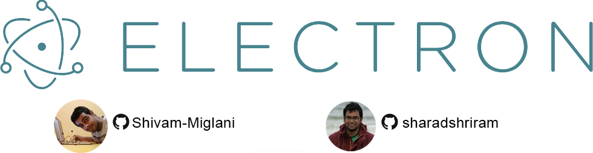

By [Shivam Miglani](https://github.com/Shivam-Miglani) and [Sharad Shriram](https://github.com/sharadshriram), Delft University of Technology.

## Abstract
Electron is an open-source software framework that was initially developed by  [Cheng Zhao](https://github.com/zcbenz), an engineer at GitHub for building native desktop GUI applications with web technologies like JavaScript, HTML, and CSS[[1]](#ref1). This project is developed using [node.js](https://github.com/nodejs/node) runtime as back-end and [chromium](https://github.com/chromium/chromium) as the front-end. Several popular and widely-used open source projects like [Atom](https://github.com/atom/atom), [Slack](https://electronjs.org/apps/slack), [Skype](https://electronjs.org/apps/skype), [VS Code](https://github.com/Microsoft/vscode), [Github Desktop](https://desktop.github.com/), and about [500 more](https://electronjs.org/apps) native desktop applications are built on Electron. This chapter summarizes the architecture of Electron through stakeholders involved and their interests, different views ranging from development to deployment, and perspectives such as  evolution and security.

## Table of contents
1. [What is Electron?](#introduction)
2. [Stakeholder Analysis](#stakeholder)
3. [Architecture](#archi)
   - 3.1 [Views](#view)
     - 3.1.1. [Context View](#view1)
     - 3.1.2. [Development View](#view2)
     - 3.1.3. [Deployment View](#deployment)
   - 3.2. [Architectural Perspectives](#per)
     - 3.2.1. [The Evolution Perspective and the related Technical Debt](#evo)
     - 3.2.2. [Security Perspective](#security)
4. [Conclusions](#con)
5. [References](#ref)

<a name="introduction"></a>
## 1. What is Electron?
Developing desktop GUI applications is laborious and it requires Operating System (OS) specific expertise, which leads to  additional cost and time overhead along with an increase in the technical complexity of the project. For such projects, maintaining the quality, functionality, and security across multiple operating systems is a difficult task. Electron provides a solution to this problem by providing a framework for developing cross-platform native desktop applications using web technologies like JavaScript, HTML and CSS. This means that a skilled web developer can develop such cross-platform applications without the need of breadth of OS-specific skills.

The applications built from Electron consist of two types of processes: the main process and multiple renderer processes which follow a *master-slave* pattern. The main process of the application is the master and the multiple renderer processes are the slaves which communicate using Inter-Process Communication (IPC). Fig. 1 shows that this is analogous to a Chromium browser where there is one main window and multiple tabs (renderer processes).	
 	 
<a name="fig1">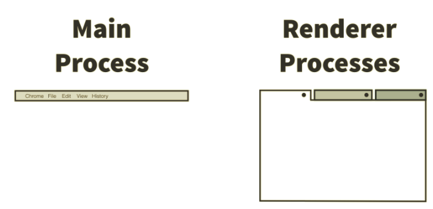</a>

*Figure 1: One Main process with Multiple renderer processes. This is analogous to a window of Chromium browser with multiple tabs*	

Specifically, Electron looks into the start entry in the ``package.json`` manifest included in the project to determine the entry point of the application, which runs as the main process.	
	
- *Main process*: The main process is responsible for responding to application lifecycle events such as starting up, quitting, preparing to quit, going to the background, coming to the foreground, and more. The main process is also responsible for communicating to native operating system APIs. For example, to display a dialog to open or save a file. [[2]]() The main process can also create and destroy renderer processes using Electron’s ``BrowserWindow`` module. 	
	
- *Renderer processes*: Renderer processes can load web pages to display a GUI. Each process takes advantage of [Chromium’s multi-process architecture]() and runs on its own thread. Unlike normal web pages, there is access to all the Node APIs in the renderer processes, allowing developers to leverage native modules and lower-level system interactions. [[2]]()
	
At the time of writing, the stable version of Electron is 1.8.4 and all our analysis are mainly focused on the ``master`` branch of core Electron's  [repository](http://github.com/electron/electron). Before doing in-depth architectural analysis let's look at the people and organizations involved in Electron's development.

<a name="stakeholder"></a>
## 2. Stakeholder Analysis
Stakeholder Analysis describes the people involved in Electron and their roles. We have categorized them according to the eleven types proposed by Rozanski and Woods[[3]](#ref3). 

|Type|Stakeholders|Description|
|---|---|-----------|
|Developers|Core developers, Committer team and contributors|Core developers like [@zcbenz](https://github.com/zcbenz), [@zeke](https://github.com/zeke) and others set policies and are the general managers. Most of the core developers work at Github (which sponsors Electron). Committers like [@deepak1556](https://github.com/deepak1556) and open-source active developers like [Alexey Kuzmin](https://github.com/alexeykuzmin) from Microsoft, [Felix Rieseberg](https://github.com/felixrieseberg) from Slack help the core developers with pull requests.|
|Acquirers|Core Developers at Github|The core developers and (some) senior contributors from prominent users ([Alexey Kuzmin](https://github.com/alexeykuzmin) from Microsoft and [Felix Rieseberg](https://github.com/felixrieseberg) from Slack) decide the future roadmap for Electron.|
|Assessors|Developers|Developers of Electron as well as from the user organizations using Electron assess the conformance to standards and legal regulations themselves.|
|Communicators|Teachers|Electron is taught by teachers in online environments such as [YouTube Videos](https://www.youtube.com/watch?v=tqBi_Tou6wQ), [Tutorials](https://www.tutorialspoint.com/electron/index.htm) and [Blogs](https://medium.com/developers-writing/building-a-desktop-application-with-electron-204203eeb658) on the web.|
|Maintainers|Core developers, Contributors|The overall evolution is maintained by the core developers, and maintenance tasks by both core developers and contributors.|
|Production Engineers|[John Kleinschmidt](https://github.com/jkleinsc) and team|Manages the production releases and runs tests on new builds. He also manages the code for Circle-CI integration tests.|
|Suppliers|Github|Github sponsors Electron and is a supplier for Electron as it provides software and infrastructure for Electron to run.|
|Support Staff|Developers, Teachers|Support for development and contributions for Electron is done through mailing lists,  [Slack](http://atom-slack.herokuapp.com/), [Discuss Forums](https://discuss.atom.io/c/electron) and platforms such as StackOverflow.|
|System Administrators|[John Kleinschmidt](https://github.com/jkleinsc) and Core developers|They control the evolution and development of the project. They also manages the code for integration tests through Circle-CI, Travis-CI, AppVeyor etc.|
|Testers|Developers, Committer team|They are responsible for the testing of new commits and builds through explicit unit and application tests.|
|Users|Developers and organisations using Electron| Electron is used in [Skype](https://electronjs.org/apps/skype), [Slack](https://electronjs.org/apps/slack), [WhatsApp](https://electronjs.org/apps/whatsapp), [Atom](https://electronjs.org/apps/atom) close to [7400](https://github.com/electron/electron/network/members) independent developer forks.|


### Going beyond Rozanski and Woods classification:
The following stakeholders identified are additional stakeholders who do not match the groups in Rozanski and Woods[[3]](#ref3).

- *Other repositories and products in Electron Umbrella project* like [Spectron]() the testing framework, [i18n]() the home for documentation and its translations, [electronjs.org]() the website, [libchromiumcontent]() the content-rendering library of Chromium, [node]() the backend component, [devtron]() the chrome development tools and around 40 other repositories complete Electron as a framework.

- *End-Users* are normal users who experience a native desktop app built on Electron and it indirectly influences Electron's development.

- *Bloggers* are unambiguous and reliable sources of information who use and help new developers to use Electron.

- *Translators* contribute to translations for Electron's documentation to different languages for its [website](https://electronjs.org) and there are close to 300 translators (including us) who have contributed for this purpose till date.

<a name="power"></a>
### Quantifying the stakeholder's involvement:  Power vs Interest Grid 
Mendelow's power/interest grid[[5]](#ref5) is used to classify the groups of stakeholders necessary to be managed closely. Figure [2](#fig2) shows that the core developers, committer team, active contributors from prominent products like Skype, Slack, etc. using Electron are stakeholders who have both high interest and power. These are the people that actively contribute to and maintain the project and need to be managed closely. Teachers and projects that use Electron without active contributions show high interest but have low power and must be informed well. Electron’s dependencies have low interest and low power. The power of Chromium is slightly higher because it influences Electron's future developement as explained in the [development viewpoint](#view2).

<a name="fig2"></a>

*Figure 2: Power Interest Grid of Electron where the interest of the stakeholder is shown on the horizontal axis and the power of the stakeholder is shown on the vertical axis.*
 
<a name="archi"></a> 
## 3. Architecture

In this section, we describe the architecture of Electron based upon various (1) *views* and (2) *perspectives*. According to Rozanski and Woods [[3]](#ref3), a view is a representation of one or more structural aspects of an architecture that illustrates how the architecture addresses one or more concerns held by some stakeholder and an architectural perspective is a collection of activities, tactics, and guidelines that are used to ensure that a system exhibits a particular set of related quality properties that require consideration across a number of the system’s architectural views. 

<a name="view"></a>
## 3.1 Views
In this section, we describe the context, development and deployment viewpoints of Electron. 


<a name="view1"></a>
### 3.1.1 Context Viewpoint

The context view describes the scope and responsibilities, relationships, dependencies and interactions around Electron [[3]](#ref3), as shown in Figure [3](#fig3).

<a name="fig3"></a>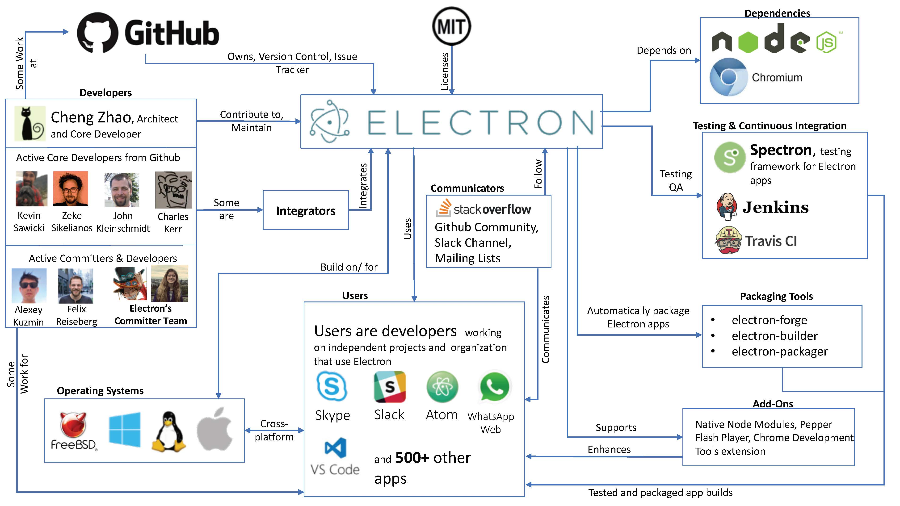


*Figure 3: Context View of Electron showcasing relationships with its environment*

Some prominent findings from the context view diagram are:

- **Integrators** are the active core developers from Github. The are the architects of the Electron and their merging their challenges and merging strategies are explained in the [Evolution Perspective](#evo)

- **Users** are organizations and developers of cross-platform desktop applications using Electron. The **communicators** are the link between users and Electron's developer community.  

- **Testing Frameworks and Continuous Integration**: [Spectron](https://github.com/electron/spectron) is the testing framework for Electron apps. Travis and Jenkins are the CI systems for testing new application build using the virtual display driver for Chromium.

- **GitHub** sponsors the entire project and provides infrastructure for version control using git and issue tracking with Github issue tracker.

- **Target Platforms**: The Electron apps are built on/for MacOS, Windows and Linux platforms. The **Packaging tools** allow for automatic packaging of Electron apps for these platforms.

- **Add-ons** like Native Node modules, Pepper Flash plugin etc. are supported by Electron and enhance the features of developed applications.

<a name="view2"></a>
### 3.1.2 Development Viewpoint
Electron combines Chromium's *single thread multi-process* model[[18]](#ref22) and Node's *single thread event-loop*[[13]](#ref13) model into **single runtime**. As a consequence, Electron design patterns resembles its two primary dependencies namely Node.js and Chromium Webkit. Electron includes customized forked embeddings of [Chromium](https://github.com/electron/electron/tree/master/chromium_src) and [Node](https://github.com/electron/node) modules to keep its size small. Electron application's design pattern is similar to the *master-slave* pattern as discussed in section [1](#introduction). 

The *layered architecture* shown in Figure [4](#fig4) gives a very high-level overview of Electron and applications built using Electron. In this section, the development view of Electron's core is summarized using module organization and dependencies, common design models and codeline models

<a name="fig4"></a>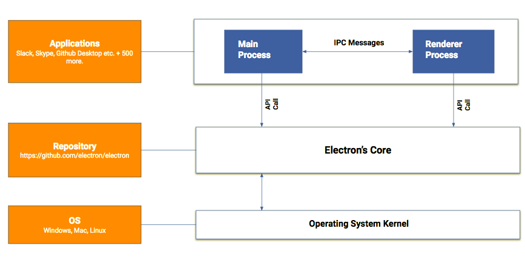

*Figure 4: Layered Architecture of Electron*

<a name="module"></a>
#### Module Organization
Apart from reducing size, the customized forked embeddings of Chromium and Node removes the need for external interfacing dependencies, and improves speed and performance through preconfiguration of dependencies. The module organization in Figure [5](#fig5) demonstrates **high cohesion** through *Electron Core block* and **low coupling** as demonstrated through custom embeddings of the dependencies in *Electron extensions*, which is an example of good software design.

<a name="fig5"></a>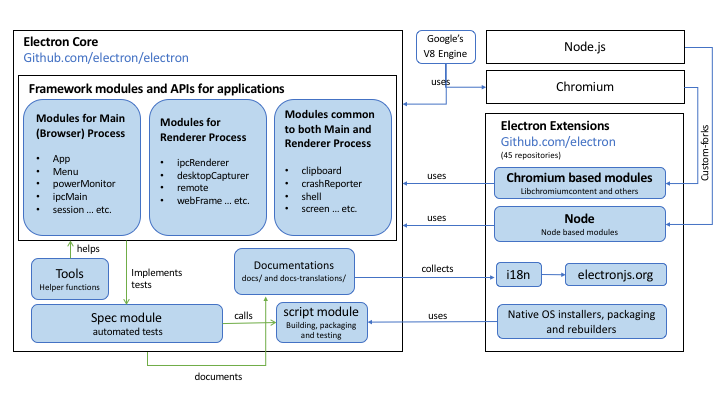</a>

*Figure 5: High-level module organization of [`electron/electron`](https://github.com/electron/electron) repository and the other [45 repositories](https://github.com/electron/) where the links to external dependencies are shown in color *blue* whereas internal dependencies in Electron's core are shown in *green*.*

Now we explain the 3 blocks in the diagram:

- **V8 engine**: Electron, [Node](https://github.com/electron/node) and [Chromium](https://github.com/electron/ibchromiumcontent) use [V8](https://developers.google.com/v8), an open-source engine which converts JavaScript directly into native machine code with major optimizations. The V8 engine optimizes the code at runtime based on code heuristics and employing different optimization strategies like inline caching. 

- **Electron extensions:** 

  - Electron embeds different Chromium modules like [``libchromiumcontent``](https://github.com/electron/libchromiumcontent), the content-rendering module. Other examples are [``native-mate``](https://github.com/electron/native-mate) which makes writing JS bindings easy, and automatically converts V8 types to C++ types, and [``pdf-viewer``](https://github.com/electron/pdf-viewer) is  a fork of Chrome's pdf extension to work as ``webui`` page, etc.

  - The custom embedding of [Node runtime environment](https://github.com/electron/node) handles the interactions between with the native OS and various add-on node packages. Electron also uses some node packages for internal use like [``node-minidump``](https://github.com/electron/node-minidump) is used to process minidump files, and the full list can be seen in [[10]](#ref10).


  - All of the Electron's documentation and translations are collected in [i18n](https://github.com/electron/i18n) repository as a large JSON object in every language. The JSON object from i18n repository is used as content in the electronjs.org website.

  - *Native OS installers* are modules developed for different native operating systems on which Electron can be installed like [``windows-installer``](https://github.com/electron/windows-installer) for the Windows operating system. Electron apps can be *packaged* to [``Asar``](https://github.com/electron/asar) format which is a tar like archiving format providing advantages of mitigating issues like long file names in Windows, speeding up ``require`` and concealing source code from cursory inspection.[[21]](#ref25). Electron supports native Node.js module injection using [``electron-rebuild``](https://github.com/electron/electron-rebuild) which *rebuilds* native them against the currently installed Electron's version. 

 - **Electron's Core:**

   - *Framework Modules and APIs for applications*: In applications, [Electron APIs](https://electronjs.org/docs/api) can be used for both the main process and renderer process. Node APIs are available globally, while only DOM/Browser APIs are available in a renderer. Based on Figure [6](#fig6) and the API documentation [[11]](#ref11), the following is an overview of some common APIs used:
      - **Main process:** 
        1. [``app``](https://electronjs.org/docs/api/app) control application's event lifecycle.
        2. [``ipcMain``](https://electronjs.org/docs/api/ipc-main) for asynchronous communication from the main process to renderer processes.
        3. [``autoUpdater``](https://electronjs.org/docs/api/auto-updater) enables automatic updates for apps
        4. [``session``](https://electronjs.org/docs/api/session) maanage browser sessions, cookies, cache, proxy settings, etc.
      - **Renderer process**
        1. [``ipcRenderer``](https://electronjs.org/docs/api/ipc-renderer) for  asynchronous communication from a renderer process to the main process.
        2. [``remote``](https://electronjs.org/docs/api/remote) remote invocation of methods in the main process.
        3. [``webFrame``](https://electronjs.org/docs/api/web-frame) customises the rendering for the current web page
      - **Common APIs**
        1. [``crashReporter``](https://electronjs.org/docs/api/crash-reporter) submits crash reports to a remote server.
        2. [``clipboard``](https://electronjs.org/docs/api/clipboard) performs copy and paste operations on the system clipboard.
  

<a href="api"></a>
<a name="fig6"></a><center>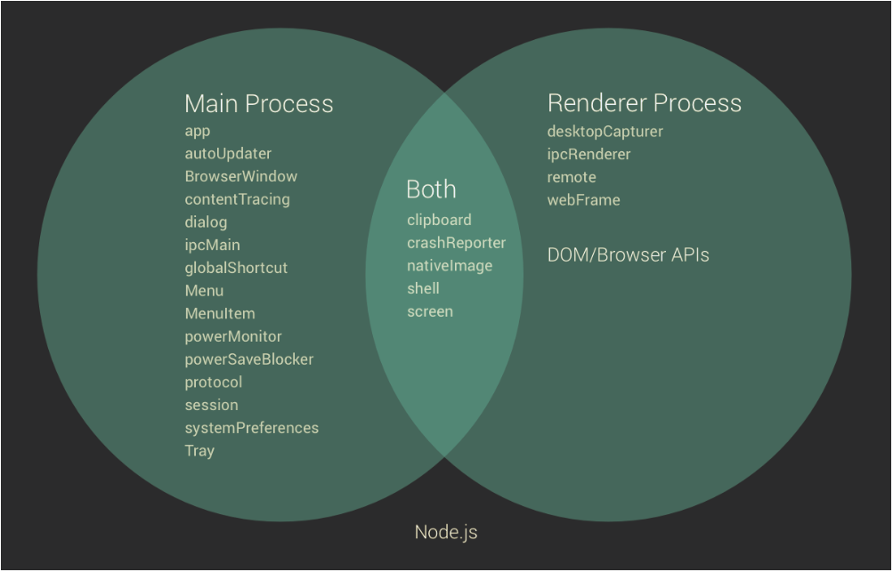</center>

*Figure 6: Venn Diagram of Electron module APIs to be used by developed application's main and renderer process. The universal set is other node.js module APIs which are available globally.*
 
- *Script,spec and tools modules*: ``script`` contains scripts used for development purposes like building, packaging and testing. ``spec`` contains automatic tests for the framework APIs (main, renderer and common), packaging formats (asar), version checks etc. ``tools`` contains non user centric helper functions. The [framework (API) modules](#api) use ``tools`` as helper functions and ``spec`` for creating automatic tests.


<a name="commonDesign"></a>
#### Common Design Models
Commonality across the different versions of Electron is done by defining a set of strict design constraints that are followed in Electron's development.

- *Common Processing*: Based on [[3]](#ref3), the common processing models for Electron combines the processing models used in the [framework architecture](#view2) and the [application architecture](#introduction)

  - *Termination and restart of operation*  on the framework during application development is with the ``main process``. For applications, the [app](https://electronjs.org/docs/api/app) API that controls the application's event lifecycle is responsible for the termination and restart operations.

  - *Message Logging* - [``crashpad``](https://github.com/electron/crashpad) is a [Chromium project](https://dev.chromium.org/Home) used for capturing, storing and transmitting postmortem crash reports from a client to an upstream collection server  for diagnostic purposes[[14](#ref14), [15](#ref15)]. For applications, communication between the main and renderer processes are done as IPC messages using the [``ipcMain``](https://electronjs.org/docs/api/ipc-main) and [``ipcRenderer``](https://electronjs.org/docs/api/ipc-renderer) API modules.

  - *Internationalization* - Electron's developer community is worldwide and thus Electron's documentation is translated into [different languages](https://electronjs.org/languages) under the [Electron-i18n](https://github.com/electron/i18n) project. Moreover, to facilitate better contribution and maintain a supportive, active community the [conduct of conduct](https://github.com/electron/electron/blob/master/CODE_OF_CONDUCT.md) states,
    > In the interest of fostering an open and welcoming environment, we as contributors and maintainers pledge to making participation in our project and our community a harassment-free experience for everyone, regardless of age, body size, disability, ethnicity, gender identity and expression, level of experience, nationality, personal appearance, race, religion, or sexual identity and orientation.

  - *Internal and external interfacing* in Electron is applicable to both the framework and application APIs. In the framework, the different code modules and method invocations between the framework are internal interfacings whereas the Node and Chromium modules used the account as external interfacing. In applications, the [API](https://electronjs.org/docs/api) bindings between the main process and renderer processes are internal whereas additional Node packages that are used on applications as add-ons are the external interfacing.

<a href="design"></a>
- *Standardization of Design*:
Electron's [development guide](https://electronjs.org/docs/development/) documents the steps for issue creation, contributing to issues, making pull requests in accordance to the [conduct of conduct](https://github.com/electron/electron/blob/master/CODE_OF_CONDUCT.md) which is adhered by every developer and contributor. This section briefly summarizes the design standards laid out for Electron.

  - [*Issues*](https://github.com/electron/electron/issues) is the first stop for either a developer, contributor or a user to get technical assistance with build-specific issues like compilation errors, display errors, system crashes, etc. The [issues](https://github.com/electron/electron/issues) found on the repository of [Electron](https://github.com/electron/electron/), are generally resolved within 3-7 days  [[6]](#ref6). 

  - [*Pull Requests*](https://github.com/electron/electron/pulls) facilitate the contribution to addition of new features, modification of existing features or bug fixes for a particular feature of Electron. There is an [official documentation for pull requests](https://electronjs.org/docs/development/pull-requests) which standardizes the steps to be followed for submitting a new pull request to Electron. Every pull request is subjected to a  [Continuous Integration (CI)](https://electronjs.org/docs/development/pull-requests#continuous-integration-testing) check and the merge pattern involves thorough code review and discussion with contributors.

  - [*Coding Styles*](https://electronjs.org/docs/development/coding-style) standardizes formatting the source code making it easy to read and understand by the contributor community. 
    1. Electron is mostly written in C++ with some flavours of Objective-C codes which is styled based on [Chromium's C++ Style Guide](https://chromium.googlesource.com/chromium/src/+/master/styleguide/c++/c++.md). Electron uses the [``clang-format``](https://electronjs.org/docs/development/clang-format) for formatting C++ source code. 
    2. Electron uses Python version 2.7 as per the documentation for [generating projects](https://github.com/electron/gyp), follows the [Chromium Coding Style](https://www.chromium.org/developers/coding-style) and uses ``script/cpplint.py `` script to check code formatting to conformance.
    3. Electron is well documented and is written entirely on Markdown with the Github style. A node package called [``electron-docs-linter``](https://www.npmjs.com/package/electron-docs-linter) developed to ensure that documentation changes are formatted correctly and can be used as ``npm run lint-docs`` 
    4. JavaScript engines used in Electron are written in the [standard](https://npm.im/standard) style with the newer ES6/ES2015 syntax where appropriate.
    5. Naming Conventions for files and variables in the source code is a good design practice which makes the code base consistent and stable for continuous development. In Electron, file names should be concatenated with ``-`` instead of ``_`` and naming variables in code is similar to Node.js as Electron APIs uses the same capitalization scheme. 

<a href="test"></a>
- *Standardization of Testing*:  Testing in Electron can be done in the framework and application levels. In this section, the tools used in Electron for testing is discussed,

  - *Framework Testing* in Electron is a continuous testing framework to maintain stable builds[[16]](#ref16). Electron uses [Jenkins](https://mac-ci.electronjs.org/blue/organizations/jenkins/Electron%20org%2Felectron/activity/?branch=master) for continuous integration tests on builds in Mac and Linux, AppVeyor[[16]](#ref16) for Windows, and [Circle CI](https://electronjs.org/docs/tutorial/testing-on-headless-ci) for pull requests. 

  - *Application Testing* - [Spectron](https://electronjs.org/spectron) is a testing framework built upon WebdriverIO with helpers to access Electron APIs in  tests and bundles ChromeDriver. WebDriverJs and WebdriverIO provide Node packages for testing with web driver[[18]](#ref18). [Devtron](https://electronjs.org/devtron), is a Electron [Dev Tool](https://developer.chrome.com/devtools) developed on the [Chrome Developer Tools](https://developer.chrome.com/devtools) for developers to inspect, monitor, and debug their Electron apps [[19]](#ref19). Devtron can be used to visualize dependency graphs, inspect the events and event listeners registered on the Electron app, monitor the IPC messages between the main process and renderer process and check the application for consistent code styles or linting.

   
<a name="codeline"></a>
#### Codeline models
According to Rozanski and Woods[[3]](#ref3), the codeline models describe the source code structure, release process, configuration management, build and testing approaches.

- **Source Code Structure:** The source code organization structure of Electron is compliant with [Chromium's Multi-Process model](https://dev.chromium.org/developers/design-documents/multi-process-architecture) [[22]](#ref22). For example, ``atom/`` (C++ source code) and ``lib/``(Javascript source code) contains modules ``browser/``, ``renderer/`` and ``common/`` which contain submodules for main process, renderer process and main and renderers (both) respectively. All the scripts are maintained `script` folder. These are examples of classic Chromium style coding. The ``third_party`` dependencies of Electron such as Node and Chromium's ``libchromiumcontent`` are found under the ``/vendor`` sub-directory to prevent a naming conflict with Chromium's Source Tree [[20]](#ref20).  The complete directory organization of Electron based on the docs [[7]](#ref7) with some additions to match the current repository is made below:

 ```diff
Electron
├── atom/ - C++ source code. Called atom because Electron was called atom at first.
|   ├── app/ - System entry code.
|   ├── browser/ - The frontend including the main window, UI, and all of the
|   |   main process things. This talks to the renderer to manage web pages.
|   |   ├── ui/ - Implementation of UI for different platforms.
|   |   |   ├── cocoa/ - Cocoa specific source code.
|   |   |   ├── win/ - Windows GUI specific source code.
|   |   |   └── x/ - X11 specific source code.
|   |   ├── api/ - The implementation of the main process APIs.
|   |   ├── net/ - Network related code.
|   |   ├── mac/ - Mac specific Objective-C source code.
|   |   └── resources/ - Icons, platform-dependent files, etc.
|   ├── renderer/ - Code that runs in renderer process.
|   |   └── api/ - The implementation of renderer process APIs.
|   └── common/ - Code that used by both the main and renderer processes, 
|       including some utility functions and code to integrate node's message
|       loop into Chromium's message loop.
|       └── api/ - The implementation of common APIs, and foundations of
|           Electron's built-in modules.
├── brightray/ - Thin shim over libcc that makes it easier to use.
├── chromium_src/ - Source code copied from Chromium.
├── default_app/ - The default page to show when Electron is started without an app.
├── docs/ - Documentations.
├── lib/ - JavaScript source code.
|   ├── browser/ - Javascript main process initialization code.
|   |   └── api/ - Javascript API implementation.
|   ├── common/ - JavaScript used by both the main and renderer processes
|   |   └── api/ - Javascript API implementation.
|   └── renderer/ - Javascript renderer process initialization code.
|       └── api/ - Javascript API implementation.
├── script/ - scripts used for development purpose like building, packaging, testing, etc.
├── spec/ - Automatic tests.
├── tools/ - helper scripts used by gyp files, unlike script, 
|            scripts put here should never be invoked by users directly.
├── vendor/ - source code for third-party dependencies.
├── electron.gyp - Building rules of Electron.
└── common.gypi - Compiler specific settings and building rules for other
    components like `node` and `breakpad`.
```


- **Build Approach:** Electron uses [gyp](https://gyp.gsrc.io/) for project generation which is built using [ninja-build](https://ninja-build.org/). The binaries of third-party frameworks that are used in Electron but are not supported in ``gyp`` build are found in the ``external_binaries`` directory. 

- **Release Process:**  The release process begins with the selection of the Release Candidate (RC) branch. In the RC branch the ``prepare-release`` script is run to perform checks, update version number and auto-generate draft release notes. After the ``prepare-release`` script execution is done, the release notes are compiled with major and minor changes done on the code base. The release takes place after the completion of the release draft and the release branch is pushed/ published.[[24]](#ref24)

- **Configuration Management:** Electron is managed  on Github and new versions of Electron are released through Github releases. Github provides a powerful version control system to maintain the source code which supports repeatability via branches and commits. The technical integrity of the main code is preserved as the master branch is always **version-less**. The configuration structures used are repositories, branches, labels, tags, milestones, issue trackers and pull requests. 

<a name="deployment"></a>
### 3.1.3 Deployment View

In the previous sections, a view of the dependencies which make Electron work is described. This section summarizes the system requirements and additional frameworks to successfully run Electron. We now explain the Figure deployment view of Electron as illustrated in figure [7](#fig7).

<a href="fig7"></a>

*Figure 7: Deployment view of Electron.*

- *Third-party software requirements*:
Electron uses different Chromium modules and Node packages, like ``libchromiumcontent`` for content rendering, ``pdf-viewer`` for rendering ``webui`` pages, like ``node-minidump`` for processing minidump files, and other packages like ``Chromium's Crashpad`` for message logging. There is also a collection of binary frameworks that are bundled by  Electron for making it truly cross-platform. These assets are downloaded as part of Electron's 
[bootstrapping process](https://github.com/electron/electron/blob/master/script/update-external-binaries.py) and form the third-party system requirements for running Electron apps.

  - [DirectX SDK](https://msdn.microsoft.com/en-us/library/windows/desktop/ee663275(v=vs.85).aspx)
  - [MS Visual Studio C++ Runtime](https://msdn.microsoft.com/en-us/library/abx4dbyh.aspx)
  - [Mantle](https://github.com/Mantle/Mantle)
  - [Reactive Cocoa](https://github.com/ReactiveCocoa/ReactiveCocoa)
  - [Squirrel for Mac](https://github.com/Squirrel/Squirrel.Mac/)


- *Runtime Environment*:
Electron uses the Node runtime as its back-end component and this interacts with native Operating System. Electron and its two dependencies also use Google's V8 high-performance JavaScript engine which adds up as a runtime environment. Electron does not require additional downloads for runtime environments as they are embedded as pre-configured forks ready for use out-of-the-box.

- *Operating Systems*:
Electron is built on Node and Chromium which are cross-platform which makes Electron and applications built-on it cross-platform. Thus, Electron is supported on  Windows (both ``32`` and ``64 bit`` versions from Windows 7 and above), macOS(``64 bit`` of macOS 10.9) and Linux (``arm``,``32`` and ``64 bit`` versions of Ubuntu 12.04 and later, also works on Fedora 21 and Debian 8)

<a name="pers"></a>
## 3.2 Architectural Perspectives
We give an overview of evolution perspective of Electron and also depict some interesting facts about the analyzed *technical debt* related to it. We then describe the security perspective of the Electron.

<a name="evo"></a>
### 3.2.1 The Evolution Perspective and the related Technical Debt

Electron started as a fork of [NW.js[6]](#ref6) for building GitHub's Atom editor and was called Atom-Shell in 2013. The project was developed a [Cheng Zhao](https://github.com/zcbenz), an intern at GitHub. By spring 2014[[2]](#ref2), Atom and Atom-Shell branched out into two separate projects. Atom-Shell was renamed as Electron in 2015 and in 2016 Electron reached version 1.0 with the support to publish apps to Mac and Windows App Store. In the perspecitve of technical debt(TD), this is an indication of single-point of failure in terms of only one contributor [Cheng Zhao](https://github.com/zcbenz), which can be inferred from the code additions to the project in Figure [8](#fig8). 

<a href = "fig8"></a>
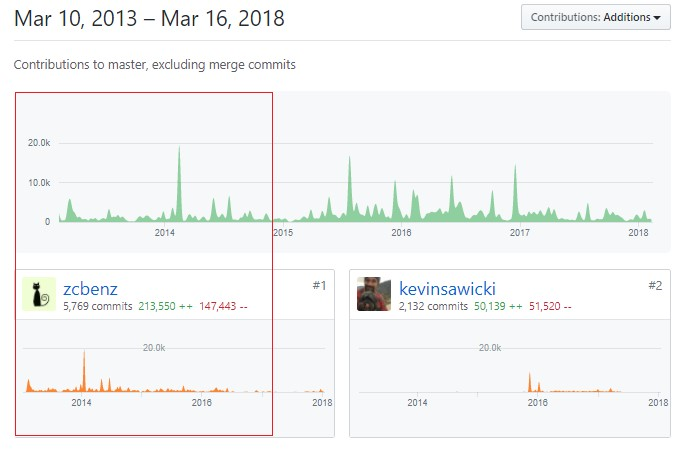</img>

*Figure 8: Electron's dependence on Cheng Zhao, a single-point of failure type of Technical Debt*

After 2015, around the time when Electron branched out from Atom more core developers like [@zeke](https://github.com/zeke) joined and the single-point of failure TD started to reduce gradually as seen in Figure [9](#fig9). To minimize TD in the code level the core developers standardized [writing](#design) and [testing](#test) contributions to ensure stable builds which has helped Electron develop at a rapid pace attracting many new contributors to the project.

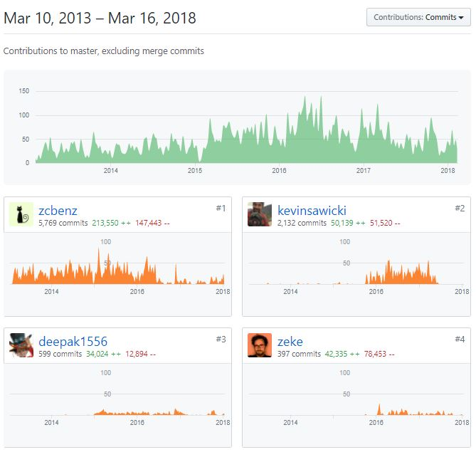</img>

*Figure 9: Electron's development timeline*

From Rozanski and Woods [3](#ref3), the evolution perspective is defined by:
- **Magnitude and Speed of Change:** At the time of testing, the stable version was ``1.8.4``. Given the speed of evolution for Electron and still staying at the major version ``1.x.x`` from 2016 till Spring 2018 indicates stability of the platform. This indicates that the magnitude of major change in Electron is long-term and minor releases  are short-term in nature.

- **Product Management/ Integrators**  are the architects of the Electron. The core developers at Github like [@zcbenz](https://github.com/zcbenz),[@zeke](https://github.com/zeke) and [@ckerr](https://github.com/ckerr) are the integrators. Their challenge is to keep Electron releases stable as only pull requests (PR) that pass all the continuous integration checks and review requirements are merged. The code reviews are done by the integrators and there is a thorough discussion on the proposed change to make sure that the integrator and the contributor are on the same page, and this results in maintaining quality across contributions. PRs are subject to CI checks on CircleCI, Appveyor, Travis and Jenkins for different OS so that the changes are non-breaking, forward and backward compatible across all Electron versions and satisfy the contributing guidelines like linting of code, etc.

- **Dimension of Change:** Platform evolution are the major version updates like ``v2.0.0`` in which even the versioning strategy has changed to [``semver``](https://electronjs.org/docs/tutorial/electron-versioning#semver). This requires Electron to change for every major update of its dependencies (Node and Chromium). The functional evolution is periodic through patch and minor version increments.

- **Changes driven by External Factors:** Electron evolves with the version of Chromium which is used for rendering the GUI components. Since, Electron uses custom embeddings of its dependencies the Chromium update could be done at a later time and need not be an immediate one. But when the Electron 2.0 arrives, Electron will conform to [``semver``](https://electronjs.org/docs/tutorial/electron-versioning#semver) which requires Electron to change for every major update of Node and Chromium.

At the time of writing this chapter the major update version 2.0.0 is in the final stages of development and we analyzed the technical debt on the versionless ``master`` during an impending new version release. The tools used were:

|Name of Tool|Purpose|
|----------|------------|
|SonarQube|Code smells, code duplicates, finding bugs and security vulnerability|
|github-grep|for finding ``FIXME`` and ``TODO``|
|Github Insights|to find indicators of technical debt from contributions and contributors|

#### Results from SonarQube
Following are the results we got from using [SonarQube](https://www.sonarqube.org/) to assess the code quality of core electron repository:

- Code Smells: Code smell analysis shows 2 days technical debt, which is very low considering the size and lines of codes in Electron. The 140 code smells depicted were not representative of real issues and were from the limitation of selecting primary language in SonarQube as JavaScript. About 70 of these were about refactoring function names which is not applicable to C++ files. The real code smell founds were  mostly in testing and scripting files which don't form an important component for core of Electron and does not affect it's stability. The figure also shows the maintainability rating `A` for all files except one testing file. Hence, we can say current version of `master` of electron is maintained pretty well. 
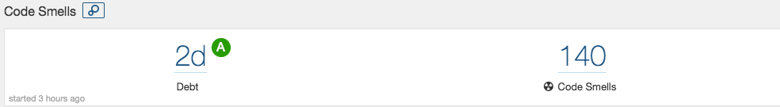</img>
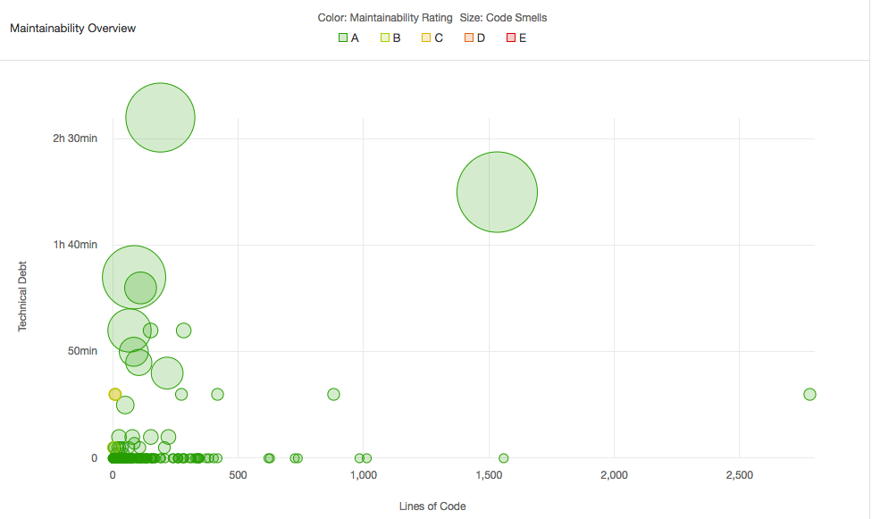</img>


- Duplicates: There are only 4% duplications found which again comes from testing code. Our analysis states that these duplicates cannot be avoided due to the nature of `describe-it` statements in [Mocha](https://mochajs.org/) and [Chai](https://chaijs.org/) testing frameworks.

Still, one can say that testing methods have a little bit of technical debt in terms of code smells and duplicates but electron developers do discuss about these through TODOs and FIXMEs as explained in point 4 below. 
</img>

- Bugs and Vulnerabilities: SonarQube detected 15 bugs and 3 security vulnerabilities. The bugs were related to coding style such as defining functions outside loop and argument mismatch. Only one of them was critical in nature and was related to how `eval` function was used at runtime to call an object's property. The solution is to call the object's property at compile time. It also estimates security remediation would take only about an hour to fix all three of them. Again, this is extremely low number of bugs and security warnings compares to the size of electron.
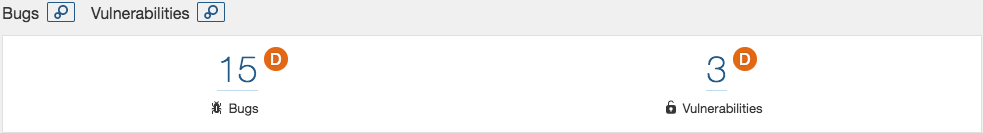</img>

#### Results from github-grep for TODOs and FIXMEs
 The developers of Electron do discuss about the technical debt there is and they communicate through code as well as github issue tracking by mentioning TODOs and FIXMEs. We used `github -grep` to find TODOs and FIXMEs in the code. In total there were 79 TODOs and 46 FIXMEs found. Each of them decribed who wrote it and/or who will fix it. Examples are shown below:


- `atom/browser/api/atom_api_app.cc:      // TODO(juturu): Remove in 2.0, deprecate before release`
- `chromium_src/chrome/browser/process_singleton.h:  // TODO(brettw): Make the implementation of this method non-platform-specific`
- `spec/api-crash-reporter-spec.js:        // TODO(alexeykuzmin): Skip the test instead of marking it as passed.`
- `spec/webview-spec.js:        // FIXME(alexeykuzmin): Skip the test.`
- `atom/browser/web_contents_preferences.h:  // FIXME(zcbenz): This method does not belong here.`

Majority of them were about skipping tests instead of marking them passed in the version 2.0. However, by doing this we got to know the technical debt (still relatively very small compared to repo's size) not found by automatic finders like SonarQube and can only be found through developer insights and project's long term plans. The TODOs in core Electron's code represent deprecations to be done in release 2.0 of the release. Our solution to this is that these 2.0 TODOs should not be in the versionless master branch but 1.8.4 (current production version's) branch.


There is also discussion about these on github issue tracking. The TODOs and FIXMEs there are on much higher abstraction level as described in this recent example on:
- [https://github.com/electron/electron/issues/10836](https://github.com/electron/electron/issues/10836): List of hacks and workarounds made during the upgrade to Chromium 61. They are to be fixed before Chromium 61 is merged or right after. Most of the issues are fixed already. This reinforces that Electron's developers are very active and keep it's technical debt low.
- [https://github.com/electron/electron/issues/11242](https://github.com/electron/electron/issues/11242): This described the debt in terms of updating documentation (Remove async menu from the docs) that came with upgrades in Chromium 61.


We can infer from this activity that Electron developer's community is well aware of the technical debt that is arising from the new incoming version 2.0 and is actively working towards reducing the same. This makes evolution of Electron future-proof and their steps towards `semver`, where they will update Electron with every major update of its dependencies reinforces this fact.


<a name="security"></a>
### 3.2.2 Security Perspective
It is important to distinguish that Electron is not a web-browser and the applications are built using Chromium as a renderer and Node to make remote calls to sources on the web. The security of applications built on Electron depends on the current, latest version of Chromium.
Chromium has an off-the-shelf sandbox to run processes which can freely use CPU and memory. However, being a restrictive environment, there are well-defined policies for processes which prevents bugs and attacks during IO operations. 

To provide applications with desktop functionality, the Electron team modified Chromium to introduce a runtime to access native APIs as well as Node.js’s built in and third-party modules. To do this the Chromium sandbox protection was disabled, meaning any application running inside Electron is given unfiltered access to the operating system.

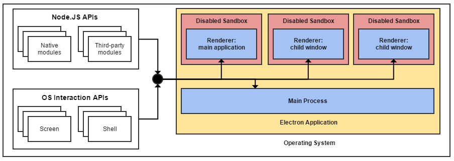

*Figure 15: Electron's architecture combined with disabled Chromium sandboxes [[28]](#ref28)*

This is not a concern for a lot of Electron applications, especially those that don’t pull in remote data and need extensive operating system privileges anyway (such as an IDE). However, this is a (potentially) serious and unnecessary security risk for applications that do pull in remote data, any successful XSS attack would give the attacker full control over the victim’s machine!
It’s worth stressing that a successful XSS attack within a sandboxed application is still a catastrophic event that can do untold damage. Even restricted to the sandbox, an attack can execute scripts to hijack user sessions, deface web sites, insert hostile content, redirect users and install malware. Nonetheless, unless they escape the sandbox the potential for damage stops at the browser level with the operating system left unharmed and only data explicitly shared with the browser at risk.[[28]](#ref28)

A cross-site-scripting (XSS) attack is more dangerous if an attacker can jump out of the renderer process and execute code on the user's computer. Cross-site-scripting attacks are fairly common - and while an issue, their power is usually limited to messing with the website that they are executed on. Disabling Node.js integration helps prevent an XSS from being escalated into a so-called "Remote Code Execution" (RCE) attack.[[29]](#ref29)

It’s worth pointing out that there’s [an open discussion](https://github.com/atom/electron/issues/1753) around Electron’s security model on GitHub, so further changes and improvements are likely to be made once this discussion is finalised.

To summarise, Electron currently has its fair share of security issues that complicate the process of building secure applications. Various workarounds also exist that circumvent turning node integration off in the event of an XSS attack. One major goal should be a more secure way for applications that do need some node and desktop integration to interact with the operating system.  Fortunately, due to the framework’s popularity and active community the Electron team are already making good progress to resolving these issues.[[28]](#ref28)

<a name="con"></a>
## 4. Conclusions
We can summarize our detailed analysis through the following points:
- Electron makes thing easy by providing a framework for developing cross-platform desktop apps through web technologies.
- Electron has a large and friendly community, who is always eager to welcome new contributors. The experience is based on our own contributions. One of the core developers [@Zeke](https://github.com/zeke) even did a video call to help us with coding issues for the contribution.
- Lots of applications are dependent on Electron and hence, extra focus is given on Electron's stability at any given point of time.
- Electron is backed up by Github and other large communities. The developers of Electron are well-aware of the technical debt that comes with evolving and actively discuss and contribute towards keeping it low.
- Electron is gaining a lot of attention and the contributor community is large, skilled and fast growing, and so when you might be reading this chapter, a new version 2.x.x must be available.
- In 2.x.x, Electron has promised to update according to every major update to its depedencies making it more secure and robust.

*Do you want to contribute to Electron as well? Take a look at [Electron]() and the [contributing guidelines]() for the Electron project. It's our guarantee that you will be welcomed with open arms by team Electron and will provide help and feedback by all means possible for your contributions.*


### References <a name="ref"></a>
<a name="ref1"></a>1. Electron (software framework)(2018). [online] Available at: https://en.wikipedia.org/wiki/Electron_(software_framework) [Accessed 23 Feb. 2018].

<a name="ref2"></a>2. Steve Kinney (2018), Introducing Electron in Electron in Action(pp. 1-15), Manning Publications.

<a name="ref3"></a>3. Rozanski, N., & Woods, E. (2012). Software systems architecture: working with stakeholders using viewpoints and perspectives. Addison-Wesley.

<a name="ref4"></a>4. Electron: Tutorial (2018). [online] Available at: https://electronjs.org/docs/tutorial/ [Accessed 23 Feb. 2018]. 

<a name="ref5"></a>5. Olander, S., & Landin, A. (2005). Evaluation of stakeholder influence in the implementation of construction projects. International journal of project management, 23(4), 321-328.

<a name="ref6"></a> 6. Lynch, A. (2017). Beyond The Browser: From Web Apps To Desktop Apps. [online] Available at: https://www.smashingmagazine.com/2017/03/beyond-browser-web-desktop-apps/ [Accessed at 4 March, 2018]


<a name="ref7"></a> 7. Electron: Source code structure(2018). [online] Available at:    https://github.com/electron/electron/edit/master/docs/development/source-code-directory-structure.md [Accessed 4 March, 2018]

<a name="ref8"></a> 8. Betts, P. (2016). Building Hybrid Applications with Electron. [online] Available at: https://slack.engineering/building-hybrid-applications-with-electron-dc67686de5fb [Accessed at 4 March, 2018]

<a name="ref9"></a> 9. Betts, P. (2016). Using ES2015 with Electron — introducing electron-compile. [online] Available at: https://slack.engineering/using-es2015-with-electron-introducing-electron-compile-2a0e5ccbadb6  [Accessed at 4 March, 2018]


<a name="ref10"></a> 10. Electron's dependecies (2018), [online] Available at:  https://david-dm.org/electron/electron?type=dev [Accessed at 4 March, 2018]

<a name="ref11"></a> 11. Elctron API documentation, [online] Available at:  from https://electronjs.org/docs/api [Accessed at 4 March, 2018]

<a name="ref12"></a> 12. Nokes, C. (2016). Deep dive into Electron’s main and renderer processes.[online] Available at: https://codeburst.io/deep-dive-into-electrons-main-and-renderer-processes-7a9599d5c9e2 [Accessed at 5 March, 2018]

<a name="ref13"></a> 13. Norris, T. (2015). Understanding the Nodejs Event Loop. [online] Available at: http://nodesource.com/blog/understanding-the-nodejs-event-loop/ [Accessed at 5 March, 2018]


<a name="ref14"></a> 14. Crashpad README(2018). [online] Available at: https://github.com/electron/crashpad/blob/master/doc/overview_design.md [Accessed at 5 March, 2018]


<a name="ref15"></a> 15. Crashpad- Development Notes (2018 ). [online] Available at: https://github.com/electron/crashpad/blob/master/doc/developing.md [Accessed at 5 March, 2018]

<a name="ref16"></a> 16. Electronjs.org Testing on Headless CI (2018). [online] Available at: https://electronjs.org/docs/tutorial/testing-on-headless-ci [Accessed at 5 March, 2018]

<a name="ref17"></a> 17.  Electronjs.org Testing (2018).  [online] Available at: https://electronjs.org/docs/development/testing [Accessed at 5 March, 2018]

<a name="ref18"></a> 18. Spectron. (2018). [online] Available at:  https://github.com/electron/spectron [Accessed at 5 March, 2018]

<a name="ref19"></a> 19. Devtron. (2018). [online] Available at:  https://github.com/electron/devtron [Accessed at 5 March, 2018]

<a name="ref20"></a> 20. Electronjs.org source code strucutre. (2018). Source Code Directory Structure. [online] Available at: https://electronjs.org/docs/development/source-code-directory-structure [Accessed at 6 March, 2018]

<a name="ref21"></a> 21. Electronjs.org/ build overview. (2018). Build System Overview. [online] Available at: https://electronjs.org/docs/development/build-system-overview [Accessed at 6 March, 2018]

<a name="ref22"></a> 22. Chromium.org/ multi-process architecture. (2018). Multi-Process Architecture. [online] Available at: https://www.chromium.org/developers/design-documents/multi-process-architecture [Accessed at 6 March, 2018]

<a name="ref23"></a> 23. Lord, J. (2018). Jlordus. [online] Available at:  http://jlord.us/essential-electron/ [Accessed at 6 March, 2018]

<a name="ref24"></a> 24. Electronjs.org Releasing (2018).  [online] Available at: https://electronjs.org/docs/development/releasing [Accessed at 6 March, 2018]

<a name="ref25"></a> 25. Electronjs.org. (2018). Releasing. [online] Available at: https://electronjs.org/docs/tutorial/application-packaging [Accessed at 6 March, 2018]

<a name="ref26"></a> 26. Cunningham, W. (2011). Ward Explains Debt Metaphor. [online] Available at: http://c2.com/cgi/wiki?WardExplainsDebtMetaphor [Accessed at 15 March, 2018]

<a name="ref27"></a> 27. Electron's Versioning Documents. [online] Available at: https://github.com/electron/electron/blob/master/docs/tutorial/electron-versioning.md [Accessed at 15 March, 2018]


<a name="ref28"></a> 28. Kerr, D. (2018). As It Stands - Electron Security. [online] Available at: http://blog.scottlogic.com/2016/03/09/As-It-Stands-Electron-Security.html [Accessed 1 Apr. 2018]. 

<a name="ref29"></a> 29.  Electronjs.org. (2018). Security. [online] Available at: https://electronjs.org/docs/tutorial/security [Accessed 1 Apr. 2018]. 
