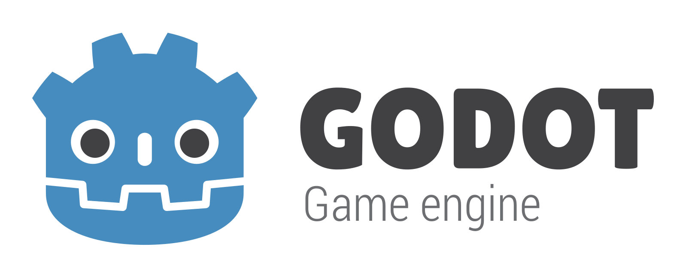
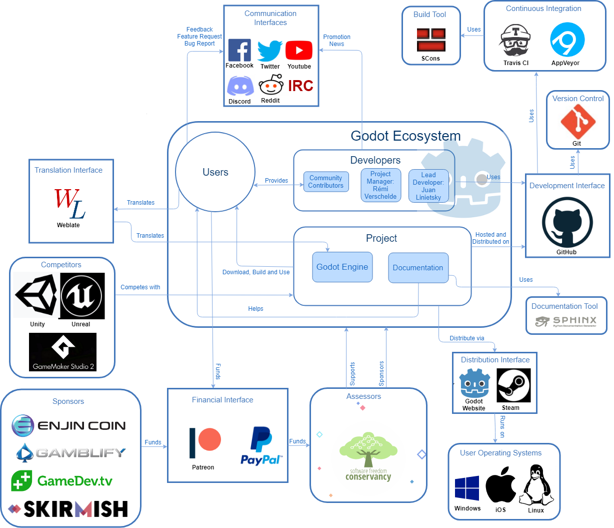
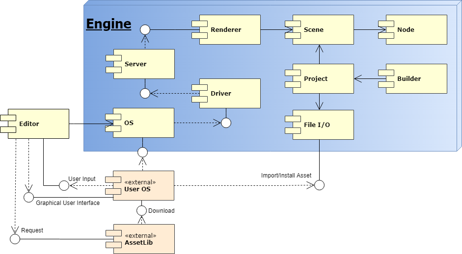
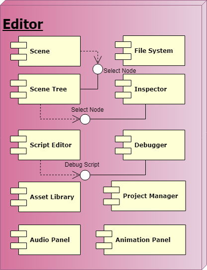
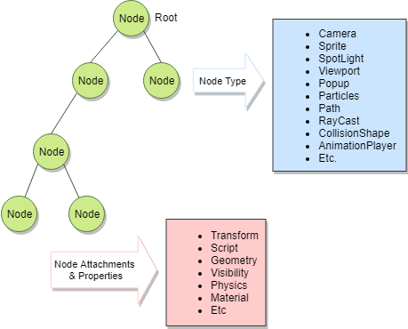
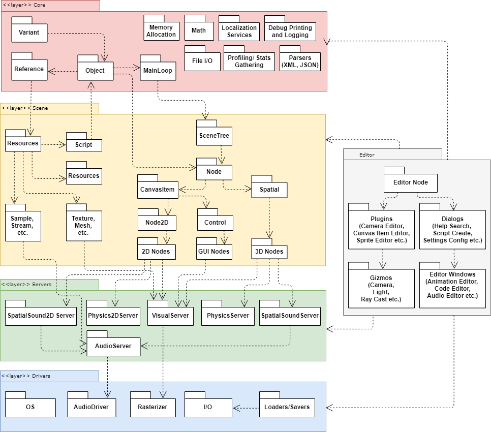

# Godot

By [Alkis Antoniades](https://github.com/Deathex), [Miriam Doorn](https://github.com/millenniumproof), [Marie Kegeleers](https://github.com/Mari3), [Felix Yang](https://github.com/Falke117)

*Delft University of Technology, 2018*

## Introduction

Godot is a community-developed, cross-platform, open-source game engine released under the MIT license and is free for commercial applications. A large and growing online community actively contributes to the development by coding, testing, documenting and promoting the Godot Project.

In this chapter, we will describe our research, analysis and documentation of the architecture and development of the Godot Engine. Who are the stakeholders most interested in the development? What are the qualities which are most important for such a system, and how do we ensure those qualities are implemented in the system?

## Table of contents

1. [Introduction](#introduction)
2. [Stakeholder Analysis](#stakeholder-analysis)
3. [Context Viewpoint](#context-viewpoint)
	1. [System Scope and Responsibilities](#system-scope-and-responsibilities)
	2. [Entities and Interfaces of Interests](#entities-and-interfaces-of-interests)
4. [Functional Viewpoint](#functional-viewpoint)
5. [Development Viewpoint](#module-structure)
	1. [Module Structure](#module-structure)
	2. [Common Design](#common-design)
	3. [Standardization of Design and Testing](#standardization-of-design-and-testing)
	4. [Codeline Organization](#codeline-organization)
6. [Deployment Viewpoint](#deployment-viewpoint)
7. [Internationalization Perspective](#internationalization-perspective)
8. [Technical Debt](#technical-debt)
9. [Conclusion](#conclusion)

## Stakeholder Analysis

 Stakeholder analysis helps identify responsibilities of persons involved in the project. The following table shows the types of stakeholders present in the project and their involvement. Due to the project being completely non-profit, community-developed and released under MIT license, the stakeholder types are quite unique.

 | Stakeholder | Person/Entity | Involvement |
 | :--- | :--- | :--- |
 | Lead Developer | Juan Linietsky ([**reduz**](https://github.com/reduz))     |  Creation of most of the code, and high-level decision making.  |
 | Committee Members | Juan Linietsky ([**reduz**](https://github.com/reduz)), Ariel Manzur ([**punto**](https://github.com/punto-)), Rémi Verschelde ([**akien-mga**](https://github.com/akien-mga)), George Marques ([**vnen**](https://github.com/vnen)), and Andreas Haas ([**Hinsbart**](https://github.com/Hinsbart))       | Financial management. |
 | Project Manager     | Rémi Verschelde ([**akien-mga**](https://github.com/akien-mga))       | Maintainer, integrator and manager of Godot repositories, also acts as the representative of Godot Engine to the public.      |
 | Senior Developers     |    Members of [Godot Engine](https://github.com/godotengine)    |  Assist the lead developer with software development, and assist the project manager with issues & pull requests management and integration.      |
 | Community Contributors     |    Contributors of any repositories of [Godot Engine](https://github.com/godotengine)    |  Bugfixing, the creation of minor new features, documentation creation and maintenance, testing, etc.     |
 | Users     |   Individuals or companies that develop games with the Godot Engine     | Use the product, report encountered bugs, and request new features.   |
 | Sponsors     |   Patrons of the Godot Project on Patreon](https://www.patreon.com/godotengine)    | Support the development with money, and lean in the development process with their opinions.      |
 | Competitors    | Unity 3D, Unreal, etc       | Game engines offering similar features and tools. |

## Context Viewpoint

 

 &nbsp;

### System Scope and Responsibilities

 Godot is a game engine that provides a large set of tools used in game development, including an editor with a graphical interface, which runs on Windows, macOS, Linux and BSD, and can create games targeting PC, console, mobile, and web platforms. The project extends to include documentation on how to use the editor, as well as translations for it.

 System Responsibilities:
 - Support for development of both 2D and 3D games.
 - Providing an intuitive, cohesive and integrated development environment.
 - Cross-platform support for development environment (Windows, Mac OS, Linux).
 - Even greater cross-platform support for publishing games (mobile, web, console, PC).
 - Performance should be comparable to mainstream engines such as Unity 3D and Unreal.
 - Clear and comprehensive documentation.
 - Free for all applications.
 - Open to customization.

### Entities and Interfaces of Interests

#### Funding

 The Godot project is being crowdfunded on Patreon and by direct donations using Paypal. At the moment there are four corporate sponsors through Patreon, with the rest of the donors being individual members of the Godot community. The Software Freedom Conservancy (SFC) acts as a fiscal sponsor, and any funding goes through it.

#### Development

 Juan Linietsky and Rémi Verschelde manage a large group of community developers who contribute to the Godot Engine code base via GitHub. GitHub is used as an interface where developers and users can access the codebase that is hosted there, and is also used for discussions and project management.

 When a pull request is made for a code contribution on GitHub, [Travis CI](https://travis-ci.org/) and [AppVeyor](https://travis-ci.org/) are deployed to check whether the changes suggested pass certain tests. [SCons](http://scons.org/) is used as a tool to generate builds for multiple platforms.

#### Documentation
 The source code for the documentation of the Godot Engine has its own [github repo](https://github.com/godotengine/godot-docs), and contributors are encouraged to make additions. The documentation is accessible on the [Godot Docs website](http://docs.godotengine.org/en/3.0/), as well as directly inside the Godot Editor.

#### Translation
 The translation interface will be described in detail in the section on Internationalization.

#### Communication
 The community of the project uses many [channels](https://godotengine.org/community) to interact, such as Twitter, Reddit, Facebook, Discord, IRC, etc, where members help each other when they have questions or want to discuss the development of games, as well as the development of the Godot engine project. Users can act as advocates for the Godot engine by showcasing the games they make using the Godot editor.

 When a stable release is ready for deployment, it gets released on the [Godot official website](https://godotengine.org/download/windows) and on [Steam](http://store.steampowered.com/app/404790/Godot_Engine/) for supported platforms.

## Functional Viewpoint

 &nbsp;

 

 &nbsp;

 The diagram above illustrates the functional structure of the Godot Engine, which consists of multiple internal and external entities, and the interfaces and dependencies between them.

### Engine
 Most internal entities are contained within the group *Engine*, the core of the whole system. *Engine* renders game scenes and executes game logic.

 The biggest entity within *Engine* is *OS*. It serves many fundamental purposes, including communicating with *User OS*, initializing the system, etc.

 *Driver* and *Server* together implement graphics and audio effects in games, with the difference being that the former handles low-level communication with APIs and is hidden from the user, while the latter is visible to script writers.

 *Renderer* makes use of *Server* and renders the current scene, which makes it dependent on the *Scene* entity. Scenes in the Godot engine consist of multiple nodes in a tree structure, which makes *Scene* dependent on *Node*.

 A project in the Godot engine consists of multiple scenes, which explains the dependency from *Project* to *Scene*. A project is also a basic unit the game builder takes in to build game executables, thus the dependency from *Builder* to *Project*. Any changes to a project that need to be read or written are handled via *File I/O*.

 &nbsp;

 &nbsp;

 &nbsp;

 &nbsp;

 &nbsp;

### Editor

 &nbsp;

 

 &nbsp;

 *Editor* serves as an interface between *User OS* and *Engine OS*, to help users manage projects easier, and display information from *Engine* in an intuitive way. The above diagram shows the many sub-entities of *Engine* that offer functionality to the user in a Graphical User Interface (GUI).

 *Project Manager* is used to create new projects, load existing ones, and it contains a list of templates, which are essentially demos showcasing different game mechanics that developers can use to simplify certain aspects of their project development.

 *File System* facilitates the import of game assets such as textures, 3D models, etc, and the creation of scripts which are used for specifying game logic, or shaders that can be attached to game objects, as well as game scenes which can consist of game assets with their attached scripts.

 Scripts can be edited in the built-in *Script Editor*, which has its own *Debugger*.

 &nbsp;

 

 &nbsp;

 *Scene Tree* can be used to create Nodes and edit the scene tree in a visual way. The above diagram shows a visual representation of a scene tree and the types of Nodes it can contain. Properties can be set to Nodes in the *Inspector*. *Scene* shows the Nodes in a 2D or 3D environment.

 In *Animation Panel*, users can create and edit animations for nodes in the scene tree, including those that have gameplay related values.

 *Audio Panel* can be used to edit the settings of audio buses. Audio streams can be set to play from the target audio bus.

 Through the *Asset Library* GUI, users can search for and download assets from *AssetLib*. The interface between the *Editor* and *AssetLib* server is based on the REST API

## Development Viewpoint

### Module Structure

 The Godot Engine has a layered architecture with the modules organized in four layers with intermodule dependencies, something which the structure diagram below illustrates. This diagram is based on the [architecture diagram](http://docs.godotengine.org/en/3.0/development/cpp/introduction_to_godot_development.html) found in the Godot Documentation, and even though this diagram was made over a year ago, the basic structure of the engine remains the same.

 

 &nbsp;

 - Core: The core layer consists of the main loop of the program, which keeps it running, along with class modules that can be inherited from to form a consistent base for each class. The most important classes here are *Variant* and *Object*. *Variant* can contain all data types that are useful to the engine and can therefore be used as a dynamic type in C++. *Variants* can be set to *Objects* as properties. *Object* forms a general base for a class by providing elements like id, flags and get methods. *Reference* contains basic elements for classes that involve resources, configurations, parameters etc. All the nodes and resources inherit from the *Object* class. The core also contains many basic low level functionalities such as *Math* and *File Input/Output*.
 - Scene: This layer contains all modules concerning the scene which is everything that the user interacts with when building a game. Each scene is built up using a *SceneTree* which consists of nodes, instances of classes that inherited from the *Node* class. Some examples of nodes are controls, 3D objects and GUI elements.
 - Servers: This layer contains detailed implementation for aspects like Graphics, Physics, Audio etc, and users can interact with them via scripts and the editor. The most prevalent one is the *VisualServer*, since everything that is visible in-game gets processed by it.
 - Drivers: This layer implements functionalities provided by the *Server* layout on a lower level. The drivers layer handles various platforms and exterior systems, thus making the low-level details opaque to the Servers layer. For example, the *I/O* and *Loaders/Savers* deal with different read and write methods on different platforms, etc..
 - Editor: The editor group is a collection of all modules that make up the Godot Editor application. The editor is not part of the Godot Engine per se, and in fact it has been created using it, and is thereby dependent on modules from all the layers in it.

### Common Design
#### Graphics Rendering
 One of the concerns of the Godot Engine is that games made using the engine should be portable to different platforms and operating systems. You can imagine that rendering for a mobile game is done differently from rendering for a Linux desktop. To enable this quality, all classes that draw graphics have to interface with the Visual server singleton class, which then interfaces with the OpenGL ES API for rasterization and rendering.

#### Portability
 All components, including custom user modules, must include an *SCsub* file, which contains Python code that enables a third-party software, SCons, to include them in the engine build. SCons is an open source cross-platform software construction tool that uses Python scripts for configuration files, and according to the Godot engine authors, it plays a pivotal role since it facilitates building the engine for different platforms, without breaking the build. Custom user modules also need to have a config.py file, which states whether it is ok to build for a specific platform.

#### Writing Scripts
 GDScript is a high level, dynamically-typed programming language similar in syntax to Python, which has been developed to make it easy and intuitive for game developers to use the Godot Engine. For the scripting engine to determine the available types when coding in GDScript, *ClassDB* is used, which is a static class holding a list of registered classes that inherit from *Object*, along with dynamic bindings to all their method properties. Each class desired to be available in GDScript needs to be registered to *ClassDB*, and should users creating modules in C++ want the classes to be available in GDScript, they need to apply these bindings.

 Game developers can also write code in VisualScript, which makes the coding process more visual to allow for a lower entry barrier to using the engine, and C#. C++ is the programming language used for developing the game engine itself.

#### Memory Usage
 Godot employs various tools for tracking memory usage in a game, especially during debug, so the regular C and C++ library calls should be avoided in favor of Godot-provided macros, such as *memalloc()*, instead of *malloc*, etc, and for memory allocation in the style of C++, special macros are provided. Objects are also notified right after they are created, and right before they are deleted. The *DVector<>* template is also provided for dynamic memory purposes.

### Use of third-party libraries
 The Godot Engine makes use of third-party libraries that either have the same MIT-license as the Godot Engine or one that is similarly open and free, with the full list of libraries used being available in [the documentation](https://github.com/godotengine/godot/tree/master/thirdparty).

### Standardization of Design and Testing

#### Standardization of Design and Code

 Defining code style standards ensures good collaboration and overall quality. The Godot developers advice code contributors to conform to the existing style of code. Each pull request has a code review by one of the core developers, to ensure that the code is clean and maintainable. The code style rules are formalized in the [.clang format file](https://github.com/godotengine/godot/blob/master/.clang-format) found in the Godot repository, and the style for C++ code is checked automatically using Travis CI when a contributor creates a pull request.

 There are very few comments to be found in the code, and [the core developers say](http://godot.eska.me/irc-logs/devel/2018-03-08.log) this is mostly because people don't bother to make the effort. Having comments in non-trivial code would be a useful addition, however there are no guidelines defined for code commenting, because they believe this would disencourage people from contributing and it would add an extra step in code review to determine whether certain comments in the code are necessary.

 For Python scripts, such as those used in the SCons build system, the [PEP-8 style guide](https://www.python.org/dev/peps/pep-0008/) is adhered to. For Java scripting there is no chosen style standard, and contributors are encouraged to keep their code as clean as possible.

 There are also guidelines on the proper format to use when [filing an issue](http://docs.godotengine.org/en/3.0/community/contributing/ways_to_contribute.html#testing-and-reporting-issues) on the project's GitHub page.

 The Godot documentation offers [guidelines on organizing](http://docs.godotengine.org/en/3.0/community/contributing/bug_triage_guidelines.html) issues posted on Github, including a list of the labels currently defined in the Godot repository.

#### Test and Build Strategy
 Before a pull request is merged, automated tests are run on the code submitted. For continuous integration, the Godot project uses Travis CI and Appveyor. Travis CI is used to make sure the code has the correct formatting, and Appveyor is used to make sure the project builds without problems. For creating builds, the tool SCons is used.

 The engine is mostly tested by its users. There are reliable unofficial sites offering daily builds such as [here](http://godot3builds.digitecnology.com/) and [here](https://hugo.pro/projects/godot-builds/), and quite a few users work with them, therefore when there are pressing issues they are found and fixed quickly, often within hours. Many things cannot be tested automatically, such as problems in the editor, something which requires users to notice the issue and report it to the developers. Furthermore, since the code base is changing so rapidly and features are being added constantly, it would be difficult to keep automated tests up-to-date, therefore making user testing the more agile approach.

### Codeline Organization
#### Code Management
 The Godot Project uses the “[Pull Request workflow](http://docs.godotengine.org/en/3.0/community/contributing/pr_workflow.html)”, which is common with projects on GitHub. Contributors fork the project, make modifications, and create a pull request, usually to the master branch. Other contributors can then review the code, comment on it and suggest changes when needed. When a pull request is approved, one of the core developers (mostly Rémi (**akien-mga**)) will merge it. You don't need to sign a CLA to contribute to the project, since in the words of the project manager, Rémi:
 > "CLAs make contributing to open source projects ridiculously bureaucratic and slow."

 Some pull requests spark discussion, since a developer may want to include a feature that is deemed unnecessary by others, and in such a case, it may happen that the PR will be discussed in a meeting on the Godot developer IRC channel. The PR will only be merged after a consensus is reached.

 Some developers have expertise in a certain area of the project and are allowed to commit directly if it falls within their field of responsibility.

#### Release Process
 Development on the master branch is working towards a new stable release, and there is also work being done on the previous releases in a separate branch. After the big update from version 2 to 3, there were compatibility issues when users wanted to import projects into the new version of the editor and engine, therefore there are still people working on their games using an older version of the engine. Development on older versions generally is restricted to bug fixing, while in the master branch for the new releases new features and tools are constantly being added.

 When a big release is approaching, a [callout](https://godotengine.org/article/hero-wanted-campaing-fixing-final-bugs-launchs) is made for developers to [fix remaining issues](https://godotengine.org/article/hero-wanted-help-fix-remaining-issues-30). Sometimes before a stable release, a test build is released. These builds are announced on the blog, and anyone interested can test them and report issues.

 The release schedule of intermittent updates is not determined and dependent on the severity of issues found and fixed.

## Deployment Viewpoint

 The Godot Engine offers support to build projects using the engine to the following platforms: Android, iOS, HTML5, macOS, Windows Universal, Windows Desktop and Linux/X11. To build the Godot Engine from the source code, the cross-platform build tool *SCons* is required, which in turn requires Python 2.x to run. If a user wants to build a project for a specific platform, they need a proper set-up for the target platform as well as an export template provided by Godot.

 Some platforms have extra requirements to generate builds for them, as can be seen in this table:

 | Environment   	 | Requirements for Exporting a Godot Engine Project to Platform     |
 |-------------------|-------------------------------------------------------------------|
 | Android   		 | Install ADK. Install JDK 6 or 8. Generate Debug Keystore File.     |
 | iOS \ macOS   	 | Must export from a computer running macOS with Xcode installed.     |

 For web exports (HTML5), running the export requires support for WebAssembly and WebGL 2.0 in the user’s browser.

 The export templates are used to set properties that are specific to a certain platform. For mobile platforms for example, you can set the screen orientation for the application to portrait or landscape mode. You can also manage asset compression and level of detail for the graphics. The export templates are required to create packages. In the Godot Editor you can easily install the export templates from the menu, and they can also be obtained from the download page on the website.

 Supporting all the formats out-of-the-box is impractical, as it would bloat the core with a lot of logic people would not be using, and therefore platform-specific code can be found in the platform folder of the Godot Engine source code. For rendering graphics, the Godot Engine depends on the OpenGL ES 3.0 API, thus any devices that wish to execute projects made using the Godot Engine (this includes the Godot Editor) must have an OpenGL ES 3.0 compatible operating system and hardware.

## Internationalization Perspective

 The game market is a global one, therefore by including localization, games can reach a larger audience. One of the functionalities the Godot Engine offers is support for internationalization.

 The internationalization system in Godot is based on the well-established [gettext/PO files workflow](https://en.wikipedia.org/wiki/Gettext), although using a tailor-made parsing and integration of the translated strings that does not rely on gettext. Strings that users will see can be wrapped in the TTR()-function. The supplied strings are used as keys for looking up alternative translations. When no translation is available, the function will return the original string. Translations can be imported into game projects as resources. The *Translation* class maps one string to another string, and the Translation Server singleton manages all the translations. Godot has a special importer for CSV-files and for .po-files.

 The Godot Engine supports Unicode, so languages with diverse characters such as Chinese, Japanese, and Arabic can be encoded as well. The Godot Docs has a [list](http://docs.godotengine.org/en/3.0/tutorials/misc/locales.html#doc-locales) of all the supported languages.

### Translating the Godot Editor
 The work of translating the Godot Editor is being crowdsourced to the community through [Weblate](https://weblate.org/en/), a free web-based translation tool that supports the use of GitHub for version control integration, with translations to 45 languages (including Pirate(!)) in progress as shown on the [Godot project page](https://hosted.weblate.org/projects/godot-engine/godot/) on Weblate. Users can fill in, correct and confirm translations, and even add new languages. Weblate generates [.po-files](https://github.com/godotengine/godot/blob/master/editor/translations/pr.po). Occasionally, one of the Godot core developers will synchronize the translations from Weblate with the git repository.

## Technical Debt

 When a coding team decides to achieve something using suboptimal means that only solve the imminent problem, what they are doing is essentially borrowing time and manpower from the future, since replacing it down the line will end up taking even more time and manpower than what the team borrowed. This concept is referred to as '[Technical Debt](https://www.techopedia.com/definition/27913/technical-debt)'.

### Analysis of Technical Debt

#### Code Debt
 Thanks to the excellent workflow model of the project, code debt is relatively rare in the Godot project. Most contributors assign themselves to an issue or feature, and then work to solve it, something which gives each pull request a clear goal. Moreover, the project manager, Rémi, with help from other senior contributors, inspect every pull request and conduct proper code reviews to ensure certain quality standards. Since the Godot Project is community-developed and not-for-profit, the developers do not need to rush production to meet deadlines, something which therefore results in less amount of ‘hacks’ that aim in only addressing something in the short-term.

 As the lead developer and one of the original creators of the engine, Juan is very much concerned with keeping the core engine optimized and the code base maintainable, therefore he followed the SOLID principles during the development of the engine. The Single Responsibility Principle can be observed in individual classes, while other principles can be observed in the way the class inheritance and interface are designed.

#### High-Level Debt
 The largest part of the code base is written in C++03 which by now is a relatively old version, however, to compile the Godot Engine, a C++11 compiler is required as some features of this version are used in the code.

#### Historical Analysis
 As demonstrated in [this issue](https://github.com/godotengine/godot/issues/9694), developers have discussed converting everything to fit more recent versions of the C++ language, however there are no plans to actually implement this anytime soon.

 Just like the programming language issue, there has been some discussion about changing to another build system, however there are no plans to act upon it in the near future. One of the developers [said](http://godot.eska.me/irc-logs/devel/2018-02-06.log):
 > "It's hard to deny that a flawed but existing and working and reliable system is better than a potentially more efficient, yet mostly theoretical and difficult to (re)implement one"

### Documentation Debt
 Proper documentation is of paramount importance in every project, but more so in one as big and complex as a game engine. Documentation in this case is important for both developers and users, since it can assist them in understanding what the code is supposed to do, so adjusting or adding to it can be less complicated, and it can help game developers understand the use of the different functionalities available to them.
 So in turn, documentation debt can be detrimental to the manageability of a project, and especially of an open source one where everyone can make contributions.

 &nbsp;

 &nbsp;

#### Historical Analysis
 Extensive documentation exists in the previously mentioned [GitHub repository](https://github.com/godotengine/godot-docs), however the main problem is that in many cases pull requests with no documentation are merged, something that will cause problems in the future.

### Project Debt
 As can be seen from previous sections, the backlog of issues continues to grow and there is no process in place to pay of this debt. The bulk of organizing this large amount of issues falls to the Project Manager, Rémi, who has other tasks and responsibilities related to Godot, and can be unavailable at times. While other developers have the privileges to add labels and milestones to issues, most of them are hesitant, believing Rémi and Juan to have a better judgment on these issues. This causes work to pile up, increasing the backlog. Having so few people carry so much responsibility is a technical debt, as it will be difficult to replace them when they are unavailable. Also, there is a need for more developers to contribute to the project, especially those with an expertise in some of the more specialized areas that require high level mathematics, such as rendering.

#### Historical Analysis
 Efforts have been, and are being made to pay off this technical debt. When Rémi is overwhelmed by the workload, he has in the past used the mailing list to [call out for help](https://listengine.tuxfamily.org/godotengine.org/devel/2018/03/msg00003.html). On a semi-regular basis, the core developers get together on the development IRC channel to do PR reviews together, which is a good opportunity to have several developers give their opinion on changes that are under discussion.

 To compensate for the lack of skilled developers, an approach that has been used in the past is to replace code written by Godot developers with better-performing third-party libraries, with an example being the physics system, which is being phased out of the project, now that the Bullet physics library has been fully integrated.

 Part of the money raised by [the Patreon campaign](https://www.patreon.com/godotengine) will be used to hire some of the skilled core developers of the project to spend more time working on the more difficult areas of the code base.

## Solutions

 Using an old version of C++ has already created some technical debt and could create a lot more in the future, especially since using an older version of a language always comes with the risk of code becoming obsolete. We recommend keeping the discussion going and perhaps begin to slowly port code over so that the amount of work necessary will be less, when the decision is finally made.

 To avoid further documentation debt, we suggest that contributors are encouraged to document their pull requests, and in the case of new feature additions, we recommend not merging them until the authors provide sufficient documentation.
 For existing documentation debt, we suggest having a dedicated team of developers track undocumented features, and either contact the authors to provide documentation, or examine the code and write documentation directly.

 Certain older issues are not relevant anymore, so it would be prudent to create issue-testing teams, with the task of verifying whether they have already been addressed. If so, they can be closed, otherwise they can be assigned to the upcoming milestone so that developers will have a look at it when a new release approaches.

## Conclusion

 Game development is known for code being written in an unstructured manner as scope is changing constantly. A game engine on the other hand, is an on-going project that needs to have a well defined architecture, that is robust as well as flexible. It has to be able to provide tools so that game developers are free to explore different genres and features for their games. In our analysis we found the most important qualities for a game engine system to be stability, portability, maintainability and modifiability. Stability is maintained by constant testing by the user base. The code base is kept maintainable by diligent code review by the core developers, giving the project a high level of code quality despite being worked on mostly by volunteers. Long term solutions are prefered and quick fixes avoided as much as possible. The layered architecture for the Godot Engine separates platform-independent from platform-dependent code to facilitate portability to various platforms. Interfaces to the engine can be used so that developers can create modules that expand the functionalities of the engine making the engine very modifiable.

 While many issues remain, we are confident that with the help of the excellent workflow, clear architectural model, and enthusiasm from the community, the Godot Engine will not crumble to its technical debts, but will instead, grow even better over time.
