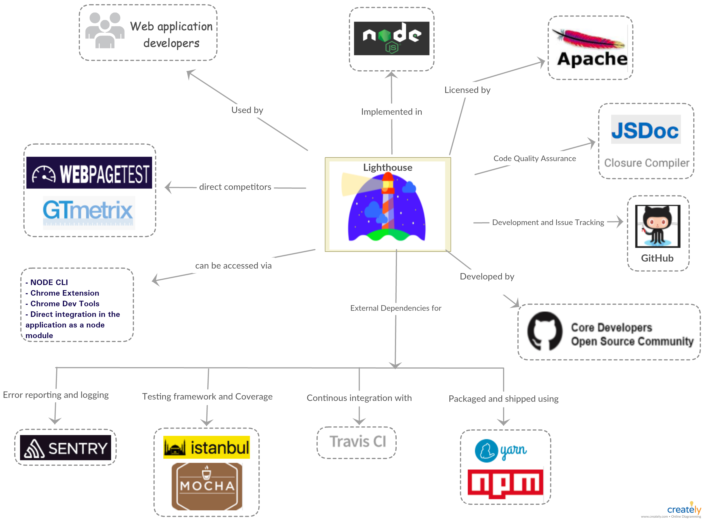
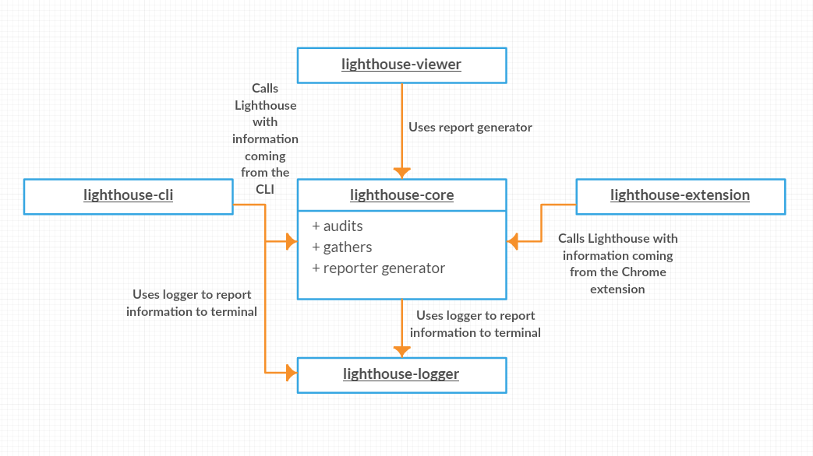
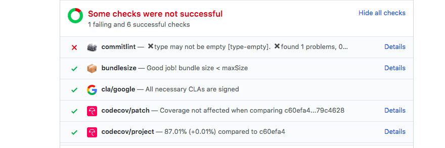
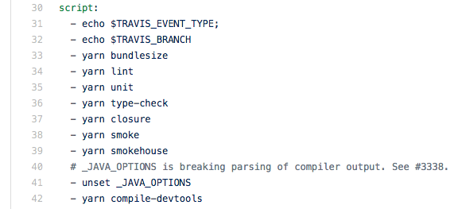
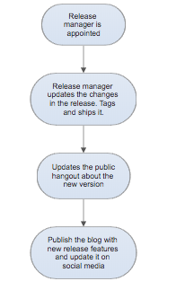
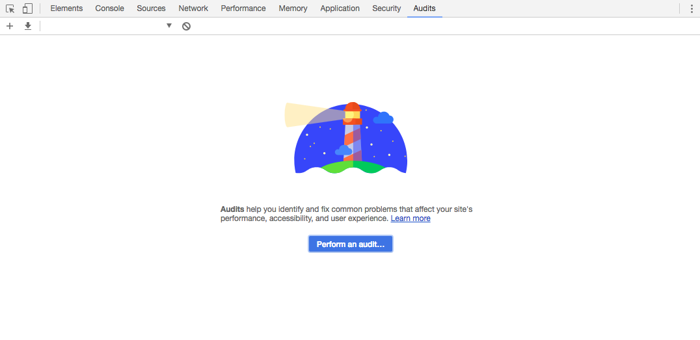
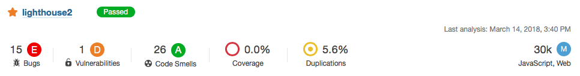

# Lighthouse 

By [Kanav Anand](https://github.com/anandkanav92),
[Nouri Khalass](https://github.com/nourikhalass),
[Ernst Mulders](https://github.com/ernstmul),
and 
[Michiel van Spaendocnk](https://github.com/mvanspaendonck) from TU Delft

## Table of Contents
1. [Introduction](#section-introduction)
2. [Stakeholders](#section-stakeholders)
3. [Context View](#section-context-view)
4. [Development View](#section-development-view)
5. [Deployment View](#section-deployment-view)
5. [Technical Debt](#section-technical-debt)
3. [References](#section-references)

## Introduction
Lighthouse is a tool that allows web developers to evaluate their website according to modern standards.
It analyzes web apps and web pages and collects performance metrics and insights on developer best practices.
The project was released by Google as an open source initiative to improve the quality of websites.

## Stakeholders
In order to determine the stakeholders of the Lighthouse project, we've looked at the contribution history on Github as well as their demo video of the Google I/O of last year. The most important group of people are the so called Lighthouse keepers. These are the top contributors of the project, and work for Google.

### Rozanski and Woods classifications
According to the classification scheme by Rozanski and Woods the Lighthouse stakeholders can be grouped as follows.

**Acquirers:** _Oversee the procurement of the system or product_  
That would be Google as owner of the project. Google invests the money that pays the salaries of the top contributors whom work for Google.

**Assessors:** _Oversee the system's conformance to standards and legal regulation_  
Lighthouse keepers, although they quite surely have a legal team behind them from Google.

**Communicators:** _Explains the system to other stakeholders via its documentation and training materials_  
Eric Bidelman and Brendan Kenny were on stage on the I/O conference talking about and explaining Lighthouse. If we look at the readme.md there are 44 contributors. Paul Irish, Patrick Hulce, and Sam Saccone were among the top of these 44.

**Developers:** _Construct and deploy the system from specifications (or lead the teams that do this)_  
The Lighthouse keepers as well as outside contributors.

**Maintainers:** _Manage the evolution of the system once it is operational_  
The Lighthouse keepers, and in particular Paul Irish.

**Suppliers:** _Build and/or supply the hardware, software or infrastructure on which the system will run_  
This is everyone that uses the plugin in their Chrome browser, or clones the repository and runs it themselves.

**Support staff:** _Provide support to users for the product or system when it is running_  
The Lighthouse keepers are keeping track of many of the open issues, and helping the people that are creating them. Also, the Lighthouse keepers are easily reached through Twitter.

**System administrators:** _Run the system once it has been deployed_  
Same as suppliers, so the users themselves.

**Testers:** _Test the system to ensure that it is suitable for use_  
The users and the Lighthouse keepers. Everybody that notices a problem while testing the tool can submit a bugreport.

**Users:** _Define the system's functionality and ultimately make use of it_  
Webdevelopers.

### Additional stakeholders
The classifications or Rozanski and Woods nearly cover all stakeholders. 
But there are more to come up with.
For Lighthouse we could identify **beneficials**, the people who browse the web and enjoy the better website because the developers used Lighthouse. Furthermore we could identify **Investors**, these are the people (or companies) who have a financial interest. For Lighthouse these investors would be Google and thereby its mother company Alphabet.

### Integrators
Integrators are the users who check the pull request. It's their task to keep the project stable and on track for the future roadmap. With lots of different contributors its hard to keep up with the quality standards. As described in [How do project owners use pull requests on Github?](http://www.gousios.gr/blog/How-do-project-owners-use-pull-requests-on-Github.html) there are a lot of different evaluation points to check before the pull request is merged within the master project.
Interesting enough Lighthouse also provides a commandline based version, which in fact helps integrators by automatically checking if their web project is still up to the set quality standards after pulling the request branch. So the team is helping integrators with their tasks (at least for web based projects).

In order to find the integrators we've looked at the commits to the [master branch](https://github.com/GoogleChrome/lighthouse/commits/master). In these commits we see the original author of the code, as well as the integrator. It is easy to spot the people we identified as most influential (see 1.7 for the full list). Paul Irish and Patrick Hulce arise as the most prominent integrators. Together they've done all pull requests.

When looking at the pull request you see that Paul and Patrick often discuss the impact of the change for the majority of the users. If it its a worthy fix, and doesn't break the usage for the user they'll go through with it. In some cases, you'll see that they'll even accept the pull request whilst knowing it will brake the application of some, such as [in this pull request](https://github.com/GoogleChrome/lighthouse/pull/4176).

### Relevant people
By analyzing the online community around Lighthouse we found that the following people were the most involved in the project.

|Name|Twitter|GitHub|Role|
|----|-------|------|-----|
|Paul Irish|@paul_irish|@paulirish|Google, Developer Tooling|
|Eric Bidelman|@ebidel|@ebidel|Google, Developer Relations|
|Brendan Kenny|@brendankenny|@brendankenny|Google, Developer Relations|
|Patrick Hulce|@patrickhulce|@patrickhulce|Google, Developer Tooling|
|Paul Lewis|@aerotwist|@paullewis|Google, Developer Relations|
|Sam Saccone|@samccone|@samccone|Android|
|Rob Dodson|@rob_dodson|@robdodson|Google, Developer Relations|

## Context View
The context view of the system describes the relationships, dependencies, and interactions between the system and its environment [[1]](#rf-context-view). This section describes the system's scope and responsibilities as well as relations with its environment consisting of users and external entities.

### System Scope and Responsibilities
Google created Google Lighthouse, as part of its effort to support progressive web apps, to establish standards for today’s web. It is an open-source auditing tool that helps developers improve the performance and accessibility of their web projects. It can be used by anyone for free to see how their website stacks up against Google’s high standards. The main responsibility of Google Lighthouse is to grade websites on the following criteria :
- Security: Is it being served from a secure origin?
- Accessibility: Does it work for all users?
- Perceptual Speed: Do users perceive it as fast? How your content loads is just as important as how fast it loads.
- Offline Connectivity: Will it load offline or in unreliable network conditions?

### External Entities
There are several external entities surrounding Lighthouse's environment. We first enlist them below and display them later as a context diagram.

- The organization that made the starting efforts: Google.
- The license of the project: Apache Licence 2.0.
- Programming languages used in the project: NodeJS.
- Tools used for code quality assurance: JSDoc, Closure Compiler.
- Tool used for Development and Issue tracking: GitHub.
- Tool used for error reporting and logging: Sentry.js.
- Testing framework and coverage tools: Istanbul.js, Mocha.js.
- Tools used for packaging and shipping the system: YARN, npm.
- Tools used for Continuous Integration: Travis CI.
- Users of the system: companies or individuals that build web applications and are interested in improving the performance and accessibility of their web applications.
- The development community: open source community.

    

Figure 1: Context View for Lighthouse

Using [Figure 1](#fig-context-view), we try to provide a brief overview of the environment of Lighthouse and how it interacts with these entities.

- **Lighthouse**
  Lighthouse is a tool used to test the quality of web applications. It was started by Google and is currently licensed under Apache Licence 2.0. It is a completely automated tool and requires only the URL of a web application.

- **Programming languages**
  Lighthouse is implemented using NodeJS and it requires the version to be Node 6 or higher.Along with YARN, npm is used as a dependency manager.

- **Quality assurance**
  Lighthouse puts a strong emphasis on the quality of the product as it is used for the sole purpose to test the quality of other web applications. Thus, multiple tools are used in order cover every nook and corner of the application. It depends on Istanbul.js and Mocha.js as its main testing frameworks. In addition to above-mentioned frameworks, Lighthouse also uses Sentry.js for reporting unexpected errors, that is, runtime exceptions.

- **Communication and Issue tracking**
  All the communications related to the development of lighthouse are done using GitHub. It follows a simple project board model with issues categorized under different projects. Apart from development communication, Lighthouse extensively uses Twitter to reach a wider audience for announcing the new release and other promotional events.

- **Continuous Integration**
  TravisCI is responsible for continuous integration of lighthouse. It is one of the key dependency of Lighthouse as being an open source project, it is very difficult to review every contribution effectively. Thus, TravisCI runs all the existing tests in the project on each pull request raised and it is merged only if it is backward compatible. It is necessary to ensure the stability of the system.

- **Users**
  Lighthouse is extensively used by companies or individuals that are in web applications development business. Many users include Lighthouse as a part of their CI to constantly monitor the changes affecting their web application quality.

- **Community**
  Lighthouse has a strong open source community consisting of active contributors. It has around 2687 forks on GitHub and with around 1800 closed issues.

## Development View

The development view of a project describes the architecture that supports the software development process [[2]](#rf-SSA).
This section will address what modules Lighthouse is composed of, what kind of standardized practices take place and how the project is structured.

### Modules

Lighthouse consists of multiple modules with some being dependant on others.
A small list of all modules present in Lighthouse will be given after which the module structure will be explained more in depth.

|Module Name|Description|
|-|-|
|`lighthouse-core`|Core part of Lighthouse which performs the tests and comes up with a report based on the results.|
|`lighthouse-cli`|Command-line front-end for Lighthouse that wraps `lighthouse-core` to be interfaceable via the command line.|
|`lighthouse-extension`|Packages `lighthouse-core` to be usable as a Google Chrome extension.|
|`lighthouse-logger`|Logger module used for information reporting to the console.|
|`lighthouse-viewer`|Application that visualizes Lighthouse reports.|

The main part of Lighthouse is `lighthouse-core`.
This is the part that performs the different audits and gives a score based on the success of those audits.
Both `lighthouse-cli` and `lighthouse-extension` use this as a back-end.
They wrap their input to allow it to be processed by `lighthouse-core`.
`lighthouse-core` comes with a `reporter` which generates a report based on the result.
This part is used by `lighthouse-viewer` to render the outcome of a Lighthouse evaluation to an HTML report.
Most of these modules rely on `lighthouse-logger` to report information to the console.
`lighthouse-logger` is a utility module that allows the logging of values in pretty colors and filter messages on priority.

    

Figure 2: Overview of the module system in Lighthouse.

To further explain the architecture behind Lighthouse we present you [Figure 3](#figure-architecture) which is a chart that is also used by the Lighthouse team [[4]](#rf-lighthouse-architecture).
It gives a high level overview of what happens during an evaluation.
The 'Lighthouse Runner' is part of `lighthouse-core`.
The topics _gatherers_ and _audits_ will be discussed in section about [standardized practices](#standardized-practices).
The website is evaluated in the Google Chrome browser.
Lighthouse uses a `driver` which interfaces with the `Chrome Debugging Protocol`.
This allows Lighthouse to gather the required information to perform its tests.
Communication between the Chrome instance and Lighthouse happens over a `websocket`.
The `driver` sends commands to the browser instance which allows Lighthouse to inject scripts and hooks to control how both the website as well as Chrome behave.

    

Figure 3. Overview of the architecture of Lighthouse.

### Standardized Practices

Because Lighthouse is a project of significant size it is important to standardize certain practices.
This in order guarantee that the project remains consistent throughout the development process.
In this section we will describe what parts of Lighthouse are standardized and why.

#### Audits and Gatherers

The goal of Lighthouse is evaluate a website and calculate a performance score.
Because of this Lighthouse has numerous _audits_ which test one particular aspect of a site.
An audit might, for example, be a test which evaluates how long it takes to load the website.
But, it is also possible that an audit tests a more abstract concept like if a site is optimized for search engines.

To execute these audits requires some knowledge about a website and how it behaves.
In the example of page load it is required to know how long it took the browser to load the page.
The required information for an audit is gathered by _gatherers_.
These gatherers fetch required information for the audits.

These two interfaces play a major role in the extendability of Lighthouse.
Again, Lighthouse is focused on evaluating websites in a variety of ways.
However, it might be the case that a developer wants to evaluate a website in a certain way which might not be relevant for other developers.
As such, it is possible to create your own audits and gatherers [[3]](#rf-SSA).
This gives the developer the ability to create their own tests and evaluate their website on their own criteria.
An added benefit is that because of the fact that audits and gatherers are standardized it is fairly easy to import the specialized tests from developers should the need arise.

#### Standardized Design

Lighthouse is open for contributions from external sources.
However, to ensure that the new contributions fall in line with the project there are some rules and standards that apply.

To ensure that all (new) code has a style that is consistent with the existing code base Lighthouse uses a 'linter' to validate the code.
The lint rules state what indentation type is used and what sort of statements are allowed.
For example, it is not allowed to use `console.log` statements.
Instead, developers should use `lighthouse-logger`.
These rules keep the code base consistent and clean.

To further streamline the contribution process Lighthouse has a `CONTRIBUTING.md` which states rules that contributors must follow [[5]](#rf-lighthouse-contributors).
Lighthouse uses [conventional commit](https://conventionalcommits.org/) for commit messages and pull requests.
A bot is then used to assert that all pull requests have a title according to the rules.
One important part for new contributors is that they sign the Contributors Licence Agreement (CLA).
If new contributors do not sign the CLA their contributions cannot be accepted into Lighthouse because of legal reasons.

### Codeline Organization

In this section we will describe how Lighthouse does testing and what its build process looks like.

#### Testing

Lighthouse testing is highly standardized and automated. As Lighthouse can be integrated with the client's application as a node module, testing becomes a priority to prevent the breakdown of client's application due to unexpected runtime errors in the Lighthouse code.

The testing process consists of two major components:

##### a) Testing framework:

Lighthouse used modular programming to develop the testing framework i.e each file contains tests related to the specific functionality and in cases where two or more functionalities are integrated, a new file is used. The main tool used for developing the testing framework is `Mocha.js`. `Mocha.js` tests run serially, allowing for flexible and accurate reporting while mapping uncaught exceptions to the correct test cases.

##### b) Continuous Integration:

Continuous Integration is a software development practice where members of a team integrate their work frequently. Each integration is verified by an automated build (including test) to detect integration errors as quickly as possible. Lighthouse uses `Travis CI`, a well-known service used to build and test software projects hosted on GitHub.

Lighthouse team makes sure that every line of code is covered and validated using automated tests. With every feature introduced to the system, there are test cases added as well, to make sure that all parts of the code are well covered. These pull requests are thoroughly reviewed, in addition to the automated GitHub checks(see [Figure 4](#figure-checks) Example GitHub checks), in order to prevent the breakdown of the system (See pull request, for [example](https://github.com/GoogleChrome/lighthouse/pull/4144)).

    

Figure 4: Example of GitHub checks.

To make sure the new functionalities integrates well with the older versions, Lighthouse team uses two levels of continuous integration. `Travis CI` runs tests on the commits you push to the repository. Each pull request triggers a minified and development build. And, `Yarn` is used to run all the test modules before releasing/shipping the code. It is done for every release to ensure that the vital parts of the systems are not corrupted.

    

Figure 5: Travis using Yarn to run tests on each PR.

#### Building

The Lighthouse team usually releases a new version every month, with occasional minor/patch releases if warranted. A release manager is appointed who is responsible for the release process shown in [Figure 6](#figure-release).

    

Figure 6: Release procedure used by Lighthouse.

The building process is done using two deployment scripts. The main difference between the two scripts is the visibility of the release. The canary release is done by slowly rolling out the change to a small subset of users before rolling it out to the entire infrastructure and making it available to everybody. Both the scripts use `Yarn` to download all the dependencies and running the test modules on the released version.

## Deployment view
As stated in Rozanski and Woods, the Deployment view focuses on aspects of the system that are important after the system has been tested and is ready to go into live operation [[2]](#rf-SSA). It describes the physical environment in which the system is intended to run. 

To run Lighthouse the user has three options:
1. within the Chrome DevTools
2. using the Chrome extension
3. using the Node CLI

All three options rely on the usage of (headless) Chrome. In essence Chrome is also part of Google, but since it is maintained by a different division within Google it would still be described as third party software.

### Chrome DevTools
This is possibly the easiest option to run Lighthouse. Since Chrome 60 Lighthouse is accessible from the DevTools. In the audit tab you will find a button to perform a complete scan for the site you are currently visiting. It uses the current website view to perform the analysis.

    

Using Lighthouse by from Chrome Devtools.

### Chrome extension
The Lighthouse team also released a Chrome extension. Installing the extension requires Chrome (obviously). After installation Lighthouse is directly available to perform tests on the current open webview, by clicking on the logo to the right of the URL bar.

    

Lighthouse Chrome Extension.

### Node CLI
The third option is the most advanced option and requires a little more steps to get it running. The CLI method relies on Node 6 to run, and can be installed by using npm (`npm install -g lighthouse`) or yarn (`yarn global add lighthouse`).
Running the tool is easily done from the command line: `lighthouse <url>`. There are many different options to set. One of the more interesting ones is the possibility to use the headless version of Chrome, which helps to use Lighthouse as part of an automated testing chain.

## Technical Debt

In this section, we will discuss technical debt and how it affects Lighthouse.
We will describe how Lighthouse suffers from both technical debt as well as testing debt.
In addition to that, we will address how these two topics have changed over time and how the team communicates about these topics.

### Technical Debt
The technical debt analysis has been performed in two different ways: automatically using software tools and by manually inspecting files. The automatic test was performed through the scanning tool from SonarQube. We've performed two checks. The first consisted of the entire Lighthouse repository. This resulted in 300 bugs, 6 vulnerabilities, 351 code smells and 18.6% duplications found in the project. The estimated technical debt by SonarQube was 8 days. However many of the issues were found in less critical parts such as the documentation. So for comparison, an analysis has also been performed on just the lighthouse-core part.

    

Analysis of Lighthouse using SonarQube.

The technical debt of the core part was estimated by SonarQube to be around 4 hours (3h on major items, 10min on critical items and 25min on minor items). However, the number of hours in itself isn't a good indicator on if the project is well maintained. The ratio between the technical debt and the time it takes for the entire code base to be built gives a better indication. For the Lighthouse-core part, the code base consists of over 30.000 lines of code, and hence the debt ratio, as calculated by SonarQube, is 0%. Which is impressive.

For the manual analysis, we checked the code with for violations of the SOLID principles. The Single responsibility principle is met. All classes are dedicated to specific functions, with a clear naming structure.
In the case Open/closed principle we take `lighthouse-core/audits/audit.js` as an example file. It is noticeable that the class can easily be extended with new functionality. All functions within the class are well defined and if required comments are made to clarify. The parameters are described and also the return types are stated. Hence the module is closed. So the file follows the Open/closed principle. This is true for all manually checked files.
The Liskov substitution principle can be checked by looking, for example, at the `lighthouse-core/audits/audit.js` file. This file is the parent file of all audits in the folder. Looking at its subclasses, we can conclude that none of them violate Liskov's substitution principle. All subclasses compute a valid override of the parent class.
The separation of all parent classes into useful parts also ensures that the code is valid according to the interface segregation principle. No class could be found that requires unnecessary other classes. Looking at the way the abstractions are set up, no violation of the dependency inversion principle could be found.

### Testing Debt

Code coverage is a measure used to indicate how much code has been covered by a test. Low coverage implies that the program has a high chance of containing undetected bugs. High coverage does not necessarily signify all actions will be correctly processed by the code, but at least it indicates that the likelihood of correct processing is good [[7]](#rf-testing).

Code coverage can be further divided based on the criteria explained below [[8]](#rf-cw).

1. Function coverage – Has each function (or subroutine) in the program been called?
2. Statement coverage – Has each statement in the program been executed?
3. Branch coverage – Has each branch (also called DD-path) of each control structure (such as in if and case statements) been executed? For example, given an if statement, have both the true and false branches been executed? Another way of saying this is, has every edge in the program been executed?
4. Lines coverage – Has each line in the program were covered by the tests?

| Release version | Modules | % Stmts | % Branch | % Funcs |  % Lines |
| ------------- |:-------------:| -----:|-----:|-----:|-----:|
| 2.9.1(latest)| lighthouse-cli       |     63.5 |    55.95 |       50 |    64.25 |
|              | lighthouse-core      |    97.89 |    93.18 |      100 |    97.78 |
|              | lighthouse-extension |      100 |      100 |      100 |      100 |
|              | lighthouse-viewer    |      100 |      100 |      100 |      100 |
| 2.6.0        | lighthouse-cli       |    33.78 |     9.88 |    11.11 |    33.96 |
|              | lighthouse-core      |    74.55 |    56.92 |    84.21 |    74.53 |                                  
|              | lighthouse-extension |      100 |      100 |      100 |      100 |
|              | lighthouse-viewer    |      100 |      100 |      100 |      100 |

Testing at the lighthouse is divided into four major modules i.e cli, core, lighthouse-extension and lighthouse-viewer. The result table presented above clearly reflects the importance given to testing at Lighthouse. All the modules, except lighthouse-cli, cover almost every line of code written for that specific module. On running coverage analysis on prior releases, we found out the testing debt in `lighthouse-cli` module was introduced during the release of version `2.6.0`. The main culprit file was found to be `sentry-prompt.js`. On further investigation, we found that `sentry-prompt.js` replaced the file `shim-modules.ts`, for which test cases still exists. Given the purpose of `sentry-prompt.js` is to ask user's permission to send runtime error report to Lighthouse, it seems no testing other than manual testing was done for this file.

Apart from the coverage, Testing time is another source of technical debt. The average testing time taken by Lighthouse to run all the tests was found to be around 1 minutes 8 seconds. It seems acceptable as a total of 937 tests were ran during that time covering ~91% of the total code.

### Communication about Technical Debt

In this section, we will address how the Lighthouse developers discuss the technical debt.
As will be seen, communication about technical debt can be divided up into two parts.
First, we will discuss how the Lighthouse team uses Github, and more specifically Github Issues, to discuss the technical debt.
After that, we will show how technical debt is denoted in the code base.

Like most discussions about Lighthouse, communication about technical debt happens through the use of Github Issues.
Technical debt is never mentioned directly but some of the issues that are raised are a direct result of technical debt.
Unfortunately, the Lighthouse team does not use special labels to denote issues related to technical debt.
This does make it more difficult to see what caused the technical debt.
Searching for pull requests which focus on solving technical debt gives more results.
There are a few pull requests where the term technical debt is directly mentioned.
However, there are no pull requests which directly mention that they fix the technical debt.

When looking using broader search terms like _refactor_ and _maintenance_ it is easier to find discussions about (problems caused by) technical debt.
Also searching for proposed architecture changes gives good examples of technical debt.
What follows is that while technical debt is not mentioned directly the problem is addressed and sometimes solved.

To denote technical debt within the code base the Lighthouse team uses different techniques.
Often they use `TODO`s as a way of signifying that a part of the code needs revising.
There are 28 `TODO` markers in the whole code base of Lighthouse [[9]](#rf-todo).
However, it is not clear if and when these `TODO`s will be fixed.
There is also no indication if there is a matching Github Issue.
Therefore it remains to be seen if these `TODO`s will actually be solved.

### Evolution of Technical Debt

In this section, we will describe how Lighthouse has dealt with technical debt over time.
Technical debt usually accumulates over a period of time.
Sometimes it is addressed directly and fixed intentionally.
It is also possible for changes to be made to the code base which results in technical debt being paid while not being the primary goal.
We will try to give a brief historic overview how Lighthouse has changed over time and how that has impacted its technical debt.

The first version of Lighthouse was released on 30-06-16 [[10]](#rf-releases).
This makes Lighthouse almost two years old.
In total 48 releases were made with the most recent version being version 2.9.3.
Many changes were made during the two year period and we are going to look at some of them to see how they impacted Lighthouse.

To look at how the Lighthouse project has changed over time we are going to analyze previous versions using SonarQube.
This will give an indication how the number of bugs, vulnerabilities and technical debt has changed.
Unfortunately, not every version of Lighthouse can be analyzed using SonarQube.
We will analyze releases starting from version 2.0 which was released on 30-06-17 [[10]](#rf-releases).
As before, we will only focus on the core part of Lighthouse to avoid including errors in unrelated parts of the code base.

What we found is that in all releases the amount of technical debt was very limited.
SonarQube found that the amount of technical debt was only a few hours.
This is a relativity low number with respect to the size of the project.
But the number of hours of technical debt does not indicate if the project is being maintained correctly.
As has been mentioned before, The ratio between the technical debt and the time it takes for the entire code base to be built gives a better indication.
With all releases, this ratio was 0%.

It follows that the amount of technical debt in Lighthouse is fairly limited.
While there are definitely instances where decisions from the past have a negative impact on future development the actual extend of these decisions is limited.
The project is not being held back by a huge amount of technical debt.
New additions to the project can happen organically and the code base changes over time to meet the needs of the developers.

## Evolution perspective
One of the great benefits of software is its ability to evolve very quickly. For Lighthouse this is very relevant, since web techniques are highly subjected to change. Since the [first commit by Paul Lewis](https://github.com/GoogleChrome/lighthouse/commit/c09a442f057469bff6e9a15bb26e78e4f7dc0af5) to the Lighthouse project in January 2016, Lighthouse is now currently at version 2.9.3.

### Timescale and Likelihood of Change
Thanks to the rise in popularity of the Progressive WebApps (PWA) the web landscape is changing. Web users expect a native feeling to web applications, as well as full functionality. Features that used to be dedicated to native smartphone apps (e.g. notifications, offline capabilities, hardware acceleration, etc.) are now moving to the web. New Javascript and CSS capabilities are developed to keep up with this trend, resulting in 3 different Chrome versions launched in March 2018 [[11]](#rf-chrome).  Being an automated web checking tool, Lighthouse needs to evolve continuously to stay relevant.  However not all changes are just related to the evolving landscape of the web, new features are continuously added to make the tool more convenient for the users. The focus for changes resolves around the four main audit categories:
1. PWA Checklist
2. Best Practices
3. Performance
4. Accessibility

It is safe to say that the timescale for changes is rather short, and the likelihood of changes is high.

### v2.0.0 and Operation Yaquina Bay
One and a half year after the first commit, Lighthouse v2.0.0 was released. A lot of work had been done. The first most visible one was the User Interface change. Making the results more clear by adding the now characteristic gauges, screenshots, filmstrips, sparklines, accessibility by sections and, pass and failures separation. Version 2.0.0 also contained the integration with the Chrome DevTools, making the tool easier accessible to many web developers.

Another important part of the 2nd version of Lighthouse is operation Yaquina Bay. The operation is named after the Yaquina Bay lighthouse which, like a fast webpage that you can see it load quickly from start to finish, is short enough that it doesn't take long to see the whole thing.

    

Yaquina Bay.

The goal was to speed up Lighthouse, or as Paul Irish put it: "I mean.. a performance tool should probably be performant. 😉". Nine issues were fixed,  resulting in  a good performance boost: a full run for cnn.com went from 169s to 50s (238% faster), and theverge.com went from 92s to 53s (73% faster).

The rest of the v2 update consisted of many fixed issues and added features. A short summary: Audits (14 commits), Metrics & Precision (17 commits), Plots (4 commits), CLI (3 commits), Testing (6 commits), Misc (12 commits), Docs (9 commits) and Deps (4 commits).

### Future evolution
Since the v2.0.0 release in August 2017 many more releases have been made bringing the current version to 2.9.3. In the issue tracker the 3.0 label is visible, and used by the team, so a new big release can be expected. 

### References
1. 

 The System Context Architectural Viewpoint, Eoin Woods and Nick Rozanski, http://www.artechra.com/media/writing/WICSA2009-context-view-paper.pdf
2. 

 Nick Rozanski and Eoin Woods. Software Systems Architecture: Working with Stakeholders using Viewpoints and Perspectives. Addison-Wesley, 2012.
3. 

 Creating custom audits, https://github.com/GoogleChrome/lighthouse/tree/master/docs/recipes/custom-audit
4. 

 Lighthouse architecture description, https://github.com/GoogleChrome/lighthouse/blob/master/docs/architecture.md
5. 

 Lighthouse rules for contributors, https://github.com/GoogleChrome/lighthouse/blob/master/CONTRIBUTING.md
6. 

 Lighthouse release process, https://github.com/GoogleChrome/lighthouse/blob/master/docs/releasing.md
7. 

 Brader, Larry; Hilliker, Howie; Wills, Alan (March 2, 2013). "Chapter 2 Unit Testing: Testing the Inside". Testing for Continuous Delivery with Visual Studio 2012
8. 

 Code coverage on Wikipedia, https://en.wikipedia.org/wiki/Code_coverage
9. 

 TODOs in Lighthouse, https://github.com/GoogleChrome/lighthouse/search?utf8=%E2%9C%93&q=TODO&type=
10. 

 Lighthouse releases, https://github.com/GoogleChrome/lighthouse/releases?after=1.1.2)
11. 

 Google Chrome Version History, https://en.wikipedia.org/wiki/Google_Chrome_version_history

