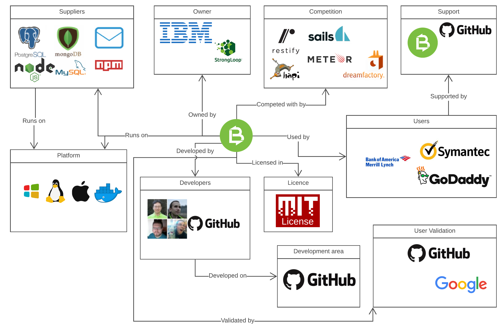
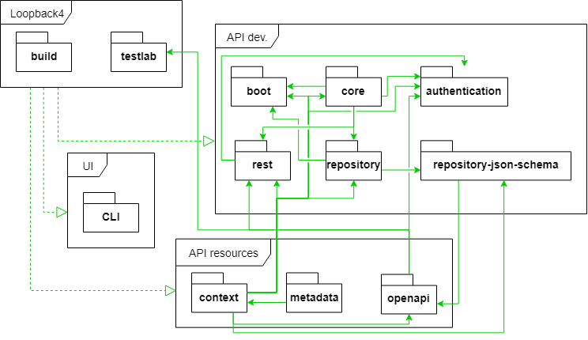
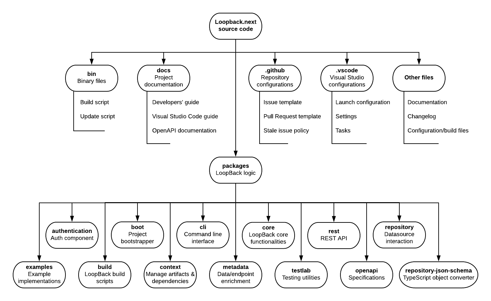
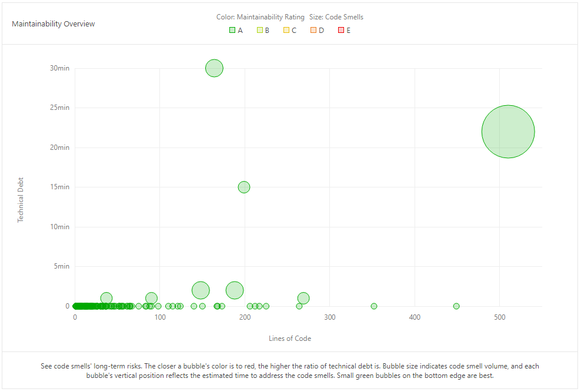
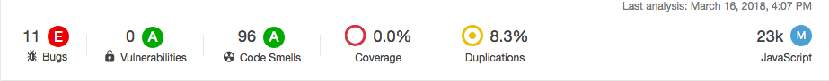
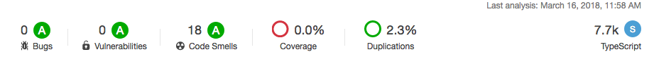

# LoopBack

Project by [Yann Rosema](http://github.com/ChampiYann), [Claudio Lazo](http://github.com/cblazo), [Wesley Quispel](http://github.com/Quispie) and [Joost Wooning](http://github.com/jwooning).

*Delft University of Technology*

## Abstract
LoopBack is a framework which allows for quickly creating APIs on existing databases.
A new version of LoopBack is expected soon, the development started in January of 2017 from scratch.
Since than the LoopBack team has tried to keep a clean and understandable codebase.
In this chapter we will analyze the architecture of the LoopBack project.
This also includes analyzing older versions of LoopBack to be able to understand why the LoopBack team has chosen to rewrite the entire project.

## Table Of Contents

* [Introduction](#introduction)
* [Stakeholder Analysis](#stakeholder-analysis)
* [Context View](#context-view)
* [Development View](#development-view)
* [Technical Debt](#technical-debt)
* [Information Viewpoint](#information-viewpoint)
* [Conclusion](#conclusion)
* [References](#references)

## Introduction
StrongLoop's LoopBack is an open-source Node.js framework that allows developers to easily build connective applications.
Through the command line interface, within minutes a skeleton for the application is created.
The program generates a REST API, has built in role-based access controls and automatically creates models (classes) and relations based on CLI input and it connects easily to data sources.

LoopBack is currently in the development state for version 4, or LoopBack4, the first release is expected June 2018.
LoopBack4 is rewritten from scratch therefore it gives us the perfect opportunity to find out why the StrongLoop team decided for this rewrite.
We will try to get a good insight in the architecture of LoopBack, for this we use the methods described in Rozanski & Woods (2012).
Since the codebase is relatively new (the development started in January of 2017) we expect that the project architecture is quite good.

## Stakeholder Analysis

To be able to understand the role of the stakeholders architecture in the development of LoopBack is fundamental. In order to have insights in the stakeholders and their roles, a stakeholder analysis is required. This is done according to the 11 stakeholder types of Rozanski & Woods (2012).

### Stakeholder types
Rozanski & Woods identify eleven stakeholder types and for LoopBack we also identify three other stakeholder types. 
An overview of these stakeholders is shown in table 1.

| Type  | Stakeholder   | Description   |
|---|---|---|
|*Acquirers* |IBM, StrongLoop management, founding developers (such as Raymond Feng) |The procurement of LoopBack was overseen by the developers who perceived a utility in its existence. |
|*Assessors* |IBM's legal department, System architects |IBM is responsible for legal regulations and the system architects for adherence to software standards.|
|*Communicators* |Developers, maintainers via GitHub and Jekyll |The people that maintain the documentation and the website are the main communicators. This is most often done by the maintainers. |
|*Developers* |Raymond Feng, Miroslav Bajtos and Ritchie Martori |The construction of the system from specification is done by a highly active team followed by less active contributors, further deployment is completed by the users of LoopBack. |
|*Maintainers* |Biniam Admikew, Diana Lau, Janny Hou, Simon Ho, Kyu Shim, Taranveer Virk, Yappa Hage and open-source contributors |Further developers that maintain LoopBack, create the documentation and debug it. |
|*Production Engineers* | - |As this software project has no production phase but only a development phase, there are no production engineers involved. |
|*Suppliers*|OS (Windows, MacOS, Linux), Github, Node.js, NPM amongst many other dependencies |LoopBack has many dependencies, which can all be considered suppliers. |
|*Support Staff*|Developers, contributors, IBM Support Portal |Support can be formal in the form of IBM's support or contacting the development team or more informal using third-party sources like StackOverflow. |
|*System Administrators* | Users |Since the users will be responsible for deployment, system administration will fall to them. |
|*Testers* |Developers, Users |Issues that are discovered can be disclosed on the repository. This means both users and developers are involved in testing. LoopBack also uses continuous integration. |
|*Users* |API builders for GoDaddy.com, Symantec, Sapient, et al. Also the end-users that use applications built using LoopBack|The users that define the system's functionality and ultimately make use of it. |
|*End users* | People who use an API created with LoopBack | These people want a consistent use of the API, which is conform the REST specification. |
|*Standardication organizations*| OpenAPI | OpenAPI is an industry standard for the design of REST APIs. loopback-next integrates the OpenAPI standard using multiple packages to make sure the rendered API complies with this standard. |
|*Tool providers*| Visual Studio Code | The loopback-next team plans on adding new tools that work with Visual Studio Code [^planned_features] making this software a stakeholder of the project. |

*Table 1.  LoopBack stakeholders sorted by type*

### Power Interest Grid
The power-interest grid in figure 1 maps certain stakeholders on a 2D-plane according to the power they have over the project and their interest in the project.
In the top right corner we see the developers of LoopBack who have the most power and the most interest in the success of the project. 

With a little less power and less interest, we have the maintainers who work on the software but need reviewing by the developers.
With again less power we have the contributors who write code which needs to be reviewed by the developers or the maintainers. 
IBM and its legal department have a similar level of power but less interest because LoopBack is software from IBM but as it is a big company, they have less interest in this project. 
The suppliers have (close to) no interest in the project as they do not play an active role in it, however they do allow the project to keep on living which means they have a non-zero amount of power over the project. 
The users have a high interest in the software and can, as a community, ask for changes, but as long as they do not become contributors, their power remains low. 
The IBM support portal has a similar amount of power to the user, because they can ask for changes in the software. However because they are part of IBM, LoopBack is not their main focus. 
Lastly, the competitors have a high interest in the software, but almost no power.

*Figure 1. Power interest grid of the LoopBack software.*

## Context View
This section describes all external entities (systems, people and organizations) that LoopBack interacts with.
The goal of this analysis is to identify dependencies and important relationships with its environment.
The entities are shown in the context view of figure 2.

### Scope & Responsibilities
LoopBack is a JavaScript REST API framework; its scope includes, but is not limited to, the following functions:
* LoopBack generates a REST API skeleton
* LoopBack allows for the customization of the REST API through a command line interface
* LoopBack has an API explorer (UI)
* LoopBack supports multiple JavaScript packages
* LoopBack provides role based access control
* LoopBack is compatible with multiple databases
* LoopBack allows HTTP request routing
* LoopBack generates standard models 

In order to narrow the scope of the software, the following functions specify what the software does do:
* LoopBack does not include a GUI
* LoopBack does not provide frontend services (other than the included API explorer)
* LoopBack does not limit the rate of accessibility

### External entities
Besides the identified stakeholders, many other entities surround LoopBack and can be of influence. They are divided into three categories: market, development and technology. 

1) Market

- *Owner*: StrongLoop, an IBM-owned company, is the company that created LoopBack. See the stakeholder 'acquirers' for more information.
- *Competition*: There are many other frameworks for the creation of REST/SOAP APIs, like Meteor, Restify, Dreamfactory, Sails, Hapi and many more. This means that LoopBack must keep innovating in order to stay in this market.
- *Users*:  The users can be any person or organization, for example GoDaddy, Symantec and Bank of America.

2) Development

- *Support*: There are many open source support channels like Gitter chat, GitHub, Google Groups and the LoopBack FAQ & Documentation. For enterprise clients (e.g. using API Connect) there's a professional support department.
- *Developers*: The lead developers (Raymond Feng, et al.) are in charge of the project. They decide to merge pull requests, what will be worked on next and what stays in the backlog. The GitHub community helps with maintenance and development.
- *Development area*: The project uses Git as a versioning system and GitHub for project management and as a Git controller.

3) Technology

- *Platform*: LoopBack is written in TypeScript and runs in Node.js. It is developed in accordance to OpenAPI, a standard for APIs.
- *Software dependency*: It is dependent of the Node.js package manager NPM for installing all dependencies, as the default LoopBack REST API already uses 500+ packages. As an API connects data sources to the web, LoopBack is also dependent of the software from the data source (MySQL, Postgres, MongoDB, Cassandra, etc.). NPM installs connectors for these data sources.
- *User validation*:  LoopBack has a default access control functionality which can be expanded with OAuth2 for using a Google/Facebook/GitHub account to access the API.
- *Distribution*: A LoopBack server can be deployed on Windows, Linux, OS X, Solaris and in Docker
- *License*: LoopBack has been given an MIT license for Open Source.

*Figure 2. The context view for LoopBack*

## Development View
The goal of the development view is to describe the architecture that supports the software development process (Rozanski & Woods, 2012). Large-scale software projects benefit from ordered codespace and standardized processes, providing maintainability, reliability and technical cohesion. The development view consists of 3 parts:

1. Module structure
2. Common design
3. Source code structure

### Module structure

The loopback-next repository is divided into packages. These packages represent the different modules present in the repository. The packages are managed by [Lerna][^lerna] and NPM scripts are used to work with Lerna.

The list of packages from [loopback-next/MONOREPO.md][^monorepo] is used as the modules of the system.  
This list can be separated in different groups of modules. We identified 4 groups:

* LoopBack4: these modules are used to build and test the code
* API development: these modules are used to create the API for which LoopBack is the framework
* API resources: these modules are used as resources and resource management for the build of the API
* UI: these modules are used for the user interface

How the modules are classified in these groups can be seen in figure 3. This figure also show the dependencies of the modules based on the NPM dependencies in `package.json` located in every package.

*Figure 3. Code module dependency (all openapi packages are categorized under 'openapi').*

The build package creates the LoopBack software.
It can be run by the testlab package which will build the code and test it afterwards. 
Once the software has been built, the user can run it by calling it from the command line. 
The user commands refer to code contained in the API development packages which, in its turn, refers to the API resources to customize the users product.

### Common design model

LoopBack4 is being designed with a YAGNI (*You Ain't Gonna Need It*) mentality, which entails that you design and build for what is needed at present and not in the future. Since there is a diverse group of people with different perspectives on API creation, focusing on the MVP (*Minimal Viable Product*) allows the team to address the root issues and build the absolutely necessary components first, before creating other requested features.

To analyze how LoopBack4 tries to achieve this developmental approach we use a common design model. This model consists of three parts according to the Rozanski & Woods, namely:

- *Common processing*, i.e. identifying tasks that benefit greatly from using a standard approach across all system elements.
- *Standard design approaches*, i.e. identifying how to deal with situations where implementations of a certain aspect of an element will have a system-wide impact.
- *Common software*, i.e. identifying the software that is used in a way that it can reduce development time and risk, and explaining why.

#### Standard design approaches

##### Coding standardization

Because LoopBack4 is developed by a large group of contributors, but a small group of developers decides which code makes it into the master branch, it is necessary to have a coding style to maintain code standardization and legibility. 

This [style guide](http://loopback.io/doc/en/contrib/style-guide.html) is provided on the LoopBack website. Examples of guidelines are the *prescription of variable declaration* (use of constant variables), *the use of arrow functions*, *using syntax-sugar for class declaration*, *using one argument per line*,  and *single line indentation of multiple-line expressions in return, if statements,  or multiline arrays*.

In addition, a [wiki](https://github.com/strongloop/loopback-next/wiki/Coding-style-guide) discussion took place regarding the case to be used in the code. The conclusion was to use kebab-case in names and dots to separate filenames from the file type (e.g. index.d.ts). This decision was discussed in [pull request #290](https://github.com/strongloop/loopback-next/pull/290) and should resolve problems with different case sensitive operating systems.

##### Software patterns

LoopBack4 is built using the [Model-View-Controller pattern](https://loopback.io/doc/en/lb4/LoopBack-3.x.html), "where code responsible for data access and manipulation is separated from the code responsible for implementing the REST API". 

An [example](https://github.com/strongloop/loopback4-example-microservices) for using this pattern is given, where the facade is the top-level service that serves the *account summary* API, which depends on three services *Account*, *Customer*, and *Transaction*. The facade only aggregates these three services and is independent from their functionality. Thus, it is possible to define APIs in the way that is required by the deployer; Data access and manipulation code is separated from code responsible for client side APIs. To create this, [decorators](https://loopback.io/doc/en/lb4/Decorators.html) or [controllers](https://loopback.io/doc/en/lb4/Controllers.html) are used.

### Source code structure

It is important to analyze the software on a low level (the source code and development processes), as mistakes on this level can muddy the interactions/dependencies between modules and commonalities of the design.

LoopBack is a complex piece of software, containing many dependencies. There is a lot of code, both JavaScript and TypeScript, and the source code doesn't even contain the required npm packages. This makes it important to structure the source code in an intuitive way.

##### Analysis

The source code of LoopBack is very organized. Clearly the developers designed this top down by creating modules (see section [Module structure](#ref_modstruct)) and sticking to it during development. As a result, the *packages* folder gives a good overview of the separate modules and their responsibilities. Figure 4 gives an overview of the source code.

*Figure 4. An overview of the source code structure.*

The *packages* folder contains the LoopBack logic. Most packages have the same structure: a source and test folder, an extensive `README.md` file and `index.ts/index.js` files. Using this template makes it easier for people to understand the commonalities of these packages.

##### Discussion

By having tests per package instead of one giant test folder, the source code is much more modular, flexible and easier to maintain. However, this gives the directory a higher tree depth, reducing understandability.

[Issue #836](https://github.com/strongloop/loopback-next/issues/836) brought the examples into the monorepo (*/packages/examples*). However, the *packages* folder is already substantially sized. We suggest to make a dedicated examples folder in the main project folder, as these have nothing to do with the actual LoopBack REST API logic in the *packages* folder, but just show how to get started or work with LoopBack4. (This has been proposed as [issue #1218](https://github.com/strongloop/loopback-next/issues/1218) , the developers acknowledged it and we have made [PR #1231](https://github.com/strongloop/loopback-next/pull/1231)).

### Development process
Since LoopBack4 is still in a development state (major version 0) there are many changes which break backwards compatibility. 
The development of LoopBack4 started in January 2017, the target for the first release is June 2018.

### Building
Because of the monorepo structure LoopBack uses, it is preferred to be able to test and build all packages at once.
For this exact purpose LoopBack uses [Lerna][^lerna] this is a tool to optimize workflow in JavaScript projects with multiple packages.
When building all the individual packages many first need to compile TypeScript files to JavaScript.
After this the building script detects which EcmaScript version it has to build to and transpiles this to the correct version if needed.
Finally the NPM builder actually builds the packages.

### Testing
To ensure the quality of code before committing LoopBack allows for testing using the [Mocha](https://mochajs.org/) testing framework and while it is not required to do test driven development, for all pull requests it is required to also add tests where necessary. To measure code coverage [Coveralls][^coveralls] is used, this also allows for a overview of how the coverage changes over time.

Guidelines that prescribe standard testing guidelines are mentioned in the [testing style guide](http://loopback.io/doc/en/contrib/style-guide.html#style-guidelines-for-tests). Some of the guidelines mentioned in this guide are:

- Using sandbox directories
- Email examples should use the `email@example.com` format
- Correct usage of hooks with for example `before` and `after` statements
- The layout of test files
- Callback function next line prescription
- Naming of files and functions

To test the project the `npm test` command is called which will build and then test the implemented functions.

### Use of GitHub
StrongLoop uses GitHub as the main communication channel.
For a structured use of GitHub they use the conventions listed below.

#### Milestones
StrongLoop uses the milestones for keeping record of a sprint backlog. 
They used to work with sprints of a week, but recently changes to monthly sprints.

#### Pull Requests
Pull requests are used to review code contributions, this happens with the following conventions.
First of all, for all pull requests there is at least one of the core developers which reviewed the pull request. 
Secondly, for a structured check for pull requests they have provided a checklist which should be passed for each pull request.
The checklist consists of (copied from GitHub): 
* `npm test` passes on your machine
* New tests added or existing tests modified to cover all changes
* Code conforms with the [style guide](http://loopback.io/doc/en/contrib/style-guide.html)
* Related API documentation was updated
* Affected artifact templates in `packages/cli` were updated
* Affected example projects in `packages/example-*` were updated

Furthermore there are continuous integration tools implemented which run on every pull request automatically they cover the tests, the code linter and more, some of these are required to merge the pull request.

##### Releases
Because of the monorepo structure, releases are separated per package. However, all packages are released at the same time.
It seems from the release timeline that there is no defined interval in which everything is released but it is approximately twice a week.
Since LoopBack4 has no real full release yet we can only look at LoopBack3 for this, but it seems they use the same kind of release cycle once the package is no longer in a development state.

#### Commit messages
For commit messages this project uses [Conventional Commits][^conv_commits] in combination with commitlint to enforce these conventions.
To simplify the use of conventional commits the use of [commitizen][^commitizen] is encouraged.
The point of this style of commit messages is that it is easy to work through the project history and that changelogs can be automated.

## Technical debt

Technical debt is a metaphor for an outstanding debt due to the implementation of technical solutions that are not maintainable or evolvable. The metaphorical debt consists of costs that have to be made to refactor the code in order to realize a consistent and maintainable solution (Cunningham, 1992).

loopback-next includes a linter, namely TSlint. This is a code analyzer that looks at bugs, formatting and programming errors. TSlint is highly customizable so the developers added their own rules to make sure the code follows their make up and utilization rules.  
For the completeness of the analysis, another tool is used to estimate the technical debt. The analysis done by [SonarQube](https://www.sonarqube.org/) reveals what was already expected: the code has very little technical debt.

*Figure 5. Technical debt analysis by SonarQube.*

Figure 5 shows the result of the SonarQube analysis. Each circle shows a code smell picked up by the analyzer. As can be seen all dots are green meaning the code smell's impact on the overall code is very small. After analyzing 7.7k lines of code, SonarQube only found 18 code smells with a total of 1h14min of technical debt (SonarQube measures the amount of technical debt in the estimated time it takes to fix it). The technical debt mostly consists of unnecessary cast and some functions with a different name but the exact same content.

While trying to write a fix for a tech debt issue involving moving some packages out of the monorepo, we came across some potential technical debt. Here we find a piece of code download the whole loopback-next repository from github again in order to have an up to date version of the examples. This code feels messy and not finished, as the comments in the file mention assumptions on folder and file names which - if they fail - break the code's functionality. Also, in order to access an example package, the code downloads all packages which takes a long time and is not needed. This piece of tech debt was found in the JavaScript part of the loopback-next code which in general does not appear to be as well written and commented as the TypeScript part of the code. 

Finally, the amount of technical in the project can best be analyzed with the help of the issues on GitHub. In the repository, the team has included a label `tech-debt` with which they label issue they consider being a technical debt. The team also uses a label named `refactor`. Under this label, the developers class issues that involve refactoring but are not considered to be technical debt. This is, for example, the renaming of file to match a company wide format or remove node modules that are not used anymore and are thus dead code.

### Impact
Identified technical debt is: unnecessary casts, functions with a different name but the exact same content and some small code smells. The impact of this identified technical debt is reduced future extensibility, whereas the developers want to create a highly extensible application. However, there is so little technical debt due to the redesigning of LoopBack with technical debt in mind, that the impact is low.

As mentioned on their [website](http://loopback.io/doc/en/lb4/Crafting-LoopBack-4.html#why-loopback-4), one of the reasons for rewriting LoopBack4 from scratch, is the accumulation of technical debt in LoopBack3. This manifested itself mostly in the form of opposition to scalability. LoopBack3 was becoming more and more diverse and needed to account for a lot of variability which resulted in backwards compatibility issues and multiple pieces of code with the same action making it more complex to handle.

## Testing debt
In this section, technical debt due to inadequate testing is identified. 
For this we will look at the testing coverage provided by [Istanbul][^istanbul]. 
We will also make some recommendations according to our findings.

We did a sample test to check the quality of the tests and it seems that every test does indeed test something new.
However, we found some tests were it has some TODOs in the testing code, thus the tests could still be improved.

### Testing coverage
For testing the coverage LoopBack uses Istanbul, this works in combination with the [Mocha][^mocha] testing framework.
Unfortunately the versions for both Istanbul and Mocha differ for LoopBack3 and LoopBack4, but we assume the results can be compared throughout these versions.
We compared the testing coverage for both LoopBack3 and LoopBack4, see table 2 for the results.
It is clear that the coverage for LoopBack4 is better then for LoopBack3, however this makes sense knowing that LoopBack4 has a much shorter lifespan.

| Coverage   | LoopBack3 | LoopBack4 |
| :--- | ---: | ---: |
| Statements | 88.4% | 97.3% |
| Branches | 80.3% | 89.7% |
| Functions | 88.0% | 95.0% |
| Lines | 90.1% | 97.4% |

*Table 2. Test coverage from both active versions of LoopBack.*

All the individual packages for LoopBack4 also contain tests which can be individually tested with `npm test`.
These tests for the packages are divided into three different kind of tests: unit, acceptance and integration.
However not all packages contain all kind of tests, this might also be a good improvement for this project.

### Testing Packages

Since LoopBack4 has a clear distinction between the different packages we can also compare the results within LoopBack4.

For example, the test coverage of the small-sized `example-rpc-server` package is only around ~62 percent, while the similarly sized `repository-json-schema` package is fully covered by testing.  The most crucial `core` package is covered for 97 percent, with 99% of the statements, 95% of the branches, 96.8% of the functions and 98.9% of the lines covered by testing. Overall Coveralls reports a test coverage of around 96% for the entire codebase.

There are two packages which are different from the others when it comes to testing, these are the cli and build package.
The cli package does not show up in the coverage results by default, the tests do however run.
What can be seen in table 2 for the cli package is what we found out ourself, the coverage is lower then other packages, but still pretty high.
We think it would be an improvement to include the cli package in the testing coverage to keep track of the coverage for the package.

The other different package is the build package, the tests for this package are about 20 integration tests.
However, these integration tests are not run by `npm test`, therefor these are not tested as often as the normal tests.
We think these tests should be included in the normal testing procedure, since we could not think of a reason not to.

### Coverage timeline
For coverage reporting LoopBack uses [Coveralls][^coveralls], on the Coveralls website you can find the report for [loopback-next][https://coveralls.io/github/strongloop/loopback-next]. 
In the report for the loopback-next repository you can see a bump about half a year ago, from the commit message for that particular bump you can see that the testing framework dependencies were updated.
A dip somewhat further shows a commit where the support for nodejs6 was dropped.
It seems that for LoopBack4 the coverage has always been quite good, thus there is no real need for improving the coverage by adding more tests.

## Evolution of technical debt

*Figure 6. Overview of the `loopback-next` repository at the latest commit.*

### Scope Definition
LoopBack4 has only been in development relatively shortly as a rebuild of the previous LoopBack3, this is since 9 January 2017.
As such, there have not been as many commits or files as other more mature projects.
The files that are committed the most are the package files which maintains the version numbers for dependencies in building of the application. 
However, since these files have no importance on the code quality these are omitted from this analysis. 
Instead, a short overview of the 20 most committed files in `loopback-next` can be seen along with the amount of active days these files have been changed. 
This table was obtained by using the `git effort` command.

|**Class**|**Amount of Commits**|**Active Days**|
|---|---|---|
|packages/core/src/application.ts|37|33|
|packages/context/src/inject.ts|33|22|
|packages/context/src/resolver.ts|33|22|
|packages/core/src/index.ts|30|25|
|packages/context/src/binding.ts|30|22|
|packages/context/src/context.ts|28|22|
|packages/context/test/unit/resolver.test.ts|24|16|
|packages/context/src/index.ts|24|20|
|packages/context/test/unit/context.ts|23|20|
|packages/authentication/test/acceptance/basic-auth.ts|23|18|
|packages/repository/src/legacy-juggler-bridge.ts|19|17|
|packages/context/test/acceptance/class-level-bindings.ts|19|17|
|packages/context/test/unit/binding.ts|18|17|
|packages/rest/src/rest-server.ts|15|14|
|packages/repository/src/decorators/model.ts|15|13|
|packages/rest/test/acceptance/routing/routing.acceptance.ts|14|13|
|packages/metadata/src/decorator-factory.ts|13|12|
|packages/context/src/resolution-session.ts|13|7|
|packages/repository/test/unit/decorator/model-and-relation.ts|12|11|
|packages/core/src/server.ts|12|10|

*Table 3. Comparison of activity in the different packages.*

It must be noted that the most commits take place in relatively few files, where only ~64% (394/616) of all files have had more than one commit in `loopback-next`. 
If we compare this statistic to `loopback` we have ~72% (175/243) of all files that have seen more than one commit.

The amount of commits for the `loopback-next` repository for the last year can be seen in the figure below. What can be seen is that the density of commits have picked up since January 2018.

*Figure 7. Last year's commits to `loopback-next`*

### Evolution of code

Since LoopBack4 is in active development, the analysis of the quality of the code of both versions 3 and 4 may be of interest.  
As such, we use SonarQube to look into both versions to see how both versions compare to each other. 
This said, since LoopBack4 is in active development and the quality of code may not be indicative of the final releasable product.

*Figure 8. The quality of the code of LoopBack3.

*Figure 9. The quality of the code of LoopBack4.

Since LoopBack4 is a redesign of LoopBack3 there are changes in which the code is organized, which will have an effect on the comparison.
When comparing both the quantity of the code is also important to take into account since LoopBack3 contains ~23k lines of code while LoopBack4 only contains ~7.7k lines of code so far.
What can be seen is that the rating of the code smells by SonarQube is considered good (*with an A-rating*), with a less than 5 percent as the ratio of the technical debt.

## Information viewpoint
The main point of LoopBack is to provide information from a data source to an API.
Because LoopBack only provides a way to distribute information it can delegate many information distribution problems to data providers.
Issues like physical database separation, large data volumes and backups are also handled by the data source.
To make sure LoopBack will not block on any requests which might take a long time in the data source, LoopBack uses asynchronous functions and promises where possible.

### Information structure and content
Because the data for LoopBack is very dependent on the application it is hard to define a structure for the information.
What we can do is specify some edge cases for which LoopBack should still be able to handle this data.

LoopBack must be able to handle information that is:
* Heavily used
* Changed very often
* Distributed across several data sources  

We first need to establish what is considered the information or data LoopBack4 is handling. This is were we run into our first problem; LoopBack4 does not handle a lot of data because it simply provides the tools for the user to build the REST API that handle the data.  
However, as LoopBack4 provides examples of REST APIs and as the tools do eventually allow the user to handle the data from a database, we will analyze the information flow of a basic REST API created using LoopBack4.

### Information flow
As APIs are tools to make information stored in a database accessible to applications, the general data flow is set between an application and a database in both directions (read and write). LoopBack4 provides the tools to create the translation from application requests to the database. As the API created is highly customizable, so are data manipulations the LoopBack4 user wants to put in place. The general idea however is to format the data coming from both sides (application and database) and transport it to the other side.  
In order to perform this translation LoopBack4 allows the user to create a connector, this piece of code creates TypeScript functions that map the desired behavior to the database language. It then uses a 3rd party package to connect to the desired database. The connector is part of a DataSource which is a LoopBack identifier for a place where data can be retrieved. Multiple data sources make up a Repository, it is eventually from this repository that the data is accessed by Controllers which manipulate or just present the data to the application.  
Data is converted into Models when traveling through the API. These models are user defined and translated to JSON schemas. At the end the JSON is shown to the application according the OpenAPI specifications. The dataflow is shown in figure 10.

*Figure 10. Dataflow of database information from and to the application.*

### Data quality
Similarly to what has been established before, the data processed by LoopBack4 is only passed through to the application. Furthermore, all functions created by LoopBack4 are designed to be adapted and personalized by the user, therefore the data quality is mainly determined by the user's code.  
However, LoopBack4 provides some data quality assessment in the form of promises. The code contains modules that that work with promises meaning that some pieces of code promise a certain data type to other pieces of code. This way the code does not misbehave down stream.

## Conclusion
In this chapter we have analyzed the architecture of the open-source project LoopBack. 
To do this we analyzed the project from different viewpoints. 
We found that StrongLoop is a company with experienced developers and maintainers who learned from mistakes that were made in LoopBack3.
With this new version of LoopBack decisions about package structure and conventions were made beforehand.
Because all these structure decisions and conventions are written down, they can be enforced by CI tools and integrators, therefore the `loopback-next` repository is very organized and will probably stay that way.
We also found that because the structure and code is very clean the amount of technical debt is quite low for such a large project.

## References

Rozanski, N., & Woods, E. (2012). *Software systems architecture: working with stakeholders using viewpoints and perspectives*. Addison-Wesley.

Cunningham, W. (1992). The WyCash portfolio management system. *ACM SIGPLAN OOPS Messenger*, *4*(2), 29-30.

[^conv_commits]: https://github.com/strongloop/loopback-next/blob/master/docs/DEVELOPING.md#commit-message-guidelines
[^commitizen]: https://www.npmjs.com/package/commitizen
[^lerna]: https://lernajs.io/
[^mocha]: https://mochajs.org/
[^monorepo]: https://github.com/strongloop/loopback-next/blob/master/MONOREPO.md
[^istanbul]: https://istanbul.js.org/
[^coveralls]: https://coveralls.io/
[^about]: https://strongloop.com/about/ 
[^ibm_press]: https://www-03.ibm.com/press/us/en/pressrelease/47577.wss
[^planned_features]: http://loopback.io/doc/en/lb4/FAQ.html#what-features-are-planned-
