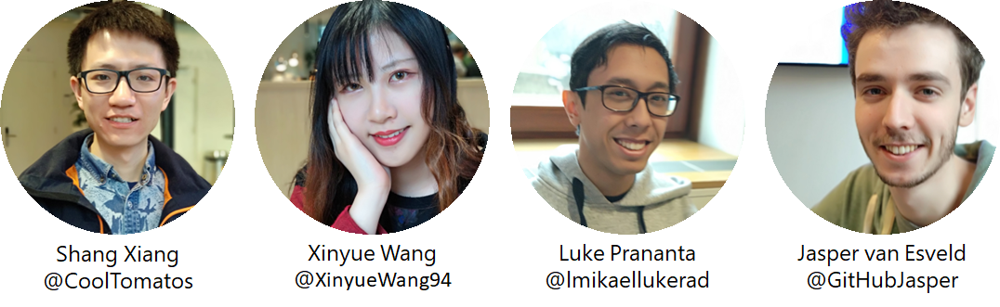
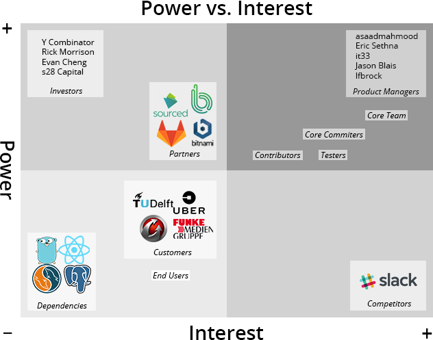
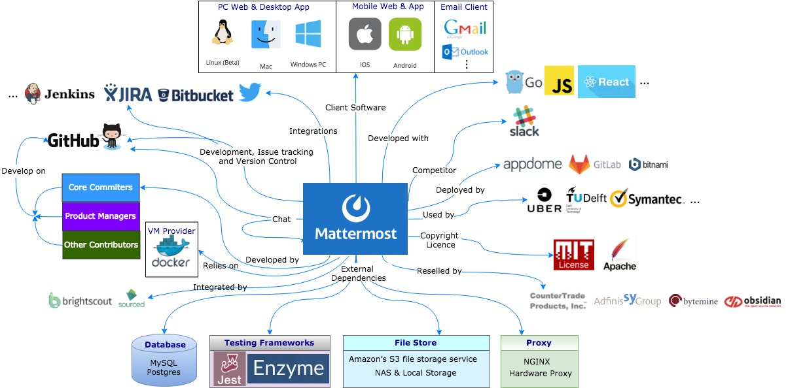
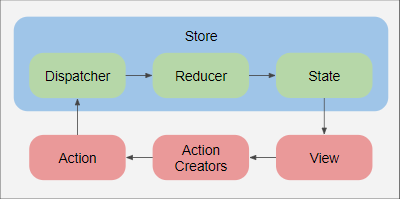
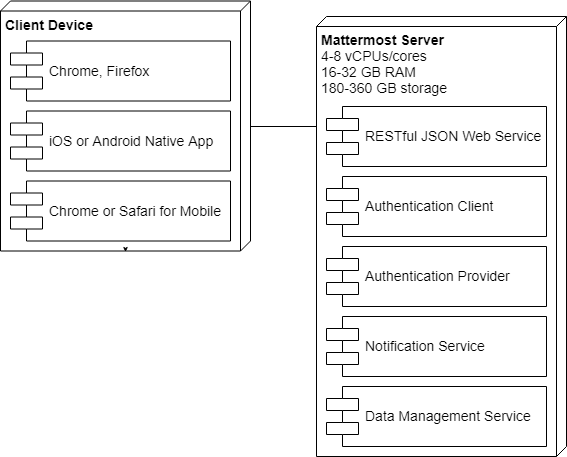
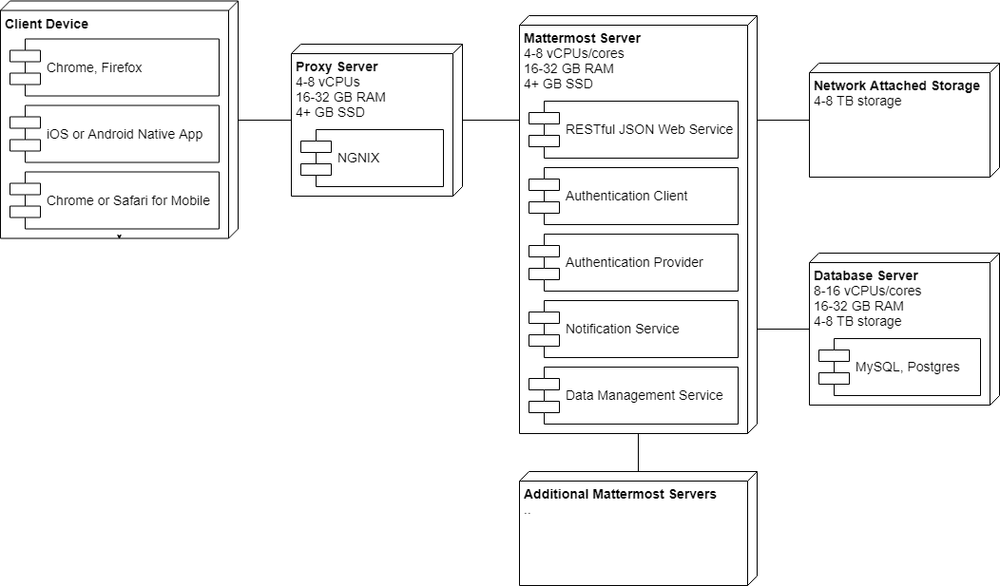
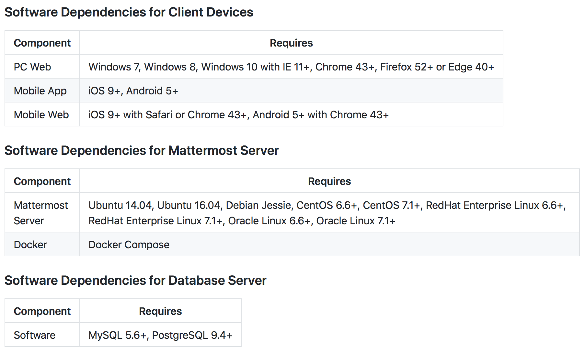
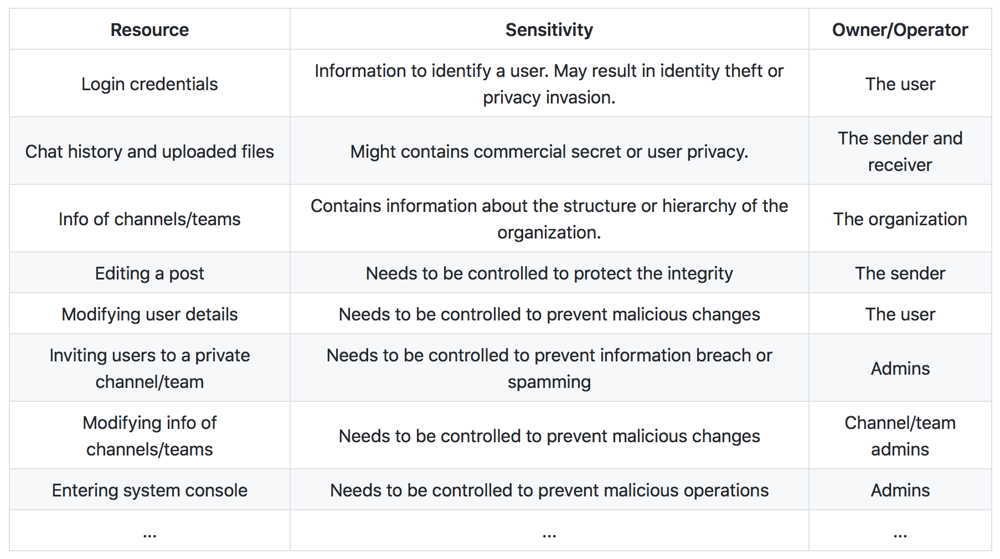
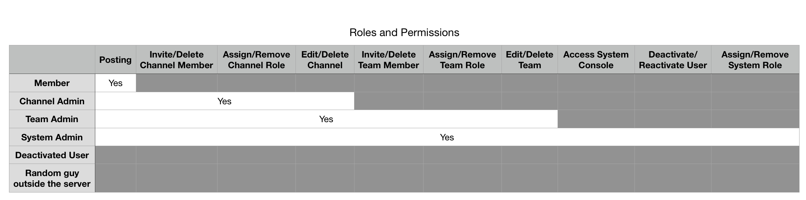

# Abstract
Mattermost is an open source, cloud-based and self-hosted Slack alternative. The company came to realize the limitations and restrictions of Slack when they adopted it as their messaging service in 2014. This is when they decided to build their own messaging software, Mattermost.
In this chapter we analyse the software architecture of Mattermost by looking at the stakeholders, the context view, development view, deployment view, security perspective and technical debt as defined by Rozanksi and Woods [[1]](#book1). We find out that Mattermost has a well organized development process and is currently in the process of repaying technical debt by moving the web app to Redux.

# Table of Contents

1. [Introduction](#intro)
2. [Stakeholders](#stake)
3. [Context View](#context)
4. [Development View](#dev)
    1. [Module Structure](#module)
    2. [Release Cycle](#cycle)
5. [Technical Debt](#debt)
    1. [Identifying Technical Debt](#identify)
    2. [Code Coverage](#cov)
6. [Evolution of Technical Debt](#evo)
7. [Deployment View](#deploy)
8. [Security Perspective](#sec)
9. [Conclusions](#conc)
10. [References](#ref)

# <a name="intro">Introduction</a>
The world of team collaboration tools and messaging services has long been dominated by Slack. It has been the dominant service ever since its start in 2014, but the service is set back by limitations due to its proprietary nature and it only available as a Software as a Service (SaaS). 

Enter Mattermost, an open source self-hosted Slack alternative. The company behind Mattermost came to realize the limitations and restrictions of Slack when they adopted it as their messaging service in 2014. This is when they decided to build their own messaging software. Mattermost entered the market with the promise of being free from the shackles of privately owned Slack servers. The open source nature makes it accessible for the community to contribute and makes it transparent for clients and the general public.

The open source nature of the project has given us the opportunity to analyse and contribute to this project. In this chapter we give our analysis of the Mattermost software by look at views and perspectives as defined by Rozanksi and Woods [[1]](#book1). We will focus on the webapp portion of Mattermost as this is the part we contributed for. We will look at the stakeholders involved, followed by a context view of all external entities. Next we look at the development view of the project, which looks at the development process and the architecture of the web app. We look into the technical debt of the project and how it has evolved throughout the development. The final sections takes a closer look at the deployment view and security perspective of the project. We conclude our analysis in the final section.

# <a name="stake">Stakeholders</a>

Various stakeholders are involved in the development of a project. For the Mattermost project we can classify several different stakeholders. The classification scheme is defined by Rozanski and Woods [[1]](#book1).

## Stakeholder Classes

### Acquirers
The interest of the acquirers are rooted in the value of money the product provides as well as the direction of the company and product. The Mattermost project has several [acquirers](https://about.mattermost.com/company/) in the form of investors, which include the following organisations and people: [Y Combinator](http://www.ycombinator.com/), Rick Morrison, Evan Cheng and [Spectrum28](https://www.s28capital.com/) [[11]](#abou11). 

### Assessors
 We assume Mattermost Inc., the company who started the Mattermost project, assesses the system's conformance to standards and legal regulations.

### Communicators
Product managers communicate a large portion of the concerns of the end users to the designers and engineers. The marketing and sales team communicates with clients and enterprises and are the ones to announce new releases of Mattermost.

### Developers
[Staff developers](https://docs.mattermost.com/process/developer.html) and product managers from the Mattermost core team are responsible for the bulk of the development. 

### Maintainers
The Mattermost project is maintained by staff from Mattermost Inc. and contributors from the Mattermost community. 
The localization team appoints a maintainer for each language translation, the full list of maintainers can be found in the [documentation](https://docs.mattermost.com/developer/localization.html).

### Suppliers
The client is responsible for providing the adequate hardware to operate the system. 
Mattermost Inc. provides [guidelines](https://docs.mattermost.com/install/requirements.html) for hardware requirements and setup.

### Support staff
Staff from Mattermost Inc. and community contributors provide support for Mattermost. 
For enterprise-grade collaborations, Mattermost Inc. provides additional commercial support in the form of [Enterprise Edition Support](https://about.mattermost.com/support/). 

### System Administrators
The client controls the operation of the system, they are the system administrators of their own deployed system. 
Mattermost Inc. provides instructions and [guides](https://docs.mattermost.com/guides/administrator.html) for users who are responsible for running the system.

### Testers
The Mattermost core team include QA testers that work closely with staff developers [[13]](#staf13). 
Mattermost community members can participate in the testing of development branches.

### Production Engineers 
The Mattermost team does not have designated production engineers, instead this task is relegated to staff developers.

### Users
Users are concerned about the functionality and scope of the system and represent the majority of the Mattermost community [[14]](#comm14). 
Users also include [companies and organizations](https://about.mattermost.com/success-stories/) which are in enterprise-grade collaboration with Mattermost [[15]](#succ15). 

## Additional Stakeholders

### Contributors
Contributors are part of the Mattermost community and provide contributions for the Mattermost project.
Several individuals have been recognized as [core committers](https://docs.mattermost.com/developer/contribution-guide.html), a group of trusted individual contributors. 

### Mattermost Partners
Mattermost provides [partner programs](https://docs.mattermost.com/process/partner-programs.html) to allow third parties to sell the Mattermost system or services related to Mattermost, to customers. 
Three different partner programs are offered, based on the type of service the third party provides for customers. 
  * Mattermost Authorized Partner Program, for one-time resale transactions to customers via a fullfilment partner
  * Mattermost Value-Added Reseller Program, for on-going resellers who provide support in local language and timezone. Examples of resellers are CounterTrade, Adfinis SyGroup and bytemine.
  * Mattermost Deployment Solutions Partner Program, for organizations who can automate the deployment and maintenance process of Mattermost systems. Examples of deployment solution partners are Bitnami, GitLab and AppDome.

A full list of certified Mattermost partners can be found on their [website](https://about.mattermost.com/partners/).

### Competitors
Mattermost has one main competitor, [Slack](https://slack.com/). Slack is a unique stakeholder; as a competitor it has the power to influence changes to Mattermost, but they can also be an inspiration for new features and ideas. Development of Slack is followed closely to mimic features or keep the quality of Mattermost on par.   

## Power vs. Interest Grid

 **Figure 1** - Power vs. Interest grid for Mattermost

Through the power vs. interest grid we can quantify the involvement of the stakeholders. 
Power is related to the influence the stakeholder has on the decision making of the system. 
Interest is related to the interest the stakeholder has on the direction of the system. 
We can identify how the various stakeholders are involved in this project, by putting them in one of the four quadrants.

At the bottom left quadrant we observe stakeholders that monitor the system. 
These include customers, end users and system dependencies. 
They do not exert much power over the system and only expect the system to function properly. 

The top left quadrant contain stakeholders that exert a high amount of power. 
Investors are necessary for the funding of the project and must be kept satisfied in order for funding to continue. They usually do not meddle with the decision making for the system and thus their interests are low. 
Partners are in a similar position, but their interests are higher because the system is directly involved in their line of business, thus they must also be kept informed about future developments.

Looking at the top right quadrant, we have stakeholders that manage the system closely. This quadrant contains stakeholders that are involved in the development of the system, such as contributors, core committers, staff developers and the product managers. 
The product managers have the highest power and interest, their interest in the system is to improve the system; they have the final word on every decision made on the system.

Lastly we identify the stakeholders in the bottom right quadrant, the stakeholders that keep themselves informed such as competitors like Slack. 
Slack keep themselves informed about the development of Mattermost, for their systems must be kept on the same level of quality for them to compete. 
They do not have direct influence on the decision making of the system, their power is low.

# <a name="context">Context View</a>

## System Scope and Responsibilities

Mattermost has a well defined scope for their system. During the [design process](https://docs.mattermost.com/process/design-process.html), the Mattermost team discusses what should be part of the scope for the new version. The [main scope](https://docs.mattermost.com/overview/product.html#mattermost-editions) for Mattermost's current version includes the following capabilities:

- Support one-to-one and group messaging, file sharing and unlimited search history
- Provide native apps for iOS, Android, Windows, Mac, Linux
- Support threaded messaging, emoji and custom emoji
- Provide highly customizable third party bots, integrations and command line tools
- Support integration via webhooks, APIs, drivers and third party extensions
- Easily scalable from dozens to hundreds of users
- New improvements released every two months
- Support 14 languages include U.S. English, Chinese (Simplified & Traditional), Dutch, French, German, Italian, Japanese, Korean, Polish, Brazilian Portuguese, Russian, Turkish, and Spanish

## Context Diagram

 **Figure 2** - Context View for Mattermost

## External Entities and Interfaces

- The software is offered under either an [MIT Licence](https://www.mattermost.org/licensing/) or an [Apache License v2.0](https://www.mattermost.org/licensing/)
- Mattermost is used by high profile companies and institutions [[11]](#abou11) such as Uber, TU Delft, Symantec, Samsung, Wargaming.net etc. 
- Mattermost also has integrations for various services such as [Bitbucket, Jira, and Jenkins, etc.](https://about.mattermost.com/community-applications/)
- Mattermost is developed by community contributors, core commmiters, staff developers and product managers 
- Communication is done through their own Contributors Mattermost Channel, forums, GitHub and Jira 
- Docker provides a virtual machine for Mattermost servers to run and test on
- Mattermost is mainly developed in Go and ReactJS
- Mattermost [client software](https://docs.mattermost.com/deployment/deployment.html#user-experience) includes a desktop app, web app and native mobile app
- Mattermost has an [email service](https://docs.mattermost.com/deployment/deployment.html#email-client) that uses Gmail, Outlook etc.
- Mattermost uses database systems such as [MySQL and PostgreSQL](https://docs.mattermost.com/deployment/deployment.html#data-stores)
- [NGNIX](https://docs.mattermost.com/deployment/deployment.html#proxy) or hardware proxy servers can be configured  for Mattermost servers
- Mattermost supports local file storage, MAS (Mobile App Services) or [Amazon S3](https://docs.mattermost.com/deployment/deployment.html#file-store)
- Mattermost uses testing frameworks like [Jest and Enzyme](https://grundleborg.github.io/posts/react-component-testing-in-mattermost/)
- Partners like Brightscout and Sourced Group provide Mattermost system services
- CounterTrade and Adfinis SyGroup, etc. are resellers of the Mattermost system
- Mattermost works with deployment solution partners such as Bitnami, GitLab and AppDome

# <a name="dev">Development View</a>

## <a name="module">Module Structure</a>

For the module structure we focus our attention on the webapp portion of Mattermost. The webapp is implemented with ReactJS. React is an architecture and an UI library that allows construction of reusable and encapsulated UI components. React is declarative, meaning that components can be built without touching the Document Object Model. The webapp originates from a legacy application that was written in JavaScript and HTML. The webapp uses a react-router library to allow Mattermost to be a single-page web application while still providing the navigation and appearance of a regular website.

The webapp architecture contains several modules which are listed below [[6](#reac6)].

  * `components` are React Native components which provide the bulk of the content for the webapp. The React components also define the routes for the React-Router.
  * Flux uses multiple `stores` to contain the data used to run the webapp. Redux only uses a single `store`. 
  * `utils` provides general utility for the webapp, similar to `utils` in the server.
  * `actions` are any sort of logic that will result in the manipulation of a store state
  * `selectors` are the methods used to retrieve data from the state of the store
  * `dispatcher` is used to broadcast payloads to registered callbacks.
  * `reducers` takes an action and an application state to perform state transitions, this module is unique to Redux.

### Flux and Redux
The interaction between the modules is designed with Flux, a pattern that defines how React components performs actions and retrieve data in an one-directional flow. 
Flux was implemented at a later stage of development, after the webapp was built with React. 
The interaction between the modules and how Flux is applied is illustrated below [[2](#flux2)].

Redux is an library that builds on the Flux pattern which will Flux in its entirety in the near future. 
While similar, it has a few key differences such as the use of a single store to maintain a single source of truth, and the use of reducers to purely transition between states. 
These differences are also the greatest benefits of Redux.
The webapp is currently being transitioned into Redux, but most of the webapp components such as server interaction and storage interaction are already implemented. The Redux flow and interaction between components as described by Mattermost is shown below.

## <a name="cycle"> Release Cycle</a>

The Mattermost system is developed in an iterative way. 
It is built, tested and released regularly.
On the 16th of every month, a new compiled version is released under a MIT license.
So far the latest released version is [v4.7.2](https://docs.mattermost.com/administration/changelog.html?highlight=release#release-v4-7).

Regarding the configuration management, Mattermost is mainly managed on GitHub and the releases are published and controlled on GitHub.
New features and bug fixes are tracked and added through Jira tickets. Tickets are prepared for every release, they're put in the pull request queue and are merged when they are approved.

The Mattermost core team has a concrete and unique development process. It draws ideas from Software Development Lifecycle approaches, such as Agile and Scrum.
The whole process starts 15 work days prior to the release day until 10 work days after the release day.
During the whole process, there are multiple parties from Mattermost involved, among which are the release manager, product manager, developers, logistic teams, quality assurance, marketing team, build team and project leads. Each of them are responsible for different tasks of the release.
The following list shows the process of the integrating, testing and building of Mattermost. 

* **Integration**: Mattermost does the integration at the beginning of release process.
The developers prioritize reviewing, updating, and merging of pull requests for major features 15 days prior to the release day and finish merging the major features 12 days prior to the release date.
The whole team will hold meetings to review the status of the remaining pull requests left to merge. 

* **Test**: After the cut-off of integration, Mattermost executes a lot of tests to decide which major features will be included in the release.
Tests are written and updated in the Release Testing spreadsheet.
Tests are mainly done by QA (quality assurance) and are scheduled on 11, 8, 7 and 2 days prior to the release day.
These tests are mainly executed in Selenium IDE and the tests results are recorded in the Release Testing spreadsheet.

* **Build**: The building process starts 8 days prior to the release day, when the Release Candidate is cut. 
The master branch is tagged and branched and "Release Candidate 1" is cut according to the Release Candidate Checklist. 
Pull requests for bug fixes are reviewed and merged during release candidate testing and new candidate builds are cut accordingly.
The CI (Continuous Integration) servers are updated to release branch and the translation server is locked to the release branch. 
Two days prior to the release day, they tag a new release (e.g. 1.1.0) and run an official build which should be essentially identical to the last release candidate. 
The release candidates are deleted after the final version is shipped and the release branch is consequently merged into master. 
The CI and translation servers are updated back to the master.

### <a name="i18n">Internationalization</a>
The release cycle for internationalization or localization is different from the rest of the system.
Quality levels are defined for each language [[10]](#loca10) to ensure that the final release is of high quality: 
- Alpha quality level translations is defined as translations that have not yet reached Beta level.
- For the Beta quality level, 90% of the translations must be verified by a Mattermost expert and a target language expert.
- The Official quality level has all of the translations verified by a Mattermost expert and a target language expert. The target language must also have at least one official [reviewer](https://docs.mattermost.com/developer/localization.html) assigned by the Mattermost team who maintains the target language. The target language must also have been in use for at least 3 full release cycles.

# <a name="debt">Technical Debt</a>

## <a name="id">Identifying Technical Debt</a>

In this subsection we identify the technical debt in the Mattermost project. 
For this analysis we will focus on the webapp portion of Mattermost. 
We will apply several methods to analyse the technical debt, including the use of automated analysis tools as well as manually looking through the code. 
Due to the size of the codebase we will only manually look at the code for specific areas. We also look at potential design debts and architectural debts.

### <a name="id-1">Code Debt</a>

Mattermost uses the [ESLint](https://eslint.org/) linting tool to enforce standards in JavaScript code formatting. 
The `.eslintrc.json` in the root directory contains the configuration for the ESLint tool.
We run ESLint and other code analysis tools through the WebStorm IDE by Jetbrains. 
After running a code inspection using WebStorm IDE, we observe ESLint reporting 617 errors. 
Taking a closer look we discover several code smells.

Firstly, there are issues with code line length. 
The maximum amount of lines is set to 450 lines, and files such as `utils.jsx`, `sidebar.jsx`, `audit_table.jsx` and `user_settings_notifications.jsx` exceed this limitation.
For example, the `utils.jsx` file contains 1329 lines of code, which we can clearly identify as a bloater. 
Looking through the files, we observe either too many functions in a single file, or functions that are way too long. 
For example, in `audit_table.jsx` there is a function `formatAuditInfo` which is over 300 lines long. 
It would be in the developer's best interest to split up the existing long methods into smaller ones for this would improve clarity and scalability.

Next up we observe errors in regards to cyclomatic complexity. The ESLint configuration file sets the maximum tolerable complexity to 10, and there are several functions that violate this threshold. Looking at the violations, we observe functions with a cyclomatic complexity between 11 and 20. These are harder to maintain, but should not be an immediate priority for refactoring or redesign. However, a refactor can definitely make the code more clear and open for future changes.

Most of the rest of the errors are about the liberal use of magic numbers. This is a code smell that the developers are not bothered with, as the violations are very numerous. While refactoring the magic numbers is an option to consider, the sheer number of magic number violations makes it not a straightforward or easy process. We believe that any work put into refactoring magic numbers does not necessarily improve the productivity for future changes.

### <a name="id-2">Design Debt and Impact</a>

To look for design debt we look for design smells. These arise from poor design decisions that make the design fragile and difficult to maintain.
Looking at the history of the Mattermost project, we see several periods of time where design debt could have built up. 
The Mattermost webapp started as a legacy project built on JavaScript and HTML. 
They first adopted React and later down the line adopted Flux. 
This decision has caused design debt that is now in the process of being repaid.

#### From Flux to Redux

The developers are currently working on moving from Flux to Redux. 
This is an ongoing effort of removing old code and switching to newer code. 
An example of this is the removal of the old Flux stores and replacing it with a single Redux store.

Pure React components that use Redux get their dependencies passed in through the props attribute, while Flux requires them to be imported.
Meaning they no longer have extensive dependency chains, or direct access to data sources.
This allows for easier mocking, making unit testing a component in isolation a trivial task. 
Our contributions to Mattermost included [migrating](https://github.com/mattermost/mattermost-webapp/pull/989) a component to be pure and use Redux.
Before the migration the component was not covered by any test, afterwards the component was much easier to test is covered for 86%. 

#### Future Goals

The developers are fully aware of the implications of technical debt, and are careful with major refactoring of code. 
The developers maintain a [list](https://docs.google.com/spreadsheets/d/1f3oGV-8GnE3iVTlrliSMepf4C-7kIAoBn27s59hgPVM/edit?usp=sharing) of future improvements some of which are related to reducing the technical debt. 
An example of this is the removal of JQuery, since it doesn't interact well with React and the API. 
Their main goal with refactoring is to make code easier to test, which in turn should mean less bugs.

## <a name="cov">Code Coverage Analysis</a>

So far, there are 145 test suites composed of 944 separate tests, targeting on 145 elements, and accordingly 413 Jest snapshots as the standard test output.
A simple code coverage run gives us the following table, indicating what percentage of the source code has been covered with the provided test scheme.

### Module Coverage Statistics

| Modules      | Files Covered | Lines Covered |
| ------------ | ------------- | ------------- |
| `selectors`  | 5             | 54%           |
| `reducers`   | 8             | 53%           |
| `utils`      | 24            | 43%           |
| `plugins`    | 3             | 30%           |
| `stores`     | 17            | 27%           |
| `client`     | 2             | 16%           |
| `actions`    | 23            | 13%           |
| `components` | N/A           | N/A           |

Redux `reducers` and `selectors` are the most well-covered modules of the project.
They are well tested mainly because of the simplicity of Redux, and that currently the team is going through the process of moving from Flux to Redux, thus all newly wrote components having corresponding test suites.

On the contrary, the other modules are poorly tested, much less lines covered, because they are either rather complicated or old, comparing with newly evolving Redux modules.
Take the module `actions` for example, it holds all Flux actions where the majority of the logic of the webapp takes place. 
The same goes for `stores` which holds all the Flux stores.
The low coverage shows that there is a large debt that is being repaid by moving to Redux.

### Component Coverage

As for the `components` module, it should be broken down further to talk about the statistics, given that there are currently hundreds of components.
About half of the components are fully tested, with a coverage over 85%, and about one third of the components are not tested at all.
This has to do with the transition to Redux.

# <a name="evo">Evolution of Technical Debt</a>

Mattermost is concerned with technical debt and has shown to put in effort to repay this debt.
The origin of Mattermost has a play in how the technical debt build up.
Mattermost used to go by the name SpinPunch, a HTML5 game studio.
The first version was not designed to be a Slack alternative but a way to reach gamers.
Due to internal problems with proprietary messaging apps they planned to use it for their own company communications.

The webapp and server were not originally designed to support the features it currently has.
The webapp was built on a legacy application using JavaScript and HTML. 
In addition, the webapp and the server were initially not separated, but part of the same repository.
It was only later that these two portions were separated.
This in turn reduced the technical debt for both the server and the webapp, as the separation made both aspects easier to maintain.
This also meant that certain parts had to be completely rewritten to maintain a simple and effective architecture. 
In 2015 the webapp was rewritten using the Flux pattern.
The Flux pattern has a few advantages, namely:
 - A clear structure
 - A clear data flow
 - Easy to add new components
 - Per component testing

This was a step in the right direction, however to further simplify the webapp a different method could be used: Redux.
The main difference being that Redux uses one store, while Flux uses multiple stores.
Transitioning has started, and a lot of components are now pure Redux components.
This transition has been divided into smaller tasks to receive aid from the community.
Smaller tasks have the additional benefit of avoiding big code changes which could cause problems for people maintaining a fork.
This prevents technical debt from building up and allows a smoother transition from Flux to Redux.

# <a name="deploy">Deployment View</a>
The deployment view provides an overview on aspects of the system after the system is ready for deployment. It defines the hardware the system needs to operate, as well as the network requirements, and the software that is mapped to the various runtime elements [[1]](#book1).

## Runtime Platform Model
The runtime platform model is the core of the deployment view. We provide the runtime platform model for the team edition as well as the enterprise edition.

### Mattermost Team Edition

Note that the optimal configuration for the Mattermost Server can vary by the amount of registered users. The runtime platform displays the setup for 1000 to 2000 users. Other set ups are found in the [documentation](https://docs.mattermost.com/install/requirements.html).

Only a single machine is needed to deploy the team edition, cutting down on deployment costs and complexity.

### Mattermost Enterprise Edition

The Enterprise edition has its hardware set up for high availability and scalability. The hardware needed for the Enterprise edition is beefy and provides capacity for up to 20000 registered users and a peak of up to 4000 concurrent users. 

For high availability mode, additional servers can be added. High availability mode provides better concurrency and provides more options for back-up and recovery.

## Technology Dependency Models

# <a name="sec">Security Perspective</a>

Security is a top concern when it comes to a messaging service, given that it deals with tons of user information.
It is even more so for team messaging services, like Mattermost, handling the internal communication of an organization or a company, which may involve commercial secrets worthy of millions.
Security matters at Mattermost and we decide to take a look at the project from this perspective.

## Sensitive Resources

Almost everything is considered as sensitive, from information like login details to operations like inviting new members.
Here we give a table of resources we think important and the reason why.

There is much more to be listed, like the using habit of a user can be exploited to impersonate him or invade his privacy.
The interest of stakeholders can be harmed from various angles by compromising sensitive resources.

## Security Policy

Mattermost secures things by categorize users into different roles.
The following table displays what these roles are and their permission levels.

Admins can set the channel/team open to invitation, otherwise only admins can invite new members.
Users can be deleted from a channel or a team but not from the server.
They can only be deactivated to prevent compromising the integrity of message archives from happening.
And the Admin roles are specific for that specific Channel or Team, meaning that one Team Admin might be nobody in another team.
The actual access permission model is more complicated than the table because System Admin can manage separate permissions from anyone.
It is a hierarchy structure with roles at higher positions also have the permission of lower position roles.

## Security Implementation

One thing worthy of mentioning before walking down the security implementation of Mattermost is that, the server of Mattermost is deployed on the organization's local network, behind the private firewall.
So a large part of the responsibility of security falls onto the organization itself.

Besides the shield of the private firewall, Mattermost also performs a few practices to ensure the security of the service.
It supports TLS encryption using AES-256 with 2048-bit RSA on all data transmissions between Mattermost client applications and the Mattermost server across both LAN and internet, to prevent eavesdropping.
Encryption-at-rest is available for messages via hardware and software disk encryption solutions applied to the Mattermost database.
And to protect against brute force DDoS attacks, the organization can set rate limiting on APIs, varied by query frequency, memory store size, remote address and headers.
Session length, session cache and idle timeout are all configurable to comply with the internal policies of the organization.

As for recovery, the Mattermost team has published a [guideline](https://docs.mattermost.com/administration/backup.html) for administrators to tackle backup and disaster recovery.
It provides a `High Availability Mode` while deploying to allow fast automated recovery from a component failure.

## Evaluation from the Security Perspective

Though Mattermost touts its concern for privacy and safety as a selling point against its competitors, there are a few things of the project, that are questionable.

For example, to enable end user search and compliance reporting of message histories, Mattermost does not offer encryption within the database.
Mattermost also stores a complete history of messages, including edits and deletes, along with all files uploaded.
Even if the user deletes a post or a file, it only disappears from the interface but stays in the database.
Though it is understandable from the perspective of protecting integrity and non-deniability, it can instead be a problem for user privacy.

Another problem of Mattermost is that it depends too much on the private network.
For example, the team made a deliberate decision to show "Your password is incorrect" when wrong password is entered, which can be considered as a information leakage and can be exploited by the attacker.
The team [argued](https://github.com/mattermost/docs/issues/885) that if security was of top concern, then the service should be deployed on a private network.

# <a name="conc">Conclusions</a>

Our journey with the Mattermost team is extremely pleasant as they are very community friendly.
Deeply involved with the community, that's how they maintain the momentum and prosperity as a small team, and on the other hand, that's also a big challenge.
Luckily the team has established an effective way of developing and managing the project.
The project is well organized as they have a clear roadmap, of how the structure of the project is supposed to be, in mind.
Though some debts were made during the earlier days of Mattermost, they are acting actively to repay them by moving from Flux to Redux.
With people's growing awareness of privacy protection, Mattermost is surely going to earn a larger part of the pie with its ability to deploy the server locally.

# <a name="ref">References</a>
<a name="book1">[1]</a> N. Rozanski & E. Woods. *Software Systems Architecture: Working with Stakeholders Using Viewpoints and Perspectives.* Addison-Wesley Professional, 2012.   
<a name="flux2">[2]</a> "facebook/flux: Application Architecture for Building User Interfaces." Internet: https://github.com/facebook/flux [Mar. 5, 2018]    
<a name="intr3">[3]</a> "Mattermost Dev Talk - Introduction to Codebase & Architecture." Internet: https://youtu.be/Q4MgnxbpZas [Mar. 5, 2018]    
<a name="serv4">[4]</a> "Mattermost Dev Talk - Server Application Layer." Internet: https://youtu.be/rU6-xSV6dTI [Mar. 5, 2018]   
<a name="loca5">[5]</a> "Mattermost Dev Talk - Localization." Internet: https://youtu.be/cVRmzXjpp7Y [Mar. 5, 2018]  
<a name="reac6">[6]</a> "Mattermost Dev Talk - ReactJS." Internet: https://youtu.be/8dB2_29TtNo) [Mar. 5, 2018]  
<a name="buil7">[7]</a> "Mattermost Dev Talk - Building a Webapp Component." Internet: https://youtu.be/MRmGDhlMhNA [Mar. 5, 2018]  
<a name="conf8">[8]</a> "Mattermost Dev Talk - Adding a Config Setting." Internet: https://youtu.be/hVLRVPnNeaw [Mar. 5, 2018]  
<a name="rele9">[9]</a> "Release Process &mdash; Mattermost 4.7 documentation" Internet: https://docs.mattermost.com/process/release-process.html [Mar. 5, 2018]  
<a name="loca10">[10]</a> "Localization &mdash; Mattermost 4.7 documentation" Internet: https://docs.mattermost.com/developer/localization.html [Mar. 9, 2018]   
<a name="abou11">[11]</a> "Company - Mattermost." Internet: https://about.mattermost.com/company/  
<a name="cont12">[12]</a> "Contributors to mattermost/docs." Internet: https://github.com/mattermost/docs/graphs/contributors  
<a name="staf13">[13]</a> "Staff Developers — Mattermost 4.8 documentation." Internet: https://docs.mattermost.com/process/developer.html  
<a name="comm14">[14]</a> "Mattermost Community — Mattermost 4.8 documentation." Internet: https://docs.mattermost.com/process/community-overview.html  
<a name="succ15">[15]</a> "Success Stories – Mattermost." Internet: https://about.mattermost.com/success-stories/ 