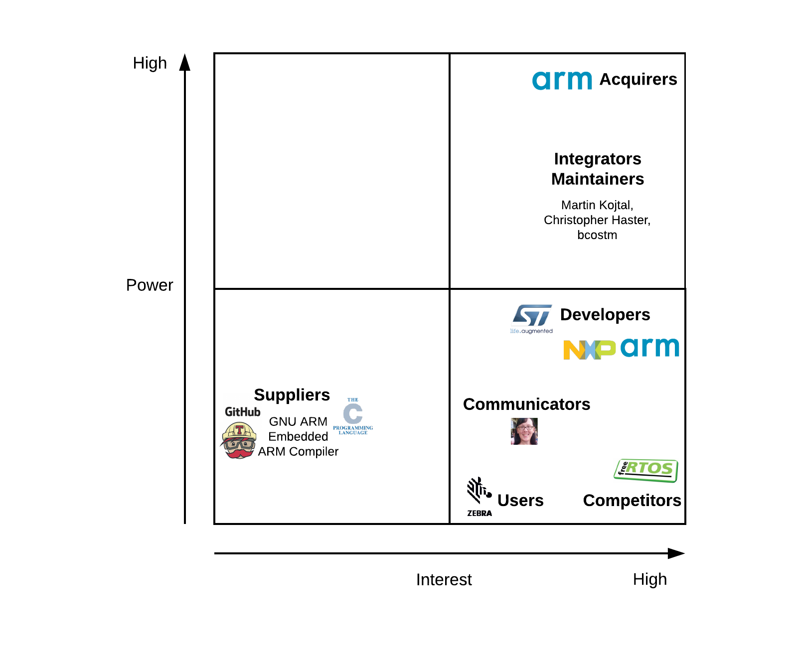
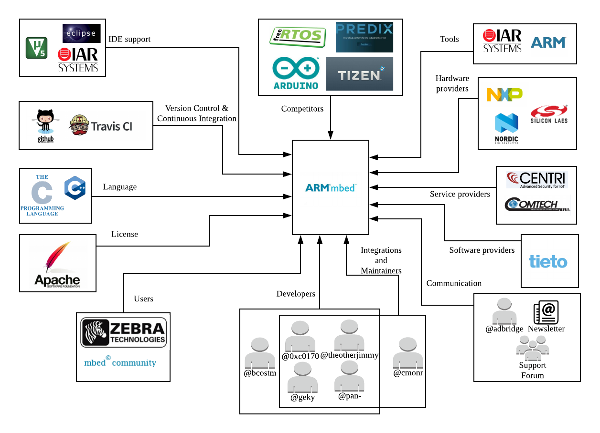
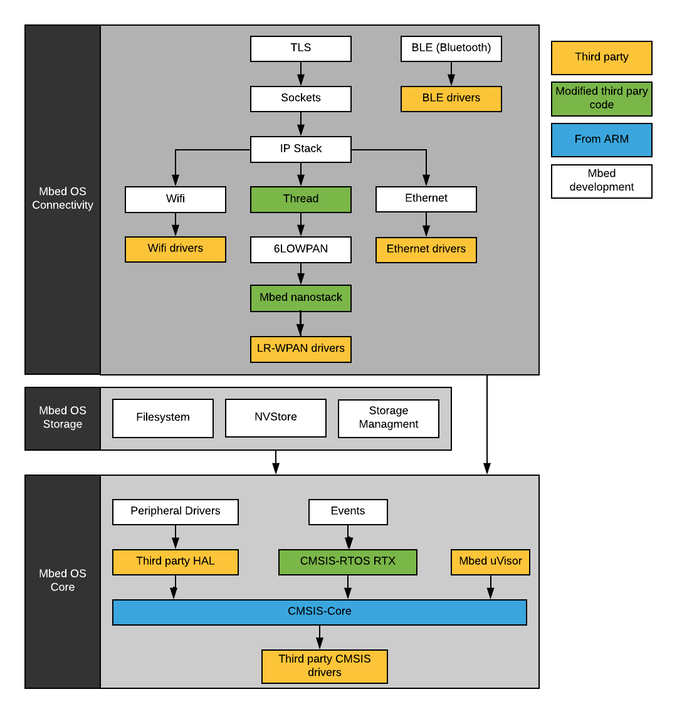
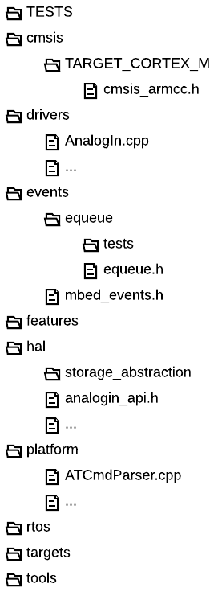
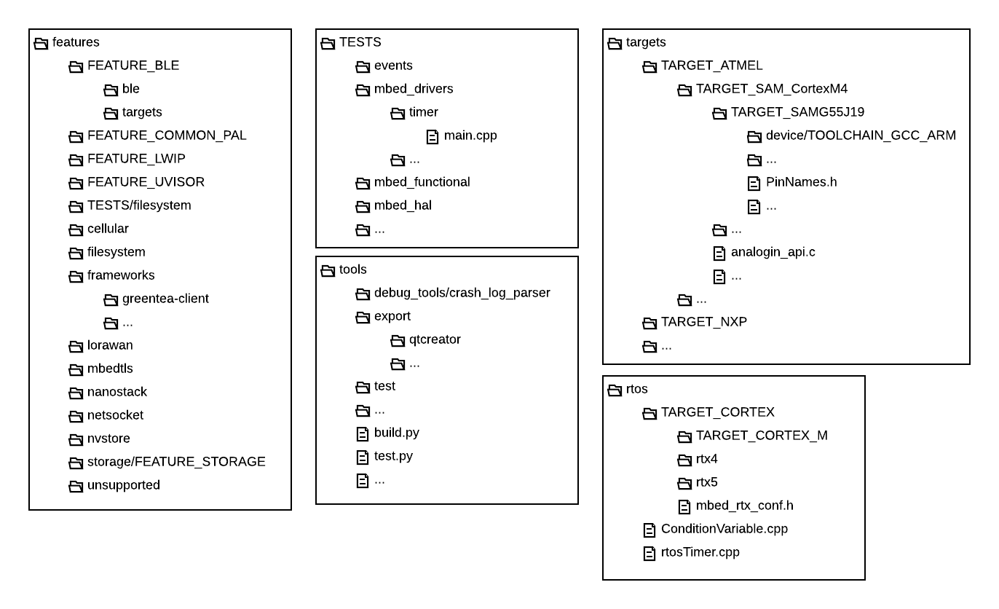
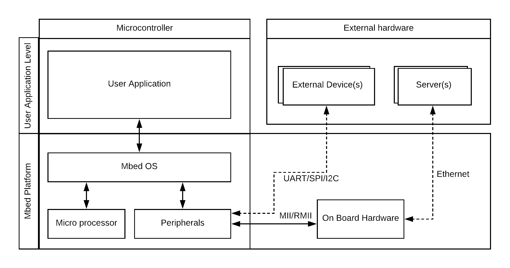
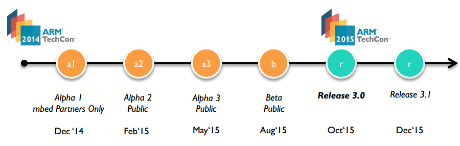
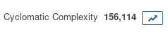
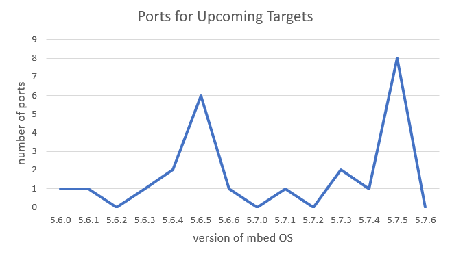
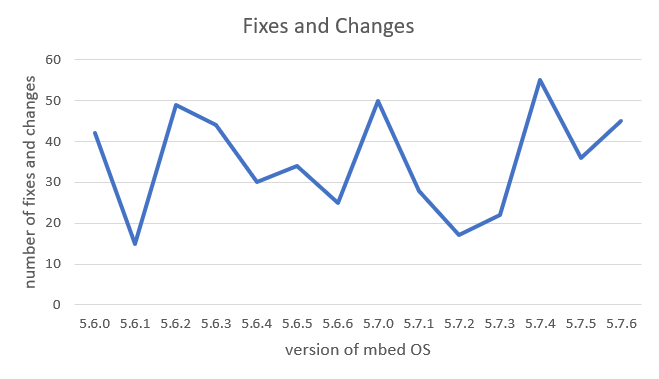

# Mbed OS


By Jasper de Winkel, Arjan Langerak, Wanning Yang and Kun Jiang.

On Github [jdewinkel](https://github.com/jdewinkel),
[alangerak](https://github.com/alangerak),
[yangwanning](https://github.com/yangwanning) and [jiangkun1994](https://github.com/jiangkun1994)

## Abstract

*Mbed OS is an open-source embedded operating system designed for the "things" for the Internet of Things.
It supports a lot of different target hardware as well as the option to implement support for other
hardware without altering the existing libraries.
This chapter analyzes Mbed OS by starting with a discussing of the stakeholders and the context of the system.
After that, the development is discussed which describes the architecture of the code. Furthermore,
the deployment of Mbed OS to different target hardware is discussed . Then, the evolution of the system and the technical debt of the system is discussed. This chapter then ends with a conclusion on the status of the architecture.*

## Table of Contents

1. [Introduction](#Introduction)
2. [Stakeholders](#Stakeholders)
  * [Power-Interest Grid](#Power-Interest-Grid)
3. [Context View](#Context-View)
4. [Development View](#Development-View)
  * [Module structure](#Module-structure)
  * [Common Design Models](#Common-Design-Models)
  * [Codeline](#Codeline)
5. [Deployment View](#Deployment-View)
  * [Hardware Targets](#Hardware-Targets)
6. [Evolution Perspective](#Evolution-Perspective)
7. [Technical Debt](#Technical-Debt)
  * [Identification of Technical Debt](#Identification-of-Technical-Debt)
  * [Manual Analysis](#Manual-Analysis)
  * [Testing Debt](#Testing-Debt)
  * [Evolution of Technical Debt](#Evolution-of-Technical-Debt)
8. [Conclusion](#Conclusion)


## Introduction

ARM Mbed is a fully integrated device management solution. There are some services it can provide, such as operating system, gateway, device management services and partner ecosystem [[1]](#ref1). These services may reduce costly development and deployment time of IoT solutions. The solution is divided into two major parts Mbed Cloud and Mbed OS. This document focuses on Mbed OS specifically.

### Mbed OS
ARM Mbed OS is a free, open-source embedded operating system designed specifically for the "things" in the Internet of Things. It includes all the features needed to develop a connected product based on an ARM Cortex-M microcontroller, including security, connectivity, a RTOS and drivers for sensors and I/O devices.[[3]](#ref3).

The RTOS is the major compoment in Mbed. This is a type of OS that is intended to handle tasks that are defined with a minimum and a maximum time in which they should have been executed. This is achieved by using a combination of threads and a scheduler that determines the order of the tasks.

## Stakeholders
A lot of different stakeholders have interaction with Mbed OS. These stakeholders are separated into different categories and described in the table below.

*Table 1. The different stakeholders of Mbed OS*

| Stakeholder | Description |
|-------------|-------------|
| Acquirers | The enterprise ARM takes the main responsibility of developing and marketing Mbed operating system to cooperative partners. These partners contribute to the platform, use it within their products or deliver a service to Mbed. The OS directly targets ARM processors and supports different microcontrollers of vendors like NXP and ST. These vendors are also ARM Partners and act as acquirers because they actively spend resources on developing support for MbedOS to get their boards working with MbedOS. |
| Assessors | Assessors determine if the legal constraints of the project are met. In the case of Mbed, this is the responsibility of ARM as it is supporting and pushing Mbed. |
| Communicators | ARM handles communication through (paid) support, a news letter and by support forums. From the releases it is deduced that one key communicator (ARM employee) is [@adbridge](https://github.com/adbridge). |
| Developers | In the case of Mbed, the most active developers are a part of ARM or one of its partners. Key developers are:[@bcostm](https://github.com/bcostm), [@0xc0170](https://github.com/0xc0170), [@theotherjimmy](https://github.com/theotherjimmy), [@geky](https://github.com/geky) and [@pan-](https://github.com/pan-) |
| Support staff | Support of MbedOS is given in two ways. Number one is the commercial channel. Since it is a commercial product owned by ARM, support can be provided directly. The other support channels are through the forums and questions can be answered by email. |
| Suppliers | Key suppliers are the compilers and libraries. Relevant compilers are the ARM compiler or GNU ARM Embedded. The code is hosted on Github, thus Github is a supplier as well. |
| Users | Since MbedOS targets an embedded device the responsibility of deploying, designing the hardware and software environments of the system is a task for the end user. In this case, an embedded developer working at a company. Maintenance of the final product also will be the responsibility of the embedded developer. |
| Contributors | Some contributors from ARM are also integrators while there are still some contributors are not from ARM. [@bridadan](https://github.com/bridadan), [@emilmont](https://github.com/emilmont) and [@stevew817](https://github.com/stevew817) are three of these active contributors. |
| Integrator and Maintainers | In Mbed OS no clear distinction is made between integrators and maintainers. The integraters take on both roles. The main integrators at the moment are [@0xc0170](https://github.com/0xc0170), [@geky](https://github.com/geky), [@pan-](https://github.com/pan-), [@theotherjimmy](https://github.com/theotherjimmy) and [@cmonr](https://github.com/cmonr). Most of the integrators are ARM employees. |
| Competitors | MbedOS is not the only platform, it has many competitors. Several compatitores are: Arduino, Tizen, Predix and FreeRTOS |
| Founders/Originators | The Mbed project began in 2005 when the two founders Chris Styles and Simon Ford (ARM employees) met to discuss some projects they had been helping out with[[17]](#ref17). |


### Power-Interest Grid
The grid listed below shows the power vs Interest of each stakeholder. ARM as the major acquirerer has the highest power and is the most invested in the platform. With slightly less power but with also very large interest are the Integrators/Maintainers followed by the developers.
The development of Mbed OS is closely monitored by the competition.
The communicators and users have moderate interest in the platform but have little influence. Suppliers however have a moderate to large power since if there would be any major changes or a stop of development this would directly effect the project. However, programming languages like C and compilers like GNU ARM Embedded are very unlikely to change drastically.


<br>*Figure 1. Stakeholder power vs interest grid*

## Context View

To create this large ecosystem, Mbed depends on a lot of different parties that are not part of Mbed (or ARM, the parent company). These parties can be directly involved with the development of the OS while others provide online services to manage IoT devices that are running Mbed.
Below are some major interactions and dependencies listed and visualized. Not all the companies that provides software,hardware or services are listed since there are too many to be able to include.



<br>*Figure 2. Context View of Mbed with its environment*

Following up on the figure, a more detailed description is discussed next.

*Programming Language:* The bulk of the software is written in C. But to give users a more friendly way using this, a small C++ layer is added. So, the C code can be seen as the External Entity while the C++ fulfills the role of a *Service Provider* for the External Interface.

*Version Control & Continous Integration:* Several Github repositories are used for Mbed, one of which is specifically for Mbed OS. It is used for version control and issue tracking.
Besides this, they also have a repository on their own website[[16]](#ref16) for sharing community project and example projects.  
On all Pull Requests, test code is run by using Continuous Integration tools. In order to integrate Travis CI with Mbed and Github, an *External Interface* exists that provides an API to achieve this. So, this is a *Service Provider*.

*IDE support:* A project can be set up on major Embedded Systems IDEs like Keil uVision5 but Eclipse is also supported. This tool is a *Data Provider* because it created to necessary data to be able to use the IDE.

*Hardware Providers:* These companies provides hardware components for IoT platforms.

*Service Providers:* These offers *External Interfaces* to be able establish a connection between a board and their services. These interfaces can be classified as *Data Providers* (data storage), *Service Provider* (security) and *Event Provider* (monitoring services).

*Software Providers:* Tieto provides several protocol stacks and drivers. Since this software is directly included into Mbed, there is no *External Interface* needed.

## Development View

The development view “describes the architecture that supports the software development process” [[4]](#ref4).
In this section, the structure of MbedOS is introduced in terms of the architecture of the source code, standardizations and the structure of the directories.

### Module structure

MbedOS is a layered architecture. At the bottom, the specific hardware drivers of a vendor can be found. Then, each layer that comes after this adds either new functionality or simplifies the usage of that device by providing a common API.

The system can be roughly divided into three sections: the _Core_ , _Storage_ and _Connectivity_.

The _Core_ consists out of modules that forms the Real Time Operating System. Also, the modules for interfacing with peripherals and for creating a sandbox environment (uVisor) are part of the _Core_. The reason for this classification is that these modules provides the functionality to run code on a hardware board. Therefore, all the other modules have dependencies on modules that are part of the _Core_.

The different modules that are related to files and storage are grouped into the _Storage_ section. The _FileSystem_ and _Storage Managment_ provides APIs for interfacing with regular files. The _NVStore_ provides the functionality to store data by keys in internal flash.

Lastly, all the different modules that are related to connecting devices together are found in the _Connectivity_. Mbed has support for Wifi, Bluetooth and also Low-Rate Wireless Personal Area Networks (LR-WPAN).
The _Thread_ , _6LOWPAN_ and _nanostack_ are modules for building a complete network between different devices.
In particular,  _6LOWPAN_ provides IPv6 functionality and _Thread_ provides functionality to create a mesh network.

The categorized modules be found in the figure below.


<br>*Figure 3. Module overview of the most important components of the system.*

### Common Design Models
#### Contributing standardization

Open source projects such as Mbed OS are developed by both employers of Mbed as well as community members. This means that everyone is free to contribute to the repository. In order to keep maintainability, reliability, and technical cohesion of the system, the core developer composed a *contributing and publishing guide* to standardize the design process. It provides concrete guidelines in terms of the code, naming conventions, documentations and compiler settings which can be all found on their style guide page[[5]](#ref5).

#### API design standardization

In addition, the API design should be worth mentioned here as it provides an environment to implement groups of features like drivers, connectivity etc. The general rule is that a C++ class-based interface is implemented for MbedOS users. Another one is the use of a porting layer which handles the support of multiple hardware targets. This layer is implemented with a C compatible interface.

This API design is splitting into the *drivers* directory (C++ interface), the *hal* (C interface) and the *targets* (implementations) directory.

Also, this API uses a configuration file that defines what kind in inputs/outputs a board which is shown below.

```yml
"LPC11C24": {
        ...
        "device_has": ["ANALOGIN", "CAN", "I2C", "I2CSLAVE", "INTERRUPTIN", "PORTIN", "PORTINOUT", "PORTOUT", "PWMOUT", "SERIAL",
        ...
    },
```
By using *if* and *endif*, the corresponding drivers can be included into the build process.

#### Testing standardization

Since the MbedOS accepts community contributions through GitHub, it requires some form of automated testing. To accomplish this, Mbed uses Travis CI (continuous integration) and it is ran on all pull requests and all commits to a branch to verify that it builds and it passes testing. Regardless of which type of CI run for testing, all CI jobs must pass before the pull request is merged by Mbed OS maintainers.  

The process starts at the *.travis.yml* file in the root of Mbed OS repository. It specifies all the steps for building a test environment. The build lifecycle is made up of two steps, one is **install** which installs any dependencies required and the other one is **script** which runs the actual tests.  In *script*, multiple script commands are specified. If one of the build commands returns a non-zero exit code, the Travis CI build runs the subsequent commands as well, and accumulates the build result.

Finally, the results of testing are passed to *coveralls* which reports this as shown below.

[![Build status release][mbed-travis-release-svg]][mbed-travis-release]
[![Build status master][mbed-travis-master-svg]][mbed-travis-master]
[![Tools coverage status][mbed-coveralls-tools-svg]][mbed-coveralls-tools]
[![PR progress][mbed-waffle-svg]][mbed-waffle]

[mbed-os-logo]:logo.png
[mbed-os-link]:https://www.mbed.com/en/platform/mbed-os/
[mbed-travis-master]:https://travis-ci.org/ARMmbed/mbed-os
[mbed-travis-master-svg]:https://travis-ci.org/ARMmbed/mbed-os.svg?branch=master
[mbed-travis-release]:https://travis-ci.org/ARMmbed/mbed-os/branches
[mbed-travis-release-svg]:https://travis-ci.org/ARMmbed/mbed-os.svg?branch=latest
[mbed-coveralls-tools]:https://coveralls.io/github/ARMmbed/mbed-os?branch=master
[mbed-coveralls-tools-svg]:https://coveralls.io/repos/github/ARMmbed/mbed-os/badge.svg?branch=master
[mbed-waffle]:https://waffle.io/ARMmbed/mbed-os
[mbed-waffle-svg]:https://badge.waffle.io/ARMmbed/mbed-os.svg?columns=all

Since Mbed OS is mainly working for different kinds of boards, it should have a standardization testing for functionality of drivers. Mbed provides the *Greentea* testing tool to automate the process of flashing Mbed boards, driving the tests and accumulating test results into test reports. Those all *.cpp* files in 'mbed-os/TESTS/mbed_drivers' directory indicate that which certain drivers need to be tested. For example, flash IAP, low-power Ticker, Real-time Clock, etc. Each testing file will include a corresponding testing process to guarantee the executable driver and finally can meet the high demand of real time.

Generally, there are some common parts in testing files. Firstly, the following code can be found in all *.cpp* files which introduces the used testing tools.
 
```yml
#include "mbed.h"
#include "greentea-client/test_env.h"
#include "utest/utest.h"
#include "unity/unity.h"
```

And there is also a list of specified cases in each file for testing certain functionality. Here, we select  the *main.cpp* of *lp_ticker* as an example. The low power ticker, mainly working on setting up a recurring interrupt and calling a function repeatedly at a specified rate. Therefore, the test will include measuring the callback time and checking whether ticker properly execute callback. The code of this part is shown as following:
 
```yml
// Test cases
Case cases[] = {
    Case("Test attach for 0.001s and time measure", test_attach_time<1000>),
    Case("Test attach_us for 1ms and time measure", test_attach_us_time<1000>),
    ...
};
```

*Greentea* also presents relevant testing requirements in order to match the standards. For example, tests should be organized based on the class, roughly one test file per class.[[7]](#ref7)

### Codeline



*Figure 4. The top level directory structure of the code [[9]](#ref9)*

The figure above shows the top level directory with the smaller directories already expanded. These directories will be explained first.

The cmsis (vendor-independent hardware abstraction layer) contains abstract interfaces of the various hardware components found in CORTEX microcontrollers.

The driver directory contains C++ interfaces that provides abstractions for common features found in boards. These includes interfaces for input/output pins and other common hardware.

The events directory includes a third party library called _equeue_ written in C which provides event scheduling by using queues. Mbed has encapsulated this library with C++ classes.

The hal (hardware abstraction layer) includes C interfaces that defines functions for interacting with hardware. Some of these interfaces are used in the *drivers* directory that provides the C++ encapsulation.

The platform directory includes C++ classes that implements basic functionality that are commonly found on different boards and platforms.



*Figure 5. Directory structures of features,TESTS,tools,targets and rtos.*

The features directories contains all the different libraries for using wireless communications. Also, libraries for storage and the sandbox (UVisor) are found here. The common structure that is found between these libraries is that there is the code that controls the hardware is separated from the protocols and algorithm code. The hardware code is always found in the *targets* directory.

All the tests that are targeted Mbed are found in the TESTS directory. Each module has its own directory inside the TESTS directory. These modules also have their own directories where the names reflects what part is being tested. Then, the actual testing file is always called *main.cpp*.

The tools directory contains the different python script that can generate IDE config files, run tests, build source code and other various scripts that are used for configuring,building and uploading code to boards.

The targets directory contains the files that implements the interfaces found in the *hal* directory. Also, the initialization files and interfaces from the *rtos* directory are also included.
The structure of this directory is that the boards of each manufacturer are grouped together. The manufacturer then has defined their own structure of how to seperate different boards.

Finally, the structure of the rtos directory is that the top level contains basic C++ classes that encapsulates some functionally of the underlying rtos which is written in c. The *TARGET_CORTEX* directory contains the directories where the actual rtos is located, Keil RTX rtos. Also, the *TARGET_CORTEX_M* contains files that are related to error handling on the Cortex M microcontrollers.

## Deployment View
With the large amount of supported targets and options, Mbed OS's build and deployment is one of the most challenging aspects of the OS. As mentioned in previous sections, Mbed has its own python builder to set specific flags in code to enable certain drivers/modules depending on the desired features and the hardware target. The table that highlights a few major third party dependencies for deployment.

*Table 2. Third party dependencies for deployment*

|Category|Third party library|Mandatory|Role in the system|
|:----------------------:|:--------------------------:|:----------:|:----------------------------------------------------------:|
|Building:|GNU Arm Embedded Toolchain|Choose one|Compiler, C/C++ libraries etc. to build the OS|
||ARM Compiler and Toolchain|Choose one|Compiler, C/C++ libraries etc. to build the OS|
|Processor abstraction:|CMSIS|Yes|Cortex Microcontroller Software Interface Standard|
|OS functionality:|Keil RTX|Yes|Real Time Operating System (RTOS) that manages scheduling of tasks, semaphores etc.|
|Event handling:|Equeue|Yes|Provides event scheduling by using queues|
|Networking:|lwIP|No|Small lightweight TCP/IP stack|
||LoRaWAN|No|Provides support for LoRa|
|File System|Cfstore|No|Secure, associative key-value (KV) store abstraction layer|
||ChaN|No|FatFS implementation|
|Security:|MBed TLS|No|Embedded SSL/TLS library|
|Testing:|GreenTea|No|Mbed's own testing platform|
||Utest|No|Embedded Testing|
||Unity|No|Unit Testing for C (especially Embedded Software)|

Mbed OS is a RTOS thus requires a user program to tell it what to do in order to do anything. An example deployment scenario is shown below. It depicts an embedded product with an onboard microcontroller and some other hardware on the board for communication. It can communicate directly to other devices through Mbed by using simple peripherals or even by using the on-board ethernet hardware to connect to servers.


<br>*Figure 6. Example deployment scenario.*

### Hardware Targets
As previously mentioned, Mbed supports countless hardware targets. Below are several vendors list that supply microcontrollers that are supported by MBed OS. Support for more targets keeps growing. Please note that this list only mentions the suppliers and one vendor. For example, ST has multiple series of microcontrollers and each series contains a lot of MCU's. Therefore, providing support for every microcontroller is not feasible.

* NXP
* ST Microelectronics
* Maxim integrated
* Nordic Semiconductor
* Nuvoton
* Realtek
* Renesas
* Silicon Labs

If a development board of a certain microcontrollers is used as a target, a programmer is usually in the same area to where the board is. This board is connected to a PC with an USB cable. Therefore, to be able to deploy the program to the board, the only additional hardware required is the PC.

#### Feature Support
With the large number of supported microcontrollers, it is important to note that not all microcontrollers support all of the Mbed OS functionality. Especially Ethernet, LoRa, USB, Bluetooth and Wifi are only supported on a subset of the supported targets.

## Evolution Perspective

The first version for ARM Mbed OS was generated on 14th of December in 2014 and it is called Alpha 1, however, only available to Mbed Partners. The second version was released to the public after 2 months called Alpha 2 but it was still heavily in development. Finally, version 3.0 was released officially on 15th of October in 2015. The Mbed OS Release Schedule can be seen in Figure 1, which was shown on [ARM TechCon 2014](http://www.armtechcon.com/this-is-whats-new-at-arm-techcon-2014).


<br>*Figure 7. The roadmap of Mbed OS before 2016.*

On 5th of August in 2016, Mbed OS 5 with version 5.1 was released. This release has a lot of changes and enhancements so that Mbed OS is usable for many Internet of Things (IoT) use cases. Also, Mbed OS 2 (“Classic”) and Mbed OS 3 is merged together such that the ecosystem of Mbed OS 3, such as an RTOS and tooling, is now combined with the ecosystem of  Mbed OS 2. Lastly, there are new board included that support Mbed[[10]](#ref10). The process is shown in Figure 2.


<br>*Figure 8. Mbed OS 5 integrates the two codelines of Mbed 2.0 (“Classic”) and Mbed 3.0 (“Eventing OS”) into one unified platform.*


Nowadays, the release process is still continuing and there are three major types of ARM Mbed OS releases which are `major`, `feature` and `patch`[[8]](#ref8).

Major releases involve changes to the structure of the OS. These releases are rare since it changes the complete structure of the code. The only major releases so far are version 2, 3 and 5.

Feature releases are created every quarter. These releases add new functionalities to the OS.

Finally, there are the patch releases. These occur every two weeks and include bug fixes, new target boards (or components) and improvements to existing functionalities.

From analyzing the release of Github, it can be seen that they follow these guidelines very closely.

## Technical Debt
In this chapter the the technical debt of Mbed OS is discussed. This includes the identification of technical debt, including testing debt through various methods (tools or manual analysis). The chapter is concluded with a section about the evolution of the technical debt of Mbed OS over time.

### Identification of Technical Debt

In order to identify technical debt in a large system such as Mbed OS, tools can be used to give an indication of the amount of technical debt. Without these tools, it would cost a lot of time to go through every code.
These tools can also reveal locations and tips on how to reduce the technical debt.

#### Code keywords analysis

Another way to check for technical debt is to look for certain keywords/tags that are commonly used to indicate that something probably needs to be changed. These
keywords are also used for communication between developers. However, for identifying technical debt, the following keywords are selected:

-TODO: This keyword indicates that there is an additional feature that needs to be implemented. The analysis revealed that most of the time, these issues relate to either upcoming features or low priority issues.

-FIXME: This keyword indicates that some code is working but it could use some refactoring/rewriting. Also, it can indicate that some code is currently not usable and that it only can be used if it is fixed. Usually, these issues
have a greater impact than the TODO issues.

-HACK: This keyword indicates that code is written to circumvent a bug/problem. The issues found in the code which is marked with HACK circumvents certain checks, introduces possibly memory leaks and introduces mismatches between what a function should do and what it actually does.

-XXX: This keyword is more of comment to developers to warn about possible problematic errors or misleading code. These issues can arise because there are no checks or the naming can be confusing depending on the domain the developer is used to.

In order to find the keyword, the following bash command is used:
>      grep -rohinHw "\<keyword\>" --include \\*.h --include \\*.cpp --include \\*.c

This command only includes actual source files and it skips documentation files
and tools that are written in Python. The reason to exclude these is because they are actually developed in a seperate directory.

The occurrences of each keyword is seperated per module as listed in the table below. Only the modules that have a
high occurrence are listed.

*Table 3. Overview of occurrences of different keywords in the modules.*

|Module|TODO|FIXME|HACK|XXX|
|-----------------------------|------|-------|------|-----|
|feature_ble|58|18|0|0|
|feature_nanostack|153|0|15|6|
|feature_lwip|171|20|22| 10|
|feature_uvisor|58|5|48| 0|
|feature_storage|41|5|0|0|
|feature_unsupported|21|20|1|3|
|targets|255|56|6|0|


An example of a TODO is found in the BLE module in the file 'MemorySecurityDB.h':

>     virtual void get_whitelist(WhitelistDbCb_t cb, ::Gap::Whitelist_t *whitelist) {
        /*TODO: fill whitelist*/
        cb(whitelist);
    }

This clearly shows that there is functionality missing in this function. At the moment, it only uses the callback with the supplied whitelist parameter which is probably an empty list at the moment.

Overall, these keywords indicate there is technical debt that the original author(s) are aware of but could not fix themselves.
 For instance, an obvious conclusion can be drawn from the table above, the module regarding *lwip* has a large number of keywords `TODO`, `FIXME`, `HACK` and `XXX` in its code. Therefore, when developers want to deploy the module *lwip*, it would not only create more problems involved maintenance but also operates in the way it should not have operated. Thus, the large amount of technical debt in this module could lead to that developers cannot understand this module correctly which leads to a negative impact on the development.

#### Software Analytics
Below, several interesting analyzed expects are discussed.
##### Code Duplication
  
<br>*Figure 9. SonarQube code duplication results.*

The operating system has a lot of hardware targets. To support each of these targets (efficiently) code duplication is almost unavoidable and is very common for this scenario. The analysis showed most duplication occurs in the C files to support all of the different hardware targets as expected.

##### Cyclomatic Complexity
Cyclomatic complexity is a metric to measure the complexity of a program. This metric measures the number of independent paths through the code. In the case of MBed, to support all those hardware targets a lot of independent paths exist. This is reflected in the results, Mbed has a very high cyclomatic complexity. The main complexity occurs in the target implementations.

  
<br>*Figure 10. SonarQube detected cyclomatic complexity.*

### Manual Analysis

In addition to searching for the technical debt using tools, technical debt can be also found manually.

#### Bug fixes

There are still some issues found in [GitHub ARM mbed OS]( https://github.com/ARMmbed/mbed-os/issues) which are labeled as `bug`. This means Mbed OS has some technical debt that need to be paid off and some of these bugs are even dated back to 2014. So far, there are 345 open issues and 98 issues of them are belonging to the type `bug` which takes up 28.4% of all issues. It indicates that Mbed OS team still needs to make much more effort to deal with the technical debt.

#### Refactoring

In addition to the type `bug`, there is another type called `enhancement` in open issue as well. The goal of this is to improve or refactor some unreasonable code structures, code smell and even API and HAL interface.

Most of them have been reviewed and approved by developers working for ARM Mbed and they improve the performance of Mbed OS significantly, but this also adds to the technical debt. There are 74 open issues about enhancements out of 345 open issues so far.

### Testing Debt
Testing debt is caused by the lack of testing or by poor testing quality.
In this section, the detail of Mbed OS’s testing debt will be analyzed.

Mbed OS uses the service *coveralls* to evaluate the code coverage. The coverage test is triggered once a pull request is submitted. The latest code coverage in Master branch only got 33% which is not a good score.

Only files that are in the *tools* are covered. However, there do exist many other testing files that cover the actual code of Mbed. The reason that these tests are not included is that in the first place, there are no coverage files created for the C/C++ code files thus *coveralls* cannot report statistics about coverage.
The reason for this is that most of the C/C++ tests depends on the greentea testing framework which can only run on an actual board.
From Mbed webpage about contributing[[18]]() ,it is noted that they test a proposal against the Mbed Enabled development boards. The greentea framework does not have support to calculate coverage percentages but it does look like that most of the functionality is covered by tests.

[![Tools coverage status][mbed-coveralls-tools-svg]][mbed-coveralls-tools]

[mbed-coveralls-tools]: https://coveralls.io/github/ARMmbed/mbed-os?branch=master
[mbed-coveralls-tools-svg]: https://coveralls.io/repos/github/ARMmbed/mbed-os/badge.svg?branch=master

### Evolution of Technical Debt

ARM Mbed OS is in development for many years and has become a popular platform in the Internet of things (IoT) domain. However, the development comes with some historical technical debt which are needed to be paid off. In this section, two types of technical debt are described.

#### Technical debt of version division

As described in the evolution perspective, Mbed OS needed to keep two version due to radical differences between version 2 and 3. These two versions were split into separate codebases which caused a rift in the developer community to some extent at that time.

For now, the ARM’s Mbed team has been working on the combination of Mbed 2.0 and Mbed 3.0 that closes the gap between embedded developers and programmers working at the service layer. This version is known as 5.0 (Mbed 2.0 + Mbed 3.0). This means that the Mbed developers have been struggling to pay off the technical debt that resulted from the version division. The latest released version is Mbed OS 5.7.6 and by looking through the latest version and previous version from the [released page](https://github.com/ARMmbed/mbed-os/releases), it can be seen that the Mbed team is still concentrating on the compatibility, fixes and changes throughout these years.

#### Technical debt evolution based on Github repository

For every release for Mbed OS, there are new features added into the new version. In every release, a main developer from ARM Mbed will make an introduction to the new release. This includes a summary of the release in which known issues of critical bugs or changes and which ones are solved. Also, it mentions new port addition the ports addition which are compatible with Mbed OS.

 Using the information given in GitHub release[[13]](#ref13), two figures have been created. Figure 11 shows the number of ports for upcoming targets. Figure 12 shows the number of fixes and changes that are contributed by contributors in GitHub.


<br>*Figure 11. The number of ports for upcoming targets from Mbed OS 5.6.0 to 5.7.6.*


<br>*Figure 12. The number of fixes and changes from Mbed OS 5.6.0 to 5.7.6*

## Conclusion

At the beginning of this chapter, the stakeholders were identified that are involved in the development of Mbed OS and the interaction between the system and the stakeholders was analyzed. This can be split into two groups, a developer group which are employed by Mbed, and the community that contribute in different ways such as fixing problems or adding new boards.

Then, in order to understand how the Mbed OS works, the different layers of the source code, common design models as well as the structure of directories was analyzed. It was found that the code was made modular in such way that new boards can be included relatively easy and also that the system contains the most necessary functionalities to support IoT development. Besides, the documentations for each module are comprehensive and provide good descriptions so that users know what each function should do.

Then, the technical debt was analyzed by using tools and doing manual analysis. It was found that although the technical debt has already been decreased significantly, there is still a lot of debt left which is mainly caused by non-compatible boards but also that a lot of tests don't create coverage statistics. This could give the wrong impression of what part of the code is actually tested.
There is also a lot of debt that was identified by searching for common keywords such as _TODO_. These revealed that are some implementations that needs to be rewritten in order to support new functionalities or to improve the code quality.

In conclusion, Mbed OS has a good foundation that provides the basic functionalities to create IoT devices. It is also structured such that new boards (with Cortex M processor) can be added and integrated into Mbed OS without changing existing libraries.
There is always room for improving the platform by reducing the amount of technical debt but the current debt does not seem to slow down the development since they always hit their intended release schedule. All in all, Mbed OS is a good choice for starting with IoT development with Cortex M processors. This is also reflected by the number of Mbed OS users which is still growing so Mbed OS could become a major player in the IoT sector.

## References
1. <a name="ref1"></a>  ARM, Mbed, https://www.mbed.com/en/, Retrieved on 9-3-2018 <br>
2. <a name="ref2"></a> ARM, Mbed Cloud, https://cloud.mbed.com/, Retrieved on 9-3-2018 <br>
3. <a name="ref3"></a> ARM, Mbed OS, https://www.mbed.com/en/platform/mbed-os/, Retrieved on 9-3-2018
4. <a name="ref4"></a> Rozanski, N. Woods, E. , 2012, Software Systems Architecture: Working with Stakeholders Using Viewpoints and Perspectives. Addison-Wesley.<br>
5. <a name="ref5"></a> Mbed OS Style guide, https://docs.mbed.com/docs/mbed-os-handbook/en/latest/cont/code_style/, Retrieved on 23-2-2018<br>
6. <a name="ref6"></a> Testing in mbed OS 5, https://docs.mbed.com/docs/mbed-os-handbook/en/5.2/advanced/testing/, Retrieved on 24-2-2018<br>
7. <a name="ref7"></a> ARM, mbed OS Software Design Guide, https://docs.mbed.com/docs/mbed-os-handbook/en/5.2/cont/design_guidelines/, Retrieved on 8-3-2018<br>
8. <a name="ref8"></a> ARM, How We Release Arm Mbed OS, https://os.mbed.com/docs/v5.7/introduction/how-we-release-arm-mbed-os.html, Retrieved on 4-3-2018<br>
9. <a name="ref9"></a> ARM et al, Github: ARMmbed mbed-os, https://github.com/ARMmbed/mbed-os, Retrieved on 2-3-2018<br>
10. <a name="ref10"></a> ARM, Introducing mbed OS 5, https://os.mbed.com/blog/entry/Introducing-mbed-OS-5/, Retrieved on 15-3-2018<br>
11. <a name="ref11"></a>ARM et al, Github: PR #6102, https://github.com/ARMmbed/mbed-os/pull/6102, Retrieved on 3-4-2018<br>
12. <a name="ref12"></a> ARM, mbed OS forum, https://os.mbed.com/forum/mbed/topic/28559/?page=1#comment-54245, Retrieved on 16-3-2018
13. <a name="ref13"></a>ARM et al, Github: Release page, https://github.com/ARMmbed/mbed-os/releases, Retrieved on 16-3-2018<br>
14. <a name="ref14"></a> SonarSource, SonarQube, https://www.sonarqube.org/, Retrieved on 16-3-2018<br>
15. <a name="ref15"></a> SonarOpenCommunity et al, Github: SonarQube C++ plugin (Community), https://github.com/SonarOpenCommunity/sonar-cxx, Retrieved on 15-3-2018<br>
16. <a name="ref16"></a> ARM, Mbed OS code repository, https://os.mbed.com/code/, Retrieved on 25-3-2018<br>
17. <a name="ref17"></a> ARM, Mbed OS handbook, https://os.mbed.com/handbook/Founders-interview, Retrieved on 22-3-2018<br>
18. <a name="ref18"></a> ARM, Mbed OS contributing, https://os.mbed.com/contributing/, Retrieved on 4-4-2018<br>
19. <a name="ref19"></a> ARM et al, Github: Pull request number 6341, https://github.com/ARMmbed/mbed-os/pull/6341, Retrieved on 4-4-2018<br>
20. <a name="ref20"></a> ARM et al, Amazon CI build server: build number 5581 for target board FF_LPC546XX, http://mbed-os.s3-eu-west-1.amazonaws.com/builds/5581/PASS/FF_LPC546XX/GCC_ARM/5dd46136ada7e3f03833fd8255ba6ffac85004e1_build_log_FF_LPC546XX_GCC_ARM.txt, Retrieved on 4-4-2018<br>
