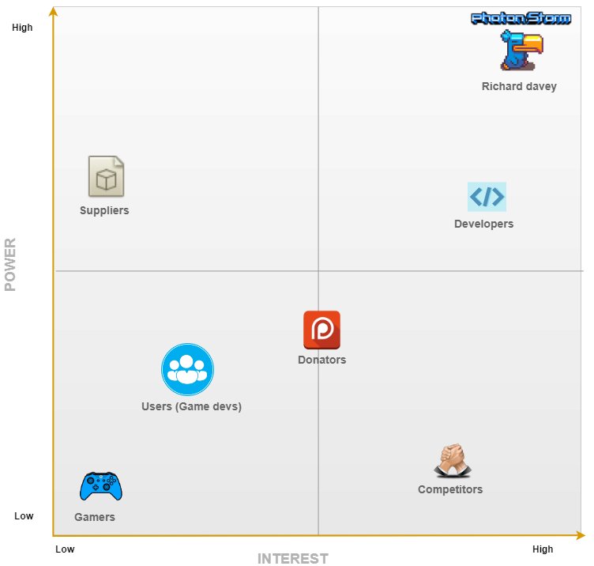
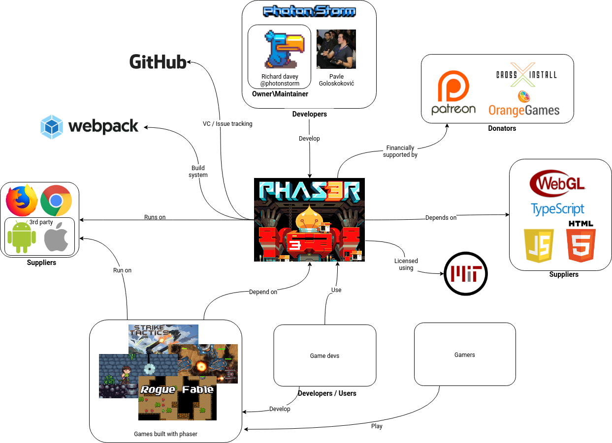
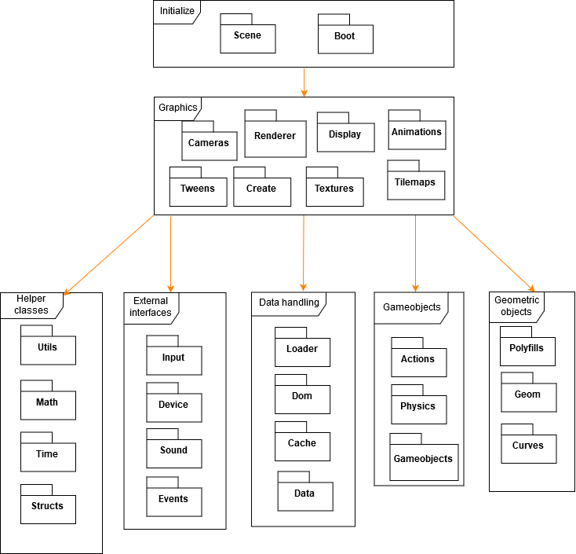
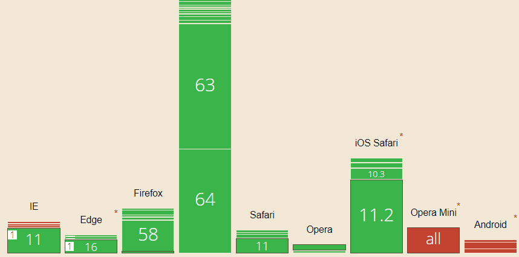
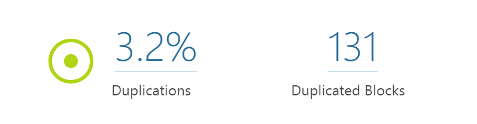
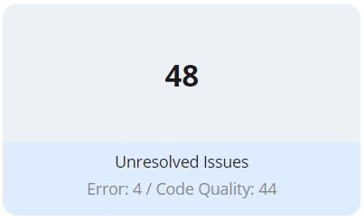
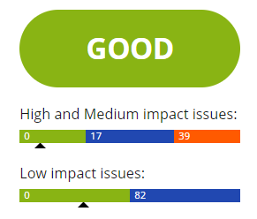

# Phaser - A Fun, Free and Fast 2D Game Framework for HTML5 browser games supporting Canvas and WebGL rendering.

**[Gerard van Alphen](https://github.com/ger1995),
[Tom Catshoek](https://github.com/TCatshoek),
[Tomas Heinsohn Huala](https://github.com/Tomas2h),
and
[Casper van Wezel](https://github.com/12casper3).**

_Delft University of Technology_

## Abstract
<!-- Explain briefly what Phaser is. -->
Phaser is a 2D HTML5 game framework with support for WebGL and Canvas. It currently is the most starred Javascript game engine on Github and the repository is completely managed by the creator Richard Davey.
<!-- Explain briefly what this chapter is about. -->
In this chapter, the project is analyzed by looking at various aspects of Phaser. By creating a number of views and analyzing the stakeholders, (technical) debt and evolution, it was concluded that Phaser is a well-managed project with high standards for code quality. However, the project is lacking automated testing which leaves room for improvment.

## Table of Contents

1. [Introduction](#introduction)
2. [Stakeholders Analysis](#stakeholders-analysis)
3. [Context View](#context-view)
4. [Development View](#development-view)
5. [Technical Debt](#technical-debt)
6. [Functional  View](#functional-view)
7. [Evolution of Phaser](#evolution-of-phaser)
8. [Conclusions](#conclusions)
9. [References](#references)

## Introduction
<!-- Explain what Phaser is. -->
Phaser is an open-source JavaScript game framework.
It is licensed using the MIT License, so people are allowed to use it freely, even for commercial purposes.
The framework implements both WebGL and HTML5 Canvas rendering, so it can be used in any browser with support for them.
On top of that, by using 3rd party tools it is possible to package your Phaser apps as native ones.

The community around Phaser mainly consists of game developers who use the platform, either for hobby or commercial purposes.
Phaser's main developer and integrator is Richard Davey. He has been working on Phaser since 2012, and it has grown tremendously since then.
There are daily commits to the repository and every week a whole bunch of issues are created and closed.

Just a few months before writing this chapter, Phaser 3 was released.
This new version improved a lot of all the problems they had with Phaser 2.

<!-- Explain the content of this chapter. -->
This chapter is written as part of the DESOSA (Delft Students on Software Architecture) book which summarizes all the work done for the TU Delft course on Software Architectures.
It will provide an analysis of many different aspects of the Phaser project.
This of course includes the technical perspective based on the code but also the business aspects are looked by defining the stakeholders.

## Stakeholders Analysis
To get a feeling about everyone who is involved in the Phaser project, all the stakeholders will be listed and explained below.
After that they will be combined into a [Power-Interest grid](#power-interest-grid).

### Donators
The project has a [Patreon](https://www.patreon.com/photonstorm) page via which supporters can pledge a monthly contribution.
This helps the funding of the project and its developers.
The pledgers get some small rewards in return (a forum badge and a discount on new Phaser products).
At the time of writing (22-02-2018) the Patreon has 171 pledgers, contributing a total of $1616 per month.
There is also the possibility to do a one-off donation, for the people who do not like to commit to a monthly payment.
The main sponsors of Phaser are [CrossInstall](https://web.crossinstall.com) and [Orange Games](http://orangegames.com/) two companies which use Phaser in their commercial products.

### Communicators
[Richard Davey](https://github.com/photonstorm/), the creator of the project, is mainly responsible for the communication.
However there is a large community which contributes training material, tutorials and knowledge on the Phaser [forum](http://www.html5gamedevs.com/forum/14-phaser/) and [site](https://phaser.io).
Richard is owner of the company [Photon Storm Ltd](http://www.photonstorm.com/) which runs a HTML5 game development service.

### Developers
At the time of writing (20-02-2018), there are 293 contributors to the project.
The contributor top 5 (based on amount of commits) is:

| Contributors | Notes |
|--------------|-------|
| [Richard Davey](https://github.com/photonstorm/) | Creator |
| [Pavle Goloskoković](https://github.com/pavle-goloskokovic) | |
| [Felipe Alfonso](https://github.com/bitnenfer) | Freelance programmer Photon Storm |
| [Michael Hadley](https://github.com/mikewesthad) | |
| [pnstickne](https://github.com/pnstickne)| worked on first Phaser version in 2015 |

So the main incentive of the two main developers just arises from of their paid jobs.
When looking at other people doing commits it is usually because they are a game developer using the platform themselves.

### Maintainers
[Richard Davey](https://github.com/photonstorm/) manages all pull requests and issues on GitHub.
Therefore he is responsible for what reaches the production version.

### Production engineers
Phaser is built using webpack, it uses several plugins to tailor the build process.
[Richard Davey](https://github.com/photonstorm/) and [Rafael Barbosa](https://github.com/rblopes) both contributed to the webpack config.

### Suppliers
<!-- Build and/or supply the hardware, software, or infrastructure on which the system will run -->

Since Phaser is a framework for JavaScript browser games, the users have to supply a website where a browser can load the framework.

More important suppliers however are the dependencies of the sofware.
Of course JavaScript is the most important one in that.
All the rendering is handled by either WebGL or an HTML5 Canvas.

Node.js is the supplier of the `webpack` build system.

### Support Staff
Within the Phaser community there is not really a separate group which can be marked as support staff.
When a game developer has questions about the framework, the developers in the [slack-channel](phaser.io/community/slack) or on the [forum](phaser.io/community/slack) will usually try to clarify things.

### Users
Of course the main incentive for Richard to start developing this framework is to use it for his own company Photon Storm.
Besides, it is used by several other HTML5 game developers.

### Competitors
With over 20 000 stars on GitHub Phaser is the biggest HTML5 game framework, but Phaser does have some notable competitors.
For example [PixiJS](https://github.com/pixijs/pixi.js) which is a lightweight library mostly used for the rendering part of game creation.
In fact, Phaser used to be based on PixiJS, but in the meantime it has been heavily modified and incorporated in the system.
Other interesting Phaser competitors can be found in this [GitHub collection](https://github.com/collections/JavaScript-game-engines).
Some of them focus on 3D games whereas Phaser's main focus is 2D games (although it has some support for 3D).

### Power-Interest grid
We analyzed the power and interest of Phaser's stakeholders and visualized this in a power-interest grid.

The stakeholder with the most power and interest is obviously Richard with his company Photon Storm.
He earns his money with Phaser and developing Phaser games and he manages the entire Phaser project.

The Phaser developers also have significant influence in the project, but Richard will always have the final say.

Suppliers like WebGL have no immediate involvement with the project but Phaser does depend on them.
Therefor they have high power but low interest. When for example WebGL decides to overhaul their API, this will require Phaser to rewrite the corresponding code.

The game developers use Phaser for their games so they have interest in the project, but not as much power. They can contact Richard for feature requests or bug reports. Donators have slightly more power and interest as they are willing to pay for the project on a monthly basis and (as stated on the Patreon page) they have a direct say on new features.

Competitors have relatively low power, as Phaser is by far the most popular framework. They do have high interest though, as they want to compete with Phaser.

The gamers, who play games created with Phaser have low power and low interest. For the gamer it does not matter as much which framework was used to create the game, the actual gameplay is what matters for them.

## Context View
In this section the relationships of Phaser with its environment will be described, as per Rozanski and Woods.
We will determine the system scope and responsibilities, analyze how it relates to the external entities involved, and what the interfaces between the system and those entities are.

### System scope and responsibilities
Phaser is a JavaScript game framework which game developers can use to handle:

* Graphics rendering using WebGL and Canvas, mainly 2D but also with preliminary 3D support
* Animation, tweens and interpolation
* Sound effects and music
* Input from keyboard, mouse, touch, and gamepads
* Asset loading from URLs
* Physics using Arcade physics, Matter.js, and in the future P2 Physics and Box2D

For the sake of completeness, there are also things Phaser does not do:

* Implement game logic
* At the time of writing, implement full 3D graphics support
* Package itself for environments other than browsers
* Host game assets

### External entities
Since Phaser is a framework, it certainly does not operate in a vacuum.
Several of its relations to the outside world are described below:

* It is developed using JavaScript and HTML5
* It runs in most modern browsers, like Firefox and Chrome
* Games made with Phaser can be packaged for Android, iOS and as a native app using 3rd party tools like [cordova](https://cordova.apache.org/) and [electron](https://electronjs.org/).
* It uses a custom rendering engine which supports both [WebGL](https://developer.mozilla.org/en-US/docs/Web/API/WebGL_API) and [HTML5 Canvas](https://www.w3schools.com/html/html5_canvas.asp)
* [Webpack](https://webpack.js.org/) is used as a build system
* GitHub is used as a version control system and issue tracker
* Development of Phaser is financed by its [Patreon](https://www.patreon.com/photonstorm), [Paypal donations](https://phaser.io/community/donate), and its two main sponsors, [OrangeGames](http://orangegames.com/) and [CrossInstall](https://crossinstall.com/).
* It is available under the [MIT](https://opensource.org/licenses/MIT) license
* Game developers build [their games](https://phaser.io/games) on Phaser
* Gamers of all ages play the games made with Phaser

### External interfaces
Here we will describe the interfaces between Phaser and its external entities.

| Entity | Data | Service | Event |
|:-------|:----:|:-------:|:-----:|
|JavaScript | both | both | provider |
|HTML5 / Canvas| consumer | provider | x |
|WebGL|consumer| provider |x |
|Webpack |x | provider |x |
|GitHub  |x | provider  |x |
|Games |x | consumer  |x |

Some of this might require a little clarification.
We see JavaScript as both a data provider and consumer as it can be used for asset loading and all other forms of data input, as well as output (e.g. uploading high scores or save files to an external server.
That would be up to the games made with Phaser to implement though, but the option is there).
We also see it as both a service provider and consumer as it is obviously used to call the Phaser api, but Phaser itself is written in JavaScript.
On top of that, we also see it as an event provider, as it passes input events from input devices to Phaser to handle later.

HTML5, or more precisely the Canvas element, is seen as a data consumer, as Phaser passes information to it on what to draw.
It is also a service provider, as it provides drawing functionality to Phaser.
The same goes for WebGL.

Webpack provides a module bundling service to Phaser, which is used to create a distributable, and possibly minified build of Phaser to use in production.

GitHub  provides version control and tools for collaboration.

Games consume the services provided by Phaser by calling its API to do all things games want to do.

### Context diagram
An overview of Phaser and its relations to the external entities mentioned above can be seen in the Figure below.

## Development View
<!-- p366 of the book-->
Since software development environments often require special dependencies or configurations, this section covers important details of the Phaser development environment.
The organization and structure of the code and architecture will be discussed, as well as the testing facilities.

### Module Organization
The Phaser project consists of 28 different packages and some configuration files.
The most important package is the `boot` package which initializes the game.
When inspecting the project, we saw that all these packages can be grouped as modules.
An overview of the modules present in this project is shown in the Module Structure Model below.

At the first layer of the Phaser project we saw that there was an initialization module.
This module contains the `boot` and `scene` packages.
The main package `boot` is responsible for setting up the game including external resources.
The `boot` package also sets up the scene manager which is located in the `scene` package.
This package is responsible for handling everything that is related to the visual aspects of the application.

Secondly, we have the graphics layer which is launched by the `scene` package.
This layer is responsible for visualizing the graphical content in Phaser.
The main package here is the `renderer` package, the renderer is responsible for managing all visible objects on screen.
More on the renderer is explained in next section.

The third and final layer contains five modules, they are mostly helper functions for the rest of the framework.
The `GameObject` module and `geometric objects` module handle all the different kind of objects to be represented in the game.
For instance, images and text objects are GameObjects here, these objects can be adjusted with the help of the `physics` and `actions` package.
The data module is responsible for handling all the incoming data used with Phaser.
Furthermore, the external device module is responsible for managing and connecting all external inputs (software and hardware wise).
Finally, there are the helper packages which contain the basic functions needed in this framework.
The most important one here is the `math` package as maths are used a lot in the interaction (rotation, translation etc.) with graphical objects.

### Common Processing
Because our framework supports multiple platforms there are some interfaces in the software which open up the possibilities for using different implementation.
The biggest example for that is the Renderer.
The framework has a `Canvas` and `WebGL` Renderer which can be used interchangeably so when a device/browser does not support `WebGL` the framework automatically falls back to the `Canvas` Renderer.
So this is not really a Common Design Model, but more a Common Behaviour Model just doing Common Processing.
This is useful when you want your game to be compatible with for example older versions of Internet Explorer or native Android browsers, as some of them do not support WebGL:

*[Source](https://caniuse.com/#feat=webgl), red boxes indicate browser versions that do not support WebGL*

You can specify which renderer you want to use with the `type` attribute in your game config.
The options are:

- `type: Phaser.AUTO`, this will automatically detect which renderer is supported and choose the best option
- `type: Phaser.WEBGL`, for WebGL rendering
- `type: Phaser.CANVAS`, for Canvas rendering
- `type: Phaser.HEADLESS`, for no rendering at all

The big advantage of this design is that the implementation is the same for each renderer, which means you only have to write the code once to support multiple renderers/browsers.

### Standardization of Design
The `GameObjects` module contains a lot of different classes (e.g. `container`, `group`, `images`, `mesh`, `particle emitter`, `sprites`, `text`, `tilemap`).
Each of these classes behave similarly, so for example the action `translate(x,y)` can be called on any of those objects in order to translate them.
This is standardized by having all individual GameObjects extend the `GameObject` class.

Using this standardization, all of these GameObjects can then be created in a Scene and be manipulated in the same way.
Any additional functionality can be implemented in each individual `GameObject`.
This makes the system more maintainable and easier to extend.
Whenever a new `GameObject` needs to be added, simply create a class which extends `GameObject` and implement the additional functionality.

### Instrumentation
The framework has an `DebugHeader` to provide useful feedback to the developer by means of console logs and statistics.

### Codeline Organization
The codeline organization of a system is all about the structure of the code base itself and how the project is managed in terms of releases.
The code base structure of the project is not very special, besides the regular git folders and required configuration files.
There is one `src` folder containing the packages as already showed in the model structure model.

As mentioned, since recently the project has a working CI environment.
Every commit is built by Travis to reduce the risk of releasing failing code.
Dependencies are managed using the package manager from Node.js (`npm`).
The code itself is then built using `webpack`, which bundles the source code in a single JavaScript file which can be used in the browser.

All releases of Phaser are managed on GitHub.
Whenever a new release is ready, Richard will tag a commit with the version and update the changelogs. These changelogs contain detailed information on what has been changed and by who this has been changed. The time between these releases is about 5 days on average

## Technical Debt
In this section we investigated the technical debt of the Phaser repository.
Technical debt is all about how much it would cost extra in the future if you have to redevelop a solution which was chosen now, instead of applying a better solution now that would take more time.
So technical debt concerns the code quality of a software project and if this code was tested properly.
To analyze the technical debt, we use code quality tools like SonarQube to get an overview of the source code quality to detect pieces of software that could be improved.

### Code quality tools analysis results
We chose to use two different online code quality tools: SonarQube (we used SonarCloud as online platform for it) and DeepScan.
They both gave roughly the same output, the results of both scans are discussed in the following sections.

#### Scan results
SonarQube works with 4 categories to measure the code quality.
The first category scans the project for bugs and vulnerabilities, where bugs are related to the reliability and the vulnerabilities are related to the security of the system.
The initial scan resulted in the following amount of bugs/vulnerabilities:

The bug scans looks for parts of code that could fail, for example possible null references or syntax errors.
It identified some typo's, some cases where a variable could be null or undefined when it is used.
About 19 of the 35 bugs are related to the potential unintended use of bitwise operator `&` instead of conditional `&&`.
This bitwise operator appears in a if-condition usually in combination with a mask of some sort resulting in a number.
This number is then implicitly compared by JavaScript to see if it is zero (false) or something else (true).
For readability it might be good to change this to an explicit comparison like `(a&b) != 0`, but this depends on the type of developer and their experience with masks.

Furthermore, the three vulnerabilities it found were all of the same kind, namely: `Review this "Function" call and make sure its arguments are properly validated.`.
We were unfamiliar with this vulnerability, but fortunately SonarQube provides an explanation for each scan result which in this case was:

> In addition to being obtuse from a syntax perspective, function constructors are also dangerous: their execution evaluates the constructor's string arguments similar to the way `eval` works, which could expose your program to random, unintended code which can be both slow and a security risk.
>
> In general it is better to avoid it altogether, particularly when used to parse JSON data.
You should use ECMAScript 5's built-in JSON functions or a dedicated library.

So as these function constructors work similarly to `eval`, a string input can be evaluated to JavaScript code. One of the those Function constructors in Phaser's code is:

`new Function('a',
            'return {minX: a' + format[0] +
            ', minY: a' + format[1] +
            ', maxX: a' + format[2] +
            ', maxY: a' + format[3] + '};');`

So whenever a user is able to manipulate the contents of the format array (for example through input in the game), he will be able to execute arbitary code.
It is unlikely that this will be a security risk, but it might crash the game or be exploited to cheat the game.
Therefor it is better to avoid them altogether.

SonarQube estimates that the time required to fix the bugs is around 4 hours and the time to fix the vulnerabilities is about 15 minutes.
SonarQube also analyzes the technical debt and code smells:

This is a very positive result, a technical debt of only two days. The code smells include redundant and unused code, confusing code and more.
By quickly analyzing these code smells it becomes clear that most of these are related to useless assignments or unused variables, so fixing these code smells will not cost much effort.
The most of the other code smells were related to boolean expressions which always seem to evaluate to true.

Fixing these code smells will improve the maintainability of the system, as it will make the code more readable and clear it from redundancies. In general the code smells are not bugs, the code still functions with the smells in it. However, they increase the risk of introducing bugs in the future which is why it is recommended to keep the code free of smells. For example, a piece of unused code could be triggered after a refactor which might cause all sorts of issues.

Another aspect SonarQube looks at is test coverage:

This is where the project really lacks behind; it simply does not have any tests.
More on this can be found in the [Testing debt](#testing-debt) section.

The final aspect SonarQube check is code duplication:

Obviously code duplication is generally bad practice as it makes the system more difficult to maintain.
Fortunately Phaser has very low code duplication.
In fact, the two files with the most duplication are debug classes, which are not part of the actual system.

The other tool we used was DeepScan, a code analysis tool specifically for JavaScript.

DeepScan was able to find a total of 48 issues:

Based on the amount of issues, DeepScan provides a code quality grade, which turned out to be "Good" :

The grading is explained in DeepScan's official [documentation](https://deepscan.io/docs/get-started/grades/).

### Testing debt
The project does not contain any automated tests, apart from Travis CI which was enabled again recently.
This just checks if `webpack` and `ESLint` do not return any errors.
And it has to be noted that `webpack` just checks for JavaScript syntax errors, so it is still possible for errors like typos to pass the CI.
The extensive [example repository](https://github.com/photonstorm/phaser3-examples) can be used to manually check each part of the system using small pieces of example code.

It could be argued that it is hard to test a gaming framework, which is partly true.
For example, how would you test that for example a certain shape is drawn on the screen as expected?
This however, is not an excuse to not have any tests at all.
Unit tests could be used to test the logic of the code.
The project would benefit from this, as it could assure that for example the wide variety of calculations done by the framework are correct.

A good example of a bug, which could have been spotted earlier with these tests, is a matrix rotation function which rotated the matrix in the opposite direction of what it was supposed to, see [this commit](https://github.com/photonstorm/phaser/commit/46e9dbd05a4ea474f4f452a29a6e0debdb223261).
Tomas discovered this and informed Richard about it. Richard then fixed it and thanked Tomas for the find.

When investigating ways to test a JavaScript game engine we stumbled upon the [Crafty game library](https://github.com/craftyjs/Crafty).
This project is tested with a JavaScript unit testing framework called [QUnit](https://qunitjs.com/), which could be a useful addition to the Phaser project.

As Phaser makes use of a lot of helper functions, there is a need to start testing these functions first.
For instance, the Math package contains helper classes for performing mathematical operations and the Utils package contains additional functionalities for the objects String, Array and Object.
Furthermore, it would also be beneficial to test the data loading, as the graphics used in Phaser projects could consist of external files like images or gifs.
Another part which could use some testing is the GameObjects module as this contains a lot of configurations options, as well as a wide variety of actions that can be performed on these objects.

The extensive collection of examples for the project serves both documentation and testing purposes of course.
However, setting up a real testing framework to also test the rendering could improve the quality and reliability of Phaser as a framework.

The lack of testing was also mentioned in a recently created issue by one of the contributors([#3361](https://github.com/photonstorm/phaser/issues/3361)).
Here it is being stated that the phaser3-examples should and could be used for regression testing, but that the actual implementation of this is still to be reviewed and discussed.
We contacted Richard on Slack to ask him about his thoughts on testing, to which he answered:

> I guess tests could be made for the non-visual parts of the API, although to be honest those are usually the ones that break the least.

A nice way to test the visual part is to take screenshots of the examples and compare them with a reference screenshot.
All the non-deterministic things like random numbers will pose a problem here though.
So to really hit this off, a deterministic version should be created.
And since most of the Phaser 2 examples are not working with Phaser 3 now, it would have been wise to start with this during Phaser 2 already so it would be easy to see the status of the switch to Phaser 3.
This wish of having these features implemented in the past is of a textbook example of technical debt!

### Debt evolution
As we have seen with the help of SonarQube, there were a lot of code smells related to useless assignments or unused variables.
When looking at this kind of code smell it becomes clear that almost all of them were introduced in the last six months.
This is probably related to the fact that the last two years were all about going from Phaser 2 to Phaser 3. When we analyzed the technical debt of an earlier version of Phaser 2, we saw that this version had a technical debt of 23 days.
 Most of these code smells were related to empty statements and the reuse of variable names in the same class.
Anyhow, these code smells were not similar to those of the current technical debt. This is due to the fact that Phaser had been refactored before Phaser 3 was released and by doing this they introduced new code smells.
As a lot of these code smells were about unused assignments, it is possible that these variables were actually used in the Phaser 2 code.

### Technical debt discussion
At the time of writing Phaser's code contains 24 TODO's and no FIXME's.
The TODO's can be considered as a means to communicate technical debt.
Debt is also discussed by developers on the Phaser forum and in GitHub  issues.
Developers create an issue when they find a bug, or ask questions about the system.
For example as mentioned earlier, a user was wondering why the project is lacking automated test and opened an [issue](https://github.com/photonstorm/phaser/issues/3361) about it.
So some of the people do find it important, but before any progress is made on this topic the owner of Phaser still has to decide what to do with it.

## Functional View
<!--
    Extra Viewpoint:
    Functional View
    Describes the system's runtime functional elements, their responsibilities, interfaces, and primary interactions.
    A Functional view is the cornerstone of most ADs and is often the first part of the description that stakeholders try to read.
    It drives the shape of other system structures such as the information structure, concurrency structure, deployment structure, and so on.
    It also has a significant impact on the system's quality properties such as its ability to change, its ability to be secured and its runtime performance.

    NOTES:
    With a good functional view, it will also be easier to explain the development view better (which has to be improved anyway)
-->

In this chapter we will look at Phaser from a functional point of view. We will define what the system is required to do and what modules are used to achieve this. We will also look at the external interfaces Phaser exposes and how these can be used.

### Capabilities
What follows is a non-exhaustive list of Phasers top level modules and what functionality they provide. These were considered the most relevant to users of Phaser.

| Module                | Functionality                        				 	|
|:----------------------|:----------------------------------------------------------------------|
| Phaser.Actions	| Apply actions to game objects						|
| Phaser.Animation	| Provide animation functionality to game objects that support it 	|
| Phaser.Cameras	| 2D and pseudo 3D camera functionality					|
| Phaser.Curves		| Math functions related to curves and paths (Cubic/Quadratic Bezier, Spline etc.)|
| Phaser.Game		| Phasers main module responsible for setting up all subsystems and running the game loop |
| Phaser.GameObjects	| Provides builders for all game objects				|
| Phaser.Geom		| Functions related to geometric primitives				|
| Phaser.Input		| Keyboard, mouse, gamepad and touch input				|
| Phaser.Loader		| Asset Loading								|
| Phaser.Math		| Math utilities and functions						|
| Phaser.Physics	| Arcade, Impact and Matter.js physics					|
| Phaser.Renderer	| Canvas and WebGL renderers						|
| Phaser.Scene		| Game "world" containers, can be seen as states			|
| Phaser.Scenes		| Scene manager, plugins, settings and systems				|
| Phaser.Sound		| Sound management and playback, HTML5 and webaudio support		|
| Phaser.Textures	| Texture frames, sources and management				|
| Phaser.Tilemaps	| Creation of static and dynamic tilemaps				|
| Phaser.Time		| Time related functions and events					|
| Phaser.Tweens		| Tween building and management						|
| Phaser.Utils		| Array, Object and String utility functions				|

### External interfaces
All modules mentioned above are exported as external interfaces and can be accessed in any project which uses Phaser.
However, in a typical game they might not all be interacted with directly.
Since Phaser gives you a lot of freedom in the way you implement your game, we will go over a greatly simplified example representing a typical use case.

- To initialize the game, Phaser.Game is called with a config file to set up the managers and the game loop
- In this config a scene is defined, which has preload, create, and update functions
- Preload runs, loading in assets from URLs
- Create runs, which sets up contents of the scene and creates game objects
- Then, every game loop update is called as long as the scene is active
- Update handles input, updates game objects, handles game logic, and more.

So, the way most users will interact with Phaser is through defining scenes, in which most functionality is handled by Phasers underlying systems.
Of course users still need to implement their game logic themselves.
It is possible to have multiple scenes, even running in parallel.
For example, this allows you to keep logic for an inventory management screen and the actual game separated.

### Internal structure
The internal elements which make up Phaser largely correspond to the modules above.
To make more clear how they relate to one another, please see the diagram below.

Every iteration of the game loop, the following happens under the hood:

- the scene manager is told to update all the scenes it contains
- the scene manager is passed the games renderer and told to render all scenes

Conceptually this is pretty simple, but code wise it is pretty hard to follow.
Especially since the documentation of Phaser 3 is still pretty incomplete.

## Evolution of Phaser
<!--
    (Extra) Perspective
    Evolution Perspective
    The ability of the system to be flexible in the face of inevitable change that all systems experience after deployment, balanced against the costs of providing such flexibility.

    NOTES:
    Explain Phaser 2-> Phaser 3 change. Also get Richard's opinion on this.
    With this back ground it is possible to improve the part about the evolution of the technical debt.
    Usability Perspective can also be a good addition to our chapter.
-->
In this section the Evolution of Phaser of the past years will be discussed.

Since the start of the Phaser framework in 2013 a lot has changed of course.
The performance of both mobile and desktop platforms have improved even further and that a lot of new possibilities were created by different frameworks.
These frameworks allowed the growth of Phaser.
WebGL is a good example of this, because WebGL provides a standard rendering API which works across most browsers these days.
PixiJS is a graphics library build on top of WebGL which allows for easy rendering of certain objects.
Another nice feature about PixiJS, is that it automatically falls back to HTML5 Canvas rendering if WebGL is not available.

However because Phaser was extended more and more, there was a need for more freedom and options during Phaser 2.
This is the reason why PixiJS was incorporated in the Phaser project itself when the switch to Phaser 3 was made.
So the whole idea of PixiJS is now fully embedded within Phaser itself.
Since both projects make use of the MIT License, it also allowed the Phaser 3 developers to directly copy the PixiJS code into the Phaser codebase.

Since the changes made since Phaser 2 are so drastic, most of the documentation that was created for the Phaser 2 API is not valid anymore.
Just as with many other projects, documentation here is always lagging the deployed codebase.
There is a separate [Phaser 3 Documentation repository](https://github.com/photonstorm/phaser3-docs), but it is not yet hosted on the Phaser website since it is not yet complete according to the Richard.
Since all documentation is automatically anyway, it would have been nice to just publish it anyway and refresh it every release because this might trigger other developers or users into updating the documentation when they need to.

## Conclusions
In this chapter we analyzed the Phaser HTML5 game framework. We can conclude that this is a well-functioning and thought-out project.

The first section describes the stakeholders involved in this project.
The creator of the project, Richard Davey, is by far the most important stakeholder.
He manages the entire project on his own.
We did identify several other stakeholders, like donators and the game developers/users.
Furthermore we analyzed the power and interest of those stakeholders, where we concluded that Richard (with his company Photon Storm) has the most power and most interest.
We also looked at issues and pull requests to determine the influence of stakeholders and analyze the integrators.

In the context view section we analyzed the dependencies of the project and visualized this in a context diagram.
Here it became clear that depends on a wide variety of external entities, like browsers and suppliers.

Phaser uses common processing (for example the renderer) and standardization (for example the `GameObjects`) in the design of the project.
In the Development view section we looked into the structure of Phaser's codebase.
We also concluded that there was no automated testing, apart from the linting in Travis CI and the provided examples which can be run manually.

The technical debt turned out to be very low, only two days. We ran automated code quality analysis tools (SonarQube and DeepScan) to conclude this. Most issues were minor so they are relatively easy to fix. However, as there are no test, the testing debt was very high.

Phaser keeps evolving with releases almost every week, with a a major release only recently, Phaser 3. We managed to make some contributions which helped progress the project. All in all, Phaser is a really interesting project which is professionally managed, albeit by a single person. We enjoyed working on the project and will follow the progress it will make over time.

## References
1. http://phaser.io/
2. Rozanski, N. Woods, E. Software Systems Architecture: Working with Stakeholders Using Viewpoints and Perspectives. Addison-Wesley, 2012.
