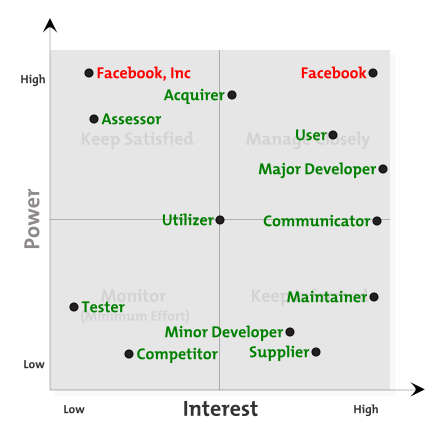
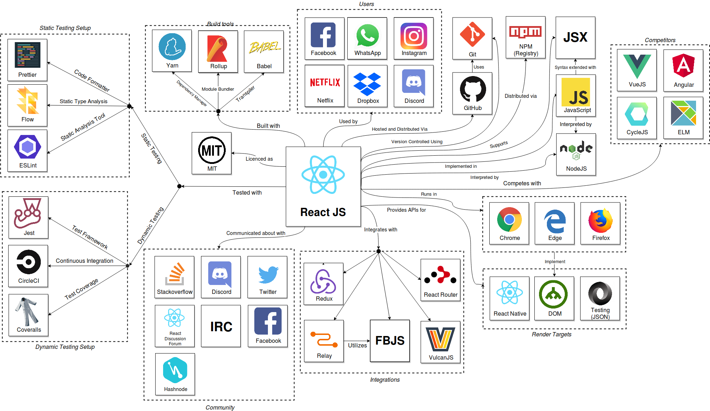
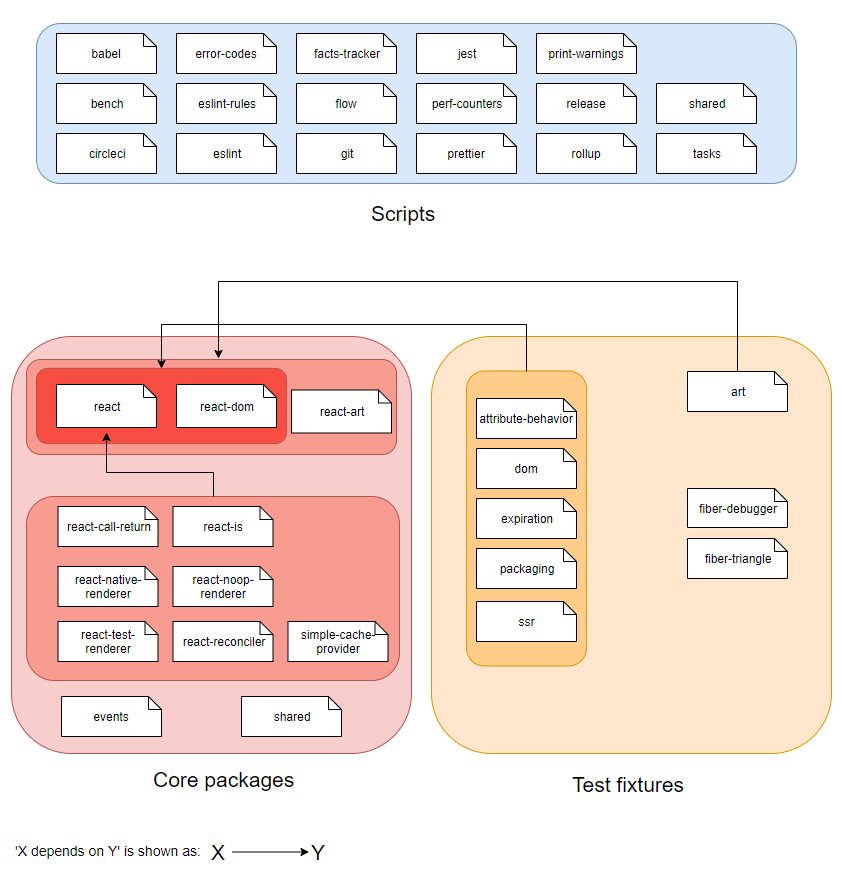

# Abstract

*React* is a JavaScript library that provides a declarative, component-based framework for developing interactive user interfaces that update in real-time without requiring page refreshes. We analyze the *React* project from several angles. First, we provide an overview of the stakeholders involved and their relative power and interest. Next, in the context view, we look at all the external tools and platform that *React* makes use of for development, testing, deployment, and so forth. We then move on to the development view, where we describe *React*'s internal structure as well as some of its standardized development practices. Finally, we analyze in detail the technical status of *React*: We identify its technical debt, including how it evolved and which associated discussions took place.

# Table of Contents

* [Introduction](#introduction)
* [Stakeholder Analysis](#stakeholders)
* [Context View](#context-view)
* [Development View](#development-view)
* [Technical Debt](#technical-debt)
* [Conclusion](#conclusion)

# 1. Introduction

The *React* framework, sometimes referred to as *ReactJS* or *ReactFB*, provides a declarative, component-based framework for the development of interactive and real-time user interfaces. Whereas web applications commonly require refreshing to view updated information, *React* allows for the manipulation of a virtual domain object model that interacts with the *real* domain object model of the browser, allowing for components which directly update when data is changed. As a result, *React* provides a web application user interface which changes in real time, causing greater interaction between the user and the application.

To assist developers and in an attempt to contribute to the project, this chapter focuses on the architectural aspects of *React*. These include a stakeholder analysis, a development viewpoint of the project, contextual analysis, and other information. Together this information provides an insight into the *React* project, possibly leading to a clearer overview of the project for new developers or to identify areas in which improvement is possible to ensure a greater degree of maintainability in the future.

# 2. Stakeholders

The stakeholders section aims to provide an overview of the various types of stakeholders of the *React* project, alongside analysis of their power and interest positions and their roles, as defined in Rozanski and Woods’ ‘*Software System Architecture: Second Edition* [1].’ Furthermore, a power-interest diagram is provided to indicate relative stakeholder influence regarding their control over the *React* project and their level of interest.

## 2.1 Stakeholders by Category

### 2.1.1 Acquirer

Within the context of *React*, the acquirers consist of [Facebook, Inc.](https://newsroom.fb.com/company-info/), and all its subsidiary companies, including Instagram and Atlas [2]. Although development is open to (and relies on) open source developers, all contributors must agree to the Facebook contributor license agreement (CLA) [3]. Thus, Facebook continues to authorize the development and control of the project.

### 2.1.2 Assessor

The main assessor of *React* is Facebook. Although the project is maintained and assessed by Facebook, it heavily relies on the open source community for continued development. To facilitate this, *React* has been made open source and allows for implementation of the project as a dependency solely through the utilization of the [*MIT* license agreement](https://github.com/facebook/react/blob/master/LICENSE) [4], which allows both private and commercial utilization of the *React* software, including modification and distribution, but waives liability and warranty requirements away from Facebook, thus ensuring the company cannot be legally held accountable for damages due to *React* software.

To further ensure compliance with legal requirements, all dependencies upon which *React* depends must also feature similar license terms to ensure waived liabilities and allow for distribution of the dependency within another project or package. Major dependencies within the *React* repository include ‘Babel’, a JavaScript compiler; ‘ESlint’, a *linting* utility for *JavaScript*; and *Rollup*, a module bundler for *JavaScript*. A [complete list of dependencies](https://github.com/facebook/react/blob/master/package.json) can be found in the project itself [5].

### 2.1.3 Communicator

Based on the repository activity, the communicators dealing with pull request discussions and oversight are:

* [Dan Abramov](https://github.com/gaearon) (@gaearon [7])

* [Brandon Dail](https://github.com/aweary) (@aweary [8])

* [Brian Vaughn](https://github.com/bvaughn) (@bvaughn [9])

These three communicators account for a majority of the active discussion and reviewing of pull requests and the technical communication of the *React* architecture.

### 2.1.4 Competitor

Stakeholders which are competitors include:

* [*VueJS*](https://vuejs.org) [14]
* [*Angular*](https://angular.io/) [15]
* [*Elm*](https://elm-lang.org) [16]
* [*CycleJS*](https://cycle.js.org) [17]
* [*Preact*](https://preactjs.com/) [43]

### 2.1.5 Developer

When analyzing the repository in the current state, there are a total of 1,157 minor developers, and the following ten major developers based on their contributions, commits, and features added:

* [**Sophie Alpert**](https://github.com/sophiebits) (@sophiebits [19])

* [**Paul O’Shannessy**](https://github.com/zpao) (@zpao [20])

* [**Dan Abramov**](https://github.com/gaearon) (@gaearon [7])

* [**Sebastian Markbage**](https://github.com/sebmarkbag) (@sebmarkbage [21])

* [**Andrew Clark**](https://github.com/acdlite) (@acdlite [22])

* [Pete Hunt](https://github.com/petehunt) (@petehunt [23])

* [**Brian Vaughn**](https://github.com/bvaughn) (@bvaughn [9])

* [Cheng Lou](https://github.com/chenglou) (@chenglou [24])

* [Christopher Chedeau](https://github.com/vjeux) [25])

* [**"Jim,"**](https://github.com/jimfb) (@jimfb [26])

These are the main developer stakeholders. Developers that are bolded are moreover organizational developers. Developers also hold roles related to providing support to end users, maintaining testing and engineering requirements, and acting as testers and verifiers for implemented behavior and changes. The developer is the stakeholder that, although not necessarily having the most power within the organization structure, performs the most versatile set of tasks. All developers must sign the *Facebook Contributor License Agreement* (CLA) and agree to the terms set out in the [contribution guide for *React*](https://reactjs.org/docs/how-to-contribute.html) [18].

### 2.1.6 Maintainer

A maintainer is a stakeholder that ensures documentation and knowledge is preserved over time. The responsible stakeholders for this task is the core *React* team and all its associated engineers, since they maintain the official *React* site and documentation. This core team published a subset of their meeting notes within a separate repository (*React-Notes*) for documentation purposes [42].

### 2.1.7 Supplier

The React team makes use of *Github* to host the project and coordinate with other developers, and the project package is hosted on and distributed via npm's package registry, npm-registry.

### 2.1.8 Tester

A tester is a stakeholder that ensures that *React* works correctly by performing a combination of unit tests, smoke tests, and other procedures both automated and manual which verify correct behavior. The role of testing is performed in two segments. Manual testing is done to verify behavior, which is the responsibility of all developer stakeholders and contributors who developed within the *React* repository.

The second type of testing stakeholder are the automated testing tools. The official *React* repository relies on [*CircleCI* ](https://circleci.com/gh/facebook/react)[27] and [*Coveralls*](https://coveralls.io/github/facebook/react) [28], who thus become two testing stakeholders. These stakeholders ensure that the automated tests, of which the repository boasts 90% coverage, pass and the desired functionality is maintained throughout development.

### 2.1.9 User

Some high-profile users, which consist of websites that utilize the *React* Library and are known to have significant traffic or awareness in both technical and non-technical communities, include:

* Netflix [29]

* Yahoo! [30]

* Airbnb [31]

* Discord [32]

* React Native [33]

Regarding these users, it should be mentioned that *React Native* is an implementation that allows native mobile applications to be developed. This means, in a simplified manner, that *React* is utilized to build components which are then compiled natively as opposed to being active on a server. *Facebook*’s subsidiaries, such as *Instagram* and *Oculus VR*, are also excluded from this category, as they fall under the greater umbrella of *React*’s main developer --- namely, *Facebook*. These stakeholders have a greater stake within the project than mere utilization of *React*, and due to this they are excluded from the user stakeholder role within this analysis.

## 2.2 Stakeholder Influence

To measure stakeholder influence and to dictate the level of communication a stakeholder must receive regarding *React*, a power-interest matrix was constructed. This matrix indicates stakeholders of increasing interest on the *x*-axis, and stakeholders of increasing power upon the *y*-axis. A stakeholder that is high power and low interest must be kept satisfied and informed only when necessary, whereas a stakeholder with low power but high interest should be informed and kept up to date, but not necessarily catered to. Stakeholders with both significant interest and power must be maintained closely, as they steer the project. The overview in figure 2.1 contains the most active contributors and most influential organizations.


*Figure 2.1: a diagram showing stakeholder power versus stakeholder interest.*

# 3. Context View

The context viewpoint describes the relationships, dependencies, and interactions between the system and its environment. This section identifies and discusses concerns regarding the system scope and responsibilities, external entities and services, and data used. As an illustration of the coherence of the entities a context diagram is also provided. The context view also includes other systems, organizations, or people that are involved with, or interact with, *React* in some manner.

## 3.1 System Scope

The system scope defines the main responsibilities that *React* provides, which consists of providing a *JavaScript* library for the development and utilization of user interfaces (UIs). This responsibility can be divided into the following sub-responsibilities:

 - Allows users to render input data and output the data to the screen.
 - Allows users to build encapsulated components that can manage their own state.
 - Provides users with the flexibility to interface with other libraries and frameworks.

## 3.2 Context Model

The context model, as shown in figure 3.1, depicts the many associated external dependencies related to *React*. They have been grouped where possible and the arrows represent what kind of relationship the entity has with *React*. A quick summation is made whereafter the [external entities](#external-entities) will be described in more detail.


*Figure 3.1: an overview of the external dependencies related to React.*

The center of the diagram shows *React* itself surrounded by the many different external entities. The left side shows the grouped [testing tools](#testing-tools) and they are further divided into two main testing setups: a static and dynamic testing setup. Next to the testing section on the left bottom the [community](#communication-channels) is located which is a large group including seven entities. The right of the community shows the [parties that integrate with React](#integrating-libraries-and-frameworks): the most important and popular entities have been picked and grouped here. Moving in counter-clockwise direction the [renderers](#render-targets) along with the browsers above them which implement the DOM are showed. In the right top corner the most popular and important [competitors](#competitors) are visualized.

Starting in the left top corner again the [build tools](#building-and-distribution-tools) that *React* uses to build the codebase are displayed. The distribution tools that are used along with these building tools are on in the right top corner next to the competitors. *React* has a lot of [users](#utilizing-applications) and next to the building tools the most popular software products that use *React* are grouped. Next to the users we see the [version control services](#version-control-services) that the *React* contributors use to control their code.

## 3.3 External Entities

### 3.3.1 Testing tools
To ensure that developers can test *React* properly, a testing environment exists which contains static and dynamic testing tools. With **[*Jest*](https://facebook.github.io/jest/)** the *JavaScript* code is dynamically tested in the form of test suites. Then, through the utilization of *Yarn*, all the *Jest* test suites can be executed by the developers. Additionally, **[*Coveralls*](https://coveralls.io/)** will provide an analysis of the code and unit coverage that these tests produce. **[*CircleCI*](https://circleci.com/)** is used to ensure that all *Jest* tests pass, which is done through the means of continuous integration (CI). This process ensures that development can be automated, which in turn provides an automated verification of correctness before code is deployed.

Besides *Jest* test files, the CI pipeline also runs the static analysis tools **[*Flow*](https://flow.org/)**, **[*ESLint*](https://eslint.org/)** and **[*Prettier*](https://prettier.io/)**. *Flow* is a static type checker for *JavaScript* and uses type inference to track data in the code that might lead to a bug. *ESLint* is a more general static analysis tool and is an open source project with the goal of providing a pluggable linting utility for *JavaScript*. *ESLint* will check for programming errors, bugs, stylistic errors, and other miscellaneous static errors. Finally, *Prettier* enforces that code is formatted in a correct and 'pretty' way, as defined by the style guide agreed upon by the *React* developers.

### 3.3.2 Version control services
*React* is an open source project which uses **[*Github*](https://github.com)** as its host. On *Github* an overview of the *React* codebase is shown. *Github* utilizes **[*Git*](https://git-scm.com/)** to function as version control of the codebase. Developers can employ *Git* to clone the codebase and maintain their own changes and those from others. Whenever a developer wishes to contribute, one must create a pull request on *Github* which will present the changes made to the codebase from their own Git branch to the core developers, whom can review and suggest necessary changes in cases of disagreement.

### 3.3.3 Building and distribution tools
**[*JavaScript*]()**
The library is implemented in the *JavaScript* language and should therefore be interpreted by a *JavaScript* runtime. In addition, various scripts related to building and testing the project are implemented that should be executed in the *NodeJS JavaScript* runtime.

**[*Babel*]()**
Relatively new syntactic *JavaScript* features (ECMA Script 2015+) are being used in the codebase of *React*. *Babel* is employed to transpile the code to an older syntax that is more broadly supported by adopted web browser versions. *Babel* interfaces with the project via a `.babelrc` configuration file in *JSON* format.

**[*Rollup*]()**
The *React* codebase consists of many modules, which are contained in separate *JavaScript* files. For *JavaScript* modules to be treated in a uniform way (such as by package managers), they must conform to a module format such as the *CommonJS* or *Asynchronous Module Definitions*. However, the ECMAScript 6 (ES6) revision proposes a native module system for importing and exporting functions and data between *JavaScript* files. Since challenges exist involving the implementation of this feature in *JavaScript* runtimes, *Rollup* is utilized which implements the functionality in the form of a package, thus allowing ES6 modules to be used. In addition, this allows *CommonJS* modules to be imported as well, ensuring a degree of backwards compatibility. The modules that compose the *React* codebase are managed and compiled in the form of ES6 modules by *Rollup*.

**[*NodeJS*](https://nodejs.org/en/)**
Tasks for manipulating the *React* codebase are run in *NodeJS*, a *JavaScript* runtime based on Google's V8 Engine.

**[*npm*]()**
*npm* is the package ecosystem (registry, manager, and other features) that came with *NodeJS*. With over 350,000 packages (2016) *npm* is the world’s largest open source software package ecosystem [51]. Furthermore, *npm* has had a negligible downtime. *React* is distributed as a package via the *npm* registry. It adheres to the CommonJS module format and manifests this by means of the `package.json` file.

**[*Yarn*]()**
Instead of the default *npm* package manager that comes bundled with *NodeJS*, *React* uses the *Yarn* package manager which is - coincidentally - a project operated by *Facebook*. Dependency *JavaScript* packages are retrieved from *Yarn*’s own package registry. *Yarn* interfaces with the project via a number of configuration files (`package.json`, `.yarnrc`, `yarn.lock`). The main file is a *YAML* file named `package.json`, describing *React* as a package itself as well as all its dependency packages.

### 3.3.4 Render Targets

*React* supports rendering the internally constructed UI component representation to different [target formats / systems](https://reactjs.org/docs/codebase-overview.html#renderers), handled by dedicated internal packages providing an interface to the targets. These targets consist of the following elements:

**[*DOM* (Browser)](https://github.com/facebook/react/tree/master/packages/react-dom)**
*React* builds a virtual document object model (DOM) internally when constructing components. It then allows the rendering of these components to the actual DOM in a differential manner. This is achieved by only applying changes to those components in the DOM that differ from the corresponding component in the virtual DOM. This allows components to be efficiently rendered on web pages rendered by browsers.

**[*React Native*](http://facebook.github.io/react-native/)**
*React Native* is *Facebook*’s framework for mobile application development, relying on *React* for UI building. *React* contains a renderer that is meant as an interface for *React Native* specifically. The code in this thin layer, which provides a dedicated interface to *React Native*, is part of the *React* codebase (as opposed to the one of React Native) due to its high coupling with the *React* core.

**[*JSON* (Testing)](https://github.com/facebook/react/tree/master/packages/react-test-renderer)**
For testing purposes, the internal component representation can also be rendered to JavaScript Object Notation (*JSON*). This is utilized by the *Jest* testing framework for snapshot testing.

### 3.3.5 Integrating libraries and frameworks

The developers at Facebook maintain a utility library named **[FBJS]()**, which consists of various in-house JavaScript packages, both to share these and to prevent duplication of code and effort. This library is a dependency for *React*, as well as some of its integrating packages.

Various libraries and frameworks integrate with *React*, and are often found to be used in combination. An example of this is the **[*Redux*](https://redux.js.org/)** state container, which is used to store and manipulate the state of an application. It has official [bindings](https://github.com/reactjs/react-redux) for *React*, such as smart components, which may listen to the store's state changes and presentational components get re-rendered when necessary. In addition, **[*Relay*](https://facebook.github.io/relay/)** is a framework that couples *React* and **[*GraphQL*](http://graphql.org/)** - a query language and server-side runtime for evaluating them. This allows for a workflow for the creation of data driven *React* applications.
Similarly, **[*VulcanJS*]()** is an example of a full-stack web application that incorporates *React* for the UI building aspects. Finally, **[*React Router*]()** is a set of navigational components allowing routing within a *React* application dynamically (i.e. as opposed to conventionally configuring routes up front).

### 3.3.6 Competitors

**[*VueJS*]()** is a highly similar *JavaScript* library for building web user interfaces. It employs similar techniques of virtualizing the DOM. *React* and *VueJS* are regarded to be similar to such an extent that there have even been efforts to transpile components between the two libraries, such as with the [Vueact](https://github.com/vueact) library. Another *JavaScript* library with use cases similar to *React* is **[*CycleJS*](https://cycle.js.org/)**, which attempts to distinguish itself by putting an emphasis on including the human user more in the loop in order to improve the human-computer interaction aspects of the web interface. Contrary to these libraries, **[*AngularJS*](https://angularjs.org/)** provides an entire framework for building front-end web applications. Similarly to *React* it abstracts away from DOM manipulation to better facilitate the development of interactive web interfaces. **[*Elm*]()** is a functional language that transpiles to *JavaScript*, having the specific purpose of programming interactive web applications.

### 3.3.7 Utilizing applications

Ultimately, the *React* library has the purpose of being incorporated into web applications to provide for and interactive front-end web interface. Numerous applications have done so, including *Netflix*, *Dropbox*, *Discord*, and *Facebook Inc.*'s internally developed applications such as *Facebook*, *WhatsApp*, and *Instagram*.

### 3.3.8 Communication channels

The *React* community is widespread across six applications. The **[*Facebook* page](https://www.facebook.com/react)** and the **[*Twitter* account](https://twitter.com/reactjs)** are the main broadcasting platforms where news and articles related to *React* can be found.

To learn more about problems in *React* or to ask personal questions, one can use the platform **[*Stack Overflow*](http://stackoverflow.com/questions/tagged/reactjs)** platform. This platform is known for providing a large question-and-answer base for a large amount of different languages, including *React*. The major developers at *React* ask to post code-level question on *Stack Overflow* while long-form discussions should be kept on the *React* Discussion Forum.

For a small question, one can go to *React*’s *Discord* page, which is called **[*Reactiflux*](https://discord.gg/0ZcbPKXt5bZjGY5n)**, to quickly find developers who are online. In addition, some of the developers are also found on the **[*IRC channel* #reactjs](https://webchat.freenode.net/?channels=reactjs)**.

*React* also uses **[*Hashnode*](https://hashnode.com/n/reactjs)** as a question-and-answer forum for discussions among developers.

# 4. Development View

The development view section aims to outline the module structure, codeline standards, and common design models of the *React* project.

## 4.1 Module Structure

A project's module structure represents the structural organization of the project’s source code into various inter-dependent internal modules.

#### 4.1.1 Test Fixtures

Test fixtures automatically set up specific environments for testing purposes, so that a developer may quickly check in what ways, if any, their modifications affect some of *React*’s basic functionalities. The test fixtures for *React* consist of: *art*, *attribute-behavior*, *dom*, *expiration*, *fiber-debugger*, *fiber-triangle*, *packaging*, and *ssr*.

#### 4.1.2 Scripts

Scripts are pieces of code that may be run to quickly and automatically achieve various goals. Developers can use scripts to run benchmarks, build and publish versions of *React*, and to lint files. The scripts for *React* consist of: *babel*, *bench*, *circleCI*, *error-codes*, *eslint-rules*, *eslint*, *facts-tracker*, *flow*, *git*, *jest*, *perf-counters*, *prettier*, *print-warnings*, release, *rollup*, shared, and tasks.

#### 4.1.3 Core packages

Core packages provide the main functionalities of *React*. The core packages of *React* consist of: events, react-art, react-call-return, react-dom, react-is, react-native-renderer, react-noop-renderer, react-reconciler, react-test-renderer, react, shared, and simple-cache-provider.

### 4.1.4 Module Structure Model

Figure 4.1 represents the organization of *React*, and displays these as interdependent modules.


*Figure 4.1: an overview of all the modules within React.*

## 4.2 Codeline Model

The codeline model describes the organization of *React*’s codeline. This defines the structure, code control, different types of code, how the code should be maintained, and which automated tools are used to build, deploy, release, and test the code.

The codebase of *React* is located on the *Github* platform and is open source. This allows developers to clone the code to their own computer in an efficient and quick manner. The code on *Github* can be automatically built and tested through continuous integration (CI). For this, *CircleCI* is used which is a free tool to setup a CI pipeline. After developers make a push to the code base in a PR, their code will automatically be built and tested to prevent any unwanted errors, bugs, or formatting issues.

To deploy *React*’s code, one must be an *npm*-owner to upload the code to the *npm* registry. A few scripts have been setup to automate a large part of the process, which is all about making sure that the latest master branch build succeeds as well as all the test suites. After these important factors, the *npm*-owner who wishes to publish will also have to do some sanity checks such as ensuring that users will get the right version of dependencies at run time. It is also advised to run all the `yarn` components: `yarn test`, `yarn lint`, and `yarn flow`. When all process steps have been finished by the *npm*-owner, the release process can begin by running the [build.js](https://github.com/facebook/react/blob/master/scripts/release/build.js) and [publish.js](https://github.com/facebook/react/blob/master/scripts/release/publish.js) script. The publish script will publish all build artifacts to *npm* and push it to *GitHub*.

For the developers to work concurrently they use *git* which provides version control for the codebase. For contributors it is necessary to first fork *React*’s repository so that they can make changes in any form they want. When changes are made to the fork they can be proposed to the React main repository by means of a pull request. Communicators or other in-house stakeholders will then review the changes made and accept or refuse the request.

*Rollup* addresses the desired structure of the code. Developers achieve this by installing the required plugins for *Rollup*. This is only required for the production build as using *Rollup* in the development build will also remove development warnings. The source code should be structured into a few packages as described in the figure 4.2.

| Package               | Description                              |
| --------------------- | ---------------------------------------- |
| events                | *React* implements an event system which does not depend on the renderers and work with React DOM and React Native. |
| react-art             | React-Art is used for drawing vectors, providing declarative and reactive bindings to sebmarkage's art-library, available at: https://github.com/sebmarkbage/art/ |
| react-call-return     | An experimental package for multi-pass rendering in *React*. |
| react-dom             | This is all about the React DOM renderer. Can be used as a standalone browser bundle. |
| react-is              | In this package one can set arbitrary test values and evaluate different objects of types specific to *React*. |
| react-native-renderer | Renders *React-Native* components to native views used in mobile applications. |
| react-reconciler      | The different render packages share some code between them. This (unstable) package solves this issue of having duplicate code. |
| react-test-renderer   | Renders *React* components to JSON trees. Mainly used for snapshot testing with *Jest*. |
| react                 | The core React code is located here. It includes the APIs necessary to define components. |
| shared                | (We spent some time researching what this package is for, but were unable to find any information on it.) |
| simple-cache-provider | Unstable package which includes a cache for *React* applications. |

*Figure 4.2: Codeline package structure and relations.*

#### 4.2.1 Module inter-relatedness

A number of observations of the dependencies between modules may be gleamed from figure 4.1.

- Given that 'react' contains the most important code of the entire *React* project, it is no surprise that many of the other packages depend on it.
- There are no other dependencies amongst core packages; each package does its own thing, and at most needs only the 'react' core.
- A number of test fixtures depend on both 'react' and 'react-dom', which is "intended to be paired with the isomorphic react" [60]. Together, they may provide a complete core environment for test fixtures to build upon.
- The test fixture 'art' depends not only on 'react' and 'react-dom', but furthermore also on the 'art' core package.

## 4.3 Common Design Models

Common design models describe standardization agreements which dictate how developers and contributors must contribute to ensure that the *React* project remains of a high quality and well tested status. The major segments within the common design models for *React* are the standardization of code style, dependencies, and testing.

### 4.3.1 Standardization of Code Style

To ensure that all submitted code looks the same (identical indentation, variable naming, and other code style preferences), there are agreements regarding code style that must be followed within each contribution to *React*. Any contribution which does not adhere to the agreed upon code style standards will not be considered for implementation into the core release, as per the *React* contribution guide. The standardization of the code base consists of the following requirements:

+ Code must be automatically formatted through the utilization of *Prettier* [52] and *Yarn* [53]. When running 'yarn prettier', all changes made to the code will be automatically formatted to the desired and agreed upon standards. To find remaining style guide issues remaining, a developer can then run 'yarn lint' to run the *linter* [61] for the project.

+ All cases which are disputed and not resolved through the aforementioned tools will result in a default to match the *AirBnB Javascript* style guide [54].

+ As described in the codeline model section, active enforcement of code style standardization takes place through, *CircleCI*, among others.

### 4.3.2 Standardization of Dependencies

*React* has a multitude of dependencies, which all require active monitoring to ensure the project remains stable. To avert this issue, all dependencies which *React* requires to function have become part of the *Facebook Inc.* body of repositories. This ensures that both legal and code stability requires are entirely covered and not dependent on external parties.

To further ensure the standardization of where dependencies are found, *React* requires the utilization of a package manager. *React* employs *Yarn*[53] for test and code formatting dependency deployment, and *npm*[56] for other dependency managements. By ensuring that all developers obtain their dependencies from the same package managers, it is guaranteed that all dependencies are identical, meaning compatibility issues don't propagate.

# 5. Technical Debt
This section contains all information regarding the technical status of *React*, the identification of technical debt, its evolution, and the discussions that took place regarding technical debt. A consideration is given to both the implementation itself, and also to technical debt related to testing.

## 5.1 Identification of Technical Debt

The identification of the technical debt within *React* was done through a combination of automated code quality analysis with the use of tools, and a manual code analysis taking into consideration the *SOLID* principles [62] for software design.

### 5.1.1 Automated Code Quality Analysis
Automated Code Quality Analysis refers to the utilization of tools that allow automatic validation of agreed upon static and dynamic code regulations. The static analysis refers to adherence to agreed spacing and code style requirements, whereas dynamic refers to code execution evaluation and the coverage provided by automated tests. These metrics provide an insight into the technical state of *React* and can assist in finding areas within the project that contain significant technical debt. These indebted areas, which are places in the code that require attention to fix technical issues, can then be selected for refactoring.

#### 5.1.1.1 Static Code Analysis
The static code analysis aimed to identify issues within *React* that are related to code quality and code formatting. *React* relies on multiple tools to perform static code analysis, two of which are *Flow* [63] and *TypeScript* [64]. Although these two perform a similar function regarding code analysis, *React* implements both and has *JSON* files and configurations that separately perform similar analysis over similar components. This is a form of technical debt, as redundancy usually indicates a disagreement or refactoring took place, and there was no decision made regarding which implementation should be kept.

Beyond this duplication, running the static code analysis as described in the *React* contribution guide [65], no static code errors exist in the master branch of the code. This is due to the requirements outlined in the contribution guide, which dictate that any pull requests or submissions to the codebase with these errors will be rejected on those grounds, ensuring a low technical debt and high static code quality.

#### 5.1.1.2 Dynamic Code Analysis
The dynamic code analysis was performed by measuring the test coverage generated by the latest release of the master branch, as reported by the in-house *Coveralls* coverage tool [66]. The decision was made to only analyze the core, *create-subscription*, *dom*, and ** folders to avoid accidentally considering *React Native* or testing packages. Packages meant for distribution or non-functional purposes, such as files aimed at the *npm* package manager, are also ignored. The statistics for each package can be found table 5.1.

| Package             | File / Folder             | Coverage % |
| ------------------- | ------------------------- | ---------- |
| Create-Subscription | createSubscription.js     | 88.04%     |
| Core                | React.js                  | 86.21%     |
| Core                | ReactBaseClasses.js       | 88.24%     |
| Core                | ReactChildren.js          | 89.85%     |
| Core                | ReactContext.js           | 86.36%     |
| Core                | ReactCreateRef.js         | 85.71%     |
| Core                | ReactCurrentOwner.js      | 100.00%    |
| Core                | ReactDebugCurrentFrame.js | 92.86%     |
| Core                | ReactElement.js           | 85.93%     |
| Core                | ReactElementValidator.js  | 90.91%     |
| Core                | ReactNoopUpdateQueue.js   | 82.14%     |
| Core                | forwardRef.js             | 83.33%     |
| DOM                 | client                    | 94.79%     |
| DOM                 | events                    | 88.56%     |
| DOM                 | server                    | 95.61%     |
| DOM                 | shared                    | 96.35%     |
| DOM                 | test-utils                | 86.67%     |
| DOM                 | unstable-dependencies     | 100.00%    |
| noop-renderer       | ReactNoop                 | 64.90%     |
|                     | TOTAL                     | 89.92%     |

*Table 5.1: overview of packages/files, and their associated test coverage percentage value.*

As the table shows, the overall coverage for *React* is 89.92%, a significant coverage metric, indicating good code quality. However, the largest discrepancies in coverage results are found in the *reactCurrentOwner*, *unstable-dependencies*, and *ReactNoop*. The *reactCurrentOwner* and *unstable-dependencies* sections are both positive outliers due to their perfect test coverage. This score is attributed to the fact that these classes validate that certain subclasses or dependencies are called in a certain order. If any tests invokes any part of these sub-classes, the top level classes receive maximum possible coverage. The negative case is the *ReactNoop JavaScript* file, which is a renderer aimed at allowing for the testing of semantics outside of the actual *React* environment. This class has a low coverage, mostly due to the fact that branches are barely tested and error handling is not tested. Since this class aims to validate semantic behavior, many catch-throw operations take place, yielding many errors, which are not tested.

Due to the finding of a lack of error catching testing, a further manual analysis was done based on the code coverage report. Analysis shows that many instances of test coverage decreases can be attributed to a lack of error handling testing. Instances in which code equivalent to that found in the figure below is located are rarely tested, significantly decreasing code and branch coverage for *React*.

```
if CONDITION TO TEST < SHOULD NOT OCCUR {
  throw new Error('This is the error message of an untested error.');
}
```

*Figure 5.2: theoretical example of untested failure cases.*

Of the packages that have less than 80% coverage, *react-call-return* and *simple-cache-provider* are noted in their respective README’s to be very unstable and prone to changes, which explains their lower test coverage. Furthermore, *react-noop-renderer* is not meant for direct use. *React-art*, which has the lowest result of these packages, is used primarily for drawing. It is speculated that, since a flaw in this package would only cause cosmetic errors, thorough testing was deemed of lesser importance for this particular package, but this is mere conjecture.

### 5.1.2 SOLID Analysis
The *SOLID* principles [62] consist of ideas that a project must adhere to with regards to class responsibilities and interaction to ensure the complexity remains at an acceptable level while also being maintainable. The principles are closely related to the object-oriented programming (*OOP*) principles. *SOLID* consists of the **Single Responsibility Principle**, **Open-Closed Principle**, **Liskov Substitution Principle**, **Interface Segregation Principle**, and the **Dependency Inversion Principle**. *React* was analyzed based on these principles, and the results for each principle can be found below in the respective sub-category. Class identification was performed in part based on the findings from the *static* and *dynamic code analysis* sections.

#### 5.1.2.1 Single Responsibility Principle
Although *React* does a good job attempting to organize all the classes and packages based on their functionality (*DOM*, *noop-renderer*, core), there are still classes which violate this principle. The clearest violation of the SRP is the *ReactDOM* class [67], found in the *DOM* package. This class, clocking in at 1354 lines of code (LOC), is not only responsible for the updating and handling of the DOM elements, but also for managing related dependencies such as batching and event registration. This violation of the SRP is so abundant that even the developers have made a *TODO* comment regarding this behavior to fix it. This comment, including the importing of responsibility classes, is shown in figure 5.3.

```
import '../shared/checkReact';
import './ReactDOMClientInjection';
import ReactFiberReconciler from 'react-reconciler';
// TODO: direct imports like some-package/src/* are bad. Fix me.
import * as ReactPortal from 'shared/ReactPortal';
import ExecutionEnvironment from 'fbjs/lib/ExecutionEnvironment';
import * as ReactGenericBatching from 'events/ReactGenericBatching';
import * as ReactControlledComponent from 'events/ReactControlledComponent';
import * as EventPluginHub from 'events/EventPluginHub';
import * as EventPluginRegistry from 'events/EventPluginRegistry';
import * as EventPropagators from 'events/EventPropagators';
import * as ReactInstanceMap from 'shared/ReactInstanceMap';
import {enableCreateRoot} from 'shared/ReactFeatureFlags';
import ReactVersion from 'shared/ReactVersion';
import * as ReactDOMFrameScheduling from 'shared/ReactDOMFrameScheduling';
import {ReactCurrentOwner} from 'shared/ReactGlobalSharedState';
import getComponentName from 'shared/getComponentName';
import invariant from 'fbjs/lib/invariant';
import lowPriorityWarning from 'shared/lowPriorityWarning';
import warning from 'fbjs/lib/warning';
import * as ReactDOMComponentTree from './ReactDOMComponentTree';
import * as ReactDOMFiberComponent from './ReactDOMFiberComponent';
import * as ReactInputSelection from './ReactInputSelection';
import setTextContent from './setTextContent';
import validateDOMNesting from './validateDOMNesting';
import * as ReactBrowserEventEmitter from '../events/ReactBrowserEventEmitter';
import * as ReactDOMEventListener from '../events/ReactDOMEventListener';
import {getChildNamespace} from '../shared/DOMNamespaces';
```

<p align="center">
  <small><i>Figure 5.3: violation of the SRP in react-DOM.</i></small>
</p>

A violation of the SRP commonly indicates that too many responsibilities were added as development continued without a clear managing or central entity which manages this. This, in turn, can show signs of a lack of planning or refactoring, and thus the accumulation of technical debt. These classes could be refactored through central discussions of lead developers, who could agree on a new standard and refactor this.

#### 5.1.2.2 Open-Closed Principle
*React* clearly violates this principle through the implementation of the renderer. React utilizes the *noop* renderer to validate behavior at a more syntactical and abstract level, which allows for easier testing of implemented logic. The *noop* renderer is stored in a separate package with a single source file [69], whereas the updater hooks for *noop* are placed in the *ReactNoopUpdateQueue* class in the root package [70].

If *React* were to adhere to the OCP, an attempt would be made to extend the update queue class based on the native *noop* update queue, or the *noop* renderer found in *React* would be extended to only re-implement the differentiated features of the native *noop* renderer. This behavior and violation of the OCP exists in multiple other locations within *React*, and commonly indicates a lack of developer willingness to utilize the native source dependencies to create desired functionality. This, in turn, means that the tested functionality found in these dependencies can possibly be broken. This, in turn, creates additional technical debt due to tests that can start failing as a result of the OCP violating extensions.

It should be noted that *React* itself is easily extendable, thereby adhering to the OCP. *Facebook* has done this themselves with *React-DevTools* [72], a project which provides developers additional insights into *React* by extending the core of the project.

#### 5.1.2.3 Liskov Substitution Principle
Within *React*, this behavior occurs in multiple instances, but the clearest violation is, again, the *noop* renderer. When attempting to utilize the renderer as an extension to the *noop* class in the source package, multiple violations will occur. This principle is important to track, since violations of it commonly indicate that a subclass is too dependent on changing behavior of its associated super class, meaning single change in this super class can break the subclass. This would then result in the increase of errors, and hence, the overall technical debt.

#### 5.1.2.4 Interface Segregation Principle
If clients were too dependent, then changing hooks would result in the required updating of components within *React* or by partners, thus decreasing the ease of implementation and thereby increasing technical debt. *React* clearly segments its packages, as shown in table 5.4.

| Package               | Purpose                                  |
| --------------------- | ---------------------------------------- |
| create-subscription   | Allows subscriptions to external, non-*React* data. |
| events                | Ensures changes required to be caught can be caught, separate from *React* core. |
| react-ART             | Allows for creation of vector graphics in *React*. |
| react-call-return     | Experimental implementation of multi-pass rendering. |
| react-dom             | *React*'s implementation of the domain object model. |
| react-is              | Package for testing of values to see if they are a *React* type. |
| react-native-renderer | The renderer used for the *JavaScript*-less version of *React*. |
| react-noop-renderer   | The renderer used for the *noop* purposes. |
| react-reconciler      | Allows the creation of custom *React* renderers. |
| react-test-renderer   | Renders *React* components without reliance on the *React* DOM. |
| react                 | Core folder, provides the library.       |
| shared                | Contains classes and functionality required by all elements. |
| simple-cache-provider | Basic cache for *React*.                 |

<p align="center">
  <small><i>Table 5.4: described purposes of React interfaces.</i></small>
</p>

Due to the segregation, developers can clearly see which elements they must edit, and all shared responsibility can be found in a single location. Overall, the *React* implementation indicates that experimental and additional library functionality is separated from the core functionality. This decreases overall technical debt, as specific features can be isolated for implementation, and shared elements are tested uniformly and reviewed by all developers.

#### 5.1.2.5 Dependency Inversion Principle
As shown in the interface segregation section, *React* segregates based on functionality, but also within the project itself. As the package layout shows, an effort was made to split renderers based on functionality, and dependencies based on external hook requirements (a developer implementing *React* desires the event package, but not the core package). Due to this, bugs can be avoided, as changing modules does not cause a change in functionality throughout the system nor its implementing modules.

## 5.3 Evolution of Technical Debt
Originally, React was developed internally at Facebook by Jordan Walke. The [initial public version](https://github.com/facebook/react/commit/e9e6b9b9b7558f1bc972f5cfb7b396d396a5508f) was [released](https://github.com/facebook/react/releases/tag/v0.3.0) in May 2013. Over the course of the past 5 years, React went through numerous architectural changes. This section describes a few specific cases of major changes to the design and architecture of React that had a major impact on its technical debt. We first analyze the re-implementation of the core algorithm known as *reconciliation* over the course of 2016 and 2017 as part of the release of React 16.

The evolutions described in this chapter were identified by elaborately inspecting the React documentation, the repository revision history, GitHub Issues and Pull-Requests, meeting notes and conference talks. In a later iteration, we plan to identify additional cases by using automated tools on the codebase for example to generate and analyze an Evolution Matrix. In addition we aim to describe a number of other smaller evolutions that were identified in the documentation.

### 5.3.1 Reconciler Re-implementation
In this section, we explain the 'reconciler', which is considered to implement the core algorithm of React. We then describe how this subsystem has evolved over time by addressing a major re-implementation. Finally we address how this evolution relates to technical debt.

#### 5.3.1.1 Purpose of the Reconciler
React provides a declarative API to developers for declaring components of a user interface (UI). This means that determining which actions to perform in order to reflect changes in the state of the UI is entirely handled by the library. This is referred to as a *pull* approach as opposed to *push* approach. The naive approach to implement this behavior would be to completely rebuild the UI on each state change. This might work in small trivial applications, but it quickly becomes expensive in terms of performance for larger applications.

To solve this problem, React employs an algorithm for determining a minimal amount of changes to the UI necessary to reflect an updated state. Initially, a representation of the UI is rendered in the form of a tree of nodes, which is internally cached. This tree is then flushed to the render target (e.g. the DOM) in order to effectuate it. Any subsequent changes to the state will result in the tree being re-rendered. The resulting tree is then compared to the cached tree using a diffing algorithm to determine the minimal amount of changes necessary to transform the cached tree into the new tree. Only these changes are then flushed to the render target. As a benefit, the reconciler can be reused in combination with different renderers, since the changes are described in a render-target-agnostic way.

The problem of comparing trees this way in general can be solved using an *O(n<sup>3</sup>)* algorithm, but this is not fast enough in practice. React implements a diffing algorithm named 'reconciliation' that uses two main heuristics to improve performance as listed in the [Reconciliation documentation](https://reactjs.org/docs/reconciliation.html):

> - Two elements of different types will produce different trees.
> - The developer can hint at which child elements may be stable across different renders with a key prop.

#### 5.3.1.2 Evolution process
After a couple of years of research on the initial *Stack Reconciler*, the React team decided to completely overhaul the core reconciliation algorithm. Right after the release of React 15, the target of re-implementation of the reconciler was set for the next milestone of the React 16 release, as documented in the [meeting notes of April 4th, 2016](https://github.com/reactjs/core-notes/blob/master/2016-04/april-07.md). Sebastian Markbåge (@sebmarkbage) appears to be the lead developer of this new reconciler. Initially, the new reconciler is referred to as the *incremental reconciler*, although later it would be named the *Fiber Reconciler*. In the [notes of April 21th](https://github.com/reactjs/core-notes/blob/master/2016-04/april-21.md) some first concerns with regards to the re-implementation are referred to, as expressed and discussed upon earlier in [Issue 6170](https://github.com/facebook/react/issues/6170) (March 2nd). The first commit for the new reconciler was merged as part of [PR 6690](https://github.com/facebook/react/pull/6690). Later meetings of [June 9th](https://github.com/reactjs/core-notes/blob/master/2016-06/june-09.md), [June 23rd](https://github.com/reactjs/core-notes/blob/master/2016-06/june-23.md#update-on-fiber), [August 4th](https://github.com/reactjs/core-notes/blob/master/2016-08/august-04.md), [October 13th](https://github.com/reactjs/core-notes/blob/master/2016-10/october-13.md), [October 20th](https://github.com/reactjs/core-notes/blob/master/2016-10/october-20.md), [November 3rd](https://github.com/reactjs/core-notes/blob/master/2016-11/november-03.md) and [December 1st](https://github.com/reactjs/core-notes/blob/master/2016-12/december-01.md) each record updates on the development of Fiber. In order to allow other developers to start contributing to the Fiber Reconciler, Sebastian published the principles behind the new reconciler in [Issue 7942](https://github.com/facebook/react/issues/7942) on October 11th. The last recorded core team [meeting notes of December 8th](https://github.com/reactjs/core-notes/blob/master/2016-12/december-08.md) record that Fiber has been successfully employed in various example applications, and that is set to rollout early 2017. The completion status of Fiber - which had gained quite some public attention being a major new feature - was tracked publicly on a [dedicated website](http://isfiberreadyyet.com/). There were some concerns about backwards compatibility as discussed in [Issue 9463](https://github.com/facebook/react/issues/9463) starting from April 20th, 2017, but the core developers guaranteed it would work out of the box due to their focus on feature parity. The [release of v16.0.0](https://github.com/facebook/react/releases/tag/v16.0.0) on September 16, 2017 - later than anticipated - was the first version to include the new Fiber reconciler, as reported in the corresponding [blog post](https://reactjs.org/blog/2017/09/26/react-v16.0.html).

#### 5.3.1.3 Paying the Technical Debt
The re-implementation had the general purpose of paying technical debt in numerous ways. The re-implementation allowed the team to solve various long standing issues like readability and anti-patterns in what seems to be the most complex part of the codebase in one fell swoop. This is for example expressed in the [meeting notes of October 13th, 2016](https://github.com/reactjs/core-notes/blob/master/2016-10/october-13.md):

> It seems like Fiber is our best shot at fixing many long-standing issues with React, and we are going to place all our effort into either replacing existing reconciler with Fiber, or failing spectacularly with it (and learning from that).

However, these opportunities seemed to be side issues, as the re-implementation was mainly motivated by the problem that the synchronous uninterruptible rendering process often impacted user experience in large applications. As a solution, work like diffing and rendering would have to be scheduled and prioritized. This would allow for example rendering of animations to be prioritized over fetching data from external sources. In addition, concurrency plays an important role: if the rendering / diffing process were to be split up into different interruptible units of work, low priority work could be paused for a higher priority workload, and resumed afterwards.

The old implementation of the reconciliation algorithm did not allow for these critical improvements, which can be identified as a large expansion of technical debt. Fiber paid this debt by implementing scheduling and concurrency as described above. More specifically, it implements a virtual call stack specific to the domain of building user interfaces. Each virtual stack frame (i.e., a unit of work) is referred to as a "fiber", hence the name of the reconciler. An analogy between Fiber and the more general concept of the call stack can be made as shown in table 5.5.

**Call Stack** | **Fiber**
--- | ---
Subroutine | Component Type
Body *(Nested subroutine invocations)* | Children
Return Address | Parent Component
Arguments | Props
Return Value | Tree Nodes *(render target specific output)*

<p align="center">
  <sub><sup><i>Table 5.5: analogy between the call stack and Fiber.</i></sub></sup>
</p>

The high-level architectural changes brought about by the introduction of Fiber are further elaborated upon by Andrew Clark (@acdlite) in his [Fiber Architecture description](https://github.com/acdlite/react-fiber-architecture) and his [Talk at ReactNext 2016 on Fiber](https://www.youtube.com/watch?v=aV1271hd9ew).

# 6. Conclusion

Despite *React* being a large project with many contributors and large packages, it manages to maintain a high level of test coverage and an overall well organized codebase. Their codeline model and requirements for developers are clear and organized in a good fashion. Hence, we conclude that *React* is a project which is acting at potential and spending time at taking care of technical debt and issue within the project. This could be seen through their reconciler re-implementation. A significant effort is also put into keeping the codebase segregated based on features, thereby also making it easier to have an overview of the project and all possible permutation regarding renderers and other options.

Future focuses for *React*, based on this research, should consist of managing their documentation and continuing the current trend regarding code quality and organization.

Please note that a more extended version of this chapter, including additional information, is available at [our chapter repository](https://github.com/delftswa2018/team-react).

# References, Footnotes, & Works Cited

[1] Nick Rozanski and Eoin Woods. 2012. Software Systems Architecture: Working with Stakeholders Using Viewpoints and Perspectives. Chapter 9, pages 135-138. Addison-Wesley.

[2] Facebook Inc. Our History. Accessed at https://newsroom.fb.com/company-info/ on 22 February 2018.

[3] ReactJS, 2018. How to Contribute. Accessed at https://reactjs.org/docs/how-to-contribute.html on 22 February 2018.

[4] Github. React/License. Accessed at https://github.com/facebook/react/blob/master/LICENSE on 22 February 2018.

[5] Github. React/package.json. Accessed at https://github.com/facebook/react/blob/master/package.json on 23 February 2018.

[6] Nick Rozanski and Eoin Woods. 2012. Software Systems Architecture: Working with Stakeholders Using Viewpoints and Perspectives. Chapter 9, page 135, Communicators. Addison-Wesley.

[7] https://github.com/gaearon

[8] https://github.com/aweary

[9] https://github.com/bvaughn

[10] https://stackoverflow.com/questions/tagged/reactjs

[11] https://discuss.reactjs.org

[12] https://twitter.com/reactjs

[13] https://facebook.com/react

[14] https://vuejs.org

[15] https://angular.io/

[16] https://elm-lang.org

[17] https://cycle.js.org

[18] ReactJS, 2018. How to Contribute. Accessed at https://reactjs.org/docs/how-to-contribute.html on 2 March 2018.

[19] https://github.com/sophiebits

[20] https://github.com/zpao

[21] https://github.com/sebmarkbag

[22] https://github.com/acdlite

[23] https://github.com/petehunt

[24] https://github.com/chenglou

[25] https://github.com/vjeux

[26] https://github.com/jimfb

[27] https://circleci.com/gh/facebook/react

[28] https://coveralls.io/github/facebook/react

[29] https://medium.com/netflix-techblog/netflix-likes-react-509675426db

[30] https://yahooeng.tumblr.com/post/101682875656/evolving-yahoo-mail

[31] https://www.youtube.com/watch?v=tUfgQtmG3R0

[32] https://blog.discordapp.com/using-react-native-one-year-later-91fd5e949933

[33] https://facebook.github.io/react-native/

[34] Wolf, Adam. *Explaining React's license*. Facebook. Accessed at https://code.facebook.com/posts/112130496157735/explaining-react-s-license/ on 13 March 2018.

[35] https://opensource.org/licenses/BSD-3-Clause

[36] https://code.facebook.com/pages/850928938376556

[37] https://www.apache.org/legal/resolved.html#category-x

[38] Mullenweg, Matt. *On React and WordPress*. Accessed at https://ma.tt/2017/09/on-react-and-wordpress/ on 13 March 2018.

[39] https://twitter.com/reactjs/status/911347634069168128

[40] Mullenweg, Matt. *Facebook Dropping Patent Clause*. Accessed at https://ma.tt/2017/09/facebook-dropping-patent-clause/ on 13 March 2018.

[41] https://github.com/facebook/react/commit/b765fb25ebc6e53bb8de2496d2828d9d01c2774b

[42] https://github.com/reactjs/core-notes

[43] https://preactjs.com/

[44] https://github.com/reactjs/core-notes

[45] https://stackoverflow.com/questions/tagged/reactjs

[46] https://discuss.reactjs.org/

[47] https://discord.gg/0ZcbPKXt5bZjGY5n

[48] http://irc.lc/freenode/reactjs

[49] https://github.com/markerikson/react-redux-links

[50] https://www.reactiflux.com/learning/

[51] https://www.linux.com/news/event/Nodejs/2016/state-union-npm

[52] - https://prettier.io

[53] - https://yarnpkg.com

[54] - https://github.com/airbnb/javascript

[55] - ReactJS, 2018. How to Contribute. *Style Guide*. Accessed at https://reactjs.org/docs/how-to-contribute.html on 2 March 2018.

[56] - https://www.npmjs.com/

[57] - https://facebook.github.io/jest/

[58] - ReactJS, 2018. How to Contribute. *Sending a Pull Request*. Accessed at https://reactjs.org/docs/how-to-contribute.html on 6 March 2018.

[59] - https://flow.org/

[60] - https://github.com/facebook/react/tree/master/packages/react-dom

[61] - https://eslint.org/

[62] Ramirez, Cristian. *S.O.L.I.D The first 5 principles of Object Oriented Design with JavaScript*. Accessed at https://medium.com/@cramirez92/s-o-l-i-d-the-first-5-priciples-of-object-oriented-design-with-javascript-790f6ac9b9fa on 13 March 2018.

[63] https://flow.org/

[64] https://www.typescriptlang.org/

[65] ReactJS, 2018. *How to Contribute*. Accessed at https://reactjs.org/docs/how-to-contribute.html on 15 March 2018.

[66] https://coveralls.io/builds/15992318

[67] https://github.com/facebook/react/blob/master/packages/react-dom/src/client/ReactDOM.js

[68] Meyer, Bertrand (1988). *Object-Oriented Software Construction*. Prentice Hall.

[69] https://github.com/facebook/react/blob/master/packages/react-noop-renderer/src/ReactNoop.js

[70] https://github.com/facebook/react/blob/master/packages/react/src/ReactNoopUpdateQueue.js

[71] Martin, Robert (2002). *Agile Software Development: Principles, Patterns and Practices*. Pearson Education.

[72] https://github.com/facebook/react-devtools

[73] https://github.com/markerikson/react-redux-links

[74] https://www.fullstackreact.com/30-days-of-react/day-22/

[75] https://www.robinwieruch.de/tips-to-learn-react-redux/#react-test-often

[76] http://reactkungfu.com/2015/07/approaches-to-testing-react-components-an-overview/

