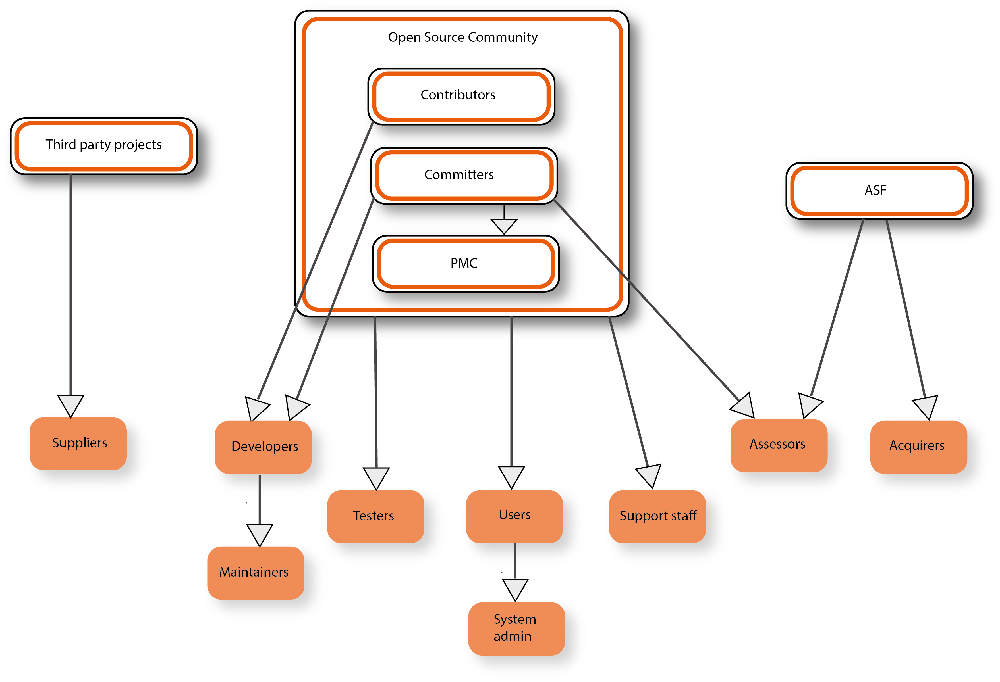
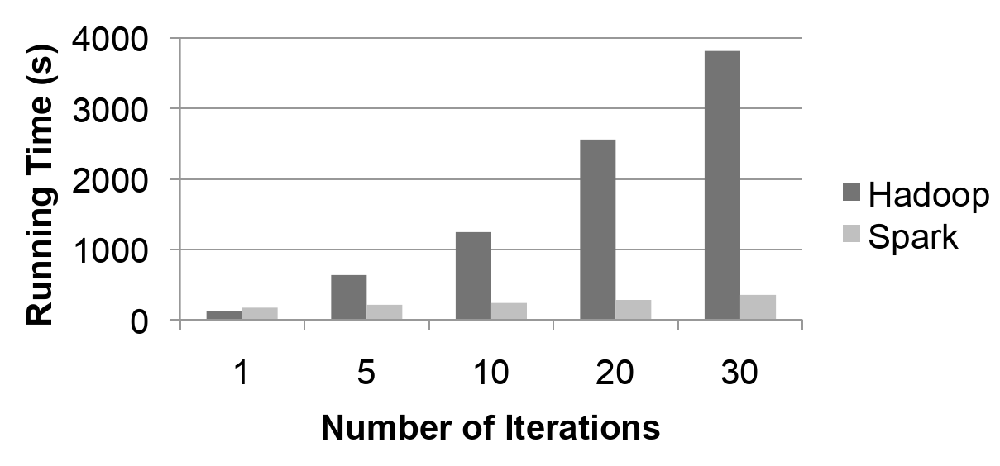
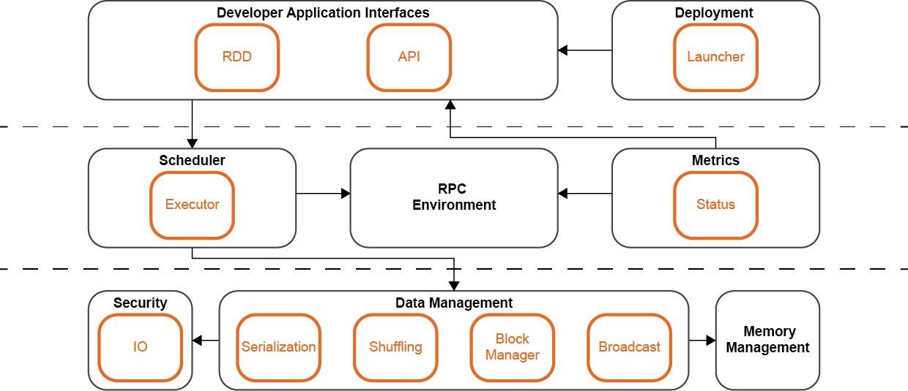
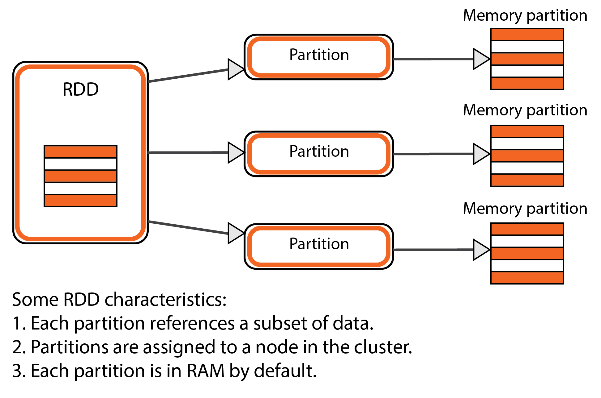

# Apache Spark

By [Chia-Lun Yeh](https://github.com/chialun-yeh), [Hiram Rayo Torres Rodríguez](https://github.com/Hrayo712), [Valérie Pourquié](https://github.com/vpourquie), and [Riaas Mokiem](https://github.com/arucard21).

## Abstract

Apache Spark is a fast and general engine for large-scale data processing. Developed originally at the University of California, Berkeley's AMPlab by Matei Zaharia, and later donated to the Apache Software Foundation, which has maintained it since. Spark was designed specifically to increase performance on specific use-cases like machine learning where Hadoop's MapReduce performed poorly. 

This chapter provides an insight of the Spark Core architecture by following the viewpoints and perspectives architectural description suggested by Nick Rozanski and Eoin Woods in their book. We give a description of the stakeholders and an insight of the context in which Spark is developed. Then, we proceed to describe the Functional view, the Performance perspective, and the Development view, to show how Spark was designed in order to meet its original requirements and how it is implemented. Also, an analysis of technical debt on the system is made, and finally, we conclude by giving our opinion on the previously mentioned aspects.

## Introduction

Apache Spark is an open-source framework for processing large amounts of data. It is described as "a fast and general engine for large-scale data processing" [[1]],  providing up to 100x faster performance than Hadoop MapReduce when the data can be read from memory and up to 10x faster performance when the data has to be read from disk. It is a Top-Level Project of the Apache Software Foundation [[2]] and is one of the most active projects in the Apache Software Foundation [[3]].

Apache Spark was created after specific use-cases, like machine learning, were shown to perform poorly using Hadoop MapReduce. Alleviating these problems provided the motivation for creating Spark [[4]].

After some analysis of the Apache Spark project, it became apparent that it actually contains many distinct products. The prominent ones that are singled out on the website are Spark SQL, Spark Streaming, MLib, and GraphX. These products provide specialized functionality on top of the main Spark product, Spark Core. 

Given the complexity of the Apache Spark project and our time constraints, we decided to focus on the main product of the Apache Spark project, Spark Core. It provides the essential functionality used in Spark since all other Spark products are built around it.

In this chapter, we try to provide some insight into the architecture of Spark Core. We first describe who the stakeholders are in the Stakeholders Analysis, and how Spark Core fits into the world around it, in the Context view. We then describe the Functional view, the Performance perspective and the Development view, which should provide insight into what Spark Core does, how it was designed to meet its performance requirements and how it was implemented. We also show how technical debt is dealt with Spark Core and conclude with our opinion on the architecture of Spark Core.

## Stakeholders 

### Apache Spark Stakeholders
For the Apache Spark project, we have identified the following stakeholders [[6]]:

1. Third-party projects
    * Being an open-source project, Apache Spark makes use of other open-source projects which can then be considered their suppliers. These include the libraries that they use to build the product, like Scala or Netty.
2. The open-source community
    * The open-source community is a common term used for the people that are gathered around a piece of open-source software, in this case, Apache Spark. The community consists of a variety of people, ranging from non-technical to technical, each of which can perform a range of tasks.
    * There are 2 specialized groups within the community.
        * *Contributors*: These people modify the source code of Apache Spark and submit Pull Requests to get these modifications into the main codebase. They are *Developers*.
        * *Committers*: These people also modify the source code of Apache Spark, so they are also *Developers*. They do many other things as well, performing as different stakeholders. As *Integrators* they accept and merge Pull Requests but they also safeguard the codebase as *Assessors*.
    * The remainder of the community consists of companies, people in the community or educational users. These community members don't just use the software, they also contribute by providing feedback and supporting others. As stakeholders, this makes them *Users*, *Testers*, *Support Staff*, and *Communicators*.
    * A subset of the standard *Users*, called *Commercial Users*, use the product as part of their core business. They would benefit from having power over Apache Spark so some measures are taken so they can't get too much power. For example, the ASF has a policy of only allowing participation of individuals and tries to ensure that a PMC does not consist of too many individuals from a single company [[8]].
3. The Apache Software Foundation (ASF)
    * As *Acquirer*, the ASF handles financial contributions and distributes it to their associated projects.
    * As *Assessor*, the ASF ensures the proper licensing of the project and creates and enforces several policies.
    * As *Facilitator*, the ASF provides and supports processes used by Apache Spark. They can use the funding provided as *Acquirer* more effectively by pooling the resources of multiple projects to facilitate these processes.
5. Hadoop MapReduce can be considered the main *Competitor* of Apache Spark. There are other *Competitors* like Apache Heron and Apache Storm though these are intended for stream processing.

### Power and Interest
To change a system, a stakeholder needs to be interested in changing it and have the power to do so. We can map power and interest for each stakeholder to see how influential they can be, as shown in Figure 2.

We can see that for most stakeholders, interest and power increase together, though power more slowly. The *Committers* are high in both interest and power since they are the ones that maintain and shape Apache Spark. They decide what gets included and what doesn't. *Contributors* have less power since they can create code but it's up to the *Committers* to incorporate this in the system. *Commercial Users* have a similar degree of power since they can provide manpower and funding. This, indirectly, gives them quite a bit of power. This is useful to them due to their commercial use of the system, which gives them the highest interest of all stakeholders. The rest of the community can provide feedback and support which gives them less power, but they are just as interested as the stakeholders mentioned so far.

We then have some stakeholders with low interest and power. *Competitors* will likely have low interest in influencing the system as well and won't have much power to do so. *Third-party projects* that use Apache Spark will have a slightly higher amount of interest but won't have much power either.

A clear outlier in this figure is the ASF. Being both an *Acquirer* and *Facilitator* gives the most power to influence development. But its interest in doing so is very low. As *Facilitator*, its interest is just to support the project. It might have had more interest as *Acquirer* but the project is open-source and the ASF is a charitable organization so there's low interest financially. So while having the most power, the ASF has very low interest and is unlikely to influence the development of the system.

## Context View 

The Context view describes the relationships, dependencies, and interactions of a system with its environment as well as its scope and high-level requirements or responsibilities [[5]]. In this part of the chapter, we will discuss the context of Spark Core by explaining the system scope and analyzing the relationships of the system with all its external entities and interfaces.

### System Scope and Responsibilities

Apache Spark began in 2009 as a research project at UC Berkeley [AMPlab](https://amplab.cs.berkeley.edu/). At that time, Hadoop MapReduce was the dominant parallel programming engine for clusters, but it had big latencies because data was read and written serially for each job. Spark was thus initiated with the objective to perform in-memory cluster computing. 

The responsibilities of Spark Core is to provide distributed task dispatching, scheduling, and basic I/O functionalities. It loads data from a distributed storage system and takes instructions from an application to decide how the data should be processed. It works with the cluster manager to distribute the data across the cluster so that data can be processed in parallel. Note that Spark does not provide permanent data storage, instead it makes use of already existing storage systems.

As stated in the first implementation of Spark [[9]], the system achieves the following:

>1. It supports batch, interactive, iterative and streaming computations in the same runtime, enabling rich applications that combine these modes and offering significantly higher performance for these combined applications than disparate systems.
>2. It provides fault and straggler tolerance across these computation modes at a very low cost.
>3. It achieves performance that is often 100× better than MapReduce, and comparable with specialized systems in individual application domains.
>4. It allows applications to scale up and down elastically and share resources in a responsive fashion.

### External Entities and Interfaces

The environment in the Context view is defined as the external entities such as service providers, users, and competitors, as well as the interfaces to those entities. To better understand the system scope and analyze the external entities with which it interacts, we provide the context model of Spark as shown in Figure 3. Since we are only looking at Spark Core in this analysis, the additional libraries of the Spark project (Spark SQL, MLib, etc.) are considered external entities.

In the following we explain the context model in more detail:

* **Cluster Manager**: Spark can use different cluster managers and usually a third-party cluster manager will be used in production environments. Spark also contains a built-in cluster manager that works locally and non-distributed, but this is mostly intended for development and debugging purposes. Using a distributed cluster manager, all applications are run as independent processes on a cluster, all coordinated by a central manager that acts as the *service provider*.
    * The **external interface** for the cluster manager is provided through the use of *interfaces in the code*, most notably the *ExternalClusterManager* interface. These interfaces have to be implemented for each cluster manager. Currently, the following implementations are available: *Apache Mesos*, *Hadoop YARN*, and *Kubernetes*.
* **Storage System**: Spark requires a storage system that stores data permanently. To handle the big amount of data that a given application may require, Spark can interface with a wide variety of file systems, such as *Hadoop Distributed File System (HDFS)*, *Apache HBase*, *Amazon S3*, *Cassandra* and many others. These storage systems are the *data provider* to Spark and the expected data size can be up to petabyte level. Spark also supports a local mode, mostly for development and debugging purposes, where distributed storage is not required and the local file system can be used instead.
    * The **external interface** for these external entities is the *configuration of Spark*. Spark allows highly customized configurations so these file systems usually support Apache Spark by providing custom code that configures Spark correctly for their file system.
* **User**: Spark is used by various user applications from individual users to large-scale companies such as *eBay,* *Amazon*, *IBM*, *Netflix*, etc. These external entities make use of Spark through the Spark APIs, such as the RDD API which is for Scala. Spark also provides additional APIs for Java, R, and Python. These *APIs* provide the **external interface** to the users and can be considered *service consumers*. Like Spark itself, these service consumers are required to be scalable, fault-tolerant, and efficient.
* **Communication**: The main communication channel for the development of Spark is through *[GitHub pull requests](https://github.com/apache/spark/pulls)*, *[JIRA](https://issues.apache.org/jira/projects/SPARK/summary)* and *[developers mailing lists](http://apache-spark-developers-list.1001551.n3.nabble.com/)*. Support for the users is provided through *[StackOverflow](https://stackoverflow.com/questions/tagged/apache-spark)* and a *[user mailing list](http://apache-spark-user-list.1001560.n3.nabble.com/)*. There is also a *[chatroom](https://gitter.im/spark-scala/Lobby)* and there are frequent meetups.
* **Development Tools**: The project currently uses *[GitHub](https://github.com/apache/spark)* to develop and manage source code where pull requests are used to handle code reviews and merge code changes. *[JIRA](https://issues.apache.org/jira/projects/SPARK/summary)* is used as issue tracker where each issue is linked with Pull Requests on GitHub to ensure traceability.
* **Build Tool**: *Apache Maven* is used as a project management and comprehension tool in which the project is built and documentation is also handled. Support for *sbt* (Simple Build Tool) is also provided.

## Functional View 

A functional view describes the system’s runtime functional elements and their responsibilities, interfaces, and primary interactions [[5]].  The functional requirements of Spark Core are identified as

> The main functionality for Spark Core is to provide an engine that is optimized for running parallel operations on distributed data. Additionally, Spark Core allows these operations to be defined in multiple programming languages and their status to be monitored.

The functional elements and interactions that are identified are illustrated in Figure 4. 

When a user application starts, a *Spark driver* creates a *SparkContext*, with the Java API or Scala API as the interface. In the case where Python is used, *PySpark* is launched as the driver. *SparkContext* is the entry point of all the functionalities provided by Spark Core. It creates a *DAG Scheduler* and a *Task Scheduler* when it starts. *Resilient Distributed Datasets* (*RDDs*) are created by user's code on the data that the user wants to process. When an action is taken upon an *RDD*, *sparkContext* submits jobs to the *DAG Scheduler*.

An *RDD* contains data that is stored using *Distributed Storage* in a way that allows tasks to access it in parallel. Since *RDDs* implement lazy operations, an operation is executed only when an action is called. When this is the case, the *DAG Scheduler* finds a minimal schedule to run jobs, which is done by computing a directed acyclic graph (DAG) of parallel tasks called stages. It then submits the stages to the *Task Scheduler*.  The *Task Scheduler* is responsible for submitting the tasks for execution to the *Cluster Manager*. The *Cluster Manager* then assigns *Executors* to run the tasks using the data in *Distributed Storage*. The *Executors* periodically send metrics of the running tasks back to the driver, which can then be accessed by the user through *SparkUI*. This way, the user can monitor his application.

To connect external elements, connectors are required. For the *Cluster Manager* and *Distributed Storage*, these correspond to the external interfaces identified in the Context view.

## Performance and Scalability perspective

In this chapter, we provide insight into two related quality properties of Apache Spark: performance and scalability. These qualities are especially important as Apache Spark was created to provide better performance than Hadoop MapReduce [[4]]. 

### Requirements
Given that Apache Spark is a framework for processing data, it behaves differently in response to heavy workloads than other systems. When there are fewer resources available, the response time and throughput will simply be lower for each processing task. The total response time and throughput for the system will still be as high as possible, which is acceptable for a data processing system like this. In other systems where users might be waiting on individual tasks to complete, this might be unacceptable, as mentioned in the book by Rozanski and Woods [[5]]. This is an important aspect of Apache Spark as it heavily influences the requirements for performance and scalability.
There are three aspects for which we quantify the requirements:

1. *Response Time*: The qualitative requirement is that the system should respond much faster than Hadoop MapReduce in use-cases like machine learning. Given the fundamental differences between Apache Spark and Hadoop MapReduce, we would quantify this as requiring a 10x improvement in response time over Hadoop MapReduce, given the same processing work and a sufficient amount of available worker nodes. This should indicate that Spark is intended to provide a significant performance improvement over Hadoop MapReduce.
2. *Throughput*: The throughput is difficult to specify since the type of work that can be done in Spark is highly variable as it is determined by the code provided by the user. Of course, in order to achieve the required improvements on the response time, the throughput will need to be significantly improved.
3. *Scalability*: While not explicitly mentioned, it's safe to assume that the scalability requirement for Apache Spark is to at least scale as well as Hadoop MapReduce.

### Performance
The performance of the system is typically determined by the response time and throughput characteristics. We only have a qualitative requirement on response time. In order to address this, Apache Spark was designed to use RDDs. An RDD is a collection of objects which are partitioned across machines. The next part shows how it improves both the throughput and response time of a single task being executed by Spark.

An RDD allows the data it contains to be accessed multiple times. This allows a significant improvement over Hadoop MapReduce which only allowed the data to be accessed once for every time it is loaded from disk. This improved the throughput of the system as a task can simply revisit data as needed, allowing more work to be done within a given time period.

By allowing the RDD to be cached in memory, the response time is significantly reduced as the data is available much more quickly. This characteristic combines especially well with the improvement to the throughput. This causes the total response time to be improved even more.

When Spark was created, this performance was benchmarked using a logistic regression that was run with different amounts of iterations (Figure 5). It shows that the response time for the initial implementation of Apache Spark had already achieved a 10x improvement, which is especially noticeable with the higher amounts of iterations. In the latest version of Apache Spark, this improvement was up to 100x, according to their website [[1]].

In addition, RDDs achieve fault tolerance through a notion of lineage by having the ability to rebuild RDDs even if a node is lost during operation. This means that even when nodes fail entirely, the task can be completed. This was measured as causing only a 21% decrease in response time [[1]].

In general, we have noticed that several of the tactics proposed by Rozanski and Woods [[5]] have been applied in Apache Spark. Most notably, they have minimized the use of shared resourced by only allowing non-exclusive access to the data. Being a distributed system, they allow scaling out to improve performance. And since it is a distributed system, they also partition and parallelize the work by splitting them into tasks which can be run on separate nodes.

### Scalability
Scalability is the ability of a system to handle an increased workload. It determines whether Spark Core is still functional and fast when it has to process larger amounts of data. Nowadays, Spark has been shown to work well with up to petabytes of data [[12]]. It does this by allowing more nodes to be added to the cluster to process this data. This has been shown to work well with up to 8000 nodes [[12]]. This indicates that the amount of efficiently participating nodes is an important metric for scalability.

As mentioned earlier, the scalability requirement for Spark Core is to at least scale as well as Hadoop MapReduce. In order to achieve this, Apache Spark was created to use the same components as Hadoop for its cluster management and distributed storage. This means nodes are managed in the same way as with Hadoop MapReduce, just as the data storage. With both the nodes and data being managed by the same components, this should provide Apache Spark with a similar level of scalability as Hadoop MapReduce.

## Development View 

This section discusses the development view of the Spark Core. It provides an overview of the architecture that supports the software development process. This is largely based on the code of Spark Core in GitHub but also on the documentation [[10]] and website of Spark [[1]].

### Module Structure Model

To facilitate the understanding of Spark Core, we provide a structural model that depicts the overall organization and distribution of modules within the system. While we were able to identify some layers based on the interaction between modules and the abstraction level of the modules, they do not seem to be created by design. This is why they don't have any name, though you may consider them as the *Top*, *Middle*, and *Bottom* layer. There do not seem to be any layering rules designed for these layers. This is not strange since the layers weren't created by design but emerged gradually.

Spark Core is organized as a set of modules, each providing specific functionalities. The diagram in Figure 6 shows these modules, their submodules and the dependencies between them. Here we describe each of the modules in a bit more detail:

- **Developer Application Interfaces**: This module provides the access to the functionalities available to users in Spark Core, most of which is contained in this module. In addition, the API submodule provides programming interfaces for other programming languages. This allows Spark Core to be used natively in multiple programming languages. It interacts with the Scheduler to schedule the tasks that need to be executed.
- **Deployment**: This module handles the Spark deployment, also known as *run modes*. It provides the required functionalities to support a local or clustered application. In addition, the launcher submodule is provided as an interface to launch Spark applications programmatically. It interacts with the Developer Application Interfaces to access the Spark functionalities.
- **Scheduler:**  This module takes care of delivering and scheduling tasks among workers in a cluster. It interacts with the RPC environment to send messages to where they need to go.
- **Metrics:** Spark uses the Metrics 3.1.0 Java library to provide insight into Spark instances such as the Scheduler and Executor. These metrics are only available when using Spark as a clustered application. It is automatically turned off in applications that only run locally.
- **RPC Environment**: This module facilitates an environment to process messages. It provides functionalities such as routing incoming messages, stopping messages and registering endpoints. It interacts with Data Management to process the messages.
- **Data Management:**  This module handles most of the lower-level functionalities related to data. These are the functionalities that are required to make RDDs work. In addition to this, this module also includes serialization functionalities to increase efficiency on data transmission. It interacts with Security to ensure that the data is secured correctly. It also interacts with Memory Management to handle any data that needs to be in memory, like caching RDDs.
- **Security:** The security module provides IO encryption and decryption streams to secure the data.
- **Memory Management:** This module handles the functionalities that Spark requires when working with memory.

### Common Processing Model
Isolating common processing across elements into separate code units contributes to the overall coherence of the system and reduces duplication. We identified 2 elements that fit this description.

- **Common data structures:** Apache Spark is built around a single common data structure, the RDD [[4]]. As the name implies, it is a read-only dataset that is distributed across multiple machines and can be rebuilt if part of it is lost. This data structure is what provides the increased performance of Apache Spark when compared to a MapReduce engine like Apache Hadoop in certain cases. As such, it is clear that this is a common design element that is fundamental to the architecture of Apache Spark, which has been designed around it. The entire Spark Core module is created in order to provide the common software that allows RDDs to be used consistently.  

- **Use of third-party libraries**: Apache Spark is designed to use third-party libraries whenever possible, which we consider a standard design approach. Specifically, we can see that the cluster manager and distributed storage system have been created in a way that allows them to reuse components from the Apache Hadoop project, namely YARN and HDFS. But the cluster has been designed in a way that allows other third-party libraries to be used as well, like Apache Mesos instead of YARN or Hive instead of HDFS. So some common processing is provided to abstract away the actual libraries.

## Technical Debt

Technical debt is what occurs when developers have to make a compromise between making the code work perfectly and making it work at all. The latter can usually be done with fewer resources and in less time but may cost more time down the road. This is the debt that can incur when the resources or time that is needed cannot be spent right away.

In this chapter, we analyze and discuss how debt is handled by the community.

### Handling Technical Debt

We've looked into how the Apache Spark developers deal with technical debt. For the most part, they try to keep technical debt as low as possible when they accept new code. They do this by using a code analysis tool to check the code from a Pull Request before they merge it. Specifically, they use Scalastyle as code analysis tool on Jenkins which they've integrated with Github. This allows them to verify several things automatically and ensures that any merged code is of sufficient quality. Of course, this doesn't remove technical debt altogether. For one thing, the developers sometimes disable certain rules because it's simply too costly to fix all the identified problems. However, they keep this in mind and try to work towards enabling these rules again. There is no clear process for this though, it's just something they keep in mind.

They also handle technical debt through their normal development procedure. If they identify technical debt that needs to be fixed, they will create an issue in JIRA to register this. After this, it can be fixed if someone has the time and expertise to do so. This means that it can remain open for quite a while like in [SPARK-2296](https://issues.apache.org/jira/browse/SPARK-2296). However, this isn't always the case. Looking at [SPARK-3453](https://issues.apache.org/jira/browse/SPARK-3453), we see that the issue was created in September 2014 and the corresponding Pull Request was actually already merged in October 2014. This shows that technical debt can be solved quite quickly too.

The developers do think of quality, so it is common to observe discussions regarding how to correctly implement things in Pull Requests and issues. But all discussions related to technical debt seem to be done through the mailing list. As an example, we found a discussion on the mailing list about the [future of Python 2 support within Spark](http://apache-spark-developers-list.1001551.n3.nabble.com/Future-of-the-Python-2-support-td20094.html). This discussion was motivated by the fact that Python 2's end-of-life has been scheduled so Python 3 must be supported before then. The support of both Python 2 and 3 could introduce a large amount of technical debt.

One area where we have noticed that they are still lacking though is that they don't seem to actively try to identify areas with technical debt. Most of the technical debt we've seen they discuss has been found incidentally or has been triggered by outside influences like platforms or libraries. This means that they may have technical debt they are unaware of.

## Conclusion

Apache Spark was created to achieve high performance on large-scale data, and this has been reflected in the whole architecture of Spark Core, which builds around RDD. Throughout our analysis, we found that Spark Core has well-designed interfaces that allow APIs and functionalities to be added. The fact that it reuses existing libraries and projects also allows it to achieve good scalability right away. Moreover, we found that developers of Spark are very careful about introducing technical debt. This results in a clean codebase. Due to the open-source nature of the project, developers from various companies, carrying out various use cases, contribute directly to the project. These factors make the development of new features in Spark fast.

Throughout each release of Spark, continuous efforts in supporting modern cluster managers and complex data sources, as well as further optimizing performance and stability, are observed. We believe that the architecture and the way of working in Apache Spark would allow it to meet the needs of future big data applications.

[1]: https://spark.apache.org/
[2]: https://blogs.apache.org/foundation/entry/the_apache_software_foundation_announces50
[3]: https://projects.apache.org/statistics.html
[4]: https://amplab.cs.berkeley.edu/wp-content/uploads/2011/06/Spark-Cluster-Computing-with-Working-Sets.pdf
[5]: http://www.viewpoints-and-perspectives.info/
[6]: https://spark.apache.org/community.html
[7]: https://gigaom.com/2014/06/28/4-reasons-why-spark-could-jolt-hadoop-into-hyperdrive/
[8]: http://community.apache.org/projectIndependence
[9]: http://www2.eecs.berkeley.edu/Pubs/TechRpts/2014/EECS-2014-12.html
[10]: https://spark.apache.org/docs/latest/
[11]: http://apache.org/
[12]: https://www.slideshare.net/databricks/large-scalesparktalk
[13]: https://code.facebook.com/posts/1671373793181703/apache-spark-scale-a-60-tb-production-use-case/
[14]: https://www.researchgate.net/publication/319317298_Spark_Scalability_Analysis_in_a_Scientific_Workflow

## Reference

\[1\] Apache Spark Homepage. https://spark.apache.org/

\[2\] The Apache Software Foundation Blog. https://blogs.apache.org/foundation/entry/the_apache_software_foundation_announces50

\[3\] The Apache Software Foundation Project Statistics. https://projects.apache.org/statistics.html

\[4\] Matei Zaharia, Mosharaf Chowdhury, Michael J. Franklin, Scott Shenker, and Ion Stoica. 2010. Spark: cluster computing with working sets

\[5\] Nick Rozanski and Eoin Woods. 2012. Software Systems Architecture: Working with Stakeholders Using Viewpoints and Perspectives, 2nd edition.

\[6\] Apache Spark Community. https://spark.apache.org/community.html

\[7\] Gigaom on Spark and Hadoop. https://gigaom.com/2014/06/28/4-reasons-why-spark-could-jolt-hadoop-into-hyperdrive/

\[8\] Apache Software Foundation page about Project Independence. http://community.apache.org/projectIndependence

\[9\] Matei Zaharia. 2014. An Architecture for Fast and General Data Processing on Large Clusters (Ph.D. Thesis)

\[10\] Apache Spark Documentation. https://spark.apache.org/docs/latest/

\[11\] The Apache Software Foundation. http://apache.org/

\[12\] Reynold Xin, https://www.slideshare.net/databricks/large-scalesparktalk.

\[13\] Apache Spark @Scale: A 60 TB+ production use case https://code.facebook.com/posts/1671373793181703/apache-spark-scale-a-60-tb-production-use-case/.

\[14\] Renan Souza, Vítor Silva Sousa, Pedro Miranda, Alexandre A. B. Lima, Patrick Valduriez, Marta Mattoso. 2017. Spark Scalability Analysis in a Scientific Workflow
