<h1 id="typescript-typed-javascript">TypeScript: typed JavaScript</h1>

<strong>By
<a href="https://github.com/Taeir" target="_top">Taico Aerts</a>,
<a href="https://github.com/ChielBruin" target="_top">Chiel Bruin</a>,
<a href="https://github.com/mpsijm" target="_top">Maarten Sijm</a> and
<a href="https://github.com/Diocruel" target="_top">Robin van der Wal</a></strong>
 <em>Delft University of Technology</em>

 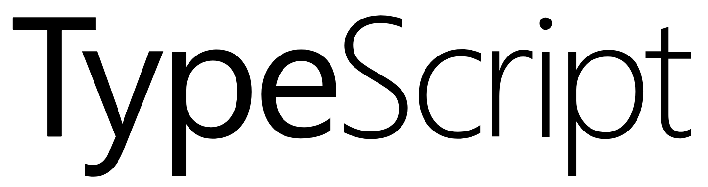
 <em>Official TypeScript Logo (on GitHub <a href="#cite-1">[1]</a>)</em>

<h2 id="abstract">Abstract</h2>

TypeScript is a programming language that brings types to JavaScript.
TypeScript, in contrast to JavaScript, gives developers a lot of feedback on their code and detects bugs well before the code is deployed.
It is a language that focusses on usability, which is reflected in the language design, the IDE integration but especially in its popularity.
Currently ranked as the third most loved programming language, TypeScript is well on its way to overtake JavaScript as the web language of choice.

In this chapter, we present a detailed analysis of the architecture of TypeScript from various viewpoints.
Furthermore, we provide a perspective on the usability of the language.
Finally, we close with an analysis of technical debt.
We conclude that TypeScript has a well-designed architecture and has very little technical debt.

<h2 id="table-of-contents">Table of Contents</h2>
<ul>
<li><a href="#1-stakeholder-analysis">1. Stakeholder Analysis</a><ul>
<li><a href="#11-issue-and-pull-request-analysis">1.1 Issue and Pull Request Analysis</a></li>
<li><a href="#12-analysis-of-external-websites">1.2 Analysis of External Websites</a></li>
<li><a href="#13-stakeholders-of-typescript">1.3 Stakeholders of TypeScript</a></li>
<li><a href="#14-power-interest-grid">1.4 Power-Interest Grid</a></li>
</ul>
</li>
<li><a href="#2-context-view">2. Context View</a><ul>
<li><a href="#21-people-developers-and-users">2.1 People: Developers and Users</a></li>
<li><a href="#22-communication-channels">2.2 Communication Channels</a></li>
<li><a href="#23-quality-ensurance">2.3 Quality Ensurance</a></li>
<li><a href="#24-competitors">2.4 Competitors</a></li>
<li><a href="#25-suppliers">2.5 Suppliers</a></li>
</ul>
</li>
<li><a href="#3-functional-view">3. Functional View</a><ul>
<li><a href="#31-capabilities">3.1 Capabilities</a></li>
<li><a href="#32-external-interfaces">3.2 External Interfaces</a></li>
</ul>
</li>
<li><a href="#4-development-view">4. Development View</a><ul>
<li><a href="#41-module-structure">4.1 Module Structure</a></li>
<li><a href="#42-common-design">4.2 Common Design</a></li>
</ul>
</li>
<li><a href="#5-usability-perspective">5. Usability Perspective</a><ul>
<li><a href="#51-usability-aspects-in-typescript">5.1 Usability Aspects in TypeScript</a></li>
<li><a href="#52-the-typescript-ecosystem">5.2 The TypeScript Ecosystem</a></li>
</ul>
</li>
<li><a href="#6-technical-debt-view">6. Technical Debt View</a><ul>
<li><a href="#61-static-tool-analysis">6.1 Static Tool Analysis</a></li>
<li><a href="#62-todo-comments">6.2 Todo Comments</a></li>
<li><a href="#63-testing-debt">6.3 Testing Debt</a></li>
<li><a href="#64-evolution-of-technical-debt">6.4 Evolution of Technical Debt</a></li>
</ul>
</li>
<li><a href="#7-conclusion">7. Conclusion</a></li>
</ul>
<h2 id="introduction">Introduction</h2>

In this chapter, the architecture of the software system TypeScript is examined and evaluated. But before we start, we will state the purpose, capabilities and history of TypeScript. To quote their website <a href="#cite-2">[2]</a>: 

<blockquote>

TypeScript is a typed superset of JavaScript that compiles to plain JavaScript. Any browser. Any Host. Any OS. Open Source.

</blockquote>

The main functionality is, in other words, to provide an extension of the JavaScript language to support types. While typing can make a language feel more restrictive, it also has many advantages, for example in terms of maintainability and readability of the code.
Typing also enables more powerful static analyses, which allows for the detection of mistakes at compile time instead of at runtime and decreases debug time <a href="#cite-3">[3]</a>.

TypeScript compiles to regular JavaScript, which means that it works on most browsers and operating systems. It offers support for the latest ECMAScript standards and is supported by multiple IDEs. An added bonus is that it is open source and free to use. TypeScript is thus suitable for developing large scale web applications and is used in many existing applications <a href="#cite-4">[4]</a>.

TypeScript started as an internal Microsoft project in 2010. After two years, the basic functionality was completed and the project was made open source <a href="#cite-5">[5]</a>. TypeScript was praised for its typing functionality back then but missed support from any IDE. This was followed up by adding IDE support and editor support in 2013 <a href="#cite-6">[6]</a>. In 2016, TypeScript version 2.0 added more type functionality, such as more control over null types <a href="#cite-7">[7]</a>. Currently, TypeScript is still in active development on its GitHub repository, where hundreds of contributors have contributed to the project <a href="#cite-8">[8]</a>. 

Section 1 analyses all stakeholders of TypeScript to determine which people are most important for its development. Next, Section 2 provides a context view of TypeScript. In Section 3, a functional view of TypeScript is given which is complemented by a development view in Section 4. Section 5 follows up with an analysis of TypeScript from a usability perspective and technical debt is examined in Section 6. Finally, Section 7 gives an overall conclusion on the architecture of TypeScript.

<h2 id="1-stakeholder-analysis">1. Stakeholder Analysis</h2>

In order to identify the relevant stakeholders, we started by analyzing different sources related to the system. In Section 1.1, we investigate the use of issues and pull requests on GitHub and in Section 1.2, we investigate external websites. This gave us a clear overview of the people who have interest in the system. This overview is shown in Section 1.3, followed by an overview of the power and interest of these stakeholders in Section 1.4.

<h3 id="11-issue-and-pull-request-analysis">1.1 Issue and Pull Request Analysis</h3>

The first source we analysed is the official GitHub repository <a href="#cite-8">[8]</a>. From issues and pull requests on this repository we were able to identify the key developers, their workflow and other stakeholders with interest in the system.

We found that the main development is done by a core group of Microsoft employees. They make many changes to the code and review the contributions made to the project via pull requests. In addition to this, they maintain the roadmap of the project in two ways: they manage the issues and milestones of the project, and they publish notes of team meetings as issues on GitHub. A last role for the development team is helping users that have opened an issue with problems they encountered. Sometimes a pointer to the documentation helps to resolve the problem, but often these issues unveil an actual problem with (a newer version of) the implementation. 

We were also able to identify other stakeholders like the continuous integration providers that build TypeScript, JavaScript frameworks that use TypeScript in their development and IDEs that integrate with the language.

<h3 id="12-analysis-of-external-websites">1.2 Analysis of External Websites</h3>

Besides the pull requests and issues on the official GitHub repository <a href="#cite-8">[8]</a>, we also investigated external sources in order to identify the stakeholders. Guided by the sources that are mentioned on the TypeScript website <a href="#cite-2">[2]</a>, we looked at StackOverflow <a href="#cite-9">[9]</a>, Twitter <a href="#cite-10">[10]</a>, the Microsoft Developer Network (MSDN) Channel 9 <a href="#cite-11">[11]</a>, the TypeScript blog <a href="#cite-12">[12]</a> and a list of languages that compile to JavaScript on the CoffeeScript GitHub <a href="#cite-13">[13]</a>.

From these sources, we found that part of the core development team actively engages with the community by answering questions on StackOverflow and by writing blog posts detailing new features of each release. These releases are announced via both the official TypeScript Twitter account and the GitHub repository. Lastly, we identified other people on StackOverflow that actively helped people with their problems, despite not being affiliated with Microsoft. Some of these people have even written books on how to use TypeScript.

<h3 id="13-stakeholders-of-typescript">1.3 Stakeholders of TypeScript</h3>

Rozanski and Woods <a href="#cite-14">[14]</a> identify ten types of stakeholders. In our classification of the identified stakeholders, we mostly followed this classification, only making some small changes to better fit the project. The stakeholder types that are the most relevant to TypeScript are shown in Table 1.1.

<table>
<thead>
<tr>
<th>Type</th>
<th>Relevant actors</th>
</tr>
</thead>
<tbody>
<tr>
<td>Acquirers</td>
<td>Oversee the procurement of the system. Hold the final rights to the project</td>
</tr>
<tr>
<td>Developers</td>
<td>Construct, test and deploy the system from the specifications</td>
</tr>
<tr>
<td>Maintainers</td>
<td>Manage the evolution of the system over time</td>
</tr>
<tr>
<td>Assessors</td>
<td>Oversee the system conformance to standards (code, documentation and specifications) and legal regulation. Can be seen as integrators in this project</td>
</tr>
<tr>
<td>Communicators</td>
<td>Explain the system to other stakeholders via its documentation and training materials, also keeps other stakeholders up to date to system changes and releases</td>
</tr>
<tr>
<td>Suppliers</td>
<td>Build and/or supply hardware, software, or infrastructure on which the system will run and deploy</td>
</tr>
<tr>
<td>Support staff</td>
<td>Provide users support for the system when it is running</td>
</tr>
<tr>
<td>Users</td>
<td>Define the system's functionality and ultimately make use of it</td>
</tr>
<tr>
<td>Competitors</td>
<td>Aim to put a similar, competing system on the market</td>
</tr>
</tbody>
</table>

<strong>Table 1.1</strong> - <em>Relevant stakeholder types for TypeScript and their roles.</em>

Many stakeholders have multiple roles in the project, making them part of multiple of the different types. Therefore we created an Euler diagram that shows all the relevant stakeholder types and the actors they contain (Figure 1.1).

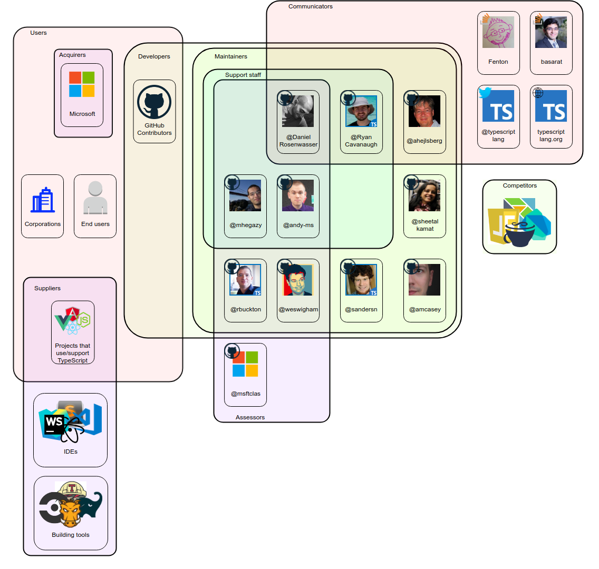
 <strong>Figure 1.1</strong> - <em>An overview of the stakeholders of TypeScript and their roles.</em>

<h3 id="14-power-interest-grid">1.4 Power-Interest Grid</h3>

Another way in which we classified the stakeholders is by looking at their power in changing the system and the interest they have in the system. Figure 1.2 shows this relation in a grid with the relative power and interest the different stakeholders have in TypeScript.

 <strong>Figure 1.2</strong> - <em>The power-interest grid showing the different stakeholders.</em>

<h4 id="141-microsoft-development-team">1.4.1 Microsoft Development Team</h4>

As the owner of the project, Microsoft has the most power and interest in the system. The development team employed by Microsoft to work on TypeScript have slightly less power and interest than their employer, but they guide the main development of the system.

<h4 id="142-communicators">1.4.2 Communicators</h4>

The communicators are a group of stakeholders that have high interest in the system, but who lack the capability to steer the direction of the project. This group includes the writers of books on TypeScript, the StackOverflow users and the official announcement channels. In order to fulfil their roles as communicators, they need to be up to date with the state of the system. This gives them a great interest in the system but does not give them any power over it.

<h4 id="143-competitors">1.4.3 Competitors</h4>

Competitors have a reasonably high interest in the system. This is because they want to have a better system themselves to gain a competitive advantage over TypeScript. To achieve this, they need to closely watch the development of any new features that might give TypeScript this advantage. Following this, competitors have a small amount of power in the development of TypeScript with the features they introduce.

<h4 id="144-users">1.4.4 Users</h4>

Users generally have little power over the project, but since TypeScript is an open source project, users can submit issues and make contributions. As such, we have divided users into two different groups: those who make contributions and those who do not. Generally, a contributing user has a larger interest in TypeScript than a user that does not.

<h4 id="145-tooling">1.4.5 Tooling</h4>

The last two groups in the power-interest grid are the build tools and IDEs. These have relatively low power and interest in the system as they do not directly depend on TypeScript. The IDEs are a little more dependent on it as their integration with the language can be a reason to use this IDE over another. They also have more power as many users will use TypeScript via one of these IDEs and are therefore an important factor in the adoption of the language.

<h2 id="2-context-view">2. Context View</h2>

The context model in Figure 2.1 provides an overview of the external entities related to TypeScript. The following sections will explain each of the external entities in clockwise order, starting from the left.

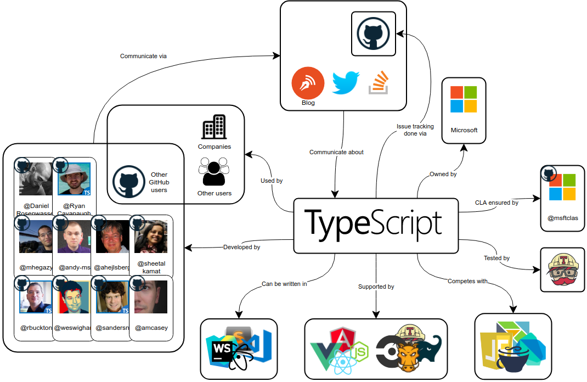
 <em>Figure 2.1: An overview of the external entities related to TypeScript.</em>

<h3 id="21-people-developers-and-users">2.1 People: Developers and Users</h3>

On the left in Figure 2.1, the active developers of TypeScript are shown.
They are employed by Microsoft, the owner of TypeScript.
They are not the only developers, however: there are GitHub users from all over the world that contribute to the project, mostly by submitting pull requests to the repository.
These GitHub users also form a part of the group of entities that use TypeScript, among companies and general other users.

<h3 id="22-communication-channels">2.2 Communication Channels</h3>

The top of the context model shows the four primary communication channels for TypeScript.

<ul>
<li>The most important communication channel is GitHub. This is where the issue tracking is done, pull requests are reviewed, meetings are documented, etcetera.</li>
<li>The TypeScript blog and Twitter are used to broadcast news about TypeScript such as newly published releases and other important events.</li>
<li>StackOverflow is used by users to ask questions about TypeScript, which are often answered by members of the development team.</li>
</ul>
<h3 id="23-quality-ensurance">2.3 Quality Ensurance</h3>

On the right in Figure 2.1, two tools are shown that TypeScript uses to assess the submitted pull requests.

<ul>
<li>TypeScript uses a Continuous Integration bot that checks whether the user that submitted the pull request has signed the CLA of Microsoft.</li>
<li>Travis CI is used to execute all tests in the repository, to make sure that the submitted pull request does not break any existing functionality.</li>
</ul>
<h3 id="24-competitors">2.4 Competitors</h3>

At the bottom right of the Context Model, the competitors of TypeScript are shown, that were discussed in Section 1.4.3. These competitors include the Elm language, Dart, CoffeeScript, and JavaScript.

<h3 id="25-suppliers">2.5 Suppliers</h3>

The remaining external entities correspond to the Supplier stakeholder type, as was discussed in Section 1.3. The following entities are shown in Figure 2.1:

<ul>
<li>Build tools: Travis CI, Gradle, Grunt, and CircleCI</li>
<li>Frameworks: Angular, NodeJS, React, Vue.js</li>
<li>IDEs: Sublime Text, Visual Studio Code, Atom, WebStorm</li>
</ul>
<h2 id="3-functional-view">3. Functional View</h2>

Every software system has some functionalities that are exposed to the user. These functionalities can be modelled as part of the architecture of TypeScript. To this end, this section shows a Functional View as described in Rozanski and Woods, Chapter 17 <a href="#cite-14">[14]</a>. Section 3.1 describes the capabilities of TypeScript, while Section 3.2 shows the external interfaces of TypeScript that are exposed to the user.

<h3 id="31-capabilities">3.1 Capabilities</h3>

TypeScript has two main capabilities.

<ol>
<li><strong>Compile</strong> TypeScript files to plain JavaScript files <a href="#cite-2">[2]</a>. 
This capability of TypeScript is fully described in the language specification on GitHub <a href="#cite-15">[15]</a>. This language specification is an exhaustive document that describes all possible constructs in the TypeScript language.</li>
<li>Provide <strong>editor-like functionalities</strong> <a href="#cite-16">[16]</a>. 
This consists of many small capabilities, including code completions, code formatting, refactoring, debugging, incremental compilation, etcetera. It is also possible to write custom language service plugins <a href="#cite-17">[17]</a>.</li>
</ol>
<h3 id="32-external-interfaces">3.2 External Interfaces</h3>

Both capabilities defined in Section 3.1 have their own external interfaces. In the following two sub-sections, we describe these interfaces and their responsibilities.

<h4 id="321-typescript-compiler">3.2.1 TypeScript Compiler</h4>

The first capability is provided by a standalone compiler. It compiles TypeScript source files to JavaScript files, in such a way that the emitted JavaScript files resemble the TypeScript input, as described in the introduction of the language specification <a href="#cite-15">[15]</a>.

The compiler is a command-line tool that has many options <a href="#cite-18">[18]</a>. All of these options can also be provided in <code>tsconfig.json</code> files in any directory that contains TypeScript files. Using a configuration file makes it easy to use compiler options consistently in a project. With a valid configuration present, the TypeScript compiler can be invoked without arguments and it will use the <code>tsconfig.json</code> file in the current directory <a href="#cite-19">[19]</a>.

<h4 id="322-typescript-server-editor-functionality">3.2.2 TypeScript Server: Editor Functionality</h4>

The editor-like functionalities are provided by a standalone server. This server is a wrapper for many capabilities related to editor functionality, as listed in Section 3.1.

The TypeScript server communicates using JSON messages <a href="#cite-20">[20]</a>. However, typical users of TypeScript will not directly interface with the server. Most IDEs include the standalone server and use it to provide static code checks, possible refactorings and other things in a user-friendly way.

<h2 id="4-development-view">4. Development View</h2>

In this chapter, we will present a part of the Development View as described in Rozanski and Woods, chapter 20 <a href="#cite-14">[14]</a>. Section 4.1 provides a module structure model of TypeScript. Section 4.2 continues by describing to what extent the commonality of design between modules, code and organisation is achieved throughout the project. We have also analysed the codeline models of TypeScript, but those have been left out as they do not provide important additional information on the architecture of TypeScript.

<h3 id="41-module-structure">4.1 Module Structure</h3>

In this section, we provide a module structure model of TypeScript. A module structure model shows how the system is organized into modules and what the dependencies between these modules are.

We have identified the main TypeScript modules and organized them into four layers, as shown in Figure 4.1. These layers are:

<ul>
<li><strong>Compiler layer</strong>: The compiler layer is responsible for compiling TypeScript programs into JavaScript.</li>
<li><strong>Language Service layer</strong>: The language service module wraps the compiler layer and provides editor-like services like formatting, refactoring, code completion and debugging.</li>
<li><strong>Server layer</strong>: The server exposes the language services and compiler features to users through a JSON protocol. Editors and IDEs can interface with the server to use the language services and to compile code.</li>
<li><strong>Test Harness layer</strong>: The test harness contains various test runners to execute different types of tests. It also contains test transformers which change the code in test files to help the test runners.</li>
</ul>

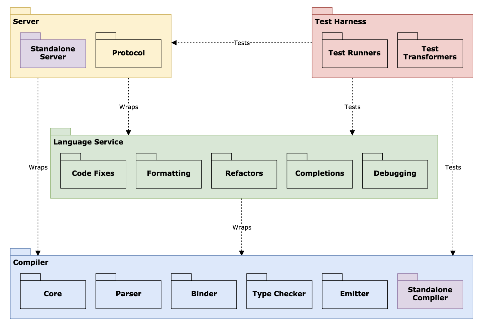
 <strong>Figure 4.1</strong> - <em>Module Structure Model of TypeScript, showing the different layers and the dependencies between them.</em>

In this overview, each module represents one or multiple source files which together perform a similar role in the system. Please note that we have grouped together some modules to prevent the image from becoming too detailed. The purple-coloured modules are modules that a user of TypeScript can interact with. All modules that are not purple are internal to TypeScript.

We can see from the module structure that the different capabilities, as defined above in the Functional View (Section 3), reside in separate layers in the repository. The editor functionality is even split into two layers: one layer that contains the editor services and one separate layer for the server, which wraps the compiler and language service layers.

<h4 id="411-as-designed-versus-as-implemented">4.1.1 As-designed versus As-implemented</h4>

TypeScript provides a layer overview <a href="#cite-16">[16]</a> on their wiki. We have included this layer overview as Figure 4.2.
While this image isn't exactly the same as a module structure model, it does describe similar layers to our module structure model.

One big difference is that the test harness is not shown in the architectural overview. While the test harness did exist whenever the image was created, it was probably left out since it is not involved in the compilation/static analysis pipeline.

Another difference is that "VS Shim" is mentioned on the layer with the server. In the code, the "shims" are in the Language Service directory and seem to offer functionality similar to other language services. For this reason, we decided to leave it out to keep our module structure simple.

Besides the layer overview, TypeScript also provides an overview of the common data structures that are used to communicate between layers. The most important one of them is the Abstract Syntax Tree (AST). Looking at the code in the different layers, it looks like the interface for an AST node is defined in multiple ways, in this way exposing different functionalities of nodes to different layers.

 <strong>Figure 4.2</strong> - <em>Layer overview from the TypeScript wiki. <a href="#cite-16">[16]</a></em>

<h3 id="42-common-design">4.2 Common Design</h3>

In our analysis of TypeScript, we have found some common elements in the design of TypeScript. For the brevity of the chapter, we have left out the complete analysis in our chapter. The most important findings of common design elements are:

<ul>
<li>Internationalization, logging, debugging and performance metrics are standardized across the project.</li>
<li>TypeScript has a clear standardized design methodology and testing procedure when it comes to contributions and changes.</li>
<li>Standard code solutions like design patterns are used sparingly.
It seems that TypeScript avoids common design patterns because of a focus on performance. This is detrimental to the readability of the code as different pieces of code performing a similar task can look very different. It can also make it more difficult for someone to contribute to the project because the developers might want to see particular code patterns, but these patterns are not communicated to contributors.</li>
</ul>

We can see that TypeScript uses common design of elements wherever this applicable, in order to prevent code duplication as much as possible.

<h2 id="5-usability-perspective">5. Usability Perspective</h2>

In this section, we analyze TypeScript from a usability perspective. For TypeScript, usability means something completely different than for other software systems. Its usability is not decided by the user interface of the software. Rather, the usability of TypeScript is determined by the usability of the language and by the ecosystem around TypeScript. This concerns architectural elements like the expressiveness of the language and the understandability of compiler output, but also elements like tutorials, support with questions and integration with IDEs. To analyse this, we first look at different usability aspects in TypeScript itself. Then, we take a look at the ecosystem around TypeScript.

<h3 id="51-usability-aspects-in-typescript">5.1 Usability Aspects in TypeScript</h3>
<h4 id="511-internationalization">5.1.1 Internationalization</h4>

Internationalization is used for the different error messages that can be generated by the compiler. To change the language, users have to set the <code>--locale</code> flag to the language of their choice, e.g. <code>--locale de</code> for German. The locale can also be configured globally with a <code>tsconfig.json</code> file. TypeScript currently supports 14 different languages, covering the most used languages on the planet. Usually, it is difficult for a project to keep the translations up to date when messages are added or changed. However, TypeScript is localized by the Microsoft localization team which updates the localizations periodically. For TypeScript this means that localizations are almost always up to date. As TypeScript also supports UTF-8 and UTF-16 in its parser and compiler, users can easily use TypeScript in the language of their choice.

<h4 id="512-conformance-testing">5.1.2 Conformance Testing</h4>

TypeScript is a superset of JavaScript. As such, they want to support all JavaScript functionality. New JavaScript functionality is added from time to time in the form of new ECMAScript standards. TypeScript also wants to conform to these standards, both in the original TypeScript code as in the JavaScript code it compiles to. To ensure this conformance, TypeScript has multiple tests for the ECMAScript functionality. Any change that would break this conformance is detected and will be modified. By supporting all this functionality, users can continue to use the features from JavaScript that they are familiar with and will probably have an easier time to switch to TypeScript.

<h4 id="513-ide-integration">5.1.3 IDE Integration</h4>

TypeScript is supported by multiple IDEs and editors, including Visual Studio, Eclipse and WebStorm, but also Sublime, Atom, Emacs and Vim. Users thus have a wide variety of choice in which editor they use. TypeScript provides the IDE functionality with the TypeScript server, which is then used by the IDE or editor. For users, this means that the experience is consistent across the different supported editors.

<h3 id="52-the-typescript-ecosystem">5.2 The TypeScript Ecosystem</h3>
<h4 id="521-documentation-and-support">5.2.1 Documentation and Support</h4>

TypeScript offers extensive documentation on its website. There are tutorials for people who are new to TypeScript, giving quick and simple explanations on how to get started. There is also a handbook which contains much more detailed explanations of the different features. A formal language specification can be found on GitHub. For further questions, users are referred to StackOverflow, where questions are answered by an active community and sometimes also by the developers of TypeScript.

We do see that the handbook is not up to date with the latest functionality. There is a section "What's New" that discusses new language features in detail, but these features should also be added into the handbook, e.g. with a note in which version they have been added.

<h4 id="522-user-satisfaction">5.2.2 User Satisfaction</h4>

The best way to determine usability is by asking the users themselves. Every year, StackOverflow has a survey amongst its users, with questions regarding popular technologies and languages <a href="#cite-21">[21]</a>. With responses from over 64.000 developers from all over the world, it is the largest survey in the field. In last year's survey, TypeScript was the 9th most popular language across all categories and the 7th most popular language according to web developers. In addition, it ranked 3rd on the list of most loved programming languages. These results suggest that users are pretty satisfied with TypeScript.

<h2 id="6-technical-debt-view">6. Technical Debt View</h2>

Software developers can sometimes decide to implement something the "quick and dirty" way. Such a solution can be justified for many reasons like time pressure but is often not the best solution when looking at code quality. In such a case, the developers deliberately introduce so-called technical debt. This debt can accumulate over time and can be decremental to the maintainability of a system. Therefore, developers need to pay attention to their technical debt every once in a while, in order to raise the quality of the code again.

In this section, we will investigate the technical debt that is present in the code of TypeScript. We will start with a static tool analysis of the repository, then we analyze the "todo" comments left in the code base followed by analysis on the testing debt. Finally, we look at the evolution of technical debt.

<h3 id="61-static-tool-analysis">6.1 Static Tool Analysis</h3>

TypeScript is a project of 135k lines of code. This is too much to go over manually. Instead, a static tool analysis was done on the project using SonarQube <a href="#cite-22">[22]</a> with the SonarTS plug-in <a href="#cite-23">[23]</a>. The overview of this analysis can be seen in Figure 6.1. Note that for testing we run a different tool, this can be found in Section 6.3.

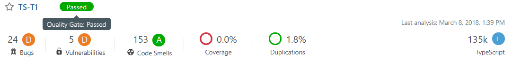
 <strong>Figure 6.1</strong> - <em>Overview of SonarQube after running the tool on the TypeScript project.</em>

According to SonarQube, TypeScript has a low score for bugs and vulnerabilities. However, most bugs and vulnerabilities are false positives since TypeScript is a compiler, which requires some workarounds in the code. The most common bug is useless self-assignment, which could easily be fixed. 

Next, the code duplication is small and the code smells are not severe. Most duplications take place in non-critical parts of the repository, such as the testing harness or the server hosting classes, there is no code duplication in the compiler. The major code smells are mostly about to conditions that always evaluate to true, empty code blocks and useless assignments. The minor smells are almost all about unnecessary casts and usage of line continuation. These code smells could be refactored.

Lastly, the most significant source of technical debt according to SonarQube is the cyclomatic complexity. The most complex file is the type checker: checker.ts. This file has a cyclomatic complexity of just over nine thousand, making the file very unreadable. However, this file is well tested and the developers do mention in their coding guidelines that they don't want to split up any classes <a href="#cite-24">[24]</a>. This adheres to the Single Responsibility principle from the SOLID design principles. However, it could still be argued that this class could be split up since there are different stages of type checking. This would increase the readability of the type checker of the compiler.

<h3 id="62-todo-comments">6.2 Todo Comments</h3>

Next, we analyzed signs of technical debt in todo comments. Todo comments a good indicator for technical debt as they are easily searched for and provide clear information if they are written well. Furthermore, todo comments are written by developers for developers, to indicate what still has to be changed in further versions to improve the product. 

In the source code of TypeScript, there are 116 <code>TODO</code> comments (measured on March 14, 2018). In Figure 6.2 the division of todo comments across the different layers (as discussed in Section 4.1) can be seen.

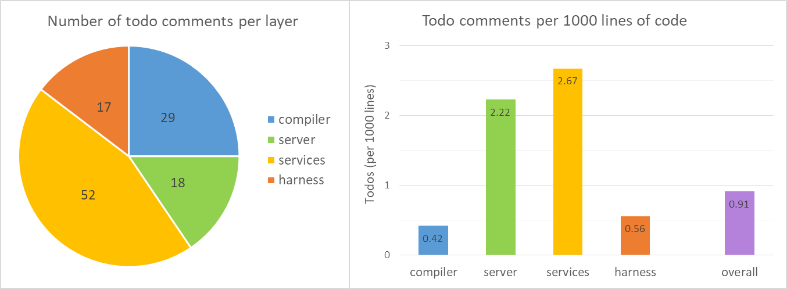
 <strong>Figure 6.2</strong> - <em>The image on the left shows the number of todo comments in each layer. The image on the right shows the number of todo comments per 1000 lines of code for each of the different layers.</em>

From Figure 6.2, we can make two remarks on the todo comments on the code. First, the layer with the most comments is the services layer. This is not surprising as this layer offers functionalities such as formatting, code fixes and debugging, which all have edge cases that only a few users stumble into. This lowers the priority of fixing these todo comments.

Secondly, while it would seem that the compiler layer has quite a few todo comments, it actually has the lowest density amongst the different layers. This is probably because the compiler layer is the core of the TypeScript project and thus it is important to keep this part clear of any technical debt.

For a large project like TypeScript, the number of todo comments is relatively low. There is less than one todo comment for every 1100 lines of code. Furthermore, many todo comments are still relevant. However, since TypeScript heavily uses the issue system of GitHub, many todo comments can be converted into GitHub issues and then be removed from the code. This would probably provide a better overview than hiding them in the code.

<h3 id="63-testing-debt">6.3 Testing Debt</h3>

TypeScript uses Istanbul <a href="#cite-25">[25]</a> to measure code coverage. We have generated two coverage reports for TypeScript, which are shown in Figures 6.3 and 6.4.

In both reports, any module in <code>src/harness</code> can be ignored, since this module contains the testing harness as explained in Section 4.1.

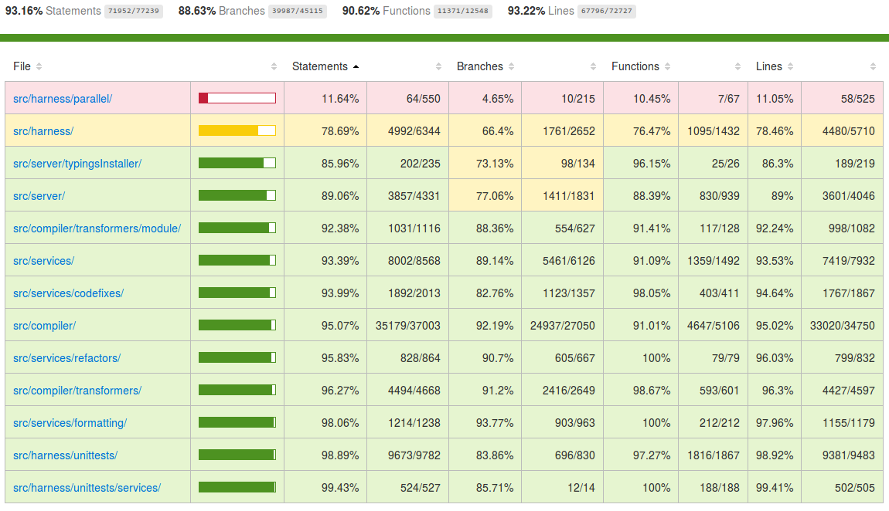
 <strong>Figure 6.3</strong> - <em>Coverage overview as generated by Istanbul <a href="#cite-25">[25]</a>.</em>

In Figure 6.3, for every module in the source code, the statement coverage, branch coverage, function coverage, and line coverage is shown.

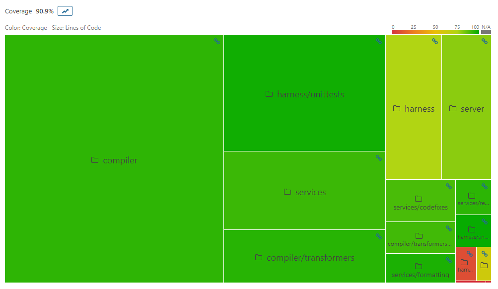
 <strong>Figure 6.4</strong> - <em>Coverage overview as generated by SonarQube <a href="#cite-22">[22]</a> from the remapped report.</em>

Figure 6.4 shows the coverage proportional to the number of lines of code in a module. The size of each block is proportional to the number of lines of code, while the colour of each block indicates the test coverage (an average of line and branch coverage).

From both Figure 6.3 and 6.4, we can see that in general, the modules that are relatively small have low coverage and vice versa.
Also, TypeScript has a rule that states that all changed code in pull requests must be 100% covered <a href="#cite-26">[26]</a>.
From this, we can conclude that testing debt is almost absent in TypeScript.

<h3 id="64-evolution-of-technical-debt">6.4 Evolution of Technical Debt</h3>

Besides the technical debt that is currently present in TypeScript, we also looked at the evolution of the system. For this we created evolution matrices <a href="#cite-27">[27]</a> for the three main modules, using Matplotlib <a href="#cite-28">[28]</a> and Gitcovery <a href="#cite-29">[29]</a>. 
These matrices show different metrics for each file over time, therefore allowing us to distinguish patterns in the evolution of TypeScript. In this section, we will highlight a few interesting observations.

<h4 id="641-red-giants">6.4.1 Red Giants</h4>

Red giants are components that are very large and maintain this size over many versions. The most obvious component in TypeScript that qualifies is the type-checker, with over 27,000 lines of code and steadily growing over time, as can be seen in the bottom row of Figure 6.5. Another component that acted as a red giant was the emitter, with around 8,000 lines of code, shown in the top row of Figure 6.5. This component is also a case where we can see a successful refactoring (in version 2.1). Here, its size was more than halved, making it more maintainable.

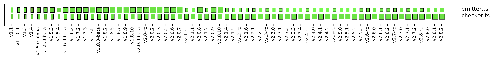
 <strong>Figure 6.5</strong> - <em>A subsection of the full evolution matrix, showing the emitter and the type-checker in more detail. The width and height of the rectangles show the number of functions and number of lines per function respectively (as a metric of file size). A black outline is added when a file is changed. We also normalized the sizes of the rectangles to the maximum values encountered for a component, to make the figure more readable. </em>

<h4 id="642-system-growth">6.4.2 System Growth</h4>

During the lifespan of TypeScript, there have been multiple phases in where the number of components grew significantly. A good example is the server module, which doubled in size from version 2.0.3 to 2.0.5 (Figure 6.6a). According to the release notes, this is due to the integration of TypeScript with Visual Studio <a href="#cite-30">[30]</a>. 
Another instance where the evolution of the system is shown clearly is in the early days of the services module. At this moment the module saw significant changes with the removal and addition of most components (Figure 6.6b). These were likely only design changes as they are not mentioned in the release notes.

    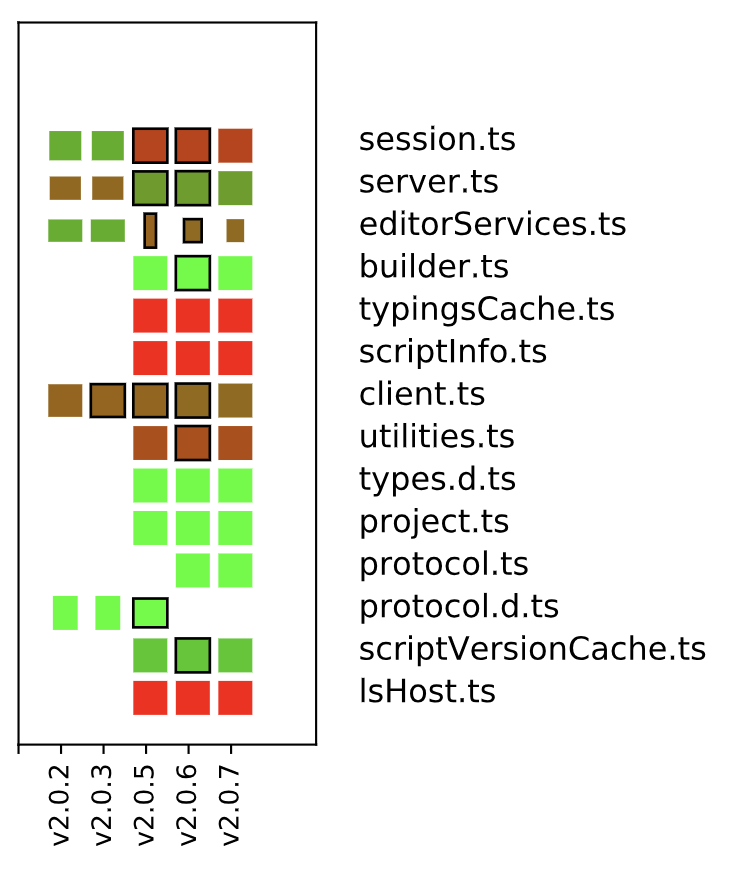
    <strong>a)</strong> - <em>Growth phase of the server module</em>

    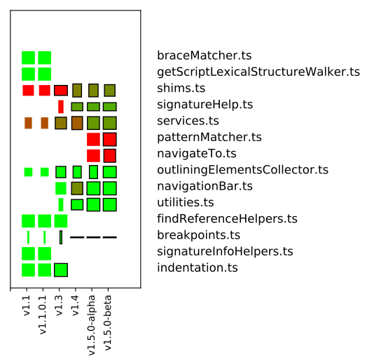
    <strong>b)</strong> - <em>Growth phase of the services module</em>

<strong>Figure 6.6</strong> - <em>Subsection of the full evolution matrices, showing phases of growth. The width and height of the rectangles show the number of functions and number of lines per function respectively (as a metric of file size). The colour shows the number of todo comments per 1000 lines of code, where green is 0 and red is 5 or more. A black outline is added when a file is changed. We also normalized the sizes of the rectangles to the maximum values encountered for a component, to make the figure more readable.</em>

<h2 id="7-conclusion">7. Conclusion</h2>

TypeScript is a well-designed system that has matured a lot since its 1.0 release. The design of the system is well-thought through and is very close to the architecture as it is currently implemented. Despite its growth, it has been able to maintain a good architecture that does not violate the SOLID principles. However, one thing we noticed is that it is very difficult to familiarize with the TypeScript code, simply because of the complexity of the project.

For a large system like TypeScript, it has very little technical debt. There are many unit tests and integration tests that together give a high coverage and automated tools find very few code problems. There are a few todo comments that indicate technical debt, but all things considered, TypeScript is very much on top of technical debt.

In terms of usability, TypeScript is doing a great job, both in the system itself as in the ecosystem around it. IDE support is good, there is a strong community and developers seem to like the language.

However, the real struggle that TypeScript has does not lie in its architecture, but rather on GitHub. The development team struggles to keep up with the number of issues and pull requests that are created every day. The initial response is quick, but the follow-up can take a long time, which can discourage users and can make integration of pull requests more difficult.

All things considered, we think that the TypeScript team is doing a great job. We are confident that TypeScript will be able to overcome the challenges ahead if they continue as they do now.

<h2 id="references">References</h2>

<table class="references"><tbody><tr><td>1</td><td>Microsoft, <a href="https://github.com/Microsoft/TypeScript/blob/master/doc/logo.svg" target="_top">TypeScript Logo</a>, <i>Microsoft</i>, 2017.</td></tr><tr><td>2</td><td>Microsoft, <a href="https://www.typescriptlang.org/" target="_top">TypeScript Website</a>, <i>Microsoft</i>, 2018.</td></tr><tr><td>3</td><td>Kleinschmager, Sebastian  <i>et al.</i>, Do static type systems improve the maintainability of software systems? An empirical study, <i>Program Comprehension (ICPC), 2012 IEEE 20th International Conference on</i>, 2012.</td></tr><tr><td>4</td><td>Microsoft, <a href="https://www.typescriptlang.org/community/friends.html" target="_top">Friends of TypeScript</a>, <i>Microsoft</i>, 2018.</td></tr><tr><td>5</td><td>Turner, Jonathan, <a href="https://blogs.msdn.microsoft.com/typescript/2014/04/02/announcing-typescript-1-0/" target="_top">Announcing TypeScript 1.0</a>, <i>Microsoft</i>, 2014.</td></tr><tr><td>6</td><td>Shen, Tom, <a href="http://marketplace.eclipse.org/content/typescript#.VAmSNvm1bYg" target="_top">TypeScript Eclipse plug-in</a>, <i>Eclipse</i>, 2013.</td></tr><tr><td>7</td><td>Bright, Peter, <a href="https://arstechnica.com/information-technology/2016/09/typescript-microsofts-javascript-for-big-applications-reaches-version-2-0/" target="_top">TypeScript, Microsoft's JavaScript for big applications, reaches version 2.0</a>, <i>Ars Technica</i>, 2016.</td></tr><tr><td>8</td><td>Microsoft, <a href="https://github.com/Microsoft/TypeScript" target="_top">TypeScript GitHub</a>, <i>GitHub</i>, 2018.</td></tr><tr><td>9</td><td>StackOverflow, <a href="https://stackoverflow.com/questions/tagged/typescript" target="_top">Questions tagged Typescript on StackOverflow</a>, <i>StackOverflow</i>, 2018.</td></tr><tr><td>10</td><td>Microsoft, <a href="https://twitter.com/typescriptlang" target="_top">TypeScript Official Twitter</a>, <i>Twitter</i>, 2018.</td></tr><tr><td>11</td><td>Microsoft, <a href="https://channel9.msdn.com/" target="_top">Microsoft Channel 9</a>, <i>Microsoft</i>, 2018.</td></tr><tr><td>12</td><td>Microsoft, <a href="https://blogs.msdn.microsoft.com/typescript/" target="_top">TypeScript Blog</a>, <i>Microsoft</i>, 2018.</td></tr><tr><td>13</td><td>CoffeeScript, <a href="https://github.com/jashkenas/coffeescript/wiki/list-of-languages-that-compile-to-js" target="_top">CoffeeScript: List of Languages that Compile to JavaScript</a>, <i>CoffeeScript</i>, 2018.</td></tr><tr><td>14</td><td>Rozanski, N., &amp; Woods, E., Software systems architecture: working with stakeholders using viewpoints and perspectives, <i>Addison-Wesley</i>, 2014.</td></tr><tr><td>15</td><td>Microsoft, <a href="https://github.com/Microsoft/TypeScript/blob/master/doc/spec.md" target="_top">TypeScript language specification</a>, <i>Microsoft</i>, 2016.</td></tr><tr><td>16</td><td>Microsoft, <a href="https://github.com/Microsoft/TypeScript/wiki/Architectural-Overview" target="_top">TypeScript Wiki: Architectural Overview</a>, <i>Microsoft</i>, 2017.</td></tr><tr><td>17</td><td>Microsoft, <a href="https://github.com/Microsoft/TypeScript/wiki/Writing-a-Language-Service-Plugin" target="_top">TypeScript Wiki: Writing a Language Service Plugin</a>, <i>Microsoft</i>, 2017.</td></tr><tr><td>18</td><td>Microsoft, <a href="https://www.typescriptlang.org/docs/handbook/compiler-options.html" target="_top">TypeScript: Compiler Options</a>, <i>Microsoft</i>, 2018.</td></tr><tr><td>19</td><td>Microsoft, <a href="https://www.typescriptlang.org/docs/handbook/tsconfig-json.html" target="_top">TypeScript: tsconfig.json</a>, <i>Microsoft</i>, 2018.</td></tr><tr><td>20</td><td>Microsoft, <a href="https://github.com/Microsoft/TypeScript/wiki/Standalone-Server-%28tsserver%29" target="_top">TypeScript Wiki: Standalone Server (tsserver)</a>, <i>Microsoft</i>, 2017.</td></tr><tr><td>21</td><td>Stack Overflow, <a href="https://insights.stackoverflow.com/survey/2017" target="_top">Stack Overflow Developer Survey 2017</a>, <i>Stack Overflow</i>, 2017.</td></tr><tr><td>22</td><td>SonarQube, <a href="https://www.sonarqube.org" target="_top">SonarQube main website</a>, <i>SonarQube</i>, 2018.</td></tr><tr><td>23</td><td>SonarQube, <a href="https://github.com/SonarSource/SonarTS" target="_top">SonarTS GitHub repository</a>, <i>SonarQube</i>, 2018.</td></tr><tr><td>24</td><td>Microsoft, <a href="https://github.com/Microsoft/TypeScript/wiki/Coding-guidelines" target="_top">TypeScript Wiki: Coding Guidelines</a>, <i>Microsoft</i>, 2018.</td></tr><tr><td>25</td><td>Krishnan Anantheswaran, <a href="https://github.com/gotwarlost/istanbul" target="_top">Istanbul GitHub repository</a>, <i>Krishnan Anantheswaran</i>, 2018.</td></tr><tr><td>26</td><td>Microsoft, <a href="https://github.com/Microsoft/TypeScript/blob/master/CONTRIBUTING.md" target="_top">TypeScript contributing.md</a>, <i>Microsoft</i>, 2018.</td></tr><tr><td>27</td><td>Lanza, Michele, The evolution matrix: Recovering software evolution using software visualization techniques, <i>Proceedings of the 4th international workshop on principles of software evolution</i>, 2001.</td></tr><tr><td>28</td><td>Matplotlib, <a href="https://matplotlib.org" target="_top">Matplotlib website</a>, <i>Matplotlib</i>, 2018.</td></tr><tr><td>29</td><td>Chiel Bruin, <a href="https://github.com/ChielBruin/Gitcovery" target="_top">Gitcovery GitHub repository</a>, <i>Chiel Bruin</i>, 2018.</td></tr><tr><td>30</td><td>Microsoft, <a href="https://github.com/Microsoft/TypeScript/releases/tag/v2.0.5" target="_top">TypeScript 2.0.5 release notes</a>, <i>Microsoft</i>, 2016.</td></tr></tbody></table>

