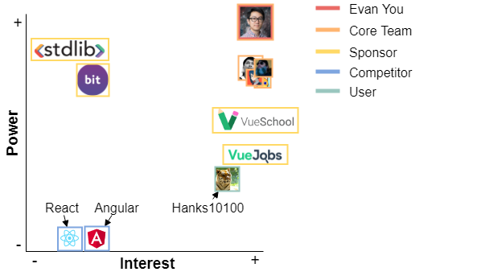
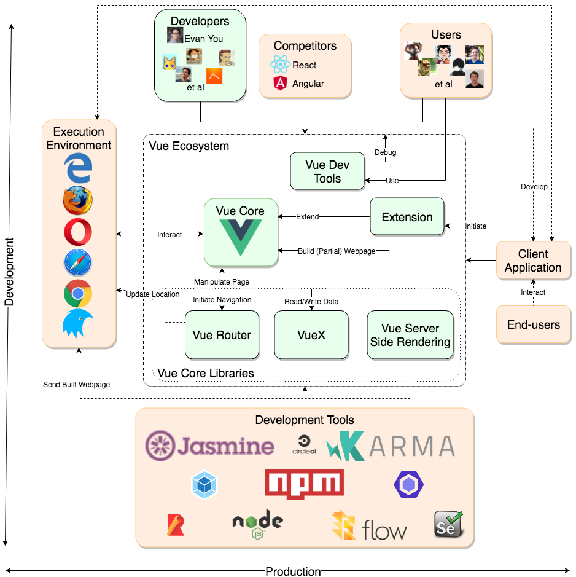
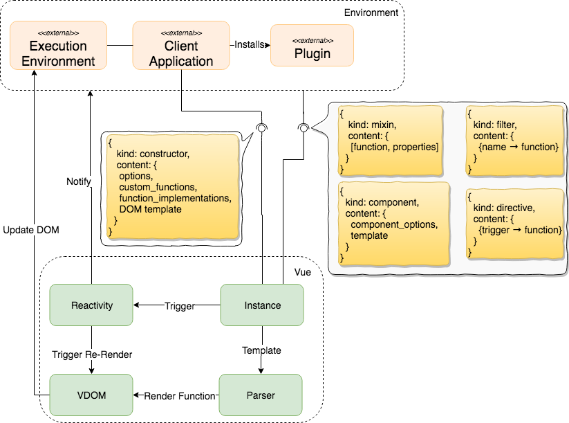
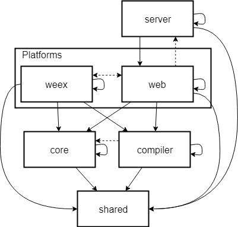

<!-- START: Intro from vue-chapter/README.md -->
# Vue.js - The Progressive JavaScript Framework

<!-- GitBook does not actually render the markdown between html tags
     The links to the groups' members are therefore written in plain
     HTML. -->

    
 <a href="https://github.com/8uurg">Arthur Guijt</a> 

    
 <a href="https://github.com/PhilipeLouchtch"> Philippe Louchtch </a> 

    
 <a href="https://github.com/TimSpeelman"> Tim Speelman </a> 

    
 
    <a href="https://github.com/LarsStegman">Lars Stegman</a> 

## Introduction
Web applications have evolved to the point where DOM manipulation via javascript is exceedingly common, however most implementations doing so are slow. Entire lists have their representation recomputed while only a single item has changed. Or the data model and visual representation are out of sync due to not recomputing enough. In the meantime there is a ton of code performing string interpolation to generate the interface elements.

[Vue.js][vue] is a library/framework for Javascript and TypeScript that uses templates or render functions, in combination with data binding to make building user interfaces easy and clean. It can be used for a small part of the website as a library, up to full single page applications utilizing Vue as a framework. Applications can also be adopt Vue incrementally, allowing developers to slowly introduce it in your project. 
Vue won't break out of nowhere. It is well tested: with a suite of over 1000 unit tests, practical e2e tests, and it boasts of 100% line coverage. 

Vue bears many similarities to other javascript libraries/frameworks related to DOM manipulation, most notably React - as they both use a virtual DOM - but also other frameworks like Angular. For an in depth comparison we would like to refer you to [this comparison](https://vuejs.org/v2/guide/comparison.html), while it is not independent it gives a good overview of the differences between projects.

In short, quoting [the first page of the Vue.js guide](https://vuejs.org/v2/guide/index.html):
> Vue (...) is a progressive framework for building user interfaces. (...) Vue is designed from the ground up to be incrementally adoptable. (...) (Vue) is easy to pick up and integrate with other libraries or existing projects. (...) Vue is also perfectly capable of powering sophisticated Single-Page Applications (...).

This introductory quote neatly outlines the scope of Vue.js: handling the view layer, mainly by DOM manipulation and event binding. In contrast with jQuery, which provides an alternative API to DOM manipulation, Vue takes the entire DOM manipulation away, letting the user focus on writing logic.

[vue]: https://github.com/vuejs/vue
<!-- END: Intro from vue-chapter/README.md -->

## Stakeholder Analysis

### Core and Ecosystem Distinction

Vue.js is more than the "core" Vue library itself. We have identified a strong interplay between the core Vue library and the various components and extensions. The development of one guides the development of the other.

Therefore we have split the developers and maintainers into "core" and "ecosystem" camps. We concern ourselves with the analysis of the "core" part. However, the ecosystem cannot be ignored, hence we included it in our developer and maintainer stakeholder analysis.

### Users and End-Users Distinction
The Vue.js project is not a product directly usable in the traditional sense. It is a library, middleware making it easy to build web-based client-side applications. We make a distinction between two classes of user stakeholders:

* End-users  
  This is a virtual class of stakeholders of users who end up using the product (the end-product) built by the 'Users' but are not exposed to the Vue.js project directly. They are concerned with having a compatible, fast and solid end-product and as a whole are uncaring about the specific middleware used.
* Users  
  These are the direct users of the Vue.js project. They're concerned with having happy end-users and thus share their concerns. On top of that, they are the stakeholder who pick the middleware and thus care about technical aspects such as: strong community support, tooling, features, and clean and easy to use APIs.

### Vue.js Community
The community is a virtual group of people participating in Vue.js development and maintenance, as well as Vue.js related discussions on GitHub & Vue.js forum, Vue.js discord server, Vue.js StackOverflow topic, Vue.js related conferences, etc. This community is mostly comprised, but not exclusive to, the Vue.js developers, maintainers, [users](#Users) and stakeholders whose businesses depend on the continued success of Vue.js. Please note that participation in the community is completely voluntary.

### The Stakeholders

#### Acquirers

Evan You is the main and most important acquirer of the system. He set out to build something new and to prove its viability. The success of the project attracted sponsors, [recurring](https://www.patreon.com/evanyou) and [one-time donations](https://vuejs.org/support-vuejs/#One-time-Donations). The whole body of the sponsors can also be considered, to a lesser extent, as an acquirer or a virtual entity with interest in the continued existence of the system.

It is unknown to us if there are hidden sponsors involved, i.e. companies whose products are built on top of Vue.js and have a direct line of communication with the development team.

#### Communicators

Evan You is the face of the project and is the most prolific member of the team. Being the face, he promotes and communicates. Furthermore, there are commercial trainers and an organization that organizes Vue.js conferences. Every member of the core team, [some more than others][short_vue_history], represents the product through their interaction with the community, whilst also writing documentation.

#### Core-Developers
Just like the 1.0 version was a large rewrite over the 0.xx series, the current 2.x series is a large rewrite over the 1.x series. The developers of the 2.0 release were the people that were members of the "core" team at that time [source][v2post]. An overview of the (current) core members can be found [here](https://vuejs.org/v2/guide/team.html)

#### Core-Maintainers
The maintainers of the Vue.js core library are [the members of the Vue.js GitHub organization](https://github.com/orgs/vuejs/people), which is a super-set of the [core developer group](https://vuejs.org/v2/guide/team.html). The actual maintainers are the active and willing members of the Vue.js GitHub organization.

Any member of the organization has the ability to approve or decline a pull-request. Evan You, however, is the only person making the final merges and releases.

#### The Integrator
Evan You is the man, the face and the brains behind the Vue.js project. It is both his reputation and source of income. Evan is directly dependent on the success of the project, therefore he is concerned with keeping the relevant stakeholders happy. These include: the users (and indirectly the end-users), developers and maintainers, and sponsors. Furthermore, the community size and richness of the ecosystem is a strong indicator of interest, therefore his interest lies in keeping stakeholders happy whilst growing the community and the ecosystem.

This is a special kind of stakeholder, much like Linus Torvalds of the Linux Kernel fame, whose success is directly related to the success of his most renowned project. Hence, in a respectful, tongue-in-cheek kind of way, we originally referred to this stakeholder as "The Linus".
Another interesting aspect of this kind of stakeholder is the "Benevolent Dictator" development/Git-branching model where only the integration-manager (or "the dictator") has direct commit privileges to the "[blessed repository](https://git-scm.com/about/distributed)".

#### Ecosystem-Developers & Maintainers
Some members of the core-team are also ecosystem developers. However, the ecosystem is not a specific project or a repository. There are both "official" and community ecosystem contributions. The official Vue.js components live directly in the Vue.js GitHub organization, while the community components start their life outside of it.

#### Users
The direct users of the Vue.js project. These are the developers or companies making use of Vue.js to build their own products.

One very important user of Vue.js is the [Alibaba Group][evan_ali_collab]. Not only have they built some of their websites with Vue.js, they decided to help integrate Vue.js with Weex in persuit of their goal to use only one front-end framework across their applications, both web and mobile. [source][evan_quora]

#### End-users
The users of the final product made by the "Vue.js users". This group does not participate in the development of Vue.js but their concerns are extremely important for the evolution of the Vue.js project. Their wishes and demands may propagate up to the Vue.js ecosystem or even the core project.

#### Support Staff
Some communicators also fulfil this role by participating in stack-overflow and forum questions & .discussions

### Power-Interest

This power interest diagram shows the most important stakeholders, below is an explanation for each of them.

Evan You is by far the most important person in the system, and is the one who makes the decisions. Due to Evan being the final decision maker and _the_ integrator, the core developers have less power. Furthermore, their interest is rated lower as their income and reputation does not depend as much on the success of the project as Evan does.

The top-tier sponsors contribute significant amounts of funding to the project. Such funding always buys some level of power, even if subconscious, in the case of Vue we argue this also being true, albeit limited to some extent. Not all sponsors are directly dependent on the success of the Vue.js project, these score lower on the interest graph. Others like VueSchool, do and therefore are rated having higher interest in the success of the project.

Hanks10100 is an example GitHub user who is not part of the development team. We consider him to be part of "the Vue.js community".

Finally we have two major competitors, React and Angular. While they do not hold much power, as competing products they have to pay attention to each other. Case-in-point: some of the people involved with React joined the discussion in [the comparison](https://vuejs.org/v2/guide/comparison.html).

[v2post]: (https://medium.com/the-vue-point/vue-2-0-is-here-ef1f26acf4b8)
[short_vue_history]: (https://forum.vuejs.org/t/question-to-the-members-of-the-core-team/31119/3)
[evan_ali_collab]: (https://medium.com/the-vue-point/vue-2-0-is-here-ef1f26acf4b8#9aa2)
[evan_quora]: (https://www.quora.com/How-popular-is-VueJS-in-the-industry-Will-becoming-a-Vue-expert-be-useful-career-wise)

## Context view

horizontal axis: production line, vertical axis: development line

A few external entities can immediately be identified: Vue can be extended through **components and plugins**, consumed by **web applications** or **individual UI components**. Together these form the interface towards the **end user**, who uses a **browser** to run it all. This is what we call the 'production line'.

Conversely, different people and projects are involved during development which are not seen during production itself. The **Vue developers**, the **users** that create their applications, the **competitors** that can alternatively be chosen from. But also the **development tools** themselves: npm for package management, rollup and webpack for bundling, and the testing tools further described in [Standardization of Testing](#standardization-of-testing). This is what we call the 'development line', visualized vertically in the diagram.

The part of Vue that we are looking at - Vue 'core' - is the base library on which the rest of the Vue ecosystem is built. 
The ecosystem consists of libraries, some of which where important enough to be maintained by Vue core developers: the Vue core libraries. Examples of this are [Vue Router](https://router.vuejs.org/en/) and [VueX](https://vuex.vuejs.org/en/). 

Vue is based around reusable components, some of which will be local to their own projects - but some are reusable enough that they can be used across projects. The community provides a large amount of these reusables, and many of those are shared as open source, for example those listed on [awesome-vue](https://github.com/vuejs/awesome-vue).

## Functional Architecture

It's in the name. Vue offers a convenient way to manage the view layer. This entails two ways of communication: the data from the application is presented to the end-user, and the end-user input is communicated back to the application. These two are essentially the main 'visible' functionalities Vue offers. 

Furthermore, Vue offers its users, i.e. web developers, two more non-functional functionalities: component-based design and reusability management.

In this section we first discuss what responsibilities Vue has and how it works internally. After that we explain how Vue communicates with its environment. 

In the figure below an overview is given of the APIs Vue provides and what the internal components send to each other.

### The Internal Architecture and the Functionalities It Offers

Everything the end-user can interact with, is the product of applying a format to the application data and sending changes back to this data when the end-user changes something.

#### Formatting

The recommended way of specifying a format in Vue is using the Vue template syntax: HTML with three sugars, namely custom tags, custom attributes and interpolation (e.g. `{{text}}`). 

In short, a Vue app defines a set of templates and passes these to Vue along with the data it wishes to display. Vue's parser then parses the provided template, turning this entire sugared custom HTML string into a JavaScript render function; a function that takes data and outputs a Virtual DOM Node (or VNode), ready to be injected into the real DOM tree. This process is displayed in the diagram above.

#### Reactivity

This is definitely not enough: for a one-off render one might as well use PHP. Instead, whenever the data changes, Vue will update the view accordingly using its reactivity system. To monitor changes, the system attaches itself to the application data object. As a full re-render on every data change would be too costly, Vue pulls a few tricks to make efficient changes to the DOM tree. The backbone of this is the dependency tracking system. It only updates those parts of the tree that depend on changed data (e.g. `{{text}}` only re-renders when the value of `text` changes).

#### Input handling
Every interaction the end-user has with the application is a product of the application methods (API) and some bound UI elements. In the view template it is possible to connect events of view elements to methods. This is mainly handled by the `v-on` directive, a custom html attribute provided by Vue. Similar to the data formatting, Vue parses the template and binds the provided method to the actual event. On top of that, it will destroy this 'listener' when the component is removed from the DOM. 

#### Component Re-use
Vue is entirely component based. Any use of Vue requires instantiating it using `new Vue(options)`, which creates a Vue instance. The instance takes a template as mentioned above, some data and some methods and Vue handles the rest. Larger apps will want to separate and re-use logic instead of writing one big component. For this, one can define a Vue component using `Vue.component('my-comp', options)` and subsequently use it in Vue templates as `<my-comp />`. This facilitates separation of concerns and code re-use. Vue's third main functionality is offering a way to define components and subsequently handling their entire: from its creation, through several updates of its state, to it finally being destroyed. Larger applications, extensively using Vue, will have to shape their architecture towards it. So in return, Vue must consider how it can best facilitate architectural best practices to these applications.

### Interactions With The Environment

Vue provides a diverse set of external interfaces, from lifecycle hooks to complete plugins. This section describes each external interface and how they can be used by users to extend Vue's behavior and functionality. First, the lifecycle hooks are explained. Second, the use of components, directives, and filter, i.e. assets. The concept of mixins is then discussed, and finally, plugins that can be used to encapsulate logical modules.

#### Lifecycle Hooks

Vue allows users to observe the lifecycles of Vue instances by implementing functions that are lifecycle hooks. Users can use these hooks to perform certain tasks at certain points in time during the instance's lifecycle, e.g. start fetching some data from an external server. For a detailed explanation of all existing lifecycle hooks please see Vue's [user documentation](https://vuejs.org/v2/guide/instance.html#Instance-Lifecycle-Hooks).

#### Assets

In addition to adding custom behavior to Vue instances, users can also add custom assets to Vue. These assets can be used in templates to build a DOM.

##### Component

Components are the building blocks of the (virtual) DOM. They have their own internal logic, data structures and reactive components. Components are identified by their names, for instance `counting-button`, would be a fitting name for a button that counts the number of times it has been clicked.

##### Directives

Directives are dynamic properties that add behavior to components. Directives are defined using the `Vue.directive` method. An example of a directive is the default directive `v-show` which toggles the visibility of a component in the DOM depending on the arguments passed to the directive. 

It is also possible to create custom directives that add behavior to the elements they are added to. Examples can be found in Vue's [documentation](https://vuejs.org/v2/guide/custom-directive.html). The most interesting example is the custom directive `focus`, which automatically focusses elements when they are inserted in the DOM.

Directives can respond to various events from the elements they are applied to. A complete list of the events can be found [here](https://vuejs.org/v2/guide/custom-directive.html#Hook-Functions).

##### Filters

The final asset type that is discussed are filters. Filters can be used to format data, for example transforming a Unix epoch to a human readable timestamp. Filters are defined using the `Vue.filter` method.

#### Mixins

Mixins allow users to add custom properties and functions to Vue instances. 

For example, [Vue Router](https://router.vuejs.org/en/) adds the properties `$route` and `$router` to Vue instances, which respectively represent the current route the end user is at and the router object the user can use to control routing.

Vue Router also uses mixins to implement the lifecycle hooks `beforeCreate` and `destroyed` to be able to dynamically update the current route the end user is at.

#### Plugins

Adding custom behavior in an encapsulated manner is also possible with Vue. Completely separate plugins can be created and then plugged into Vue through their `install` functions. This function is used by Vue to instantiate the plugin and allows the plugin to add custom behavior to the Vue instance. 

Usually, plugins use the mixin and asset concepts described above to add their behavior to Vue instances. For examples of this we recommend looking at the `install` functions of [Vue Router](https://github.com/vuejs/vue-router/blob/dev/src/install.js) and [VueX](https://github.com/vuejs/vuex/blob/dev/src/store.js).

## Development View
### Module Organization

Vue consists of a few modules:
The shared module contains common utilities that are not included in the standard javascript library. 
The core on the other hand contains logic specifically related to Vue. 
This logic is split up in submodules, some of which are:
* `vdom` -- virtual DOM manipulation module
* `observer` -- provides internal functionality to make certain constructs _observable_, [a design pattern](https://en.wikipedia.org/wiki/Observer_pattern). To allow Vue.js to _react_ to model and/or state changes in a relatively (to their competitors) performance efficient way.
* `global-api` -- the general global api that is provided to the users.
* `instance` -- Lifecycle management, events and state of Vue are located here.
This module is required to run in environments which does and does not have the web APIs related to manipulating webpages. 

In order to make things fast certain parts of the user-provided templates can be parsed, optimized and compiled beforehand by the compiler. 
The entry points are located in three modules. The Weex module is for identically named framework developed by Alibaba, web is for running in a webbrowser related context, while server is meant for server side rendering. These points contain the platform specific code to let Vue run and work within their respective environments.

Isolated from the rest of the codebase is the module that contains the parsing logic for single file components - a feature that allows Vue to be used as a framework. This part is used by plugins for build tools - for example webpack and rollup  - to deal with single file components - without having to re-implement the parser.

### Standardization of Design
In order to streamline contributions from the community, Vue provides a [contribution guideline document](https://github.com/vuejs/vue/blob/dev/.github/CONTRIBUTING.md). The document explains how to set up Vue for development, report issues, creating PRs, and an explanation on the project folder structure, among other things.

Surprisingly, the project structure is the only specification of design choices made for the Vue core package. Moreover, it is the only real source of documentation on Vue source code. The lack of comments in the source code is noticeable, and gives developers a hard time understanding its workings and motivations behind it.

In sharp contrast to the core package itself, Vue docs offer an extensive [developer style guide](https://vuejs.org/v2/style-guide/) for its users. This gives developers who use Vue strong advice in terms of naming, code style, use of particular Vue constructs (such as using a `key` prop when using the `v-for` directive) and handling of data. As these guidelines do not apply to the core, it is beyond the scope of this text.

<!-- BEGIN: vue-chapter/development-view/standardzation_of_testing.md -->
### Standardization of Testing

The Vue.js tests are located in the `/test/` directory. This directory contains various types of tests for the core Vue.js library. Because the core Vue.js library also contains platform specific code, tests for those platforms are also included. Two of the platforms are quite specific and have their own unit-tests: Server-Side Rendering (SSR) and Weex. The other, generic, browser platform is tested through the end-to-end tests using Selenium. These tests are located in the `/test/e2e` directory and are used to test the correctness of Vue.js behavior on the currently most dominant browsers.

#### Core Vue.js Tests
Located in the `/test/unit` directory and can be further categorized into unit and integration tests. Structurally, these are split into `module` and `feature` types.

##### The  `/test/unit/feature` Tests
Tests to ensure the correct operation of user-facing Vue.js features and global API. These are, for the most part, integration tests.

##### The `/test/unit/modules`
Tests to ensure the correct operation of the underlying building blocks of core Vue.js library itself. Namely the `vdom`, `compiler` and `observer` submodules.

#### Platform-specific Tests
The rest of the directories (except for `helpers/`) deal with testing the various platform-specific code that is part of the core Vue.js library. There are three logical platforms:

* Server-Side Rendering (SSR)
* Weex
* Web

The SSR and Weex platforms are special kinds of platforms. These are platforms which are used in non-standard environments. SSR renders templates into HTML by running the client-side code on the server before serving. Weex is a platform for shipping Vue.js-powered (amongst others) applications as mobile, native applications.

Both Weex and SSR have their own unit tests that deal with platform specific features, behavior, and past quirks and bugs.

The web platform is the default Vue.js platform, namely the major browsers. These cannot be tested with JavaScript unit tests and therefore are tested with end-to-end tests and interaction scenarios. Interesting is that the test-data used for the End-to-End tests are the live-examples of Vue.js, although some specific test-data is also present amongst the Selenium test scenario definitions in the `/test/unit/e2e/specs` directory.

#### Technology Used
All JavaScript tests are written using the Jasmine JavaScript unit testing library and Karma JavaScript test runner.

The end-to-end testing is done with Nightwatch.js which uses the Java-based Selenium internally to simulate user interaction. Nightwatch.js simplifies writing technical end-to-end tests for Selenium and is script-able with JavaScript.

### Testing Pipeline
Due to the distributed and parallel development nature of the project, where any person can propose a contribution, keeping the code quality high requires some work from the core team.

This quality control is partially implemented in the form of an automated testing pipeline. The pipeline is implemented as an npm script and consists of the following steps:

1. ESLint
2. Type-check with Flow
3. Unit tests with coverage
4. End-to-end tests

[source](https://github.com/vuejs/vue/blob/dev/.github/CONTRIBUTING.md#commonly-used-npm-scripts)

This testing pipeline is also executed by the project's cloud based CI-tool on each commit. A failing pull-request will not be approved.

#### Approaches
With regard to testing approaches, there is no guideline other than a brief mention in the contributor guide of new changes needing to have "appropriate test coverage if applicable".

There is some standardization of some common actions in the `/test/helpers` directory. These deal with either setting up some test case or with helping the developer to do some common assertion.

## Technical Debt

As most applications, Vue has some technical debt. This section analyzes how serious Vue's technical debt is and where it is located.

### Code Smells

A good indicator of places where technical debt might be located is the presence of code smells. 

#### Lack of Documentation

One of the first code smells we noticed was the lack of documentation; a very consistent lack of documentation.  Especially complex pieces of the code, such as the `compiler`, would benefit from adding documentation. This has two benefits: obviously, others can understand what is going on, but maybe more importantly, explicit mentions of the reasoning can prevent bugs when refactoring or otherwise modifying the code later.

#### SOLID Principles

Another way of identifying technical debt is by looking for violation of the SOLID principles. However, Vue is written in JavaScript, object-oriented programming is not enforced and barely used within Vue. The SOLID principles are harder to apply, but may still be useful. 

The Single Responsibility Principle (SRP) seems to be well respected. Most code is split up into well-named files and functions, clearly identifying their single responsibility. One exception to this is a number of `utils` files, spread across packages. While sometimes justified, these files are a magnet to technical debt. 

The Open-Closed (OCP) principle may loosely translate to the frequency with which files are changed. The more frequent a file is changed, the more likely it is that its functionality is changed instead of extended through subclassing, and thus that OCP is violated.

The other SOLID principles are less applicable to Vue.

#### Other Smells

There were two other code smells that stood out.

The high cyclomatic complexity in some files. The violations of this were `server/render.js`(108), `compiler/codegen/index.js` (125) and `compiler/parser/index.js` (138). Which makes this even worse is there was almost no documentation in these files, making it even harder to understand how the code works.

The second smell that stood out was the method length. There were methods that were hundreds of lines long. This smell mainly occurs in high performance code, which makes it more justifiable, but this should be kept under control. One of the worst violators of this was the filter parser. We have made a contribution to fix this problem to reduce complexity and method length.

Even though Vue has ESLint configured, it is not used to its full potential. The issues of long methods was not detected by it and other syntactic issues that we found, we also not detected.

### Testing

Vue.js has an extensive test suite and has a whopping 100% line coverage according to the [continuous integration](https://codecov.io/github/vuejs/vue?branch=dev). This was surprising as hardly any project can achieve 100% coverage, which is why we looked deeper into the testing practices of the Vue.js project.

#### Continuous Integration

Vue has CI enabled on all pull requests and branches on GitHub. This encourages contributors to properly test their code before submitting it, as nobody wants to break the build.

The Vue tests are written using Jasmine. This framework allows testers to test asynchronous code with assertions and spies. Vue has multiple kinds of tests: unit, end-to-end, Weex, SSR, type, and Sauce. The Sauce tests are equal to the unit tests with the exception of the execution environment. Aside from Sauce, all tests are executed on the CI server. 

#### Coverage

In addition to running the tests on every pull request, the CI also measures coverage. According to CI the coverage of Vue is 100%, but after analyzing the codebase, we found annotations that disable coverage for certain parts of the code. After we removed these annotations we saw that coverage actually 95.34%. The majority of uncovered code is present in the HTML parser, which is actually an essential component of Vue. It is however not custom written code, and a clone and own strategy has been applied to it. 

#### Testing Practices

The tests for Vue are written using Jasmine. Jasmine allows developers to test asynchronous code using assertions and spies. The tests for Vue are written quite well and are often easy to understand. 

They could be improved even more by making sure that tests do not test more than one functionality at the same time. A couple of tests test more than one thing, which makes it harder to pin down what goes wrong when the test fails.

Another thing that could improved is the "unitness" of the tests. When we worked on our contribution and broke one component, over 70% of all tests began to fail. 

##### Testing Environment

The end-to-end tests for Vue are currently being executed using PhantomJS, however PhantomJS has some problems. [The main developer has quit](https://groups.google.com/forum/#!topic/phantomjs/9aI5d-LDuNE) and [the last minor release - as of writing - is from January 2016](http://phantomjs.org/releases.html) which, given the velocity regarding WebAPIs and the JavaScript language, can be problematic.

We recommend the Vue team to replace PhantomJS with Chrome Headless. We have created a pull request in the Vue repository to remove some barriers that exist to adopt Chrome Headless.

### Development History

Over the course of its existence, Vue has had multiple rewrites. We have analyzed the codebase over its releases and in this section we discuss the results.

From the analysis we were able to see that there is a positive correlation between the amount of changes between releases and the cyclomatic complexity in the files. This was not entirely unexpected as the files with the highest complexity are the parser and the virtual DOM files. These files are likely to change between releases, as they need to support new features.

These files are also the least readable files in the project, which might indicate technical debt. It could, however, also be caused by handwritten optimizations as these files are performance critical.

### Conclusion

Vue has some technical debt, however at the moment it seems to be manageable and managed. The main points that should be kept under control are the parsers and the virtual DOM patching. One point that should definitely be improved to encourage contributions would be to improve the developer documentation, as it is nearly non-existent. 
